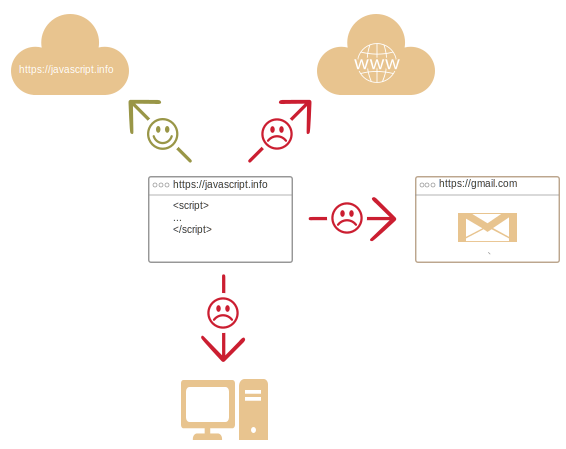

# Une Introduction à JavaScript

Voyons ce qui est spécial à propos de JavaScript, ce qu'il nous permet de faire et avec quelles autres technologies il s'accorde bien.

## Qu'est-ce que JavaScript?

*JavaScript* a été initiallement créé pour "rendre les pages web vivantes".

Les programmes dans ce langage sont appelés *scripts*. Ils peuvent être écrits directement dans une page HTML et exécutés automatiquement au chargement des pages.

Les scripts sont fournis et exécutés en texte brut. Ils n'ont pas besoin d'une préparation spéciale ou d'une compilation pour fonctionner.

De part cet aspect, JavaScript est très différent d'un autre langage appelé [Java](https://fr.wikipedia.org/wiki/Java_(langage)).

```smart header="Pourquoi est-il appelé <u>Java</u>Script ?"
Quand Javascript a été créé, il portait initialement un autre nom : "LiveScript". Mais à cette époque le langage Java était très populaire, il a donc été décidé que positionner un nouveau langage en tant que "petit frère" de Java pourrait aider.

Mais au fur et à mesure de son évolution, JavaScript est devenu un langage totalement indépendant, avec ses propres spécifications appelées [ECMAScript](https://fr.wikipedia.org/wiki/ECMAScript), aujourd'hui il n'a aucun rapport avec Java.
```

Aujourd'hui, JavaScript peut s'exécuter non seulement dans le navigateur, mais également sur serveur, ou encore sur n'importe quel appareil dans lequel existe un programme appelé [le moteur JavaScript](https://fr.wikipedia.org/wiki/Moteur_JavaScript).

Le navigateur a un moteur intégré, parfois il peut être également appelé "la machine virtuelle JavaScript".

Différents moteurs ont différents "nom de code", par exemple:

- [V8](https://fr.wikipedia.org/wiki/V8_(moteur_JavaScript)) -- dans Chrome et Opera.
- [SpiderMonkey](https://fr.wikipedia.org/wiki/SpiderMonkey) -- dans Firefox.
- … Il existe d'autres noms de code comme "Trident", "Chakra" pour différentes version d'Internet Explorer, "ChakraCore" pour Microsoft Edge, "Nitro" ans "SquirrelFish" pour Safari etc.

Les termes ci-dessus sont bons à retenir, car ils sont utilisés dans les articles destinés aux développeurs sur Internet. Nous les utiliserons aussi. Par exemple, si "une fonctionnalité X est prise en charge par V8", cela fonctionne probablement dans Chrome et Opera.

```smart header="Comment fonctionnent les moteurs ?"

Les moteurs sont compliqués. Mais le fonctionnement de base est facile à comprendre.

1. Le moteur (intégré si c’est un navigateur) lit ("analyse") le script.
2. Ensuite, il convertit ("compile") le script en langage machine.
3. Enfin le code machine s'exécute, très rapidement.

Le moteur applique des optimisations à chaque étape du processus. Il surveille même le script compilé en cours d'exécution, analyse les données qui le traversent et applique des optimisations au code machine en fonction de ces informations. 
```

## Que peut faire JavaScript dans le navigateur ?

Le JavaScript moderne est un langage de programmation "sûr". Il ne fournit pas d'accès de bas niveau à la mémoire ou au processeur, parce qu'il a été initialement conçu pour les navigateurs qui n'en ont pas besoin.

Les fonctionnalités dépendent grandement de l'environnement qui exécute JavaScript. Par exemple, [Node.js](https://fr.wikipedia.org/wiki/Node.js) prend en charge les fonctions qui permettent à JavaScript de lire / écrire des fichiers arbitrairement, d'exécuter des requêtes réseau, etc.

JavaScript intégré au navigateur peut faire tout ce qui concerne la manipulation des pages Web, l'interaction avec l'utilisateur et le serveur Web.

Par exemple, JavaScript dans le navigateur est capable de : 

- Ajoutez un nouveau code HTML à la page, modifiez le contenu existant, modifiez les styles.
- Réagir aux actions de l'utilisateur, s'exécuter sur des clics de souris, des mouvements de pointeur, des appuis sur des touches.
- Envoyer des requêtes sur le réseau à des serveurs distants, télécharger et envoyer des fichiers (technologies [AJAX](https://fr.wikipedia.org/wiki/Ajax_(informatique)) et [COMET](https://fr.wikipedia.org/wiki/Comet_(informatique))).
- Obtenir et définir des cookies, poser des questions au visiteur, afficher des messages.
- Se souvenir des données du côté client ("stockage local").

## Qu'est-ce que JavaScript ne peut pas faire dans le navigateur ? 

Les capacités de JavaScript dans le navigateur sont limitées pour la sécurité de l'utilisateur. L'objectif est d'empêcher une page Web malfaisante d'accéder à des informations privées ou de nuire aux données de l'utilisateur.

Les exemples de telles restrictions sont:

- JavaScript sur une page Web ne peut pas lire/écrire des fichiers arbitrairement sur le disque dur, les copier ou exécuter des programmes. Il n'a pas d'accès direct aux fonctions du système d'exploitation.

    Les navigateurs modernes lui permettent de fonctionner avec des fichiers, mais l'accès est limité et n'est fourni que si l'utilisateur effectue certaines actions, comme «déposer» un fichier dans une fenêtre de navigateur ou le sélectionner via une balise `<input>`.

    Il existe des moyens d’interagir avec une webcam / microphone et d’autres appareils, mais ils nécessitent une autorisation explicite de l’utilisateur. Ainsi, une page compatible avec JavaScript ne permet pas d'activer une caméra Web, d'observer l'environnement et d'envoyer les informations à la [NSA](https://fr.wikipedia.org/wiki/National_Security_Agency).

- Différents onglets / fenêtres ne se connaissent généralement pas. Parfois, ils se croisent, par exemple lorsqu'une fenêtre utilise JavaScript pour ouvrir l'autre. Mais même dans ce cas, le JavaScript d'une page ne peut pas accéder à l'autre si elle provient de sites différents (provenant d'un autre domaine, protocole ou port).

    C'est ce qu'on appelle la "politique de même origine" (“Same Origin Policy”). Pour contourner cette sécurité, *les deux pages* doivent se mettre d'accord et contenir un code JavaScript spécial qui gère l'échange de données. Nous allons voir cela plus loin dans ce tutoriel.

    Cette limitation concerne également la sécurité de l'utilisateur. Une page de `http://autresite.com` qu'un utilisateur a ouverte ne doit pas pouvoir accéder à un autre onglet du navigateur avec l'URL `http://gmail.com` et y voler des informations.

- JavaScript peut facilement communiquer sur le net avec le serveur d'où provient la page en cours. Mais sa capacité à recevoir des données d'autres sites / domaines est paralysée. Bien que possible, il nécessite un accord explicite (exprimé dans les en-têtes HTTP) du côté distant. Encore une fois, ce sont des limites de sécurité.



De telles limites n'existent pas si JavaScript est utilisé en dehors du navigateur, par exemple sur un serveur. Les navigateurs modernes permettent également l’installation de plug-ins / extensions susceptibles d’obtenir des autorisations étendues.

## Qu'est-ce qui rend JavaScript unique ?

Il y a au moins trois bonnes choses à propos de JavaScript:

```compare
+ Intégration complète avec HTML / CSS.
+ Les choses simples sont faites simplement.
+ Pris en charge par tous les principaux navigateurs et activé par défaut.
```

JavaScript est la seule technologie de navigateur qui combine ces trois éléments.

C’est ce qui rend JavaScript unique. C’est pourquoi c’est l’outil le plus répandu pour créer des interfaces de navigateur.

Cela dit, JavaScript permet également de créer des serveurs, des applications mobiles, etc.

## Les langages "par dessus" JavaScript

La syntaxe de JavaScript ne convient pas aux besoins de tous. Différentes personnes veulent des fonctionnalités différentes.

Il faut s’y attendre, parce que les projets et les exigences sont différents pour tous.

Donc, récemment, une pléthore de nouveaux langages sont apparus, qui sont *transposés* (convertis) en JavaScript avant leur exécution dans le navigateur.

Les outils modernes rendent la [transpilation](https://fr.wiktionary.org/wiki/transpilation) très rapide et transparente, permettant aux développeurs de coder dans une autre langue et de la convertir automatiquement "sous le capot".

Les exemples de ce genre de langages :

<<<<<<< HEAD
- [CoffeeScript](http://coffeescript.org/) est un "sucre syntaxique" pour JavaScript, il introduit une syntaxe plus courte, permettant d’écrire du code plus précis et plus clair. Habituellement, les développeurs Ruby l'aiment bien.
- [TypeScript](http://www.typescriptlang.org/) se concentre sur l'ajout de "typage strict des données" pour simplifier le développement et la prise en charge de systèmes complexes. Il est développé par Microsoft.
- [Flow](http://flow.org/) ajoute également la saisie de données, mais de manière différente. Développé par Facebook.
- [Dart](https://www.dartlang.org/) est un langage autonome doté de son propre moteur qui s'exécute dans des environnements autres que les navigateurs (comme les applications mobiles). Il était initialement proposé par Google en remplacement de JavaScript, mais pour le moment, les navigateurs exigent qu’il soit transposé en JavaScript, tout comme ceux ci-dessus.
=======
- [CoffeeScript](http://coffeescript.org/) is a "syntactic sugar" for JavaScript. It introduces shorter syntax, allowing us to write clearer and more precise code. Usually, Ruby devs like it.
- [TypeScript](http://www.typescriptlang.org/) is concentrated on adding "strict data typing" to simplify the development and support of complex systems. It is developed by Microsoft.
- [Flow](http://flow.org/) also adds data typing, but in a different way. Developed by Facebook.
- [Dart](https://www.dartlang.org/) is a standalone language that has its own engine that runs in non-browser environments (like mobile apps), but also can be transpiled to JavaScript. Developed by Google.
- [Brython](https://brython.info/) is a Python transpiler to JavaScript that allow to write application in pure Python without JavaScript.
>>>>>>> e074a5f825a3d10b0c1e5e82561162f75516d7e3

Il en existe évidemment bien plus, cela dit, même si nous utilisons un de ces langages, nous devrions également connaître le langage JavaScript, pour bien comprendre ce que nous faisons.

## Résumé

- JavaScript a été initialement créé en tant que langage de navigateur uniquement, mais il est désormais également utilisé dans de nombreux autres environnements.
- En ce moment, JavaScript occupe une position unique en tant que langage de navigateur le plus largement adopté avec une intégration complète avec HTML / CSS.
- De nombreux langages sont "transpilés" en JavaScript et fournissent certaines fonctionnalités. Il est recommandé d'y jeter un coup d'œil, au moins brièvement, après avoir maîtrisé JavaScript.
