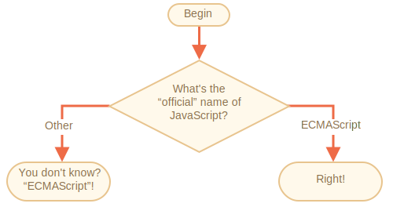

importance: 2

---

# Le nom de JavaScript

En utilisant la construction `if..else`, écrivez le code qui demande : 'Quel est le nom "officiel" de JavaScript?'

Si le visiteur entre "ECMAScript", alors éditez une sortie "Bonne réponse !", Sinon -- retourne "Ne sait pas ? ECMAScript!"

[demo src="ifelse_task2"]
