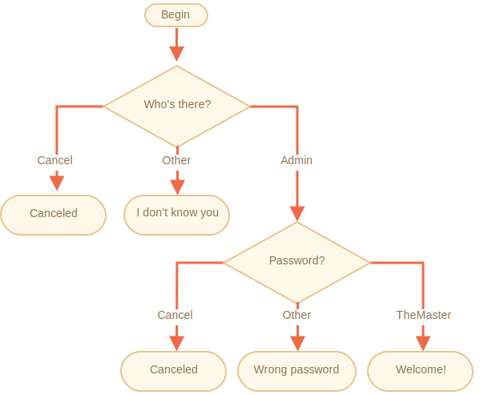

importance: 3

---

# Check the login

Écrivez le code qui demande une connexion avec `prompt`.

Si le visiteur entre `"Admin"`, puis `prompt` pour un mot de passe, si l'entrée est une ligne vide ou `key:Esc` -- affichez "Canceled", s'il s'agit d'une autre chaîne de caractères -- alors affichez "I don't know you".

Le mot de passe est vérifié comme suit :

- S'il est égal à "TheMaster", alors affichez "Welcome!",
- Une autre chaînede caractères -- affichez "Wrong password",
- Pour une chaîne de caractères vide ou une entrée annulée, affichez "Canceled".

Le schéma :

Veuillez utiliser des blocs `if` imbriqués. Attention à la lisibilité globale du code.

Astuce: passer une entrée vide à un prompt renvoie une chaîne de caractères vide `''`. En pressant `key:ESC` lors d'un prompt cela retourne `null`.

[demo]
