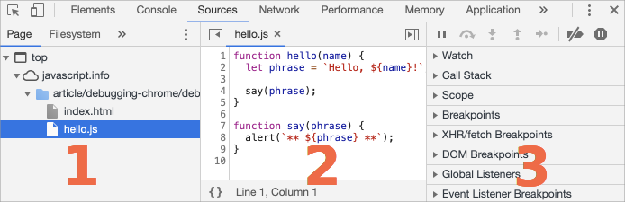
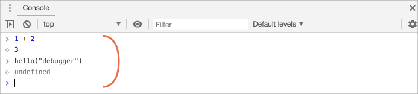
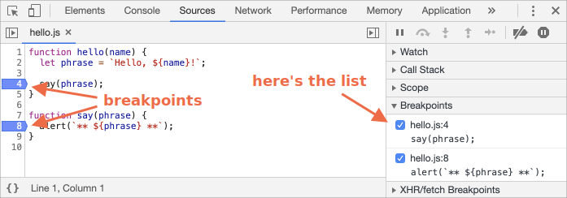
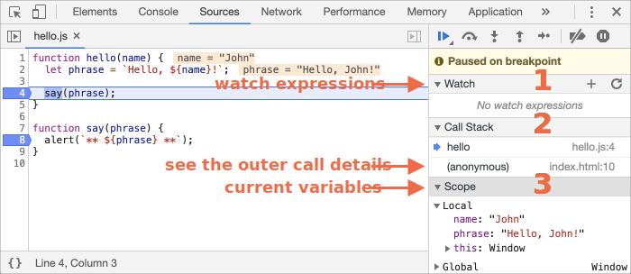
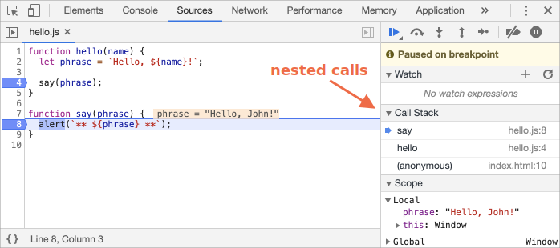

# Débogage dans le navigateur

Avant d’écrire un code plus complexe, parlons de débogage.

Le [Debugging](https://en.wikipedia.org/wiki/Debugging) est le processus de recherche et de correction des erreurs dans un script. Tous les navigateurs modernes et la plupart des autres environnements prennent en charge les outils de débogage - une interface utilisateur spéciale dans les outils de développement facilitant grandement le débogage. Cela permet également de tracer le code étape par étape pour voir ce qui se passe exactement.

Nous allons utiliser Chrome ici, car il possède suffisamment de fonctionnalités, la plupart des autres navigateurs utilisent un processus similaire.

## Le volet "Sources"

Votre version de Chrome peut sembler un peu différente, mais vous devez tout de même savoir ce qui est là.

- Ouvrez la [page d'exemple](debugging/index.html) dans Chrome.
- Activer les outils de développement avec `key:F12` (Mac: `key:Cmd+Opt+I`).
- Séléctionner le volet `Sources`.

Voici ce que vous devriez voir si vous le faites pour la première fois :


Le bouton <span class="devtools" style="background-position:-172px -98px"></span> ouvre l'onglet avec les fichiers.

Cliquez dessus et sélectionnez `hello.js` dans l’arborescence. Voici ce qui devrait apparaître :



Ici nous pouvons voir 3 parties : 

1. Le volet **explorateur de fichiers** répertorie les fichiers HTML, JavaScript, CSS et autres fichiers, y compris les images jointes à la page. Des extensions Chrome peuvent également apparaître ici.
2. Le volet **Editeur de Code** affiche le code source.
3. Le volet **Débugueur JavaScript** est pour le débogage, nous l'explorerons bientôt.

Maintenant, vous pouvez cliquer sur le même bouton <span class="devtools" style="background-position:-172px -122px"></span> à nouveau pour masquer la liste des ressources et laisser un peu d’espace au code.

## Console

Si nous appuyons sur `key:Esc`, une console s'ouvre ci-dessous. Nous pouvons taper des commandes ici et appuyer sur `key:Entrée` pour les exécuter.

Une fois une instruction exécutée, son résultat est présenté ci-dessous.

<<<<<<< HEAD
Par exemple, ici `1+2` donne `3`, et `hello("débogueur")` ne renvoie rien, le résultat est donc `undefined` :
=======
For example, here `1+2` results in `3`, while the function call `hello("debugger")` returns nothing, so the result is `undefined`:
>>>>>>> 45934debd9bb31376ea5da129e266df5b43e545f



## Breakpoints

Examinons ce qui se passe dans le code de la [page d'exemple](debugging/index.html). Dans `hello.js`, cliquez sur le numéro de ligne `4`. Oui, sur le chiffre `4`, pas sur le code.

Félicitations ! Vous avez défini un point d'arrêt. Veuillez également cliquer sur le numéro correspondant à la ligne `8`.

Cela devrait ressembler à ceci (le bleu est l'endroit où vous devez cliquer) :



Un *breakpoint* est un point dans le code où le débogueur mettra automatiquement en pause l'exécution de JavaScript.

Pendant que le code est en pause, nous pouvons examiner les variables actuelles, exécuter des commandes dans la console, etc. En d'autres termes, nous pouvons le déboguer.

Nous pouvons toujours trouver une liste de points d'arrêt dans le volet de droite. C’est utile lorsque nous avons plusieurs points d’arrêt dans divers fichiers. Ça nous permet de :
- Sauter rapidement au point d'arrêt dans le code (en cliquant dessus dans le volet de droite).
- Désactiver temporairement le point d'arrêt en le décochant.
- Supprimer le point d'arrêt en cliquant avec le bouton droit de la souris et en sélectionnant Supprimer.
- … Et ainsi de suite

<<<<<<< HEAD
```smart header="Points d'arrêt conditionnels"
Un *clic droit* sur le numéro de ligne permet de créer un point d'arrêt conditionnel. Cela ne se déclenche que lorsque l'expression donnée est vraie.
=======
```smart header="Conditional breakpoints"
*Right click* on the line number allows to create a *conditional* breakpoint. It only triggers when the given expression, that you should provide when you create it, is truthy.
>>>>>>> 45934debd9bb31376ea5da129e266df5b43e545f

C’est pratique lorsque nous devons nous arrêter uniquement pour une certaine valeur de variable ou pour certains paramètres de fonction.
```

<<<<<<< HEAD
## Commande du débogueur
=======
## The command "debugger"
>>>>>>> 45934debd9bb31376ea5da129e266df5b43e545f

Nous pouvons également suspendre le code en utilisant la commande `debugger`, comme ceci :

```js
function hello(name) {
  let phrase = `Hello, ${name}!`;

*!*
  debugger;  // <-- le débogueur s'arrête ici
*/!*

  say(phrase);
}
```

<<<<<<< HEAD
C’est très pratique lorsque vous utilisez un éditeur de code et que vous ne souhaitez pas passer au navigateur et rechercher le script dans les outils de développement pour définir le point d’arrêt.

=======
Such command works only when the development tools are open, otherwise the browser ignores it.
>>>>>>> 45934debd9bb31376ea5da129e266df5b43e545f

## Pause et regarder autour

Dans notre exemple, `hello()` est appelé lors du chargement de la page, donc le moyen le plus simple d'activer le débogueur (après avoir défini les points d'arrêt) est de recharger la page. Appuyez donc sur `key:F5` (Windows, Linux) ou sur `key:Cmd+R` (Mac).

Lorsque le point d'arrêt est défini, l'exécution s'interrompt à la 4ème ligne :



Veuillez ouvrir les menus déroulants d’information à droite (indiqués par des flèches). Ils vous permettent d'examiner l'état du code actuel :

1. **`Watch` -- affiche les valeurs actuelles pour toutes les expressions.**

<<<<<<< HEAD
    Vous pouvez cliquer sur le plus `+` et entrer une expression. Le débogueur affichera sa valeur à tout moment, en la recalculant automatiquement au cours de l'exécution.
=======
    You can click the plus `+` and input an expression. The debugger will show its value, automatically recalculating it in the process of execution.
>>>>>>> 45934debd9bb31376ea5da129e266df5b43e545f

2. **`Call Stack` -- affiche la chaîne des appels imbriqués.**

    À ce moment précis, le débogueur se trouve dans l’appel `hello()`, appelé par un script dans `index.html` (aucune fonction n’est appelée, elle est donc appelée "anonyme").

    Si vous cliquez sur un élément de la pile (ex: "anonymous"), le débogueur passe au code correspondant, et toutes ses variables peuvent également être examinées.
3. **`Scope` -- variables actuelles.**

    `Local` affiche les variables de fonction locales. Vous pouvez également voir leurs valeurs surlignées directement sur la source.

    `Global` a des variables globales (en dehors de toutes fonctions).

    Il y a aussi le mot-clé `this` que nous n’avons pas encore étudié, mais nous le ferons bientôt.

## Tracer l'exécution

Il est maintenant temps de *tracer* le script.

Il y a des boutons pour cela en haut du volet de droite. Actionnons-les.
<!-- https://github.com/ChromeDevTools/devtools-frontend/blob/master/front_end/Images/src/largeIcons.svg -->
<span class="devtools" style="background-position:-146px -168px"></span> -- "Reprendre" : continue l'exécution, raccourci clavier `key:F8`.
: Reprend l'exécution. S'il n'y a pas de points d'arrêt supplémentaires, l'exécution continue et le débogueur perd le contrôle.

    Voici ce que nous pouvons voir après un clic dessus : 

    

    L'exécution a repris, atteint un autre point d'arrêt à l'intérieur de `say()` et s'y est arrêtée. Jetez un coup d’œil à "Call stack" à droite. Il a augmenté d'un appel supplémentaire. Nous sommes à l'intérieur `say()` maintenant.

<span class="devtools" style="background-position:-200px -190px"></span> -- "Step": lance la commande suivante, raccourci clavier `key:F9`.
: Exécute la prochaine déclaration. Si nous cliquons dessus maintenant, `alert` sera affiché.

    En cliquant dessus encore et encore, vous parcourrez toutes les instructions de script une par une.

<<<<<<< HEAD
<span class="devtools" style="background-position:-62px -192px"></span> -- "Step over": lance la commande suivante, mais *n'entre pas dans une fonction*, raccourci clavier `key:F10`.
: Semblable à la précédente commande "Step", mais se comporte différemment si l'instruction suivante est un appel de fonction. C’est-à-dire qu’il ne s’agit pas d’une fonction intégrée, comme `alert`, mais d’une fonction propre.

    La commande "Step" y pénètre et met en pause l'exécution à la première ligne, tandis que "Step over" exécute l'appel de fonction imbriqué de manière invisible, en ignorant les éléments internes de la fonction.

    L'exécution est alors suspendue immédiatement après cette fonction.
=======
<span class="devtools" style="background-position:-62px -192px"></span> -- "Step over": run the next command, but *don't go into a function*, hotkey `key:F10`.
: Similar to the previous "Step" command, but behaves differently if the next statement is a function call (not a built-in, like `alert`, but a function of our own).

    If we compare them, the "Step" command goes into a nested function call and pauses the execution at its first line, while "Step over" executes the nested function call invisibly to us, skipping the function internals.

    The execution is then paused immediately after that function call.
>>>>>>> 45934debd9bb31376ea5da129e266df5b43e545f

    C'est bien si nous ne sommes pas intéressés à voir ce qui se passe dans l'appel de fonction.

<span class="devtools" style="background-position:-4px -194px"></span> -- "Step into", raccourci clavier `key:F11`.
: Cela ressemble à "Step", mais se comporte différemment dans le cas d'appels de fonctions asynchrones. Si vous commencez seulement à apprendre le JavaScript, vous pouvez alors ignorer la différence, car nous n'avons pas encore d'appels asynchrones.

    Pour le futur, il suffit de noter que la commande "Step" ignore les actions asynchrones, telles que `setTimeout` (appel de fonction planifiée), qui s'exécutent ultérieurement. Le "Pas à pas" entre dans leur code, les attend si nécessaire. Voir [DevTools manual](https://developers.google.com/web/updates/2018/01/devtools#async) pour plus de détails.

<span class="devtools" style="background-position:-32px -194px"></span> -- "Step out": continuer l'exécution jusqu'à la fin de la fonction en cours, raccourci clavier `key:Shift+F11`.
: Continue l'exécution et l'arrête à la toute dernière ligne de la fonction en cours. C'est pratique lorsque nous avons accidentellement entré un appel imbriqué en utilisant <span class="devtools" style="background-position:-200px -190px"></span>, mais cela ne nous intéresse pas et nous voulons continuer jusqu'au bout le plus tôt possible.

<span class="devtools" style="background-position:-61px -74px"></span> -- active / désactive tous les points d'arrêt.
: Ce bouton ne déplace pas l'exécution. Juste un ensemble de on/off pour les points d'arrêt.

<<<<<<< HEAD
<span class="devtools" style="background-position:-90px -146px"></span> -- active/désactive la pause automatique en cas d'erreur.
: Lorsque cette option est activée et que les outils de développement sont ouverts, une erreur de script interrompt automatiquement l'exécution. Ensuite, nous pouvons analyser les variables pour voir ce qui ne va pas. Donc, si notre script meurt avec une erreur, nous pouvons ouvrir le débogueur, activer cette option et recharger la page pour voir où il meurt et quel est le contexte à ce moment.
=======
<span class="devtools" style="background-position:-90px -146px"></span> -- enable/disable automatic pause in case of an error.
: When enabled, if the developer tools is open, an error during the script execution automatically pauses it. Then we can analyze variables in the debugger to see what went wrong. So if our script dies with an error, we can open debugger, enable this option and reload the page to see where it dies and what's the context at that moment.
>>>>>>> 45934debd9bb31376ea5da129e266df5b43e545f

```smart header="Continue to here"
Un clic droit sur une ligne de code ouvre le menu contextuel avec une excellente option appelée "Continue to here".

C’est pratique lorsque nous voulons faire plusieurs pas en avant, mais nous sommes trop paresseux pour définir un point d’arrêt.
```

## Logging

Pour afficher quelque chose sur la console depuis notre code, utilisez la fonction `console.log`.

Par exemple, cela affiche les valeurs de `0` à `4` sur la console : 

```js run
// open console to see
for (let i = 0; i < 5; i++) {
  console.log("value,", i);
}
```

Les internautes ne voient pas cette sortie, elle se trouve dans la console. Pour la voir, ouvrez l'onglet Console des outils de développement ou appuyez sur `key:Esc` lorsque vous vous trouvez dans un autre onglet : la console en bas s'ouvre.

Si nous avons assez de logging dans notre code, nous pouvons voir ce qui se passe dans les enregistrements, sans le débogueur.

## Résumé

Comme nous pouvons le constater, il existe trois méthodes principales pour suspendre un script :
1. A breakpoint.
2. Les instructions du `debugger`.
3. Une erreur (si les outils de développement sont ouverts et le bouton <span class="devtools" style="background-position:-90px -146px"></span> est "on")

<<<<<<< HEAD
En pause, nous pouvons déboguer -- examiner les variables et suivre le code pour voir où l’exécution s’est mal passée.
=======
When paused, we can debug: examine variables and trace the code to see where the execution goes wrong.
>>>>>>> 45934debd9bb31376ea5da129e266df5b43e545f

Il y a beaucoup plus d'options dans les outils de développement que celles couvertes ici. Le manuel complet est ici <https://developers.google.com/web/tools/chrome-devtools>.

Les informations de ce chapitre sont suffisantes pour commencer le débogage, mais plus tard, en particulier si vous utilisez beaucoup de fonctions de navigateur, allez-y et examinez les fonctionnalités plus avancées des outils de développement.

Oh, et vous pouvez aussi cliquer sur différents endroits des outils de développement et voir ce qui s’affiche. C’est probablement la voie la plus rapide pour apprendre les outils de développement. Ne pas oublier le clic droit aussi les menus contextuels !
