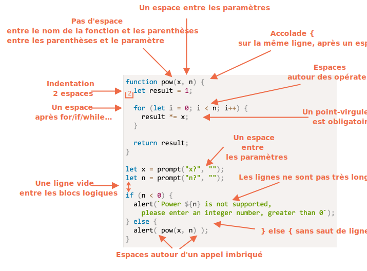

# Style de codage

Notre code doit être aussi propre et lisible que possible.

C’est en fait un art de la programmation -- prendre une tâche complexe et la coder de manière correcte et lisible par l’homme. Un bon style de code aide grandement à cela.

Une chose à aider est le bon style de code.

## Syntaxe

Voici un aide-mémoire avec quelques règles suggérées (plus de détails ci-dessous) :


<!--
```js
function pow(x, n) {
  let result = 1;

  for (let i = 0; i < n; i++) {
    result *= x;
  }

  return result;
}

let x = prompt("x?", "");
let n = prompt("n?", "");

if (n < 0) {
  alert(`Power ${n} is not supported,
    please enter a non-negative integer number`);
} else {
  alert( pow(x, n) );
}
```

-->

Discutons maintenant des règles et de leurs raisons en détail.

```warn header="Il n'y a pas de règles \"vous devez\""
Rien n'est figé ici. Ce sont des préférences de style, pas des dogmes religieux.
```

### Accolades

Dans la plupart des projets JavaScript, les accolades sont écrites sur la même ligne que le mot clé correspondant, et non sur la nouvelle ligne, dans un style dit «égyptien». Il y a aussi un espace avant un crochet d’ouverture.

Comme ceci :

```js
if (condition) {
  // fait ceci
  // ...et cela
  // ...et cela
}
```

Une construction sur une seule ligne, comme `if (condition) doSomething()`, est un cas important. Devrions-nous utiliser des accolades ? 

Voici les variantes annotées pour que vous puissiez juger de leur lisibilité :

1. 😠 Beginners sometimes do that. Bad! Curly braces are not needed:
    ```js
    if (n < 0) *!*{*/!*alert(`Power ${n} is not supported`);*!*}*/!*
    ```
2. 😠 Split to a separate line without braces. Never do that, easy to make an error when adding new lines:
    ```js
    if (n < 0)
      alert(`Power ${n} is not supported`);
    ```
3. 😏 One line without braces - acceptable, if it's short:
    ```js
    if (n < 0) alert(`Power ${n} is not supported`);
    ```
4. 😃 The best variant:
    ```js
    if (n < 0) {
      alert(`Power ${n} is not supported`);
    }
    ```

For a very brief code, one line is allowed, e.g. `if (cond) return null`. But a code block (the last variant) is usually more readable.


### Longueur de la ligne

Personne n'aime lire une longue ligne horizontale de code. La meilleure pratique est de les scinder.

Par exemple :
```js
// les guillemets backtick ` permettent de scinder la chaîne de caractères en plusieurs lignes
let str = `
  ECMA International's TC39 is a group of JavaScript developers,
  implementers, academics, and more, collaborating with the community
  to maintain and evolve the definition of JavaScript.
`;
```

Et pour les déclarations `if` :

```js
if (
  id === 123 &&
  moonPhase === 'Waning Gibbous' &&
  zodiacSign === 'Libra'
) {
  letTheSorceryBegin();
}
```

La longueur de ligne maximale est convenue au niveau de l'équipe. C’est généralement 80 ou 120 caractères.

### Indentations

Il existe deux types d'indentations :

- **Un retrait horizontal : 2(4) espaces.**

    Une indentation horizontale est faite en utilisant 2 ou 4 espaces ou le symbole  horizontal de tabulation (key `key:Tab`). Lequel choisir est une vieille guerre sainte. Les espaces sont plus communs de nos jours.

    Un des avantages des espaces sur les tabulations est qu’ils permettent des configurations de retrait plus flexibles que le symbole tabulation.

<<<<<<< HEAD
    Par exemple, nous pouvons aligner les arguments avec le crochet d’ouverture, comme ceci :
=======
    For instance, we can align the parameters with the opening bracket, like this:
>>>>>>> 97ef86242f9f236b13152e1baf52a55c4db8728a

    ```js no-beautify
    show(parameters,
         aligned, // 5 espaces à gauche
         one,
         after,
         another
      ) {
      // ...
    }
    ```

- **Un retrait vertical: lignes vides pour fractionner le code en blocs logiques.**

    Même une seule fonction peut souvent être divisée en blocs logiques. Dans l'exemple ci-dessous, l'initialisation des variables, la boucle principale et le retour du résultat sont fractionnés verticalement :

    ```js
    function pow(x, n) {
      let result = 1;
      //              <--
      for (let i = 0; i < n; i++) {
        result *= x;
      }
      //              <--
      return result;
    }
    ```

    Insérez une nouvelle ligne où cela aide à rendre le code plus lisible. Il ne devrait pas y avoir plus de neuf lignes de code sans indentation verticale.

### Un point-virgule

Un point-virgule doit être présent après chaque déclaration. Même si cela pourrait éventuellement être ignoré.

Il y a des langages où le point-virgule est vraiment optionnel. Il est donc rarement utilisé. Mais dans JavaScript, il y a peu de cas où un saut de ligne n'est parfois pas interprété comme un point-virgule. Cela laisse place à des erreurs de programmation. Plus d'informations à ce sujet dans le chapitre <info:structure#semicolon>.

Si vous êtes un programmeur JavaScript expérimenté, vous pouvez choisir un style de code sans point-virgule comme [StandardJS](https://standardjs.com/). Autrement, il est préférable d’utiliser des points-virgules pour éviter les pièges possibles. La majorité des développeurs mettent des points-virgules.

### Niveaux d'imbrications

Il ne devrait pas y avoir trop de niveaux d'imbrication.

Par exemple, dans une boucle, c’est parfois une bonne idée d’utiliser la directive ["continue"](info:while-for#continue) pour éviter une imbrication supplémentaire. 

Par exemple, au lieu d’ajouter un `if` imbriqué conditionnel comme ceci :

```js
for (let i = 0; i < 10; i++) {
  if (cond) {
    ... // <- un autre niveau d'imbrication
  }
}
```

Nous pouvons écrire :

```js
for (let i = 0; i < 10; i++) {
  if (!cond) *!*continue*/!*;
  ...  // <- pas de niveau d'imbrication supplémentaire
}
```

Une chose similaire peut être faite avec `if/else` et `return`.

Par exemple, les deux constructions ci-dessous sont identiques.

Le premier :

```js
function pow(x, n) {
  if (n < 0) {
    alert("Negative 'n' not supported");
  } else {
    let result = 1;

    for (let i = 0; i < n; i++) {
      result *= x;
    }

    return result;
  }  
}
```

Et ceci :

```js
function pow(x, n) {
  if (n < 0) {
    alert("Negative 'n' not supported");
    return;
  }

  let result = 1;

  for (let i = 0; i < n; i++) {
    result *= x;
  }

  return result;
}
```

Le second est plus lisible, parce que le "cas marginal" de `n < 0` est traité tôt. Une fois la vérification effectuée, nous pouvons passer au flux de code "principal" sans avoir besoin d'imbrication supplémentaire.

## Placement de Fonction

Si vous écrivez plusieurs fonctions "helper" (auxiliaires) et le code pour les utiliser, il existe trois façons de les placer.

1. Déclarez les fonctions *au-dessus* du code qui les utilise :

    ```js
    // *!*fonctions declarations*/!*
    function createElement() {
      ...
    }

    function setHandler(elem) {
      ...
    }

    function walkAround() {
      ...
    }

    // *!*le code qui les utilise*/!*
    let elem = createElement();
    setHandler(elem);
    walkAround();
    ```
2. Le code d'abord, puis les fonctions

    ```js
    // *!*le code qui utilise les fonctions*/!*
    let elem = createElement();
    setHandler(elem);
    walkAround();

    // --- *!*fonctions helper*/!* ---

    function createElement() {
      ...
    }

    function setHandler(elem) {
      ...
    }

    function walkAround() {
      ...
    }
    ```
3. Mixte : une fonction est décrite là où elle a été utilisée pour la première fois.

La plupart du temps, la deuxième variante est préférée.

C’est parce qu’en lisant du code, nous voulons d’abord savoir ce qu’il fait. Si le code commence en premier, il devient clair dès le début. Ensuite, nous n’aurons peut-être pas besoin de lire les fonctions du tout, surtout si leur nom décrit ce qu’elles font réellement.

## Guides de style

Un guide de style contient des règles générales sur "comment écrire" du code, ex: les quotes à utiliser, le nombre d'espaces pour indenter, la longueur de ligne maximale, etc. Beaucoup de petites choses.

Au total, lorsque tous les membres d'une équipe utilisent le même guide de style, le code est uniforme. Peu importe qui l’a écrit, c’est toujours le même style.

Bien sûr, une équipe peut toujours écrire son propre guide de style, mais cela n’est généralement pas nécessaire. Il existe de nombreux guides existants à choisir.

Par exemple :

- [Google JavaScript Style Guide](https://google.github.io/styleguide/jsguide.html)
- [Airbnb JavaScript Style Guide](https://github.com/airbnb/javascript)
- [Idiomatic.JS](https://github.com/rwaldron/idiomatic.js)
- [StandardJS](https://standardjs.com/)
- (il y en a plus)

Si vous êtes un développeur novice, commencez par le cheatsheet au début de ce chapitre. Ensuite, vous pouvez parcourir d'autres guides de style pour trouver plus d'idées et décider lequel vous préférez.

## Linters automatisés

Les linters sont des outils permettant de vérifier automatiquement le style de votre code et de formuler des suggestions d'amélioration.

Ce qui est génial avec eux, c'est que la vérification du style trouve également des bugs, comme une faute de frappe dans une variable ou un nom de fonction. En raison de cette fonctionnalité, l'utilisation d'un linter est recommandée même si vous ne souhaitez pas vous en tenir à un "style de code" particulier.

Voici quelques linters bien connus :

- [JSLint](http://www.jslint.com/) -- l'un des premiers linters.
- [JSHint](http://www.jshint.com/) -- plus de paramètres que JSLint.
- [ESLint](http://eslint.org/) -- probablement le plus récent.

Tous peuvent faire le travail. L'auteur utilise [ESLint](http://eslint.org/).

La plupart des linters sont intégrés aux éditeurs: il suffit d'activer le plug-in dans l'éditeur et de configurer le style.

Par exemple, pour ESLint, vous devez procéder comme suit :

1. Installer [Node.js](https://nodejs.org/).
2. Installer ESLint avec la commande `npm install -g eslint` (npm est un gestionnaire de paquets JavaScript).
3. Créez un fichier de configuration nommé `.eslintrc` dans la racine de votre projet JavaScript (dans le dossier contenant tous vos fichiers).
4. Installez / activez le plug-in pour votre éditeur qui s'intègre à ESLint. La majorité des éditeurs en ont un.

Voici un exemple de `.eslintrc`:

```js
{
  "extends": "eslint:recommended",
  "env": {
    "browser": true,
    "node": true,
    "es6": true
  },
  "rules": {
    "no-console": 0,
    "indent": 2
  }
}
```

Ici, la directive `"extends"` indique que nous nous basons sur l'ensemble de paramètres "eslint:recommended", puis nous spécifions les nôtres.

Il est aussi possible de télécharger des ensembles de règles de style à partir du Web et de les étendre. Voir <http://eslint.org/docs/user-guide/getting-started> pour plus de détails sur l'installation.

L'utilisation d'un linter a un effet secondaire formidable: les linters prennent les fautes de frappe. Par exemple, quand on accède à une variable non définie, un linter la détecte et (s'il est intégrée à un éditeur) la met en évidence. Dans la plupart des cas, il s’agit d’un mauvais type. Nous pouvons donc régler le problème tout de suite.

Pour cette raison, même si vous n’êtes pas préoccupé par les styles, il est vivement recommandé d’utiliser un linter.

De plus, certains IDE prennent en charge le linting nativement, ce qui peut également être bien, mais pas aussi ajustables que ESLint.

## Résumé

Toutes les règles de syntaxe de ce chapitre et les guides de style visent à améliorer la lisibilité, elles sont donc toutes discutables.

Lorsque nous pensons à écrire du "meilleur" code, les questions que nous devrions nous poser sont les suivantes : "Qu'est-ce qui rend le code plus lisible et plus facile à comprendre ?" Et "Qu'est-ce qui peut nous aider à éviter les erreurs ?" Telles sont les principales choses à garder à l'esprit lors du choix et du débat sur les styles de code.

Lisez les guides de style pour connaître les dernières idées à ce sujet et suivez celles que vous trouvez les meilleures.
