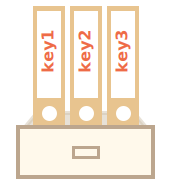
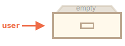
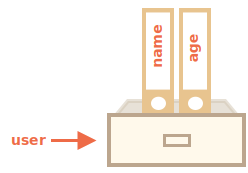
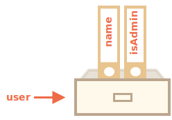
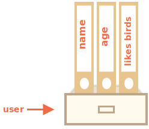

# Objets

Comme nous le savons du chapitre <info:types>, il existe huit types de données dans le langage JavaScript. Sept d'entre elles sont appelées "primitives", car leurs valeurs ne contiennent qu'une seule chose (que ce soit une chaîne, un nombre ou autre).

En revanche, les objets sont utilisés pour stocker des collections de données variées et d’entités plus complexes. En JavaScript, les objets pénètrent dans presque tous les aspects du langage. Nous devons donc d'abord les comprendre avant d'aller plus loin.

Un objet peut être créé avec des accolades `{…}`, avec une liste optionnelle de *propriétés*. Une propriété est une paire "clé: valeur", dans laquelle la clé (`key`) est une chaîne de caractères (également appelée "nom de la propriété"), et la valeur (`value`) peut être n'importe quoi.

Nous pouvons imaginer un objet comme une armoire avec des fichiers signés. Chaque donnée est stockée dans son fichier par la clé. Il est facile de trouver un fichier par son nom ou d’ajouter/supprimer un fichier.



Un objet vide ("armoire vide") peut être créé en utilisant l'une des deux syntaxes suivantes :

```js
let user = new Object(); // syntaxe "constructeur d'objet"
let user = {};  // syntaxe "littéral objet"
```



Habituellement, les accolades `{...}` sont utilisées. Cette déclaration s'appelle un littéral objet (*object literal*).

## Littéraux et propriétés

Nous pouvons immédiatement inclure certaines propriétés dans `{...}` sous forme de paires "clé: valeur" :

```js
let user = {     // un objet
  name: "John",  // par clé "nom" valeur de stockage "John"
  age: 30        // par clé "age" valeur de stockage 30
};
```

Une propriété a une clé (également appelée "nom" ou "identifiant") avant les deux points `":"` et une valeur à sa droite.

Dans l'objet `user`, il y a deux propriétés :

1. La première propriété porte le nom `"name"` et la valeur `"John"`.
2. La seconde a le nom `"age"` et la valeur `30`.

L'objet `user` résultant peut être imaginé comme une armoire avec deux fichiers signés intitulés "nom" et "âge".



Nous pouvons ajouter, supprimer et lire des fichiers à tout moment.

Les valeurs de propriété sont accessibles à l'aide de la notation par points :

```js
// récupère les valeurs de propriété de l'objet :
alert( user.name ); // John
alert( user.age ); // 30
```

La valeur peut être de tout type. Ajoutons un booléen :

```js
user.isAdmin = true;
```


Pour supprimer une propriété, nous pouvons utiliser l'opérateur `delete` :

```js
delete user.age;
```



Nous pouvons également utiliser des noms de propriété multi-mots, mais ils doivent ensuite être entourés de quotes :

```js
let user = {
  name: "John",
  age: 30,
  "likes birds": true  // le nom de la propriété multi-mots doit être entourée de quotes
};
```




La dernière propriété de la liste peut se terminer par une virgule :
```js
let user = {
  name: "John",
  age: 30*!*,*/!*
}
```
Cela s'appelle une virgule  "trailing" ou "hanging". Elle facilite l'ajout/suppression/déplacement des propriétés, car toutes les lignes se ressemblent.

<<<<<<< HEAD
## Crochets
=======
````smart header="Object with const can be changed"
Please note: an object declared as `const` *can* be modified.

For instance:

```js run
const user = {
  name: "John"
};

*!*
user.name = "Pete"; // (*)
*/!*

alert(user.name); // Pete
```

It might seem that the line `(*)` would cause an error, but no. The `const` fixes the value of `user`, but not its contents.

The `const` would give an error only if we try to set `user=...` as a whole.

There's another way to make constant object properties, we'll cover it later in the chapter <info:property-descriptors>.
````

## Square brackets
>>>>>>> b52aa942a8e9b75ba8a65124c22593171e273bb6

Pour les propriétés multi-mots, l’accès par points ne fonctionne pas :

```js run
// cela donnerait une erreur de syntaxe
user.likes birds = true
```

JavaScript ne comprend pas cela. Il pense que nous adressons `user.likes`, ensuite il donne une erreur de syntaxe lorsqu'il rencontre des `birds` inattendus.

Le point nécessite que la clé soit un identificateur de variable valide. Cela implique qu'elle ne contient aucun espace, ne commence pas par un chiffre et n'inclut pas de caractères spéciaux (`$` et `_` sont autorisés).

Il existe une autre “notation entre crochets” qui fonctionne avec n’importe quelle chaîne :

```js run
let user = {};

// set
user["likes birds"] = true;

// get
alert(user["likes birds"]); // true

// delete
delete user["likes birds"];
```

Maintenant tout va bien. Veuillez noter que la chaîne de caractères entre crochets est correctement entourée de quotes (tout type de guillemets fera l'affaire).

Les crochets fournissent également un moyen d'obtenir le nom de la propriété comme résultat de toute expression (par opposition à une chaîne de caractères littérale), semblable à une variable, comme ceci :

```js
let key = "likes birds";

// pareil que user["likes birds"] = true;
user[key] = true;
```

Ici, la variable `key` peut être calculée au moment de l'exécution ou dépendre de la saisie de l'utilisateur. Et ensuite, nous l'utilisons pour accéder à la propriété. Cela nous donne beaucoup de flexibilité. 

Par exemple :

```js run
let user = {
  name: "John",
  age: 30
};

let key = prompt("What do you want to know about the user?", "name");

// accès par variable
alert( user[key] ); // John (si entré "name")
```

The dot notation cannot be used in a similar way:

```js run
let user = {
  name: "John",
  age: 30
};

let key = "name";
alert( user.key ) // undefined
```

### Propriétés calculées

<<<<<<< HEAD
Nous pouvons utiliser des crochets dans un objet littéral. Cela s'appelle des propriétés calculées (*computed propertie*).
=======
We can use square brackets in an object literal, when creating an object. That's called *computed properties*.
>>>>>>> b52aa942a8e9b75ba8a65124c22593171e273bb6

Par exemple :

```js run
let fruit = prompt("Which fruit to buy?", "apple");

let sac = {
*!*
  [fruit]: 5, // le nom de la propriété est tiré de la variable fruit
*/!*
};

alert( bag.apple ); // 5 si fruit="apple"
```

La signification d'une propriété calculée est simple: `[fruit]` signifie que le nom de la propriété doit être extrait de `fruit`.

Ainsi, si un visiteur entre `"apple"`, `bag` deviendra `{apple: 5}`.

Essentiellement, cela fonctionne de la même façon que :
```js run
let fruit = prompt("Which fruit to buy?", "apple");
let bag = {};

// prendre le nom de la propriété de la variable fruit
bag[fruit] = 5;
```

… Mais a une meilleure apparence.

Nous pouvons utiliser des expressions plus complexes entre crochets :

```js
let fruit = 'apple';
let bag = {
  [fruit + 'Computers']: 5 // bag.appleComputers = 5
};
```

Les crochets sont beaucoup plus puissants que la notation par points. Ils autorisent tous les noms de propriété et variables. Mais ils sont aussi plus lourds à écrire.

Ainsi, la plupart du temps, lorsque les noms de propriété sont connus et simples, le point est utilisé. Et si nous avons besoin de quelque chose de plus complexe, nous passons aux crochets.

## Valeur de propriété abrégée (Property value shorthand)

Dans le code, nous utilisons souvent des variables existantes en tant que valeurs pour les noms de propriétés.

Par exemple :

```js run
function makeUser(name, age) {
  return {
    name: name,
    age: age,
    // ...autres propriétés
  };
}

let user = makeUser("John", 30);
alert(user.name); // John
```

Dans l'exemple ci-dessus, les propriétés portent les mêmes noms que les variables. Le cas d’utilisation de la création d’une propriété à partir d’une variable est si courant qu’il existe une valeur spéciale de propriété abrégée (*property value shorthand*) pour la rendre plus courte.

Au lieu de `name:name`, nous pouvons simplement écrire `name`, comme ceci :

```js
function makeUser(name, age) {
*!*
  return {
    name, // pareil que name: name
    age,  // pareil que age: age
    // ...
  };
*/!*
}
```

Nous pouvons utiliser à la fois des propriétés normales et des raccourcis dans le même objet :

```js
let user = {
  name,  // pareil que name:name
  age: 30
};
```

<<<<<<< HEAD
## Limitations des noms de propriété

Les noms de propriété (clés) doivent être des chaînes de caractères ou des symboles (un type spécial pour les identifiants, à couvrir plus tard).

Les autres types sont automatiquement convertis en chaînes de caractères.

Par exemple, un nombre `0` devient une chaîne de caractères `"0"` lorsqu'il est utilisé comme clé de propriété :
=======

## Property names limitations

As we already know, a variable cannot have a name equal to one of language-reserved words like "for", "let", "return" etc.

But for an object property, there's no such restriction:
>>>>>>> b52aa942a8e9b75ba8a65124c22593171e273bb6

```js run
// these properties are all right
let obj = {
<<<<<<< HEAD
  0: "test" // pareil que "0": "test"
};

// les deux alertes accèdent à la même propriété (le nombre 0 est converti en chaîne "0")
alert( obj["0"] ); // test
alert( obj[0] ); // test (même propriété)
```

**Les mots réservés sont autorisés comme noms de propriété.**

Comme nous le savons déjà, une variable ne peut pas avoir un nom égal à l'un des mots réservés du langage comme `for`, `let`, `return` etc.

Mais pour une propriété d'objet, il n'y a pas ce genre de restriction. Tous les noms sont acceptés :
=======
  for: 1,
  let: 2,
  return: 3
};

alert( obj.for + obj.let + obj.return );  // 6
```

In short, there are no limitations on property names. They can be any strings or symbols (a special type for identifiers, to be covered later).

Other types are automatically converted to strings.

For instance, a number `0` becomes a string `"0"` when used as a property key:
>>>>>>> b52aa942a8e9b75ba8a65124c22593171e273bb6

```js run
let obj = {
  0: "test" // same as "0": "test"
};

// both alerts access the same property (the number 0 is converted to string "0")
alert( obj["0"] ); // test
alert( obj[0] ); // test (same property)
```

<<<<<<< HEAD
Nous pouvons utiliser n'importe quelle chaîne de caractères comme clé, mais il existe une propriété spéciale nommée `__proto__` qui reçoit un traitement spécial pour des raisons historiques.

Par exemple, nous ne pouvons pas la définir sur une valeur non-objet :
=======
There's a minor gotcha with a special property named `__proto__`. We can't set it to a non-object value:
>>>>>>> b52aa942a8e9b75ba8a65124c22593171e273bb6

```js run
let obj = {};
obj.__proto__ = 5; // assign a number
alert(obj.__proto__); // [object Object] - la valeur est un objet, n'a pas fonctionné comme prévu
```

Comme nous le voyons dans le code, l'affectation à une primitive `5` est ignorée.

<<<<<<< HEAD
La nature de `__proto__` sera révélée en détail plus loin dans le chapitre [](info:prototype-inheritance).

Pour l'instant, il est important de savoir qu'un tel comportement de `__proto__` peut devenir une source de bugs et même de vulnérabilités si nous avons l'intention de stocker des clés fournies par l'utilisateur dans un objet.

Le problème est qu'un visiteur peut choisir `__proto__` comme clé, et la logique d'affectation sera ruinée (comme indiqué ci-dessus).

Il existe deux solutions de contournement pour le problème :
1. Modifiez le comportement de l'objet pour traiter `__proto__` comme une propriété régulière. Nous apprendrons comment le faire dans le chapitre [](info:prototype-methods).
2. En utilisant la structure de données [Map](info:map-set) qui prend en charge les clés arbitraires. Nous l'apprendrons dans le chapitre <info:map-set>.
=======
We'll cover the special nature of `__proto__` in [subsequent chapters](info:prototype-inheritance), and suggest the [ways to fix](info:prototype-methods) such behavior.
>>>>>>> b52aa942a8e9b75ba8a65124c22593171e273bb6

## Test d'existence de propriété, opérateur "in"

<<<<<<< HEAD
Une caractéristique notable des objets est qu’il est possible d’accéder à n’importe quelle propriété. Il n’y aura pas d’erreur si la propriété n’existe pas ! L'accès à une propriété non existante renvoie simplement `undefined`. Le langage fournit un moyen très courant de vérifier si la propriété existe -- pour l'obtenir et la comparer avec `undefined` :
=======
A notable feature of objects in JavaScript, compared to many other languages, is that it's possible to access any property. There will be no error if the property doesn't exist!

Reading a non-existing property just returns `undefined`. So we can easily test whether the property exists:
>>>>>>> b52aa942a8e9b75ba8a65124c22593171e273bb6

```js run
let user = {};

alert( user.noSuchProperty === undefined ); // true signifie "pas une telle propriété"
```

<<<<<<< HEAD
Il existe également un opérateur spécial `"in"` pour vérifier l'existence d'une propriété.
=======
There's also a special operator `"in"` for that.
>>>>>>> b52aa942a8e9b75ba8a65124c22593171e273bb6

La syntaxe est :
```js
"key" in object
```

Par exemple :

```js run
let user = { name: "John", age: 30 };

alert( "age" in user ); // true, user.age existe
alert( "blabla" in user ); // false, user.blabla n'existe pas
```

Veuillez noter que sur le côté gauche de `in`, il doit y avoir un *nom de propriété*. C’est généralement une chaîne de caractères entre guillemets.

<<<<<<< HEAD
Si nous omettons les guillemets, cela signifierait une variable contenant le nom à tester. Par exemple :
=======
If we omit quotes, that means a variable, it should contain the actual name to be tested. For instance:
>>>>>>> b52aa942a8e9b75ba8a65124c22593171e273bb6

```js run
let user = { age: 30 };

let key = "age";
<<<<<<< HEAD
alert( *!*key*/!* in user ); // true, prend le nom de la clé et vérifie cette propriété
```

````smart header="Utilisation de \"in\" pour les propriétés qui stockent `undefined`"
Habituellement, la comparaison stricte `"=== undefined"` vérifie l'existence de la propriété très bien. Mais il y a un cas particulier où elle échoue, mais `"in"` fonctionne correctement.
=======
alert( *!*key*/!* in user ); // true, property "age" exists
```

Why does the `in` operator exist? Isn't it enough to compare against `undefined`?

Well, most of the time the comparison with `undefined` works fine. But there's a special case when it fails, but `"in"` works correctly.
>>>>>>> b52aa942a8e9b75ba8a65124c22593171e273bb6

C’est lorsque une propriété d’objet existe, mais qu'elle stocke undefined :

```js run
let obj = {
  test: undefined
};

alert( obj.test ); // c'est indéfini, donc - pas une telle propriété ?

alert( "test" in obj ); // true, la propriété existe !
```

<<<<<<< HEAD

Dans le code ci-dessus, la propriété `obj.test` existe techniquement. Donc, l'opérateur `in` fonctionne bien.

Des situations comme celle-ci se produisent très rarement, parce que `undefined` n'est généralement pas attribué. Nous utilisons principalement `null` pour les valeurs "inconnues" ou "vides". Ainsi, l'opérateur `in` est un invité exotique dans le code.
````
=======
In the code above, the property `obj.test` technically exists. So the `in` operator works right.

Situations like this happen very rarely, because `undefined` should not be explicitly assigned. We mostly use `null` for "unknown" or "empty" values. So the `in` operator is an exotic guest in the code.

>>>>>>> b52aa942a8e9b75ba8a65124c22593171e273bb6


## La boucle "for..in"

Pour parcourir toutes les clés d'un objet, il existe une forme spéciale de boucle : `for..in`. C'est une chose complètement différente de la construction `for(;;)` que nous avons étudiée auparavant.

La syntaxe :

```js
for(key in object) {
  // exécute le corps pour chaque clé parmi les propriétés de l'objet
}
```

Par exemple, affichons toutes les propriétés de `user` :

```js run
let user = {
  name: "John",
  age: 30,
  isAdmin: true
};

for(let key in user) {
  // keys
  alert( key );  // name, age, isAdmin
  // valeurs pour les clés
  alert( user[key] ); // John, 30, true
}
```

Notez que toutes les constructions "for" nous permettent de déclarer la variable en boucle à l'intérieur de la boucle, comme `let key` ici.

En outre, nous pourrions utiliser un autre nom de variable ici au lieu de `key`. Par exemple, `"for(let prop in obj)"` est également largement utilisé.

<<<<<<< HEAD

### Ordonné comme un objet
=======
### Ordered like an object
>>>>>>> b52aa942a8e9b75ba8a65124c22593171e273bb6

Les objets sont-ils ordonnés ? En d'autres termes, si nous parcourons un objet en boucle, obtenons-nous toutes les propriétés dans le même ordre où elles ont été ajoutées ? Pouvons-nous compter sur cela ?

La réponse courte est : "ordonné de manière spéciale" : les propriétés des entiers sont triées, les autres apparaissent dans l'ordre de création. Nous allons voir cela en détails.

Par exemple, considérons un objet avec les indicatifs de téléphone par pays :

```js run
let codes = {
  "49": "Germany",
  "41": "Switzerland",
  "44": "Great Britain",
  // ..,
  "1": "USA"
};

*!*
for(let code in codes) {
  alert(code); // 1, 41, 44, 49
}
*/!*
```

L'objet peut être utilisé pour suggérer une liste d'options à l'utilisateur. Si nous créons un site principalement pour le public allemand, nous voulons probablement que `49` soit le premier.

Mais si nous exécutons ce code, nous voyons une image totalement différente :

- USA (1) passe en premier
- puis Switzerland (41) et ainsi de suite.

Les indicatifs de téléphone sont classés par ordre croissant, car ce sont des entiers. Donc on voit `1, 41, 44, 49`.

````smart header="Propriétés entier (integer properties) ? Qu'est-ce que c'est ?"
Le terme "propriété entier" (integer properties) désigne ici une chaîne de caractères pouvant être convertie en un entier à partir de-et-sans modification.

Ainsi, "49" est un nom de propriété entier, parce que lorsqu'il est transformé en nombre entier et inversement, il reste identique. Mais "+49" et "1.2" ne le sont pas :

```js run
// Math.trunc est une fonction intégrée qui supprime la partie décimale
alert( String(Math.trunc(Number("49"))) ); // "49", idem, propriété entier (integer property)
alert( String(Math.trunc(Number("+49"))) ); // "49", pas pareil "+49" ⇒ pas une propriété entier (integer property)
alert( String(Math.trunc(Number("1.2"))) ); // "1", pas pareil "1.2" ⇒ pas une propriété entier (integer property)
```
````

… Par contre, si les clés ne sont pas des entiers, elles sont listées dans l'ordre de création, par exemple :

```js run
let user = {
  name: "John",
  surname: "Smith"
};
user.age = 25; // Ajouter une clé de plus

*!*
// les propriétés non-entiers sont listées dans l'ordre de création
*/!*
for (let prop in user) {
  alert( prop ); // name, surname, age
}
```

Donc, pour résoudre le problème avec les indicatifs de téléphone, nous pouvons "tricher" en rendant ces indicatifs non entiers. Ajouter un signe plus `"+"` avant chaque indicatif suffit.

Comme ceci :

```js run
let codes = {
  "+49": "Germany",
  "+41": "Switzerland",
  "+44": "Great Britain",
  // ..,
  "+1": "USA"
};

for(let code in codes) {
  alert( +code ); // 49, 41, 44, 1
}
```

Maintenant, cela fonctionne comme prévu.

<<<<<<< HEAD
## Copier par référence

L'une des différences fondamentales entre les objets et les primitives est qu'ils sont stockés et copiés "par référence".

Les valeurs primitives: chaînes de caractères, nombres, booléens - sont attribuées / copiées "comme une seule valeur".

Par exemple :

```js
let message = "Hello!";
let phrase = message;
```

Par conséquent, nous avons deux variables indépendantes, chacune stockant la chaîne de caractères `"Hello!"`.


Les objets ne sont pas comme ça.

**Une variable ne stocke pas l'objet lui-même, mais son "adresse en mémoire", autrement dit "une référence".**

Voici l'image d'un objet :

```js
let user = {
  name: "John"
};
```


Ici, l'objet est stocké quelque part en mémoire. Et la variable `user` a une "référence" à cet objet.

**Lorsqu'une variable d'objet est copiée - la référence est copiée, l'objet n'est pas dupliqué.**

Si nous imaginons un objet comme une armoire, une variable en est la clé. La copie d'une variable duplique la clé, mais pas l'armoire elle-même.

Par exemple :

```js no-beautify
let user = { name: "John" };

let admin = user; // copier la référence
```

Maintenant nous avons deux variables, chacune avec la référence au même objet :


Nous pouvons utiliser n’importe quelle variable pour accéder à l'armoire et modifier son contenu :

```js run
let user = { name: 'John' };

let admin = user;

*!*
admin.name = 'Pete'; // modifié par la référence "admin"
*/!*

alert(*!*user.name*/!*); // 'Pete', les changements sont visibles depuis la référence "user"
```

L'exemple ci-dessus montre qu'il n'y a qu'un seul objet. Comme si nous avions une armoire avec deux clés et en utilisions une (`admin`) pour y entrer. Ensuite, si nous utilisions plus tard l'autre clé (`user`), nous constaterions des changements.

### Comparaison par référence

Les opérateurs d'égalité `==` et d'égalité stricte `===` pour les objets fonctionnent exactement de la même manière.

**Deux objets ne sont égaux que s’ils sont le même objet.**

Par exemple, si deux variables référencent le même objet, elles sont égales :

```js run
let a = {};
let b = a; // copier la référence

alert( a == b ); // true, les deux variables font référence au même objet
alert( a === b ); // true
```

Et ici, deux objets indépendants ne sont pas égaux, même s'ils sont vides :

```js run
let a = {};
let b = {}; // deux objets indépendants

alert( a == b ); // false
```

Pour des comparaisons comme `obj1 > obj2` ou pour une comparaison avec une primitive `obj == 5`, les objets sont convertis en primitives. Nous étudierons très bientôt le fonctionnement des conversions d’objets, mais à vrai dire, de telles comparaisons ne sont nécessaires que très rarement et résultent généralement d’une erreur de codage.

### Objet Const

Un objet déclaré comme `const` *peut* être modifié.

Par exemple :

```js run
const user = {
  name: "John"
};

*!*
user.age = 25; // (*)
*/!*

alert(user.age); // 25
```

Il peut sembler que la ligne `(*)` cause une erreur, mais non, il n’y a absolument aucun problème. C’est parce que `const` fixe uniquement la valeur de `user` lui-même. Et ici, `user` stocke la référence au même objet tout le temps. La ligne `(*)` va à *l’intérieur* de l’objet, elle ne réaffecte pas `user`.

Le `const` donnerait une erreur si nous essayons de définir `user` sur autre chose, par exemple :

```js run
const user = {
  name: "John"
};

*!*
// Erreur (ne peut pas réaffecter user)
*/!*
user = {
  name: "Pete"
};
```

… Mais que faire si nous voulons créer des propriétés d'objet constantes ? Donc, `user.age = 25` donnerait une erreur. C’est possible aussi. Nous couvrirons cela dans le chapitre <info:property-descriptors>.

## Clonage et fusion, Object.assign

Donc, la copie d'une variable d'objet crée une autre référence au même objet.

Mais que faire si nous avons besoin de dupliquer un objet ? Créer une copie indépendante, un clone ?

C’est également faisable, mais un peu plus difficile, car il n’existe pas de méthode intégrée pour cela en JavaScript. En fait, cela est rarement nécessaire. La copie par référence est bonne la plupart du temps.

Mais si nous le voulons vraiment, nous devons créer un nouvel objet et répliquer la structure de l’existant en itérant sur ses propriétés et en les copiant au niveau primitif.

Comme ceci :

```js run
let user = {
  name: "John",
  age: 30
};

*!*
let clone = {}; // le nouvel objet vide

// copions toutes les propriétés de user dedans
for (let key in user) {
  clone[key] = user[key];
}
*/!*

// maintenant clone est un clone totalement indépendant
clone.name = "Pete"; // changé les données qu'il contient

alert( user.name ); // toujours John dans l'objet original
```

Nous pouvons aussi utiliser la méthode [Object.assign](mdn:js/Object/assign) pour cela.

La syntaxe est :

```js
Object.assign(dest[, src1, src2, src3...])
```

- Arguments `dest`, et `src1, ..., srcN` (peut être autant que nécessaire) sont des objets.
- Il copie les propriétés de tous les objets `src1, ..., srcN` dans `dest`. En d'autres termes, les propriétés de tous les arguments à partir du 2e sont copiées dans le 1er. Puis ça renvoit `dest`.

Par exemple, nous pouvons l’utiliser pour fusionner plusieurs objets en un seul :
```js
let user = { name: "John" };

let permissions1 = { canView: true };
let permissions2 = { canEdit: true };

*!*
// copie toutes les propriétés de permissions1 et permissions2 dans user
Object.assign(user, permissions1, permissions2);
*/!*

// maintenant user = { name: "John", canView: true, canEdit: true }
```

Si l'objet destinataire (`user`) a déjà la même propriété nommée, elle sera écrasée :

```js
let user = { name: "John" };

// écrase name, ajoute isAdmin
Object.assign(user, { name: "Pete", isAdmin: true });

// maintenant user = { name: "Pete", isAdmin: true }
```

Nous pouvons également utiliser `Object.assign` pour remplacer la boucle pour un clonage simple :

```js
let user = {
  name: "John",
  age: 30
};

*!*
let clone = Object.assign({}, user);
*/!*
```

Il copie toutes les propriétés de `user` dans l'objet vide et le renvoie. En fait, c'est le même principe que la boucle, mais  en plus court.

Jusqu'à présent, nous avons supposé que toutes les propriétés de `user` sont primitives. Mais les propriétés peuvent être des références à d'autres objets. Que faire avec elles ?

Comme ceci :
```js run
let user = {
  name: "John",
  sizes: {
    height: 182,
    width: 50
  }
};

alert( user.sizes.height ); // 182
```

Maintenant, il ne suffit plus de copier `clone.sizes = user.sizes`, car `user.sizes` est un objet, il sera copié par référence. Donc, `clone` et `user` partageront les mêmes tailles :

Comme ceci :
```js run
let user = {
  name: "John",
  sizes: {
    height: 182,
    width: 50
  }
};

let clone = Object.assign({}, user);

alert( user.sizes === clone.sizes ); // true, même objet

// user et clone partagent les mêmes tailles
user.sizes.width++;       // change une propriété d'un endroit
alert(clone.sizes.width); // 51, voir le résultat de l'autre endroit
```

Pour résoudre ce problème, nous devons utiliser la boucle de clonage qui examine chaque valeur de `user[key]` et, s’il s’agit d’un objet, répliquer également sa structure. Cela s'appelle un "clonage en profondeur" (deep cloning).

Il existe un algorithme standard pour le clonage en profondeur qui traite le cas ci-dessus et des cas plus complexes, appelé l'[Algorithme de clonage structuré](http://w3c.github.io/html/infrastructure.html#safe-passing-of-structured-data). Pour ne pas réinventer la roue, nous pouvons utiliser une implémentation fonctionnelle de celle-ci à partir de la bibliothèque JavaScript [lodash](https://lodash.com), la méthode s'appelle [_.cloneDeep(obj)](https://lodash.com/docs#cloneDeep).


=======
## Summary
>>>>>>> b52aa942a8e9b75ba8a65124c22593171e273bb6

## Résumé

Les objets sont des tableaux associatifs dotés de plusieurs fonctionnalités spéciales.

Ils stockent des propriétés (paires clé-valeur), où :
- Les clés de propriété doivent être des chaînes de caractères ou des symboles (généralement des chaînes de caractères).
- Les valeurs peuvent être de tout type.

Pour accéder à une propriété, nous pouvons utiliser :
- La notation par points : `obj.property`.
- Notation entre crochets `obj["property"]`. Les crochets permettent de prendre la clé d’une variable, comme `obj[varWithKey]`.

<<<<<<< HEAD
Opérateurs supplémentaires :
- Pour supprimer une propriété : `delete obj.prop`.
- Pour vérifier si une propriété avec la clé donnée existe : `"key" in obj`.
- Pour parcourir un objet la boucle : `for(let key in obj)`.

Les objets sont assignés et copiés par référence. En d'autres termes, une variable stocke non pas la "valeur d'objet", mais une "référence" (adresse en mémoire) pour la valeur. Donc, copier une telle variable ou la passer comme argument de fonction copie cette référence, pas l'objet. Toutes les opérations via des références copiées (telles que l'ajout / la suppression de propriétés) sont effectuées sur le même objet.

Pour faire une "copie réelle" (un clone), nous pouvons utiliser `Object.assign` ou  [_.cloneDeep(obj)](https://lodash.com/docs#cloneDeep).
=======
What we've studied in this chapter is called a "plain object", or just `Object`.
>>>>>>> b52aa942a8e9b75ba8a65124c22593171e273bb6

Ce que nous avons étudié dans ce chapitre s’appelle un "objet simple" (plain object) ou juste `Object`.  
Il existe de nombreux autres types d'objets en JavaScript :

- `Array` pour stocker des collections de données ordonnées,
- `Date` pour stocker des informations sur la date et l'heure,
- `Error` pour stocker des informations sur une erreur.
- … Etc.

Ils ont leurs particularités que nous étudierons plus tard. Parfois, les gens disent quelque chose comme "Type de tableau" ou "Type de date", mais ils ne sont pas formellement propres, mais appartiennent à un seul type de données "objet". Et ils l'étendent de différentes manières.

Les objets en JavaScript sont très puissants. Nous venons de gratter la surface d’un sujet vraiment énorme. Nous allons travailler étroitement avec les objets et en apprendre davantage à leur sujet dans d’autres parties du tutoriel.
