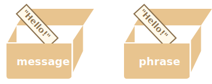
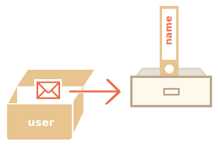
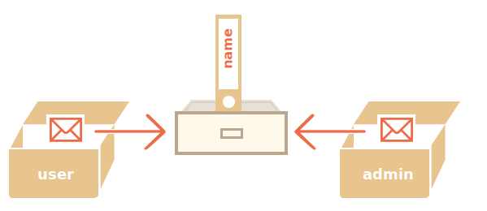

# Les références d'objet et leur copie

Une des différences fondamentale des objets avec les primitives est que ceux-ci sont stockés et copiés "par référence", en opposition des valeurs primitives : strings, numbers, booleans, etc. -- qui sont toujours copiés comme "valeur entière".

On comprendra plus facilement en regardant "sous le capot" de ce qui se passe lorsque nous copions une valeure.

Commençons avec une primitive, comme une chaîne de caractères.

Ici nous assignons une copie de `message` dans `phrase` :

```js
let message = "Hello!";
let phrase = message;
```

Il en résulte deux variables indépendantes, chacune stockant la chaîne de caractères `"Hello!"`.



Un résultat plutôt évident n'est-ce pas ?

Les objets ne fonctionnent pas comme cela.

**Une variable assignée à un objet ne stocke pas l'objet lui-même, mais son "adresse en mémoire", en d'autres termes "une référence" à celui-ci.**

Prenons un exemple d'une telle variable :

```js
let user = {
  name: "John"
};
```

Et ici comment elle est stockée en mémoire :



L'objet est stocké quelque part dans la mémoire (du coté droit de l'image), tandis que la variable `user` (du coté gauche) a une référence à celui-ci.

<<<<<<< HEAD
On peut imaginer la variable d'objet, ici `user`, comme une feuille de papier avec l'adresse de l'objet écrit dessus.
=======
We may think of an object variable, such as `user`, like a sheet of paper with the address of the object on it.
>>>>>>> 18b1314af4e0ead5a2b10bb4bacd24cecbb3f18e

Lorque l'on réalise une action avec l'objet, par exemple récupérer la propriété `user.name`, le moteur de Javascript regarde à l'adresse et réalise l'opération sur l'objet actuel.

Et voilà pourquoi cela est important.

**Lorsqu'une variable d'objet est copiée -- la référence est copiée, l'objet lui-même n'est pas dupliqué.**

Par exemple:

```js no-beautify
let user = { name: "John" };

let admin = user; // copie la référence
```

Maintenant nous avons deux variables, chacune avec la référence vers le même objet :



Comme vous pouvez le voir, il n'y a toujours qu'un seul objet, mais maintenant avec deux variables qui le référence.

On peut utiliser n'importe quelle variable pour accéder à l'objet et modifier son contenu :

```js run
let user = { name: 'John' };

let admin = user;

*!*
admin.name = 'Pete'; // changé par la référence "admin"
*/!*

alert(*!*user.name*/!*); // 'Pete', les changements sont visibles sur la référence "user"
```

C'est comme si nous avions une armoire avec deux clés et que nous en utilisions une (`admin`) pour y entrer et y apporter des modifications. Ensuite, si nous utilisons plus tard une autre clé (`user`), nous ouvrons toujours la même armoire et pouvons accéder au contenu modifié.

## Comparaison par référence

Deux objets sont égaux seulement s'ils sont le même objet.

Par exemple, ici `a` et `b` référencent le même objet, aussi sont-ils similaires :

```js run
let a = {};
let b = a; // copie la référence

alert( a == b ); // true, les deux variables référencent le même objet
alert( a === b ); // true
```

Et ici deux objets indépendants ne sont pas égaux, même s'ils se ressemblent (les deux sont vides) :

```js run
let a = {};
let b = {}; // 2 objets indépendants

alert( a == b ); // false
```

Pour des comparaisons comme `obj1 > obj2` ou des comparaisons avec une primitive `obj == 5`, les objets sont convertis en primitives. Nous étudierons comment les conversions d'objets fonctionnent très bientôt, mais pour dire la vérité, de telles comparaisons sont rarement nécessaires, en général elles sont le résultat d'une erreur de programmation.

<<<<<<< HEAD
## Clonage et fusion, Object.assign [#clonage-et-fusion-object-assign]
=======
````smart header="Const objects can be modified"
An important side effect of storing objects as references is that an object declared as `const` *can* be modified.

For instance:

```js run
const user = {
  name: "John"
};

*!*
user.name = "Pete"; // (*)
*/!*

alert(user.name); // Pete
```

It might seem that the line `(*)` would cause an error, but it does not. The value of `user` is constant, it must always reference the same object, but properties of that object are free to change.

In other words, the `const user` gives an error only if we try to set `user=...` as a whole.

That said, if we really need to make constant object properties, it's also possible, but using totally different methods. We'll mention that in the chapter <info:property-descriptors>.
````

## Cloning and merging, Object.assign [#cloning-and-merging-object-assign]
>>>>>>> 18b1314af4e0ead5a2b10bb4bacd24cecbb3f18e

Copier une variable object créé une référence en plus vers le même objet.

<<<<<<< HEAD
Mais quid si nous voulons dupliquer un objet ? Créer une copie indépendante, un clone ?

C'est aussi faisable, mais un peu plus compliqué, parce qu'en Javascript il n'y pas de méthode intégrée pour cela. En fait c'est rarement utile. Copier par référence fonctionne la plupart du temps.

Mais si nous le voulons, alors nous devons créer un nouvel objet et répliquer sa structure en itérant ses propriétés et en les copiant au niveau primitive.
=======
But what if we need to duplicate an object?

We can create a new object and replicate the structure of the existing one, by iterating over its properties and copying them on the primitive level.
>>>>>>> 18b1314af4e0ead5a2b10bb4bacd24cecbb3f18e

Comme cela :

```js run
let user = {
  name: "John",
  age: 30
};

*!*
let clone = {}; // le nouvel object vide

// on copie toutes les propritété de user
for (let key in user) {
  clone[key] = user[key];
}
*/!*

// maintenant clone est un objet complétemnet indépendant  avec le même contenu
clone.name = "Pete"; // On change les données de celui-ci

alert( user.name ); // c'est toujour john dans l'objet copié
```

<<<<<<< HEAD
On peut aussi utiliser la méthode [Object.assign](mdn:js/Object/assign) pour cela.
=======
We can also use the method [Object.assign](https://developer.mozilla.org/en-US/docs/Web/JavaScript/Reference/Global_Objects/Object/assign).
>>>>>>> 18b1314af4e0ead5a2b10bb4bacd24cecbb3f18e


La syntaxe est :

```js
Object.assign(dest, ...sources)
```

<<<<<<< HEAD
- Le premier argument `dest` est l'objet cible
- Les arguments suivants `src1, ..., srcN` (cela peut-être tant que l'on veut) sont les objets à copier.
- La méthode copie les propriétés de tous les objets à copier `src1, ..., srcN` dans l'objet `dest`. En d'autres mots, les propriétés de tous les arguments à partir du deuxième sont copiés dans le premier argument.
- L'appel retourne `dest`.

Par exemple, on peut l'utiliser pour fusionner plusieurs objets en un seul :

```js
=======
- The first argument `dest` is a target object.
- Further arguments is a list of source objects.

It copies the properties of all source objects into the target `dest`, and then returns it as the result.

For example, we have `user` object, let's add a couple of permissions to it:

```js run
>>>>>>> 18b1314af4e0ead5a2b10bb4bacd24cecbb3f18e
let user = { name: "John" };

let permissions1 = { canView: true };
let permissions2 = { canEdit: true };

*!*
// copie toutes les propriétés de permissions1 et 2 dans user
Object.assign(user, permissions1, permissions2);
*/!*

<<<<<<< HEAD
// on a user = { name: "John", canView: true, canEdit: true }
=======
// now user = { name: "John", canView: true, canEdit: true }
alert(user.name); // John
alert(user.canView); // true
alert(user.canEdit); // true
>>>>>>> 18b1314af4e0ead5a2b10bb4bacd24cecbb3f18e
```

Si la propriété copiée existe déja, elle est écrasée.

```js run
let user = { name: "John" };

Object.assign(user, { name: "Pete" });

alert(user.name); // on a user = { name: "Pete" }
```

<<<<<<< HEAD
On peut aussi utiliser `Object.assign` pour remplacer la boucle `for..in` pour un clonage simple.
=======
We also can use `Object.assign` to perform a simple object cloning:
>>>>>>> 18b1314af4e0ead5a2b10bb4bacd24cecbb3f18e

```js run
let user = {
  name: "John",
  age: 30
};

*!*
let clone = Object.assign({}, user);
*/!*

alert(clone.name); // John
alert(clone.age); // 30
```

<<<<<<< HEAD
Cela copie toutes les propriétés de `user` dans l'objet vide et le retourne.
=======
Here it copies all properties of `user` into the empty object and returns it.
>>>>>>> 18b1314af4e0ead5a2b10bb4bacd24cecbb3f18e

Il existe également d'autres méthodes de clonage d'un objet, par ex. en utilisant la [syntaxe spread](info:rest-parameters-spread) `clone = {...user}`, abordé plus loin dans le tutoriel.

## Clonage imbriqué

<<<<<<< HEAD
Jusqu'à maintenant on suppose que toutes les propriétés de `use` sont des primitives. Mais les propriétés peuvent être des références vers d'autres objets. Comment gèrer ces cas-là ?
=======
Until now we assumed that all properties of `user` are primitive. But properties can be references to other objects.
>>>>>>> 18b1314af4e0ead5a2b10bb4bacd24cecbb3f18e

Comme ceci :
```js run
let user = {
  name: "John",
  sizes: {
    height: 182,
    width: 50
  }
};

alert( user.sizes.height ); // 182
```

<<<<<<< HEAD
Ce n'est plus suffisant de copier `clone.sizes = user.sizes`, car `user.sizes` est un objet, il sera copié par référence. Donc `clone` et `user` partageront le même objet `sizes` :

Comme cela :
=======
Now it's not enough to copy `clone.sizes = user.sizes`, because `user.sizes` is an object, and will be copied by reference, so `clone` and `user` will share the same sizes:
>>>>>>> 18b1314af4e0ead5a2b10bb4bacd24cecbb3f18e

```js run
let user = {
  name: "John",
  sizes: {
    height: 182,
    width: 50
  }
};

let clone = Object.assign({}, user);

alert( user.sizes === clone.sizes ); // true, c'est le même objet

<<<<<<< HEAD
// user et clone partage l'objet sizes
user.sizes.width++;       // on modifie la propriété à un endroit
alert(clone.sizes.width); // 51, on peut voir la modification dans un autre endroit
```

Pour régler ça, on doit utiliser la boucle de clonage qui examine chaque valeur de `user[key]` et, si c'est un objet, répliquer sa structure aussi. On appelle cela un "clone réel" (deep clone).

On peut utiliser la récursion pour l'implémenter. Ou, pour ne pas réinventer la roue, prendre un implémentation existante. par exemple [_.cloneDeep(obj)](https://lodash.com/docs#cloneDeep) de la librairie [lodash](https://lodash.com).

```smart header="Les objets Const peuvent être modifiés"
Un "effet secondaire" important du stockage d'objets en tant que références est qu'un objet déclaré comme `const` *peut* être modifié.
```

Par exemple :
=======
// user and clone share sizes
user.sizes.width = 60;    // change a property from one place
alert(clone.sizes.width); // 60, get the result from the other one
```

To fix that and make `user` and `clone` truly separate objects, we should use a cloning loop that examines each value of `user[key]` and, if it's an object, then replicate its structure as well. That is called a "deep cloning" or "structured cloning". There's [structuredClone](https://developer.mozilla.org/en-US/docs/Web/API/structuredClone) method that implements deep cloning.


### structuredClone

The call `structuredClone(object)` clones the `object` with all nested properties.

Here's how we can use it in our example:
>>>>>>> 18b1314af4e0ead5a2b10bb4bacd24cecbb3f18e

```js run
let user = {
  name: "John",
  sizes: {
    height: 182,
    width: 50
  }
};

*!*
let clone = structuredClone(user);
*/!*

alert( user.sizes === clone.sizes ); // false, different objects

// user and clone are totally unrelated now
user.sizes.width = 60;    // change a property from one place
alert(clone.sizes.width); // 50, not related
```

<<<<<<< HEAD
Il peut sembler que la ligne `(*)` provoquerait une erreur, mais non. La valeur de `user` est constante, elle doit toujours référencer le même objet. Mais les propriétés de cet objet sont libres de changer.

En d'autres termes, le `const user` ne donne une erreur que si nous essayons de définir `user = ...` dans son ensemble, et c'est tout.

Cela dit, si nous avons vraiment besoin de créer des propriétés d'objet constantes, c'est également possible, mais en utilisant des méthodes totalement différentes, nous le mentionnerons dans le chapitre <info:property-descriptors>.

=======
The `structuredClone` method can clone most data types, such as objects, arrays, primitive values.

It also supports circular references, when an object property references the object itself (directly or via a chain or references).

For instance:

```js run
let user = {};
// let's create a circular reference:
// user.me references the user itself
user.me = user;

let clone = structuredClone(user);
alert(clone.me === clone); // true
```

As you can see, `clone.me` references the `clone`, not the `user`! So the circular reference was cloned correctly as well.

Although, there are cases when `structuredClone` fails.

For instance, when an object has a function property:

```js run
// error
structuredClone({
  f: function() {}
});
```

Function properties aren't supported.

To handle such complex cases we may need to use a combination of cloning methods, write custom code or, to not reinvent the wheel, take an existing implementation, for instance [_.cloneDeep(obj)](https://lodash.com/docs#cloneDeep) from the JavaScript library [lodash](https://lodash.com).
>>>>>>> 18b1314af4e0ead5a2b10bb4bacd24cecbb3f18e

## Résumé

Les objets sont assignés et copiés par référence. En d'autres termes, une variable ne stocke pas la "valeur de l'objet" mais la "référence" (l'adresse en mémoire) de la valeur. Donc copier cette variable, ou la passer en argument d'une fonction, copie la référence, pas l'objet lui-même.

Toutes les opérations faites par une copie de la référence (comme ajouter/supprimer une propriété) sont faites sur le même objet.

<<<<<<< HEAD
Pour réaliser une copie (un clone) on peut utiliser `Object.assign`, pour faire une "copie superficielle" (les objets imbriqués sont copiés par référence), ou pour une "copie réelle" une fonction comme [_.cloneDeep(obj)](https://lodash.com/docs#cloneDeep).
=======
To make a "real copy" (a clone) we can use `Object.assign` for the so-called "shallow copy" (nested objects are copied by reference) or a "deep cloning" function `structuredClone` or use a custom cloning implementation, such as [_.cloneDeep(obj)](https://lodash.com/docs#cloneDeep).
>>>>>>> 18b1314af4e0ead5a2b10bb4bacd24cecbb3f18e
