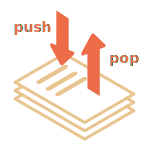
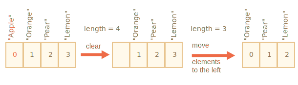
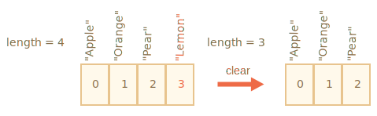

# Arrays

Les objets vous permettent de stocker des collections de valeurs à clé. C'est très bien.

Mais assez souvent, nous trouvons qu'il nous faut une *collection ordonnée*, où nous avons un 1er, un 2ème, un 3ème élément, etc. Par exemple, nous avons besoin de cela pour stocker une liste de quelque chose : utilisateurs, trucs, éléments HTML, etc.

Il n'est pas pratique d'utiliser un objet ici, car il ne fournit aucune méthode pour gérer l'ordre des éléments. Nous ne pouvons pas insérer une nouvelle propriété "entre" celles existantes. Les objets ne sont tout simplement pas destinés à un tel usage.

Il existe une structure de données spéciale appelée `Array` (tableau), pour stocker les collections ordonnées.

## Déclaration

Il existe deux syntaxes pour créer un tableau vide :

```js
let arr = new Array();
let arr = [];
```

La plupart du temps c'est la deuxième syntaxe qui est utilisée. Nous pouvons fournir des éléments initiaux entre parenthèses :

```js
let fruits = ["Apple", "Orange", "Plum"];
```

Les éléments de tableau sont numérotés en commençant par zéro.

On peut obtenir un élément par son numéro grace aux crochets :

```js run
let fruits = ["Apple", "Orange", "Plum"];

alert( fruits[0] ); // Apple
alert( fruits[1] ); // Orange
alert( fruits[2] ); // Plum
```

Nous pouvons remplacer un élément :

```js
fruits[2] = 'Pear'; // maintenant ["Apple", "Orange", "Pear"]
```

...Ou en ajouter un nouveau au tableau :

```js
fruits[3] = 'Lemon'; // maintenant ["Apple", "Orange", "Pear", "Lemon"]
```

Le nombre total d'éléments dans le tableau est sa `length` (longueur) :

```js run
let fruits = ["Apple", "Orange", "Plum"];

alert( fruits.length ); // 3
```

Nous pouvons également utiliser un `alert` pour afficher l'ensemble du tableau :

```js run
let fruits = ["Apple", "Orange", "Plum"];

alert( fruits ); // Apple,Orange,Plum
```

Un tableau peut stocker des éléments de tout type.

Par exemple :

```js run no-beautify
// mélange de valeurs
let arr = [ 'Apple', { name: 'John' }, true, function() { alert('hello'); } ];

// récupère l'objet à l'index 1 et montre ensuite son nom
alert( arr[1].name ); // John

// affiche la fonction à l'index 3 et l'exécute la
arr[3](); // hello
```

````smart header="Trailing comma (virgule de fin)"
Un tableau, comme pour un objet, peut se terminer par une virgule :
```js
let fruits = [
  "Apple",
  "Orange",
  "Plum"*!*,*/!*
];
```

Le style "virgule de fin" facilite l'insertion et la suppression d'éléments, car toutes les lignes se ressemblent.
````

## Récupérer les derniers éléments avec "at"

[recent browser="new"]

Disons que nous voulons le dernier élément du tableau.

Certains langages de programmation permettent l'utilisation d'index négatifs pour ça, comme `fruits[-1]`.

Tandis qu'en JavaScript ça ne fonctionnera pas. Le résultat sera `undefined`, parce que l'index dans les crochets est traité littéralement.

Nous pouvons calculer explicitement l'index du dernier élément et donc y accéder: `fruits[fruits.length - 1]`.

```js run
let fruits = ["Apple", "Orange", "Plum"];

alert( fruits[fruits.length-1] ); // Plum
```

Un peu lourd, n'est-ce pas ? Nous devons écrire le même nom de variable deux fois.

Heureusement, il y a une syntaxe plus courte : `fruits.at(-1)` :

```js run
let fruits = ["Apple", "Orange", "Plum"];

// Identique à fruits[fruits.length-1]
alert( fruits.at(-1) ); // Plum
```

En d'autres termes, `arr.at(i)`:

- est exactement identique à `arr[i]`, si `i >= 0`.
- pour les valeurs négatives de `i`, ça recule depuis la fin du tableau.

## Les méthodes pop/push, shift/unshift

Une [queue](https://en.wikipedia.org/wiki/Queue_(abstract_data_type)) (file d'attente) est l'une des utilisations les plus courantes pour les tableaux. En informatique, cela signifie une collection ordonnée d’éléments qui supporte deux opérations :

- `push` ajoute un élément à la fin.
- `shift` enlève un élément depuis le début, en faisant avancer la file d'attente, de sorte que le deuxième élément devienne le premier.


Les tableaux prennent en charge les deux opérations.

En pratique, nous en avons besoin très souvent. Par exemple, une file d'attente de messages devant être affichés à l'écran.

Il y a un autre cas d'utilisation pour les tableaux -- la structure de données nommée [stack](https://en.wikipedia.org/wiki/Stack_(abstract_data_type)).

Il supporte deux opérations :

- `push` ajoute un élément à la fin.
- `pop` enlève un élément de la fin.

Ainsi, de nouveaux éléments sont ajoutés ou enlevés toujours à partir de la "fin".

Un stack (pile) est généralement illustrée par un jeu de cartes. De nouvelles cartes sont ajoutées ou enlevées par le haut :



Pour les stacks (piles), le dernier élément envoyé est reçu en premier, c'est le principe LIFO (Last-In-First-Out, dernier entré, premier sorti). Pour les files d'attente, nous avons FIFO (First-In-First-Out, premier entré, premier sorti).

Les tableaux en JavaScript peuvent fonctionner à la fois en queue et en stack. Ils vous permettent d'ajouter ou supprimer des éléments à la fois par le début ou par la fin.

En informatique, la structure de données qui permet cela s'appelle [deque](https://en.wikipedia.org/wiki/Double-ended_queue).

**Méthodes qui fonctionnent avec la fin du tableau :**

`pop`
: Extrait le dernier élément du tableau et le renvoie :

    ```js run
    let fruits = ["Apple", "Orange", "Pear"];

    alert( fruits.pop() ); // supprime "Pear" et l'alerte

    alert( fruits ); // Apple, Orange
    ```

    Les deux méthodes `fruits.pop()` et `fruits.at(-1)` renvoient le dernier élément du tableau, mais `fruits.pop()` modifie également le tableau en supprimant l'élément.

`push`
: Ajoute l'élément à la fin du tableau :

    ```js run
    let fruits = ["Apple", "Orange"];

    fruits.push("Pear");

    alert( fruits ); // Apple, Orange, Pear
    ```

    L'appel de `fruits.push(...)` est égal à `fruits[fruits.length] = ...`.

**Méthodes qui fonctionnent avec le début du tableau :**

`shift`
: Extrait le premier élément du tableau et le renvoie :

    ```js run
    let fruits = ["Apple", "Orange", "Pear"];

    alert( fruits.shift() ); // supprime "Apple" et l'alerte

    alert( fruits ); // Orange, Pear
    ```

`unshift`
: Ajoute l'élément au début du tableau :

    ```js run
    let fruits = ["Orange", "Pear"];

    fruits.unshift("Apple");

    alert( fruits ); // Apple, Orange, Pear
    ```

Les méthodes `push` et `unshift` peuvent ajouter plusieurs éléments à la fois :

```js run
let fruits = ["Apple"];

fruits.push("Orange", "Peach");
fruits.unshift("Pineapple", "Lemon");

// ["Pineapple", "Lemon", "Apple", "Orange", "Peach"]
alert( fruits );
```

## Les internes

Un tableau est un type d'objet spécial. Les crochets utilisés pour accéder à la propriété `arr[0]` proviennent en fait de la syntaxe de l'objet. C'est essentiellement la même chose que `obj[key]`, où `arr` est l'objet, tandis que les nombres sont utilisés comme clés.

Ils étendent les objets en fournissant des méthodes spéciales pour travailler avec des collections ordonnées de données ainsi que la propriété `length`. Mais au fond c'est toujours un objet.

N'oubliez pas qu'il n'y a que huit types de base en JavaScript (voir le chapitre [Les types de données](info:types) pour plus d'infos). `Array` est un objet et se comporte donc comme un objet.

Par exemple, il est copié par référence :

```js run
let fruits = ["Banana"]

let arr = fruits; // copier par référence (deux variables font référence au même tableau)

alert( arr === fruits ); // true

arr.push("Pear"); // modifie le tableau par référence

alert( fruits ); // Banana, Pear - 2 items maintenant
```

...Mais ce qui rend les tableaux vraiment spéciaux, c'est leur représentation interne. Le moteur tente de stocker ses éléments dans une zone de mémoire contiguë, l'un après l'autre, exactement comme le montrent les illustrations de ce chapitre. Il existe également d'autres optimisations permettant de faire fonctionner les tableaux très rapidement.

Mais ils se cassent tous si nous arrêtons de travailler avec un tableau comme avec une "collection ordonnée" et commençons à le travailler comme s'il s'agissait d'un objet normal.

Par exemple, techniquement, nous pouvons faire ceci :

```js
let fruits = []; // créer un tableau

fruits[99999] = 5; // assigne une propriété avec un index beaucoup plus grand que sa longueur

fruits.age = 25; // créer une propriété avec un nom arbitraire
```

C'est possible, car les tableaux sont des objets à leur base. Nous pouvons leur ajouter des propriétés.

Mais le moteur verra que nous travaillons avec le tableau comme avec un objet normal. Les optimisations spécifiques à un tableau ne sont pas adaptées à ce type de situation et seront désactivées. Leurs avantages disparaissent.

Les moyens de casser un tableau :

- Ajouter une propriété non numérique comme `arr.test = 5`.
- Faire des trous, comme ajouter `arr[0]` et ensuite `arr[1000]` (et rien entre eux).
- Remplire le tableau dans l'ordre inverse, comme `arr[1000]`, `arr[999]` etc.

Veuillez considérer les tableaux comme des structures spéciales pour travailler avec les *données ordonées*. Ils fournissent des méthodes spéciales pour cela. Les tableaux sont soigneusement réglés dans les moteurs JavaScript pour fonctionner avec des données ordonnées contiguës, veuillez les utiliser de cette manière. Et si vous avez besoin de clés arbitraires, il y a de fortes chances pour que vous ayez réellement besoin d'un objet régulier `{}`.

## Performance

Les méthodes `push`/`pop` vont vite, alors que `shift`/`unshift` sont lentes.


Pourquoi est-il plus rapide de travailler avec la fin d'un tableau qu'avec son début ? Voyons ce qui se passe pendant l'exécution :

```js
fruits.shift(); // prends 1 élément du début
```

Il ne suffit pas de prendre l'élément avec le nombre `0`. D'autres éléments doivent également être renumérotés.

L'opération `shift` doit faire 3 choses :

1. Supprimer l'élément avec l'index `0`.
2. Déplacer tous les éléments à gauche, les renuméroter de l'index `1` à `0`, de`2` à `1`, etc.
3. Mettre à jour la propriété `length`.



**Plus il y a d'éléments dans le tableau, plus il y faut de temps pour les déplacer, plus il y a d'opérations en mémoire.**

La même chose se produit avec `unshift`. Pour ajouter un élément au début du tableau, nous devons d’abord déplacer les éléments existants vers la droite, en augmentant leur index.

Et qu’en est-il avec `push`/`pop` ? Ils n'ont pas besoin de déplacer quoi que ce soit. Pour extraire un élément de la fin, la méthode `pop` nettoie l'index et raccourcit `length`.

Les actions pour l'opération `pop` :

```js
fruits.pop(); // enleve 1 élément de la fin
```



**La méthode `pop` n'a pas besoin de déplacer quoi que ce soit, car les autres éléments conservent leurs index. C'est pourquoi c'est extrêmement rapide.**

La même chose avec la méthode `push`.

## Boucles

L'une des méthodes les plus anciennes pour cycler des éléments de tableau est la boucle `for` sur les index :

```js run
let arr = ["Apple", "Orange", "Pear"];

*!*
for (let i = 0; i < arr.length; i++) {
*/!*
  alert( arr[i] );
}
```

Mais pour les tableaux, il existe une autre forme de boucle, `for..of` :

```js run
let fruits = ["Apple", "Orange", "Plum"];

// itère sur des éléments de tableau
for (let fruit of fruits) {
  alert( fruit );
}
```

Le `for..of` ne donne pas accès au numéro de l'élément actuel, mais à sa valeur, mais dans la plupart des cas, cela suffit. Et c'est plus court.

Techniquement, comme les tableaux sont des objets, il est également possible d'utiliser `for..in` :

```js run
let arr = ["Apple", "Orange", "Pear"];

*!*
for (let key in arr) {
*/!*
  alert( arr[key] ); // Apple, Orange, Pear
}
```

Mais c'est en fait une mauvaise idée. Il y a des problèmes potentiels avec cela :

1. La boucle `for..in` itère sur *toutes les propriétés*, pas seulement les propriétés numériques.

    Il existe des objets dits "array-like" dans le navigateur et dans d'autres environnements, qui *ressemblent à des tableaux*. C'est-à-dire qu'ils ont les propriétés `length` et index, mais ils peuvent également avoir d'autres propriétés et méthodes non numériques, dont nous n'avons généralement pas besoin. La boucle `for..in` les listera cependant. Donc, si nous devons travailler avec des objets de type tableau, ces propriétés "supplémentaires" peuvent devenir un problème.

2. La boucle `for..in` est optimisée pour les objets génériques, pas pour les tableaux, elle est 10-100 fois plus lente. Bien sûr, c'est encore très rapide. L'accélération peut n'importer que dans les goulots d'étranglement ou sembler hors de propos. Mais il faut quand même être conscient de la différence.

En règle générale, nous ne devrions pas utiliser `for..in` pour les tableaux.

## Un mot à propos de "length"

La propriété `length` est automatiquement mise à jour lorsque nous modifions le tableau. Pour être précis, il ne s'agit pas du nombre de valeurs du tableau, mais du plus grand index numérique plus un.

Par exemple, un seul élément avec un grand index donne une grande longueur :

```js run
let fruits = [];
fruits[123] = "Apple";

alert( fruits.length ); // 124
```

Notez que nous n'utilisons généralement pas de tableaux de ce type.

Une autre chose intéressante à propos de la propriété `length` est qu'elle est accessible en écriture.

Si nous l'augmentons manuellement, rien d'intéressant ne se produit. Mais si nous le diminuons, le tableau est tronqué. Le processus est irréversible, voici l'exemple :

```js run
let arr = [1, 2, 3, 4, 5];

arr.length = 2; // tronque à 2 éléments
alert( arr ); // [1, 2]

arr.length = 5; // retourne la length d'origine
alert( arr[3] ); // undefined: les valeurs ne reviennent pas
```

Ainsi, le moyen le plus simple pour effacer le tableau est `arr.length = 0;`.

## new Array() [#new-array]

Il y a une syntaxe supplémentaire pour créer un tableau :

```js
let arr = *!*new Array*/!*("Apple", "Pear", "etc");
```

Il est rarement utilisé, car les crochets `[]` sont plus courts. En outre, il comporte une caractéristique délicate.

Si `new Array` est appelé avec un seul argument qui est un nombre, il crée un tableau *sans éléments, mais avec la longueur donnée*.

Voyons comment on peut se tirer une balle dans le pied :

```js run
let arr = new Array(2); // va-t-il créer un tableau de [2] ?

alert( arr[0] ); // undefined! pas d'éléments.

alert( arr.length ); // length 2
```

Pour éviter de telles surprises, nous utilisons généralement des crochets, sauf si nous savons vraiment ce que nous faisons.

## Tableaux multidimensionnels

Les tableaux peuvent avoir des éléments qui sont aussi des tableaux. On peut l'utiliser pour des tableaux multidimensionnels, pour stocker des matrices :

```js run
let matrix = [
  [1, 2, 3],
  [4, 5, 6],
  [7, 8, 9]
];

<<<<<<< HEAD
alert( matrix[1][1] ); // 5, l'élément central
=======
alert( matrix[0][1] ); // 2, the second value of the first inner array
>>>>>>> 1dce5b72b16288dad31b7b3febed4f38b7a5cd8a
```

## toString

Les tableaux ont leur propre implémentation de la méthode `toString` qui renvoie une liste d'éléments séparés par des virgules.

Par exemple :

```js run
let arr = [1, 2, 3];

alert( arr ); // 1,2,3
alert( String(arr) === '1,2,3' ); // true
```

Aussi, essayons ceci :

```js run
alert( [] + 1 ); // "1"
alert( [1] + 1 ); // "11"
alert( [1,2] + 1 ); // "1,21"
```

Les tableaux n'ont pas de `Symbol.toPrimitive`, ni de `valueOf` viable, ils implémentent uniquement la conversion `toString`, donc ici `[]` devient une chaîne vide, `[1]` devient `"1"` et `[1,2]` devient `"1,2"`.

Lorsque l'opérateur binaire plus `+` ajoute quelque chose à une chaîne, il la convertit également en chaîne, de sorte que l'étape suivante se présente comme suit :

```js run
alert( "" + 1 ); // "1"
alert( "1" + 1 ); // "11"
alert( "1,2" + 1 ); // "1,21"
```

## Ne comparez pas les tableaux avec ==

Les tableaux en JavaScript, contrairement à certains autres langages de programmation, ne doivent pas être comparés avec l'opérateur `==`.

Cet opérateur n'a pas de traitement spécial pour les tableaux, il fonctionne avec eux comme avec n'importe quel objet.

Rappelons les règles :

- Deux objets sont égaux `==` uniquement s'ils font référence au même objet.
- Si l'un des arguments de `==` est un objet, et l'autre est une primitive, alors l'objet est converti en primitif, comme expliqué dans le chapitre <info:object-toprimitive>.
- ...À l'exception de `null` et `undefined` qui s'égalent `==` l'un l'autre et rien d'autre.

La comparaison stricte `===` est encore plus simple, car elle ne convertit pas les types.

Donc, si nous comparons des tableaux avec `==`, ils ne sont jamais les mêmes, sauf si nous comparons deux variables qui référencent exactement le même tableau.

Par exemple :

```js run
alert( [] == [] ); // false
alert( [0] == [0] ); // false
```

Ces tableaux sont des objets techniquement différents. Donc, ils ne sont pas égaux. L'opérateur `==` ne fait pas de comparaison élément par élément.

La comparaison avec les primitives peut également donner des résultats apparemment étranges :

```js run
alert( 0 == [] ); // true

alert('0' == [] ); // false
```

Ici, dans les deux cas, nous comparons une primitive à un objet tableau. Ainsi, le tableau `[]` est converti en primitive à des fins de comparaison et devient une chaîne vide `''`.

Ensuite, le processus de comparaison se poursuit avec les primitives, comme décrit dans le chapitre <info:type-conversions> :

```js run
// après que [] soit converti vers ''
alert( 0 == '' ); // true, car '' est converti en nombre 0

alert('0' == '' ); // false, pas de conversion de type, différentes chaînes de caractères
```

Alors, comment comparer des tableaux ?

C'est simple, n'utilisez pas l'opérateur `==`. Au lieu de cela, comparez-les élément par élément dans une boucle ou en utilisant les méthodes d'itération expliquées dans le chapitre suivant.

## Résumé

Array est un type d’objet spécial, adapté au stockage et à la gestion des éléments de données ordonnées.

- La déclaration :

    ```js
    // crochets (habituel)
    let arr = [item1, item2...];

    // new Array (exceptionnellement rare)
    let arr = new Array(item1, item2...);
    ```

    L'appel de `new Array(number)` crée un tableau de longueur donnée, mais sans éléments.

- La propriété `length` est la longueur du tableau ou, plus précisément, son dernier index numérique plus un. Il est auto-ajusté par les méthodes de tableau.
- Si nous raccourcissons `length` manuellement, le tableau est tronqué.

Obtenir les éléments :

- nous pouvons obtenir un élément par son index, comme `arr[0]`
- nous pouvons également utiliser la méthode `at(i)` qui autorise les index négatifs. Pour les valeurs négatives de `i`, il recule à partir de la fin du tableau. Si `i >= 0`, cela fonctionne comme `arr[i]`.

Nous pouvons utiliser un tableau comme deque avec les opérations suivantes :

- `push(...items)` ajoute `items` à la fin.
- `pop()` supprime l'élément de la fin et le renvoie.
- `shift()` supprime l'élément du début et le renvoie.
- `unshift(... items)` ajoute des `items` au début.

Pour boucler sur les éléments du tableau :

- `for (let i = 0; i <arr.length; i++)` -- fonctionne le plus rapidement, compatible avec les anciens navigateurs.
- `for (let item of arr)` -- la syntaxe moderne pour les éléments uniquement.
- `pour (let i in arr)` -- ne jamais utiliser.

Pour comparer des tableaux, n'utilisez pas l'opérateur `==` (ainsi que `>`, `<` et autres), car ils n'ont pas de traitement spécial pour les tableaux. Ils les traitent comme n'importe quel objet, et ce n'est pas ce que nous voulons habituellement.

A la place, vous pouvez utiliser la boucle `for..of` pour comparer les tableaux élément par élément.

Nous continuerons avec les tableaux et étudierons d'autres méthodes pour ajouter, supprimer, extraire des éléments et trier des tableaux dans le prochain chapitre <info:array-methods>.
