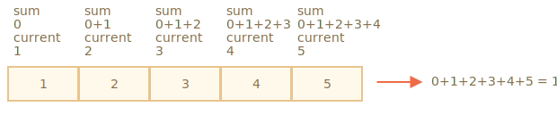

# Méthodes de tableau

Les tableaux viennent avec beaucoup de méthodes. Pour faciliter les choses, dans ce chapitre, ils ont étaient divisés en groupes.

## Ajouter/Supprimer des éléments

Nous connaissons déjà des méthodes qui ajoutent et suppriment des éléments au début ou à la fin:

- `arr.push(...items)` -- ajoute des éléments à la fin,
- `arr.pop()` -- supprime un élément à la fin,
- `arr.shift()` -- supprime un élément au début,
- `arr.unshift(...items)` -- ajouter des éléments au début.

En voici quelques autres.

### splice ()

Comment supprimer un élément du tableau?

Les tableaux sont des objets, nous pouvons donc utiliser `delete`:

```js run
let arr = ["I", "go", "home"];

delete arr[1]; // supprime "go"

alert( arr[1] ); // undefined

// maintenant arr = ["I",  , "home"];
alert( arr.length ); // 3
```

L'élément a été supprimé, mais le tableau a toujours 3 éléments, on peut voir que `arr.length == 3`

C'est normal, car `delete obj.key` supprime une valeur par la` clé`. C'est tout ce que ça fait. C'est donc parfait pour les objets. Mais pour les tableaux, nous souhaitons généralement que le reste des éléments se déplace et occupe la place libérée. Nous nous attendons à avoir un tableau plus court maintenant.

Des méthodes spéciales doivent donc être utilisées.

La méthode [arr.splice(start)](mdn:js/Array/splice) est un couteau suisse pour les tableaux. Elle peut tout faire : ajouter, supprimer et remplacer des éléments.

La syntaxe est la suivante:

```js
arr.splice(index[, nombreDeSuppression, elem1, ..., elemN])
```

Il commence à partir de la position `index`: supprime les éléments `nombreDeSuppression` puis insère elem1, ..., elemN à leur place. Il renvoie ensuite le tableau des éléments supprimés.

Cette méthode est facile à comprendre avec des exemples.

Commençons par la suppression:

```js run
let arr = ["I", "study", "JavaScript"];

*!*
arr.splice(1, 1); // À partir de l'index 1 supprime 1 élément
*/!*

alert( arr ); // ["I", "JavaScript"]
```

Facile, non? À partir de l'index 1, il a supprimé 1 élément.

Dans l'exemple suivant, nous supprimons 3 éléments et les remplaçons par les deux autres:

```js run
let arr = [*!*"I", "study", "JavaScript",*/!* "right", "now"];

// supprime les 3 premiers éléments et les remplace par d'autre
arr.splice(0, 3, "Let's", "dance");

alert( arr ) // maintenant [*!*"Let's", "dance"*/!*, "right", "now"]
```

Nous pouvons voir ici que `splice` renvoie le tableau des éléments supprimés:

```js run
let arr = [*!*"I", "study",*/!* "JavaScript", "right", "now"];

// supprime les 2 premiers éléments
let removed = arr.splice(0, 2);

alert( removed ); // "I", "study" <-- tableau des éléments supprimés
```

La méthode `splice` est également capable d'insérer les éléments sans aucune suppression. Pour cela, nous devons définir `nombreDeSuppression` sur 0:

```js run
let arr = ["I", "study", "JavaScript"];

// de l'index 2
// supprime 0
// et ajoute "complex" et "language"
arr.splice(2, 0, "complex", "language");

alert( arr ); // "I", "study", "complex", "language", "JavaScript"
```

````smart header="Negative indexes allowed"
Ici et dans d'autres méthodes de tableau, les index négatifs sont autorisés. Ils spécifient la position à partir de la fin du tableau, comme ici:

```js run
let arr = [1, 2, 5];

// de l'index -1 (un déplacement à partir de la fin)
// supprime 0 éléments,
// puis insère 3 et 4
arr.splice(-1, 0, 3, 4);

alert( arr ); // 1,2,3,4,5
```
````

### slice

La méthode [arr.slice](mdn:js/Array/slice) est beaucoup plus simple qu'un similaire `arr.splice`.

La syntaxe est la suivante:

```js
arr.slice([start], [end])
```

Il retourne un nouveau tableau dans lequel il copie tous les éléments index qui commencent de `start` à `end` (sans compter `end`). Les deux `start` et `end` peuvent être négatifs, dans ce cas, la position depuis la fin du tableau est supposée.

Cela ressemble à une méthode string `str.slice`, mais au lieu de sous-chaînes de caractères, cela crée des sous-tableaux.

Cela ressemble à une méthode de chaînes de caractères `str.slice`, mais au lieu de sous-chaînes de caractères, il crée des sous-tableaux.

Par exemple:

```js run
let arr = ["t", "e", "s", "t"];

alert( arr.slice(1, 3) ); // e,s (copy from 1 to 3)

alert( arr.slice(-2) ); // s,t (copy from -2 till the end)
```

We can also call it without arguments: `arr.slice()` creates a copy of `arr`. That's often used to obtain a copy for further transformations that should not affect the original array.

### concat

La méthode [arr.concat](mdn:js/Array/concat) crée un nouveau tableau qui inclut les valeurs d'autres tableaux et des éléments supplémentaires.

La syntaxe est la suivante:

```js
arr.concat(arg1, arg2...)
```

Il accepte n'importe quel nombre d'arguments -- des tableaux ou des valeurs.

Le résultat est un nouveau tableau contenant les éléments `arr`, puis `arg1`, `arg2`, etc.

Si un argument `argN` est un tableau, alors tous ses éléments sont copiés. Sinon, l'argument lui-même est copié.

Par exemple:

```js run
let arr = [1, 2];

// créer un tableau à partir de : arr et [3,4]
alert( arr.concat([3, 4]) ); // 1,2,3,4

// créer un tableau à partir de : arr et [3,4] et [5,6]
alert( arr.concat([3, 4], [5, 6]) ); // 1,2,3,4,5,6

// créer un tableau à partir de : arr et [3,4], puis ajoute les valeurs 5 et 6
alert( arr.concat([3, 4], 5, 6) ); // 1,2,3,4,5,6
```

Normalement, il ne copie que les éléments des tableaux. Les autres objets, même s'ils ressemblent à des tableaux, sont ajoutés dans leur ensemble :

```js run
let arr = [1, 2];

let arrayLike = {
  0: "something",
  length: 1
};

alert( arr.concat(arrayLike) ); // 1,2,[object Object]
```

… Mais si un objet de type tableau (array-like) a une propriété spéciale `Symbol.isConcatSpreadable`, alors il est traité comme un tableau par `concat` : ses éléments sont ajoutés à la place :

```js run
let arr = [1, 2];

let arrayLike = {
  0: "something",
  1: "else",
*!*
  [Symbol.isConcatSpreadable]: true,
*/!*
  length: 2
};

alert( arr.concat(arrayLike) ); // 1,2,something,else
```

## Itérer: forEach (pourChaque)

La méthode [arr.forEach] (mdn:js/Array/forEach) permet d’exécuter une fonction pour chaque élément du tableau.

La syntaxe:
```js
arr.forEach(function(item, index, array) {
  // ... fait quelques chose avec l'élément
});
```

Par exemple, cela montre chaque élément du tableau:

```js run
// pour chaque élément appel l'alerte
["Bilbo", "Gandalf", "Nazgul"].forEach(alert);
```

Et ce code est plus élaboré sur leurs positions dans le tableau cible:

```js run
["Bilbo", "Gandalf", "Nazgul"].forEach((item, index, array) => {
  alert(`${item} est à l'index ${index} dans ${array}`);
});
```

Le résultat de la fonction (s'il en renvoie) est jeté et ignoré.


## Recherche dans le tableau

Voyons maintenant les méthodes de recherche dans un tableau.

### indexOf/lastIndexOf et includes

Les méthodes [arr.indexOf](mdn:js/Array/indexOf), [arr.lastIndexOf](mdn:js/Array/lastIndexOf) et [arr.includes](mdn:js/Array/includes) ont la même syntaxe et utilisent essentiellement la même chose que leurs équivalents de chaîne, mais fonctionnent sur des éléments au lieu de caractères:

- `arr.indexOf(item, from)` recherche l'élément `item` à partir de l'index `from`, et retourne l'index où il a été trouvé, sinon il retourne `-1`.
- `arr.lastIndexOf(item, from)` -- pareil, mais regarde de droite à gauche.
- `arr.includes(item, from)` -- recherche l'élément `item` en commençant par l'index `from`, retourne `true` si il est trouvé.

Par exemple:

```js run
let arr = [1, 0, false];

alert( arr.indexOf(0) ); // 1
alert( arr.indexOf(false) ); // 2
alert( arr.indexOf(null) ); // -1

alert( arr.includes(1) ); // true ////// arreter ici
```

Notez que les méthodes utilisent la comparaison `===`. Donc, si nous cherchons `false`, il trouve exactement `false` et pas le zéro.

Si nous voulons vérifier l'inclusion et ne voulons pas connaître l'index exact, alors `arr.includes` est préférable.

De plus, une différence très mineure avec `includes` est qu’il gère correctement `NaN`, contrairement à `indexOf / lastIndexOf`:

```js run
const arr = [NaN];
alert( arr.indexOf(NaN) ); // -1 (devrait être 0, mais l'égalité ===  ne fonctionne pas pour NaN)
alert( arr.includes(NaN) );// true (correct)
```

### find et findIndex

Imaginez que nous ayons un tableau d'objets. Comment pouvons-nous trouver un objet avec la condition spécifique?

Ici la méthode [arr.find(fn)](mdn:js/Array/find) se révèle vraiment pratique.

La syntaxe est la suivante:
```js
let result = arr.find(function(item, index, array) {
 // devrait retourner true si l'élément correspond à ce que nous recherchons
 // pour le scénario de falsy(fausseté), renvoie undefined
});
```

La fonction est appelée pour chaque élément du tableau, l'un après l'autre :

- `item` est l'élément.
- `index` est sont index.
- `array` est le tableau lui même.

S'il renvoie `true`, la recherche est arrêtée, l'`item` est renvoyé. Si rien n'est trouvé, `undefined` est renvoyé.

Par exemple, nous avons un tableau d’utilisateurs, chacun avec les champs `id` et `name`. Trouvons le premier avec l'`id == 1`:

```js run
let users = [
  {id: 1, name: "John"},
  {id: 2, name: "Pete"},
  {id: 3, name: "Mary"}
];

let user = users.find(item => item.id == 1);

alert(user.name); // John
```

Dans la vie réelle, les tableaux d'objets sont une chose courante, la méthode `find` est donc très utile.

Notez que dans l'exemple, nous fournissons à `find` la fonction `item => item.id == 1` avec un argument. C'est typique, les autres arguments de cette fonction sont rarement utilisés.

La méthode [arr.findIndex](mdn:js/Array/findIndex) est essentiellement la même, mais elle retourne l'index où l'élément a été trouvé à la place de l'élément lui-même.

### filter

La méthode `find` recherche un seul (premier) élément qui rend la fonction true.

S'il y en a beaucoup plus, nous pouvons utiliser [arr.filter(fn)](mdn:js/Array/filter).

La syntaxe est à peu près identique à celle de `find`, mais `filter` renvoie un tableau d'éléments correspondants :

```js
let results = arr.filter(function(item, index, array) {
  // si true l'item est poussé vers résultats et l'itération continue
  // retourne un tableau vide si rien n'est trouvé
});
```

Par exemple:

```js run
let users = [
  {id: 1, name: "John"},
  {id: 2, name: "Pete"},
  {id: 3, name: "Mary"}
];

// retourne les tableaux des deux premiers users
let someUsers = users.filter(item => item.id < 3);

alert(someUsers.length); // 2
```

## Transformer un tableau

Passons aux méthodes qui transforment et réorganisent un tableau.

### map

La méthode [arr.map](mdn:js/Array/map) est l’une des plus utiles et des plus utilisées.

Elle appelle la fonction pour chaque élément du tableau et renvoie le tableau de résultats.

La syntaxe est :

```js
let result = arr.map(function(item, index, array) {
  // renvoie la nouvelle valeur au lieu de l'item
});
```

Par exemple, ici nous transformons chaque élément dans sa longueur :

```js run
let lengths = ["Bilbo", "Gandalf", "Nazgul"].map(item => item.length)
alert(lengths); // 5,7,6
```

### sort(fn)

La méthode [arr.sort](mdn:js/Array/sort) trie le tableau *en place*, en changeant son ordre d'élément..

Elle renvoie également le tableau trié, mais la valeur renvoyée est généralement ignorée, comme `arr` est lui-même modifié.

Par exemple:

```js run
let arr = [ 1, 2, 15 ];

// la méthode réordonne le contenu de arr
arr.sort();

alert( arr );  // *!*1, 15, 2*/!*
```

Avez-vous remarqué quelque chose d'étrange dans le résultat?

L'ordre est devenu `1, 15, 2`. C'est incorrect. Mais pourquoi?

**Les éléments sont triés en tant que chaînes par défaut.**

Littéralement, tous les éléments sont convertis en chaînes de caractères pour comparaisons. Pour les chaînes de caractères, l’ordre lexicographique est appliqué et donc `"2" > "15"`.

Pour utiliser notre propre ordre de tri, nous devons fournir une fonction comme argument de `arr.sort()`.

La fonction doit comparer deux valeurs arbitraires et renvoyer :

```js
function compare(a, b) {
  if (a > b) return 1; // if the first value is greater than the second
  if (a == b) return 0; // if values are equal
  if (a < b) return -1; // if the first value is less than the second
}
```

Par exemple, pour trier en nombres :

```js run
function compareNumeric(a, b) {
  if (a > b) return 1;
  if (a == b) return 0;
  if (a < b) return -1;
}

let arr = [ 1, 2, 15 ];

*!*
arr.sort(compareNumeric);
*/!*

alert(arr);  // *!*1, 2, 15*/!*
```

Maintenant, ça fonctionne comme nous l'avons prévu.

Mettons cela de côté et regardons ce qui se passe. L'`arr` peut être un tableau de n'importe quoi, non ? Il peut contenir des nombres, des chaînes de caractères, des objets ou autre. Nous avons donc un ensemble de *quelques items*. Pour le trier, nous avons besoin d’une *fonction de classement* qui sache comment comparer ses éléments. La valeur par défaut est un ordre de chaîne de caractères.

La méthode `arr.sort(fn)` intégre l'implémentation d'un algorithme générique de tri. Nous n'avons pas besoin de nous préoccuper de son fonctionnement interne (c'est un [tri rapide optimisé](https://fr.wikipedia.org/wiki/Tri_rapide) la plupart du temps). Il va parcourir le tableau, comparer ses éléments à l'aide de la fonction fournie et les réorganiser. Tout ce dont nous avons besoin est de fournir la `fn` qui effectue la comparaison.

À propos, si nous voulons savoir quels éléments sont comparés, rien ne nous empêche de les alerter:

```js run
[1, -2, 15, 2, 0, 8].sort(function(a, b) {
  alert( a + " <> " + b );
});
```

L'algorithme peut comparer un élément à plusieurs autres dans le processus, mais il essaie de faire le moins de comparaisons possible.

````smart header="A comparison function may return any number"
En réalité, une fonction de comparaison est requise uniquement pour renvoyer un nombre positif pour dire "plus grand" et un nombre négatif pour dire "plus petit".

Cela permet d'écrire des fonctions plus courtes:

```js run
let arr = [ 1, 2, 15 ];

arr.sort(function(a, b) { return a - b; });

alert(arr);  // *!*1, 2, 15*/!*
```
````

````smart header="Arrow functions for the best"
Souvenez-vous des [fonctions fléchées](info:arrow-functions-basics) ? Nous pouvons les utiliser ici pour un tri plus net :

```js
arr.sort( (a, b) => a - b );
```

Cela fonctionne exactement comme la version longue ci-dessus.
````

````smart header="Use `localeCompare` for strings"
Remember [strings](info:string#correct-comparisons) comparison algorithm? It compares letters by their codes by default.

For many alphabets, it's better to use `str.localeCompare` method to correctly sort letters, such as `Ö`.

For example, let's sort a few countries in German:

```js run
let countries = ['Österreich', 'Andorra', 'Vietnam'];

alert( countries.sort( (a, b) => a > b ? 1 : -1) ); // Andorra, Vietnam, Österreich (wrong)

alert( countries.sort( (a, b) => a.localeCompare(b) ) ); // Andorra,Österreich,Vietnam (correct!)
```
````

### reverse

La méthode [arr.reverse](mdn:js/Array/reverse) inverse l'ordre des éléments dans l'`arr`.

Par exemple:

```js run
let arr = [1, 2, 3, 4, 5];
arr.reverse();

alert( arr ); // 5,4,3,2,1
```

Il retourne également le tableau `arr` après l'inversion.

### split et join

Voici une situation réele. Nous écrivons une application de messagerie et la personne entre dans la liste des destinataires délimités par des virgules : `John, Pete, Mary`. Mais pour nous, un tableau de noms serait beaucoup plus confortable qu'une simple chaîne de caractères. Alors, comment l'obtenir?

La méthode [str.split(delim)](mdn:js/String/split) fait exactement cela. Il divise la chaîne en un tableau par le `délimiteur` donné.

Dans l'exemple ci-dessous, nous les séparons par une virgule suivie d'un espace:

```js run
let names = 'Bilbo, Gandalf, Nazgul';

let arr = names.split(', ');

for (let name of arr) {
  alert( `Un message à ${name}.` ); // Un message à Bilbo  (ainsi que les autres noms)
}
```

La méthode `split` a un deuxième argument numérique facultatif -- une limite sur la longueur du tableau. S'il est fourni, les éléments supplémentaires sont ignorés. En pratique, il est rarement utilisé cependant:

```js run
let arr = 'Bilbo, Gandalf, Nazgul, Saruman'.split(', ', 2);

alert(arr); // Bilbo, Gandalf
```

````smart header="Split into letters"
L'appel de `split(s)` avec un `s` vide diviserait la chaîne en un tableau de lettres:

```js run
let str = "test";

alert( str.split('') ); // t,e,s,t
```
````

L'appel de [arr.join(séparateur)](mdn:js/Array/join) fait l'inverse de `split`. Il crée une chaîne de caractères avec les éléments de `arr` fusionnés entre eux par `séparateur`.

Par exemple:

```js run
let arr = ['Bilbo', 'Gandalf', 'Nazgul'];

let str = arr.join(';'); // glue the array into a string using ;

alert( str ); // Bilbo;Gandalf;Nazgul
```

### reduce/reduceRight

Lorsque nous devons parcourir un tableau -- nous pouvons utiliser `forEach`.

Lorsque nous devons itérer et renvoyer les données pour chaque élément-- nous pouvons utiliser `map`.

Les méthodes [arr.reduce](mdn:js/Array/reduce) et [arr.reduceRight](mdn:js/Array/reduceRight) appartiennent également à cette race, mais sont un peu plus complexes. Ce méthodes sont utilisées pour calculer une valeur unique basée sur un tableau.

La syntaxe est la suivante:

```js
let value = arr.reduce(function(accumulator, item, index, array) {
  // ...
}, [initial]);
```

La fonction est appliquée à tous les éléments du tableau les uns après les autres et "poursuit" son résultat jusqu'au prochain appel.

Les arguments :

- `accumulator` -- est le résultat de l'appel de fonction précédent, égal à `initial` la première fois (si `initial` est fourni).
- `item` -- est l'élément actuel du tableau.
- `index` -- est sa position.
- `array` -- est le tableau.

Lorsque la fonction est appliquée, le résultat de l'appel de fonction précédent est transmis au suivant en tant que premier argument.

Ainsi, le premier argument est l'accumulateur qui stocke le résultat combiné de toutes les exécutions précédentes. Et à la fin, cela devient le résultat de `reduce`.

Cela semble compliqué ?

Le moyen le plus simple pour comprendre c'est avec un exemple.

Ici nous obtenons la somme d'un tableau sur une ligne:

```js run
let arr = [1, 2, 3, 4, 5];

let result = arr.reduce((sum, current) => sum + current, 0);

alert(result); // 15
```

La fonction passée à `reduce` utilise seulement 2 arguments, c’est généralement suffisant

Voyons en détails ce qu'il se passe.

1. Lors du premier passage, `sum` est la valeur de `initial` (le dernier argument de `reduce`), égale à `0`, et `current` correspond au premier élément du tableau, égal `1`. Donc le résultat de la fonction est `1`.
2. Lors du deuxième passage, `sum = 1`, nous y ajoutons le deuxième élément (`2`) du tableau et il est retourné.
3. Au troisième passage, `sum = 3` et nous y ajoutons un élément supplémentaire, et ainsi de suite ...

Le flux de calcul:



Ou sous la forme d'un tableau, où chaque ligne représente un appel de fonction sur l'élément de tableau suivant:

|   |`sum`|`current`|result|
|---|-----|---------|---------|
|premier appel|`0`|`1`|`1`|
|deuxième appel|`1`|`2`|`3`|
|troisième appel|`3`|`3`|`6`|
|quatrième appel|`6`|`4`|`10`|
|cinquième appel|`10`|`5`|`15`|


Ici, nous pouvons clairement voir comment le résultat de l'appel précédent devient le premier argument du suivant.

Nous pouvons également omettre la valeur initiale:

```js run
let arr = [1, 2, 3, 4, 5];

// Suppression de la valeur initiale de reduce (no 0)
let result = arr.reduce((sum, current) => sum + current);

alert( result ); // 15
```

Le résultat est le même. En effet, s'il n'y a pas d'initiale, alors `reduce` prend le premier élément du tableau comme valeur initiale et lance l'itération à partir du deuxième élément.

Le tableau de calcul est le même que celui ci-dessus, moins la première ligne.

Mais une telle utilisation nécessite une extrême prudence. Si le tableau est vide, alors `reduce` appeler sans valeur initiale génèrera une erreur.

Voici un exemple:

```js run
let arr = [];

// Erreur: Réduction du tableau vide sans valeur initiale
// si la valeur initiale existait, reduction le renverrait pour l'arr vide.
arr.reduce((sum, current) => sum + current);
```

Il est donc conseillé de toujours spécifier la valeur initiale.

La méthode [arr.reduceRight](mdn:js/Array/reduceRight) fait la même chose, mais va de droite à gauche.


## Array.isArray

Les tableaux ne forment pas un type de langue distinct. Ils sont basés sur des objets.

Donc son `typeof` ne permet pas de distinguer un objet brut d'un tableau:

```js run
alert(typeof {}); // objet
alert(typeof []); // pareil
```

...Mais les tableaux sont utilisés si souvent qu'il existe une méthode spéciale pour cela: [Array.isArray(value)](mdn:js/Array/isArray). Il renvoie `true` si la `value` est un tableau, sinon il renvoie `false`.

```js run
alert(Array.isArray({})); // false

alert(Array.isArray([])); // true
```

## La plupart des méthodes supportent "thisArg"

Presque toutes les méthodes de tableau qui appellent des fonctions -- comme `find`, `filter`, `map`, à l'exception de `sort`, acceptent un paramètre supplémentaire facultatif `thisArg`.

Ce paramètre n'est pas expliqué dans les sections ci-dessus, car il est rarement utilisé. Mais pour être complet, nous devons quand même le voir.

Voici la syntaxe complète de ces méthodes:

```js
arr.find(func, thisArg);
arr.filter(func, thisArg);
arr.map(func, thisArg);
// ...
// thisArg est le dernier argument optionnel
```

La valeur du paramètre `thisArg` devient `this` pour `func`.

Par exemple, nous utilisons ici une méthode de l'objet `army` en tant que filtre et `thisArg` passe le contexte :

```js run
let army = {
  minAge: 18,
  maxAge: 27,
  canJoin(user) {
    return user.age >= this.minAge && user.age < this.maxAge;
  }
};

let users = [
  {age: 16},
  {age: 20},
  {age: 23},
  {age: 30}
];

*!*
// trouve les utilisateurs pour qui army.canJoin retourne true
let soldiers = users.filter(army.canJoin, army);
*/!*

alert(soldiers.length); // 2
alert(soldiers[0].age); // 20
alert(soldiers[1].age); // 23
```

Si, dans l'exemple ci-dessus, nous utilisions `users.filter(army.canJoin)`, alors `army.canJoin` serait appelée en tant que fonction autonome, avec `this = undefined`, ce qui entraînerait une erreur instantanée.

Un appel à `users.filter(army.canJoin, army)` peut être remplacé par `users.filter(user => army.canJoin(user))`, qui fait la même chose. Le premier est utilisé plus souvent, car il est un peu plus facile à comprendre pour la plupart des gens.

## Résumé

Un cheat sheet des méthodes de tableau :

- Pour ajouter/supprimer des éléments:
  - `push(...items)` -- ajoute des éléments à la fin,
  - `pop()` -- extrait un élément de la fin,,
  - `shift()` -- extrait un élément du début,
  - `unshift(...items)` -- ajoute des éléments au début.
  - `splice(pos, deleteCount, ...items)` -- à l'index `pos` supprime les éléments `deleteCount` et insert `items`.
  - `slice(start, end)` -- crée un nouveau tableau, y copie les éléments de `start` jusqu'à `end` (non inclus).
  - `concat(...items)` -- retourne un nouveau tableau: copie tous les membres du groupe actuel et lui ajoute des éléments. Si un des `items` est un tableau, ses éléments sont pris.

- Pour rechercher parmi des éléments:
  - `indexOf/lastIndexOf(item, pos)` -- cherche l'`item` à partir de la position `pos`, retourne l'index `-1` s'il n'est pas trouvé.
  - `includes(value)` -- retourne `true` si le tableau a une `value`, sinon `false`.
  - `find/filter(func)` -- filtrer les éléments à travers la fonction, retourne en premier / toutes les valeurs qui retournent `true`.
  - `findIndex` est similaire à `find`, mais renvoie l'index au lieu d'une valeur.

- Pour parcourir les éléments :
  - `forEach(func)` -- appelle `func` pour chaque élément, ne retourne rien.

- Pour transformer le tableau:
  - `map(func)` -- crée un nouveau tableau à partir des résultats de `func` pour chaque élément.
  - `sort(func)` -- trie le tableau sur place, puis le renvoie.
  - `reverse()` -- inverse le tableau sur place, puis le renvoie.
  - `split/join` -- convertit une chaîne en tableau et retour.
  - `reduce(func, initial)` -- calcule une valeur unique sur le tableau en appelant `func` pour chaque élément et en transmettant un résultat intermédiaire entre les appels.

- Pour parcourir des éléments:
  - `forEach(func)` -- Appelle `func` pour chaque élément, ne retourne rien du tout.

- Aditionellement:
  - `Array.isArray(arr)` vérifie que l'`arr` est bien un tableau.

Veuillez noter que les méthodes `sort`, `reverse` et `splice` modifient le tableau lui-même.

Ces méthodes sont les plus utilisées, elles couvrent 99% des cas d'utilisation. Mais il y en a encore d'autres:

- [arr.some(fn)](mdn:js/Array/some)/[arr.every(fn)](mdn:js/Array/every) vérifie le tableau.

  La fonction `fn` est appelée sur chaque élément du tableau comme pour `map`. Si tout / tous les résultats sont `true`, il retourne vrai, sinon il retourne `false`.

- [arr.fill(value, start, end)](mdn:js/Array/fill) -- remplit le tableau avec la `value` répétée de l'index `start` à `end`.

- [arr.copyWithin(target, start, end)](mdn:js/Array/copyWithin) -- copie ses éléments de la position `start` jusqu'à la position `end` into *itself*, à la position `target` (écrase les éléments éxistants).

De prime abord, il peut sembler qu’il existe de nombreuses méthodes assez difficiles à retenir. Mais en réalité c'est beaucoup plus facile.

À première vue, vous pouvez penser qu’il existe de nombreuses méthodes difficiles à retenir. Mais en réalité, c'est beaucoup plus facile qu'il n'y paraît.

Parcourez le cheat sheet et essayer de vous en souvenir. Ensuite, faites les exercices de ce chapitre afin de vous familiariser avec les méthodes de tableau.

Ensuite, chaque fois que vous avez besoin de faire quelque chose avec un tableau, et que vous ne savez plus comment - revenez ici, regardez le cheatsheet et trouvez la bonne méthode. Des exemples vous aideront à l'écrire correctement. Bientôt, à force de pratiquer, vous vous souviendrez automatiquement des méthodes, sans efforts particuliers.
