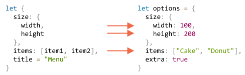

# L'affectation par décomposition

Les deux structures de données les plus utilisées en JavaScript sont `Object` et `Array`.

- Les objets nous permettent de créer une seule entité qui stocke les éléments de données par clé.
- Les tableaux nous permettent de rassembler des éléments de données dans une liste ordonnée.

<<<<<<< HEAD
Mais lorsque nous transmettons ceux-ci à une fonction, il se peut que celle-ci n'ait pas besoin d'un objet / tableau dans son ensemble, mais plutôt de morceaux individuels.
=======
However, when we pass these to a function, we may not need all of it. The function might only require certain elements or properties.
>>>>>>> 1dce5b72b16288dad31b7b3febed4f38b7a5cd8a

*L'affectation par décomposition*  est une syntaxe spéciale qui nous permet de "décompresser" des tableaux ou des objets dans un ensemble de variables, ce qui est parfois plus pratique.

<<<<<<< HEAD
La décomposition fonctionne également très bien avec des fonctions complexes comportant de nombreux paramètres, valeurs par défaut, etc.
=======
Destructuring also works well with complex functions that have a lot of parameters, default values, and so on. Soon we'll see that.
>>>>>>> 1dce5b72b16288dad31b7b3febed4f38b7a5cd8a

## Décomposition d'un tableau

Voici un exemple de la façon dont un tableau est décomposé en variables :

```js
<<<<<<< HEAD
// nous avons un tableau avec le prénom et le nom
=======
// we have an array with a name and surname
>>>>>>> 1dce5b72b16288dad31b7b3febed4f38b7a5cd8a
let arr = ["John", "Smith"]

*!*
// l'affectation par décomposition
// sets firstName = arr[0]
// and surname = arr[1]
let [firstName, surname] = arr;
*/!*

alert(firstName); // John
alert(surname);  // Smith
```

Maintenant, nous pouvons travailler avec des variables plutôt que des parties du tableau.

Cela a l'air pas mal quand c'est combiné avec `split` ou tout autre méthode de renvoi de tableau :

```js run
let [firstName, surname] = "John Smith".split(' ');
alert(firstName); // John
alert(surname);  // Smith
```

<<<<<<< HEAD
Comme vous pouvez le voir, la syntaxe est simple. Il y a cependant plusieurs détails particuliers. Voyons plus d'exemples, pour mieux le comprendre.

````smart header="\"Décomposition\" ne veut pas dire \"destruction\"."
Cette manipulation est appelée "affectation par décomposition", car elle "se décompose" en copiant ses éléments dans des variables. Mais le tableau lui-même n'est pas modifié.
=======
As you can see, the syntax is simple. There are several peculiar details though. Let's see more examples to understand it better.

````smart header="\"Destructuring\" does not mean \"destructive\"."
It's called "destructuring assignment," because it "destructurizes" by copying items into variables. However, the array itself is not modified.
>>>>>>> 1dce5b72b16288dad31b7b3febed4f38b7a5cd8a

C’est juste une façon plus courte d’écrire :
```js
// let [firstName, surname] = arr;
let firstName = arr[0];
let surname = arr[1];
```
````

````smart header="Ignorer les éléments en utilisant des virgules"
Les éléments indésirables du tableau peuvent également être supprimés via une virgule supplémentaire :

```js run
*!*
// second element is not needed
let [firstName, , title] = ["Julius", "Caesar", "Consul", "of the Roman Republic"];
*/!*

alert( title ); // Consul
```

<<<<<<< HEAD
Dans le code ci-dessus, le deuxième élément du tableau est ignoré, le troisième est attribué à `title` et le reste du tableau est également ignoré (car il n'y a pas de variables pour eux).
=======
In the code above, the second element of the array is skipped, the third one is assigned to `title`, and the rest of the array items are also skipped (as there are no variables for them).
>>>>>>> 1dce5b72b16288dad31b7b3febed4f38b7a5cd8a
````

````smart header="Fonctionne avec n'importe quel itérable à droite"

...En fait, nous pouvons l’utiliser avec n’importe quel itérable, pas seulement les tableaux :

```js
let [a, b, c] = "abc"; // ["a", "b", "c"]
let [one, two, three] = new Set([1, 2, 3]);
```
That works, because internally a destructuring assignment works by iterating over the right value. It's a kind of syntax sugar for calling `for..of` over the value to the right of `=` and assigning the values.
````

````smart header="Attribuer n'importe quoi à la partie gauche"
Nous pouvons utiliser n'importe quels "assignables" à gauche.

Par exemple, une propriété d'objet :
```js run
let user = {};
[user.name, user.surname] = "John Smith".split(' ');

alert(user.name); // John
alert(user.surname); // Smith
```

````

<<<<<<< HEAD
````smart header="Boucler avec .entries()"

Dans le chapitre précédent, nous avons vu la méthode [Object.entries(obj)](mdn:js/Object/entries).

Nous pouvons l'utiliser avec la décomposition pour boucler sur les clés et valeurs d'un objet :
=======
````smart header="Looping with .entries()"
In the previous chapter, we saw the [Object.entries(obj)](mdn:js/Object/entries) method.

We can use it with destructuring to loop over the keys-and-values of an object:
>>>>>>> 1dce5b72b16288dad31b7b3febed4f38b7a5cd8a

```js run
let user = {
  name: "John",
  age: 30
};

<<<<<<< HEAD
// boucler sur les clés et les valeurs
=======
// loop over the keys-and-values
>>>>>>> 1dce5b72b16288dad31b7b3febed4f38b7a5cd8a
*!*
for (let [key, value] of Object.entries(user)) {
*/!*
  alert(`${key}:${value}`); // name:John, ensuite age:30
}
```

Le code similaire pour un `Map` est plus simple, car il est itérable :

```js run
let user = new Map();
user.set("name", "John");
user.set("age", "30");

*!*
// Map est itéré sous forme de paires [key, value], ce qui est très pratique pour la déstructuration
for (let [key, value] of user) {
*/!*
  alert(`${key}:${value}`); // name:John, ensuite age:30
}
```
````

````smart header="Astuce d'échange de variables"
Il existe une astuce bien connue pour permuter les valeurs de deux variables à l'aide d'une affectation de déstructuration :

```js run
let guest = "Jane";
let admin = "Pete";

// Permutons les valeurs : guest=Pete, admin=Jane
*!*
[guest, admin] = [admin, guest];
*/!*

alert(`${guest} ${admin}`); // Pete Jane (échangé avec succès !)
```

Ici, nous créons un tableau temporaire de deux variables et le déstructurons immédiatement dans l'ordre permuté.

Nous pouvons échanger plus de deux variables de cette façon.

````

### Le rest '...'

Habituellement, si le tableau est plus long que la liste à gauche, les éléments "supplémentaires" sont omis.

Par exemple, ici, seuls deux éléments sont pris et le reste est simplement ignoré :

```js run
let [name1, name2] = ["Julius", "Caesar", "Consul", "of the Roman Republic"];

alert(name1); // Julius
alert(name2); // Caesar
// Les autres éléments ne sont affectés nulle part
```

Si nous souhaitons également rassembler tout ce qui suit, nous pouvons ajouter un paramètre supplémentaire qui permet d'obtenir "le reste" à l'aide de trois points `"..."` :

```js run
let [name1, name2, *!*...rest*/!*] = ["Julius", "Caesar", *!*"Consul", "of the Roman Republic"*/!*];

*!*
<<<<<<< HEAD
// reste est un tableau d'éléments, à partir du 3ème
=======
// rest is an array of items, starting from the 3rd one
>>>>>>> 1dce5b72b16288dad31b7b3febed4f38b7a5cd8a
alert(rest[0]); // Consul
alert(rest[1]); // of the Roman Republic
alert(rest.length); // 2
*/!*
```

La valeur de `rest` est le tableau des éléments du tableau restants.

Nous pouvons utiliser n’importe quel autre nom de variable à la place de `rest`, assurez-vous simplement qu’il a trois points devant lui et soit placé en dernier dans l’affectation par décomposition.

```js run
let [name1, name2, *!*...titles*/!*] = ["Julius", "Caesar", "Consul", "of the Roman Republic"];
// maintenant titles = ["Consul", "of the Roman Republic"]
```

### Les valeurs par défaut

<<<<<<< HEAD
Si le tableau est plus court que la liste des variables à gauche, il n'y aura aucune erreur. Les valeurs absentes sont considérées comme non définies :
=======
If the array is shorter than the list of variables on the left, there will be no errors. Absent values are considered undefined:
>>>>>>> 1dce5b72b16288dad31b7b3febed4f38b7a5cd8a

```js run
*!*
let [firstName, surname] = [];
*/!*

alert(firstName); // undefined
alert(surname); // undefined
```

Si nous voulons qu'une valeur "par défaut" remplace la valeur manquante, nous pouvons la fournir en utilisant `=` :

```js run
*!*
// les valeurs par défaut
let [name = "Guest", surname = "Anonymous"] = ["Julius"];
*/!*

alert(name);    // Julius (depuis le tableau)
alert(surname); // Anonymous (valeur par défaut)
```

Les valeurs par défaut peuvent être des expressions plus complexes ou même des appels de fonction. Ils ne sont évalués que si la valeur n'est pas fournie.

Par exemple, nous utilisons ici la fonction `prompt` pour deux valeurs par défaut :

```js run
// ne demande que le nom de famille
let [name = prompt('name?'), surname = prompt('surname?')] = ["Julius"];

alert(name);    // Julius (depuis le tableau)
alert(surname); // saisi par l'utilisateur
```

Notez que le `prompt` ne s'exécutera que pour la valeur manquante (`surname`).

## Décomposition d'object

L'affectation par décomposition fonctionne également avec les objets.

La syntaxe de base est la suivante :

```js
let {var1, var2} = {var1:…, var2:…}
```

Nous devrions avoir un objet existant sur le côté droit, que nous voulons diviser en variables. La partie gauche contient un "modèle" de type objet pour les propriétés correspondantes. Dans le cas le plus simple, c'est une liste de noms de variables dans `{...}`.

Par exemple :

```js run
let options = {
  title: "Menu",
  width: 100,
  height: 200
};

*!*
let {title, width, height} = options;
*/!*

alert(title);  // Menu
alert(width);  // 100
alert(height); // 200
```

Les propriétés `options.title`, `options.width` et `options.height` sont affectées aux variables correspondantes.

L'ordre n'a pas d'importance. Cela fonctionne aussi :

```js
// changé l'ordre dans let {...}
let {height, width, title} = { title: "Menu", height: 200, width: 100 }
```

Le pattern à gauche peut être plus complexe et spécifier le mapping entre propriétés et variables.

Si nous voulons affecter une propriété à une variable portant un autre nom, par exemple, `options.width` pour aller dans la variable nommée `w`, alors nous pouvons la définir en utilisant deux points :

```js run
let options = {
  title: "Menu",
  width: 100,
  height: 200
};

*!*
// { sourceProperty: targetVariable }
let {width: w, height: h, title} = options;
*/!*

// width -> w
// height -> h
// title -> title

alert(title);  // Menu
alert(w);      // 100
alert(h);      // 200
```

Les deux points montrent "quoi: va où". Dans l'exemple ci-dessus, la propriété `width` est définie sur `w`, la propriété `height` est définie sur `h` et le `title` est attribué au même nom.

Pour les propriétés potentiellement manquantes, nous pouvons définir les valeurs par défaut à l'aide de `"="`, comme ceci :

```js run
let options = {
  title: "Menu"
};

*!*
let {width = 100, height = 200, title} = options;
*/!*

alert(title);  // Menu
alert(width);  // 100
alert(height); // 200
```

Comme pour les tableaux ou les paramètres de fonction, les valeurs par défaut peuvent être des expressions ou même des appels de fonction. Elles seront évaluées si la valeur n'est pas fournie.

Le code `prompt` ci-dessous demande la `width`, mais pas le `title`.

```js run
let options = {
  title: "Menu"
};

*!*
let {width = prompt("width?"), title = prompt("title?")} = options;
*/!*

alert(title);  // Menu
alert(width);  // saisi par l'utilisateur
```

Nous pouvons également combiner les deux points et l'égalité :

```js run
let options = {
  title: "Menu"
};

*!*
let {width: w = 100, height: h = 200, title} = options;
*/!*

alert(title);  // Menu
alert(w);      // 100
alert(h);      // 200
```

Si nous avons un objet complexe avec de nombreuses propriétés, nous pouvons extraire que ce dont nous avons besoin :

```js run
let options = {
  title: "Menu",
  width: 100,
  height: 200
};

// extraire uniquement le titre en tant que variable
let { title } = options;

alert(title); // Menu
```

### Le pattern rest "..."

Et si l'objet a plus de propriétés que de variables ? Peut-on en prendre puis assigner le "rest" quelque part ?

Nous pouvons utiliser le modèle rest, comme nous l'avons fait avec les tableaux. Il n'est pas pris en charge par certains navigateurs plus anciens (IE, utilisez Babel pour le polyfiller), mais fonctionne avec les modernes.

Cela ressemble à ceci :

```js run
let options = {
  title: "Menu",
  height: 200,
  width: 100
};

*!*
// title = propriété nommée title
// rest = objet avec le reste des propriétés
let {title, ...rest} = options;
*/!*

// maintenant title="Menu", rest={height: 200, width: 100}
alert(rest.height);  // 200
alert(rest.width);   // 100
```

````smart header="Attention, sans `let`, ça coince"
Dans les exemples ci-dessus, les variables ont été déclarées juste avant l'affectation : `let {…} = {…}`. Bien sûr, nous pourrions aussi utiliser des variables existantes. Mais il y a un problème.

Cela ne fonctionnera pas :

```js run
let title, width, height;

// erreur dans cette ligne
{title, width, height} = {title: "Menu", width: 200, height: 100};
```

Le problème est que JavaScript traite `{...}` dans le flux de code principal (pas dans une autre expression) en tant que bloc de code. De tels blocs de code peuvent être utilisés pour regrouper des instructions, comme ceci :

```js run
{
  // un bloc de code
  let message = "Hello";
  // ...
  alert( message );
}
```

Donc ici, JavaScript suppose que nous avons un bloc de code, c'est pourquoi il y a une erreur. Nous voulons plutôt la déstructuration.

Pour montrer à JavaScript qu'il ne s'agit pas d'un bloc de code, nous pouvons envelopper l'expression entre parenthèses `(...)` :

```js run
let title, width, height;

// maintenant c'est bon
*!*(*/!*{title, width, height} = {title: "Menu", width: 200, height: 100}*!*)*/!*;

alert( title ); // Menu
```
````

## Décomposition imbriquée

<<<<<<< HEAD
Si un objet ou un tableau contient d'autres objets et tableaux imbriqués, nous pouvons utiliser des modèles à gauche plus complexes pour extraire des parties plus profondes.
=======
If an object or an array contains other nested objects and arrays, we can use more complex left-side patterns to extract deeper portions.
>>>>>>> 1dce5b72b16288dad31b7b3febed4f38b7a5cd8a

Dans le code ci-dessous, `options` a un autre objet dans la propriété `size` et un tableau dans la propriété `items`. Le modèle à gauche de l'affectation a la même structure pour en extraire des valeurs :

```js run
let options = {
  size: {
    width: 100,
    height: 200
  },
  items: ["Cake", "Donut"],
  extra: true
};

// affectation par décomposition divisée sur plusieurs lignes pour la clarté
let {
  size: { // mettre la taille ici
    width,
    height
  },
  items: [item1, item2], // attribuer des éléments ici
  title = "Menu" // non présent dans l'objet (la valeur par défaut est utilisée)
} = options;

alert(title);  // Menu
alert(width);  // 100
alert(height); // 200
alert(item1);  // Cake
alert(item2);  // Donut
```

<<<<<<< HEAD
Toutes les propriétés de l'objet `options`, à l'exception de `extra` qui est absente dans la partie gauche, sont affectés aux variables correspondantes :
=======
All properties of `options` object except `extra` which is absent in the left part, are assigned to corresponding variables:
>>>>>>> 1dce5b72b16288dad31b7b3febed4f38b7a5cd8a



Finnalement nous avons `width`, `height`, `item1`, `item2` et `title` à partir de la valeur par défaut.

Notez qu'il n'y a pas de variables pour `size` et `items`, car nous prenons leur contenu à la place.

## Paramètres de fonction intelligente

<<<<<<< HEAD
Il peut arriver qu'une fonction ait plusieurs paramètres, dont la plupart sont facultatifs. C’est particulièrement vrai pour les interfaces utilisateur. Imaginez une fonction qui crée un menu. Il peut avoir une largeur, une hauteur, un titre, une liste d’articles, etc.

Voici une mauvaise façon d’écrire ce genre de fonction :
=======
There are times when a function has many parameters, most of which are optional. That's especially true for user interfaces. Imagine a function that creates a menu. It may have a width, a height, a title, an item list and so on.

Here's a bad way to write such a function:
>>>>>>> 1dce5b72b16288dad31b7b3febed4f38b7a5cd8a

```js
function showMenu(title = "Untitled", width = 200, height = 100, items = []) {
  // ...
}
```

<<<<<<< HEAD
Dans la vraie vie, le problème est de savoir comment retenir l'ordre des arguments. Habituellement, les IDE essaient de nous aider, surtout si le code est bien documenté, mais quand même… Un autre problème est de savoir comment appeler une fonction lorsque la plupart des paramètres sont corrects par défaut.
=======
In real-life, the problem is how to remember the order of arguments. Usually, IDEs try to help us, especially if the code is well-documented, but still... Another problem is how to call a function when most parameters are ok by default.
>>>>>>> 1dce5b72b16288dad31b7b3febed4f38b7a5cd8a

Comme ceci ?

```js
// undefined où les valeurs par défaut sont adéquates
showMenu("My Menu", undefined, undefined, ["Item1", "Item2"])
```

C’est moche. Et devient illisible lorsque nous traitons plus de paramètres.

La décomposition vient à la rescousse !

Nous pouvons passer des paramètres sous forme d'objet, et la fonction les décomposent immédiatement en variables :

```js run
// on passe un objet à fonction
let options = {
  title: "My menu",
  items: ["Item1", "Item2"]
};

// ...et il est immédiatement étendu aux variables
function showMenu(*!*{title = "Untitled", width = 200, height = 100, items = []}*/!*) {
  // title, items – pris des options,
  // width, height – défauts utilisés
  alert( `${title} ${width} ${height}` ); // My Menu 200 100
  alert( items ); // Item1, Item2
}

showMenu(options);
```

Nous pouvons également utiliser une décomposition plus complexe avec des objets imbriqués et des mappings de deux points :

```js run
let options = {
  title: "My menu",
  items: ["Item1", "Item2"]
};

*!*
function showMenu({
  title = "Untitled",
  width: w = 100,  // width va à w
  height: h = 200, // height va à h
  items: [item1, item2] // items premier élément va à item1, deuxième à item2
}) {
*/!*
  alert( `${title} ${w} ${h}` ); // My Menu 100 200
  alert( item1 ); // Item1
  alert( item2 ); // Item2
}

showMenu(options);
```

La syntaxe complète est la même que pour une affectation par décomposition :
```js
function({
  incomingProperty: varName = defaultValue
  ...
})
```

<<<<<<< HEAD
Ensuite, pour un objet de paramètres, il y aura une variable `varName` pour la propriété `incomingProperty`, avec `defaultValue` par défaut.
=======
Then, for an object of parameters, there will be a variable `varName` for the property `incomingProperty`, with `defaultValue` by default.
>>>>>>> 1dce5b72b16288dad31b7b3febed4f38b7a5cd8a

Veuillez noter qu'une telle déstructuration suppose que `showMenu()` a un argument. Si nous voulons toutes les valeurs par défaut, alors nous devrions spécifier un objet vide :

```js
showMenu({}); // ok, toutes les valeurs par défaut

showMenu(); // cela donnerait une erreur
```

Nous pouvons résoudre ce problème en faisant de `{}` la valeur par défaut pour l'objet entier de paramètres :

```js run
function showMenu({ title = "Menu", width = 100, height = 200 }*!* = {}*/!*) {
  alert( `${title} ${width} ${height}` );
}

showMenu(); // Menu 100 200
```

Dans le code ci-dessus, la totalité des arguments objet est `{}` par défaut, il y a donc toujours quelque chose à décomposer.

## Résumé

- L'affectation par décomposition permet de mapper instantanément un objet ou un tableau sur de nombreuses variables.
- La syntaxe complète de l'objet :
    ```js
    let {prop : varName = defaultValue, ...rest} = object
    ```

    Cela signifie que la propriété `prop` doit aller dans la variable `varName` et que, si aucune propriété de ce type n'existe, la valeur `default` doit être utilisée.

    Les propriétés d'objet sans mappage sont copiées dans l'objet `rest`.

- La syntaxe complète du tableau :

    ```js
    let [item1 = defaultValue, item2, ...rest] = array
    ```

<<<<<<< HEAD
    Le premier item va à `item1`; le second passe à `item2`, tout le reste du tableau correspond au `rest`.
=======
    The first item goes to `item1`; the second goes into `item2`, and all the rest makes the array `rest`.
>>>>>>> 1dce5b72b16288dad31b7b3febed4f38b7a5cd8a

- Il est possible d'extraire des données de tableaux / objets imbriqués, pour cela le côté gauche doit avoir la même structure que le droit.
