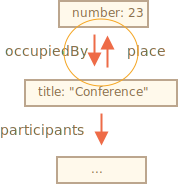

# JSON methods, toJSON

Supposons que nous avons un objet complexe et que nous aimerions le convertir en chaîne, l'envoyer par le réseau ou simplement le rendre (l'output) à des fins de journalisation.

Naturellement, une telle chaîne devrait inclure toutes les propriétés importantes.

Nous pourrions implémenter la conversion comme ceci :

```js run
let user = {
  name: "John",
  age: 30,

*!*
  toString() {
    return `{name: "${this.name}", age: ${this.age}}`;
  }
*/!*
};

alert(user); // {name: "John", age: 30}
```

... Mais au cours du développement, de nouvelles propriétés sont ajoutées, les anciennes propriétés sont renommées et supprimées. Mettre à jour un tel `toString` à chaque fois peut devenir pénible. Nous pourrions essayer de passer en boucle sur les propriétés qu'il contient, mais que se passe-t-il si l'objet est complexe et qu'il contient des objets imbriqués ? Nous aurions également besoin de mettre en œuvre leur conversion.

Heureusement, il n'est pas nécessaire d'écrire le code pour gérer tout cela. La tâche a déjà été résolue.

## JSON.stringify

Le [JSON](http://en.wikipedia.org/wiki/JSON) (JavaScript Object Notation) est un format général pour représenter les valeurs et les objets. Il est décrit comme tel dans le standard [RFC 4627](http://tools.ietf.org/html/rfc4627). Initialement, il était conçu pour JavaScript, mais de nombreux autres langages disposent également de bibliothèques pour le gérer. Il est donc facile d’utiliser JSON pour l’échange de données lorsque le client utilise JavaScript et que le serveur est écrit sur Ruby/PHP/Java et bien d'autres.

JavaScript fournit des méthodes :

- `JSON.stringify` pour convertir des objets en JSON.
- `JSON.parse` pour reconvertir JSON en objet.

Par exemple, nous allons `JSON.stringify` un student (étudiant) :

```js run
let student = {
  name: 'John',
  age: 30,
  isAdmin: false,
  courses: ['html', 'css', 'js'],
  spouse: null
};

*!*
let json = JSON.stringify(student);
*/!*

alert(typeof json); // nous avons une string !

alert(json);
*!*
/* Objet encodé en JSON :
{
  "name": "John",
  "age": 30,
  "isAdmin": false,
  "courses": ["html", "css", "js"],
  "spouse": null
}
*/
*/!*
```

La méthode `JSON.stringify(student)` prend l'objet et le convertit en une chaîne.

La chaine `json` résultante est appelé un objet *JSON-encoded* ou *serialized* (sérialisé) ou *stringified* ou *marshalled*. Nous sommes prêts à l'envoyer par le câble ou à le placer dans un simple stockage de données.

Veuillez noter qu'un objet JSON-encoded a plusieurs différences importantes par rapport au objet littéral :

- Les chaînes utilisent des guillemets doubles. Il n'y a pas de guillemets simples ni de backticks en JSON. Donc `'John'` deviendra `"John"`.
- Les propriété d'objet sont également en guillemets doubles. C'est obligatoire. Donc `age:30` deviendra `"age":30`.

`JSON.stringify` peut aussi être appliqué aux primitives.

JSON prend en charge les types de données suivants :

- Objets `{ ... }`
- Tableaux `[ ... ]`
- Primitives :
    - chaînes,
    - nombres,
    - valeurs booléennes `true`/`false`,
    - `null`.

Par exemple :

```js run
// un nombre en JSON est juste un nombre
alert( JSON.stringify(1) ) // 1

// une chaîne en JSON est toujours une chaîne, mais entre guillemets
alert( JSON.stringify('test') ) // "test"

alert( JSON.stringify(true) ); // true

alert( JSON.stringify([1, 2, 3]) ); // [1,2,3]
```

JSON est une spécification indépendante du langage et ne contenant que des données. Par conséquent, certaines propriétés d'objet spécifiques à JavaScript sont ignorées par `JSON.stringify`.

À savoir :

- Propriétés de fonction (méthodes).
- Clés et valeurs symboliques.
- Propriétés qui stockent `undefined`.

```js run
let user = {
  sayHi() { // ignorée
    alert("Hello");
  },
  [Symbol("id")]: 123, // ignorée
  something: undefined // ignorée
};

alert( JSON.stringify(user) ); // {} (objet vide)
```

D'habitude ça va. Si ce n'est pas ce que nous souhaitons, nous verrons bientôt comment personnaliser le processus.

Le grand avantage est que les objets imbriqués sont pris en charge et convertis automatiquement.

Par exemple :

```js run
let meetup = {
  title: "Conference",
*!*
  room: {
    number: 23,
    participants: ["john", "ann"]
  }
*/!*
};

alert( JSON.stringify(meetup) );
/* La structure entière est stringified :
{
  "title":"Conference",
  "room":{"number":23,"participants":["john","ann"]},
}
*/
```

La limitation importante est qu'il ne doit pas y avoir de références circulaires.

Par exemple :

```js run
let room = {
  number: 23
};

let meetup = {
  title: "Conference",
  participants: ["john", "ann"]
};

meetup.place = room;      // meetup references room
room.occupiedBy = meetup; // room references meetup

*!*
JSON.stringify(meetup); // Erreur: Conversion d'une structure circulaire en JSON
*/!*
```

Ici, la conversion échoue à cause d'une référence circulaire : `room.occupiedBy` references `meetup`, et `meetup.place` references `room` :



## Exclure et transformer : replacer

La syntaxe complète de `JSON.stringify` est :

```js
let json = JSON.stringify(value[, replacer, space])
```

Value
: Une valeur à encoder.

Replacer
: Tableau de propriétés à encoder ou une fonction de mapping `function(key, value)`.

Space
: Quantité d'espace à utiliser pour le formatage

La plupart du temps, `JSON.stringify` est utilisé avec le premier argument uniquement. Mais si nous devons affiner le processus de remplacement, préférez filtrer les références circulaires, nous pouvons utiliser le deuxième argument de `JSON.stringify`.

Si nous lui passons un tableau de propriétés, seules ces propriétés seront encodées.

Par exemple :

```js run
let room = {
  number: 23
};

let meetup = {
  title: "Conference",
  participants: [{name: "John"}, {name: "Alice"}],
  place: room // meetup references room
};

room.occupiedBy = meetup; // room references meetup

alert( JSON.stringify(meetup, *!*['title', 'participants']*/!*) );
// {"title":"Conference","participants":[{},{}]}
```

Ici, nous sommes probablement trop strictes. La liste de propriétés est appliquée à la structure entière de l'objet. Donc, les objets dans `participants` sont vides, parce que `name` n'est pas dans la liste.

Incluons dans la liste toutes les propriétés sauf `room.occupiedBy` qui provoquerait la référence circulaire :

```js run
let room = {
  number: 23
};

let meetup = {
  title: "Conference",
  participants: [{name: "John"}, {name: "Alice"}],
  place: room // meetup references room
};

room.occupiedBy = meetup; // room references meetup

alert( JSON.stringify(meetup, *!*['title', 'participants', 'place', 'name', 'number']*/!*) );
/*
{
  "title":"Conference",
  "participants":[{"name":"John"},{"name":"Alice"}],
  "place":{"number":23}
}
*/
```

Maintenant tout sauf `occupiedBy` est serialisé. Mais la liste des propriétés est assez longue.

Heureusement, nous pouvons utiliser une fonction au lieu d'un tableau comme `replacer`.

La fonction sera appelée pour chaque paire de `(key, value)` et devrait renvoyer la valeur "remplacée", qui sera utilisée à la place de celle d'origine. Ou `undefined` si la valeur doit être ignorée.

Dans notre cas, nous pouvons retourner une `value` "en l'état" pour tout sauf `occupiedBy`. Pour ignorer `occupiedBy`, le code ci-dessous retourne `undefined` :

```js run
let room = {
  number: 23
};

let meetup = {
  title: "Conference",
  participants: [{name: "John"}, {name: "Alice"}],
  place: room // meetup references room
};

room.occupiedBy = meetup; // room references meetup

alert( JSON.stringify(meetup, function replacer(key, value) {
  alert(`${key}: ${value}`);
  return (key == 'occupiedBy') ? undefined : value;
}));

/* key:value pairs that come to replacer:
:             [object Object]
title:        Conference
participants: [object Object],[object Object]
0:            [object Object]
name:         John
1:            [object Object]
name:         Alice
place:        [object Object]
number:       23
occupiedBy:   [object Object]
*/
```

Veuillez noter que la fonction `replacer` récupère chaque paire clé/valeur, y compris les objets imbriqués et les éléments de tableau. Il est appliqué de manière récursive. La valeur `this` dans `replacer` est l'objet qui contient la propriété actuelle.

Le premier appel est spécial. Il est fabriqué en utilisant un "objet wrapper" spécial: `{"": meetup}`. En d'autres termes, la première paire `(key, value)` a une clé vide, et la valeur est l'objet cible dans son ensemble. C'est pourquoi la première ligne est `":[object Object]"` dans l'exemple ci-dessus.

L’idée est de fournir autant de puissance pour `replacer` que possible : il a une chance d'analyser et de remplacer/ignorer même l'objet entier si nécessaire.

## Formatage : space

Le troisième argument de `JSON.stringify(value, replacer, space)` est le nombre d'espaces à utiliser pour un joli formatage.

Auparavant, tous les objets stringifiés n’avaient pas d'indentation ni d’espace supplémentaire. C'est bien si nous voulons envoyer un objet sur un réseau. L'arguement `space` est utilisé exclusivement pour une belle sortie.

Ici `space = 2` indique à JavaScript d'afficher des objets imbriqués sur plusieurs lignes, avec l'indentation de 2 espaces à l'intérieur d'un objet :

```js run
let user = {
  name: "John",
  age: 25,
  roles: {
    isAdmin: false,
    isEditor: true
  }
};

alert(JSON.stringify(user, null, 2));
/* indentation de 2 espaces :
{
  "name": "John",
  "age": 25,
  "roles": {
    "isAdmin": false,
    "isEditor": true
  }
}
*/

/* pour JSON.stringify(user, null, 4) le résultat serait plus indenté :
{
    "name": "John",
    "age": 25,
    "roles": {
        "isAdmin": false,
        "isEditor": true
    }
}
*/
```

Le troisième argument peut également être une chaîne de caractères. Dans ce cas, la chaîne de caractères est utilisée pour l'indentation au lieu d'un certain nombre d'espaces.

Le paramètre `space` est utilisé uniquement à des fins de journalisation et de sortie agréable.

## "toJSON" personnalisé

Comme `toString` pour la conversion de chaîne, un objet peut fournir une méthode `toJSON` pour une conversion en JSON. `JSON.stringify` appelle automatiquement si  il est disponible.

Par exemple :

```js run
let room = {
  number: 23
};

let meetup = {
  title: "Conference",
  date: new Date(Date.UTC(2017, 0, 1)),
  room
};

alert( JSON.stringify(meetup) );
/*
  {
    "title":"Conference",
*!*
    "date":"2017-01-01T00:00:00.000Z",  // (1)
*/!*
    "room": {"number":23}               // (2)
  }
*/
```

Ici on peut voir que `date` `(1)` est devenu une chaîne. C’est parce que toutes les dates ont une méthode `toJSON` intégrée qui retourne ce genre de chaîne.

Ajoutons maintenant un `toJSON` personnalisé pour notre objet `room` `(2)` :

```js run
let room = {
  number: 23,
*!*
  toJSON() {
    return this.number;
  }
*/!*
};

let meetup = {
  title: "Conference",
  room
};

*!*
alert( JSON.stringify(room) ); // 23
*/!*

alert( JSON.stringify(meetup) );
/*
  {
    "title":"Conference",
*!*
    "room": 23
*/!*
  }
*/
```

Comme on peut le voir, `toJSON` est utilisé à la fois pour l'appel direct `JSON.stringify(room)` et quand `room` est imbriqué dans un autre objet encodé.

## JSON.parse

Pour décoder une chaîne JSON, nous avons besoin d'une autre méthode nommée [JSON.parse](mdn:js/JSON/parse).

La syntaxe :

```js
let value = JSON.parse(str[, reviver]);
```

str
: La chaîne JSON à parse.

reviver
: Fonction optionnelle (clé, valeur) qui sera appelée pour chaque paire `(key, value)` et peut transformer la valeur.

Par exemple :

```js run
// stringified array
let numbers = "[0, 1, 2, 3]";

numbers = JSON.parse(numbers);

alert( numbers[1] ); // 1
```

Ou pour les objets imbriqués :

```js run
let userData = '{ "name": "John", "age": 35, "isAdmin": false, "friends": [0,1,2,3] }';

let user = JSON.parse(userData);

alert( user.friends[1] ); // 1
```

Le JSON peut être aussi complexe que nécessaire, les objets et les tableaux peuvent inclure d'autres objets et tableaux. Mais ils doivent obéir au même format JSON.

Voici des erreurs typiques dans JSON écrit à la main (nous devons parfois l'écrire à des fins de débogage) :

```js
let json = `{
  *!*name*/!*: "John",                     // Erreur: nom de propriété sans guillemets
  "surname": *!*'Smith'*/!*,               // Erreur: guillemets simples en valeur (doit être double)
  *!*'isAdmin'*/!*: false                  // Erreur: guillemets simples dans la clé (doit être double)
  "birthday": *!*new Date(2000, 2, 3)*/!*, // Erreur: aucun "nouveau" n'est autorisé, seules les valeurs nues
  "friends": [0,1,2,3]              // Ici tout va bien
}`;
```

En outre, JSON ne prend pas en charge les commentaires. L'ajout d'un commentaire à JSON le rend invalide.

Il y a un autre format nommé [JSON5](https://json5.org/) qui autorise les clés non commentées, les commentaires, etc. Mais il s’agit d’une bibliothèque autonome, pas dans la spécification du langage.

Le JSON standard est très strict, non pas parce que ses développeurs sont paresseux, mais pour permettre une implémentation facile, fiable et très rapide de l'algorithme de conversion.

## Utiliser Reviver

Imaginez, nous avons un objet stringified `meetup` sur le serveur.

Cela ressemble à ça :

```js
// title: (meetup title), date: (meetup date)
let str = '{"title":"Conference","date":"2017-11-30T12:00:00.000Z"}';
```

... Et maintenant, nous devons le *deserialize*, pour le retourner en objet JavaScript.

Faisons-le en appelant `JSON.parse` :

```js run
let str = '{"title":"Conference","date":"2017-11-30T12:00:00.000Z"}';

let meetup = JSON.parse(str);

*!*
alert( meetup.date.getDate() ); // Error!
*/!*
```

Whoops ! Une erreur !

La valeur de `meetup.date` est une chaîne et non un objet `Date`. Comment `JSON.parse` pourrait-il savoir qu'il devrait transformer cette chaîne en `Date` ?

Passons à `JSON.parse` la fonction de réactivation en tant que second argument, qui renvoie toutes les valeurs "en l'état", mais `date` deviendra une `Date` :

```js run
let str = '{"title":"Conference","date":"2017-11-30T12:00:00.000Z"}';

*!*
let meetup = JSON.parse(str, function(key, value) {
  if (key == 'date') return new Date(value);
  return value;
});
*/!*

alert( meetup.date.getDate() ); // ça fonctionne maintenant !
```

À propos, cela fonctionne aussi pour les objets imbriqués :

```js run
let schedule = `{
  "meetups": [
    {"title":"Conference","date":"2017-11-30T12:00:00.000Z"},
    {"title":"Birthday","date":"2017-04-18T12:00:00.000Z"}
  ]
}`;

schedule = JSON.parse(schedule, function(key, value) {
  if (key == 'date') return new Date(value);
  return value;
});

*!*
alert( schedule.meetups[1].date.getDate() ); // ça fonctionne !
*/!*
```

## Résumé

- JSON est un format de données qui possède son propre standard indépendant et ses propres bibliothèques pour la plupart des langages de programmation.
- JSON prend en charge les objets simples, les tableaux, les chaînes, les nombres, les booléens et `null`.
- JavaScript fournit des méthodes [JSON.stringify](mdn:js/JSON/stringify) pour sérialiser en JSON et [JSON.parse](mdn:js/JSON/parse) pour lire depuis JSON.
- Les deux méthodes prennent en charge les fonctions du transformateur pour une lecture/écriture intelligente.
- Si un objet a `toJSON`, alors il est appelé par `JSON.stringify`.
