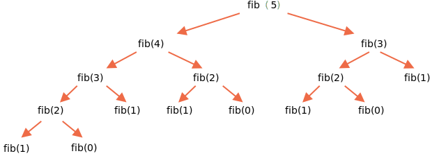

La première solution que nous pourrions essayer ici est la solution récursive.

Les nombres de Fibonacci sont récursifs par définition:

```js run
function fib(n) {
  return n <= 1 ? n : fib(n - 1) + fib(n - 2);
}

alert(fib(3)); // 2
alert(fib(7)); // 13
// fib(77); // Sera extrêmement lent!
```

...Mais pour les grandes valeurs de `n` c'est très lent.
Par exemple, `fib(77)` peut bloquer le moteur pendant un certain temps en consommant toutes les ressources du processeur.

C'est parce que la fonction crée trop de sous-appels.
Les mêmes valeurs sont réévaluées encore et encore.

Par exemple, voyons un calcul pour `fib(5)`:

```js no-beautify
...
fib(5) = fib(4) + fib(3)
fib(4) = fib(3) + fib(2)
...
```

Ici, nous pouvons voir que la valeur de `fib(3)` est nécessaire pour les deux `fib(5)` et `fib(4)`.
Alors `fib(3)` sera appelé et évalué deux fois de manière totalement indépendante.

Voici l'arbre de récursion complet:



Nous pouvons clairement remarquer que `fib(3)` est évalué deux fois et `fib(2)` est évalué trois fois.
La quantité totale de calculs augmente beaucoup plus vite que `n`, le rendant énorme même pour `n=77`.

Nous pouvons optimiser cela en nous rappelant les valeurs déjà évaluées: si une valeur de `fib(3)` est calculé une fois, alors nous pouvons simplement le réutiliser dans les calculs futurs.

Une autre variante consisterait à abandonner la récursion et à utiliser un algorithme totalement différent basé sur des boucles.

Au lieu de partir de `n` jusqu'à des valeurs plus basses, nous pouvons faire une boucle qui commence à partir de `1` et `2`, puis obtient `fib(3)` comme leur somme, ensuite `fib(4)` comme la somme de deux valeurs précédentes, ensuite `fib(5)` et monte, jusqu'à ce qu'il atteigne la valeur nécessaire.
À chaque étape, il suffit de rappeler deux valeurs précédentes.

Voici les étapes du nouvel algorithme en détails.

Le début:

```js
// a = fib(1), b = fib(2), ces valeurs sont par définition 1
let a = 1, b = 1;

// obtien c = fib(3) comme leur somme
let c = a + b;

/* nous avons maintenant fib(1), fib(2), fib(3)
a  b  c
1, 1, 2
*/
```

Maintenant, nous voulons obtenir `fib(4) = fib(2) + fib(3)`.

Passons aux variables: `a,b` aura `fib(2),fib(3)`, et `c` obtiendra leur somme:

```js no-beautify
a = b; // maintenant a = fib(2)
b = c; // maintenant b = fib(3)
c = a + b; // c = fib(4)

/* maintenant nous avons la séquence:
   a  b  c
1, 1, 2, 3
*/
```

L'étape suivante donne un autre numéro de séquence:

```js no-beautify
a = b; // maintenant a = fib(3)
b = c; // maintenant b = fib(4)
c = a + b; // c = fib(5)

/* maintenant la séquence est (encore un numéro):
      a  b  c
1, 1, 2, 3, 5
*/
```

...Et ainsi de suite jusqu'à l'obtention de la valeur nécessaire.
C'est beaucoup plus rapide que la récursion et n'implique aucun calcul en double.

Le code complet:

```js run
function fib(n) {
  let a = 1;
  let b = 1;
  for (let i = 3; i <= n; i++) {
    let c = a + b;
    a = b;
    b = c;
  }
  return b;
}

alert(fib(3)); // 2
alert(fib(7)); // 13
alert(fib(77)); // 5527939700884757
```

La boucle commence par `i=3`, parce que les première et deuxième valeurs de séquence sont codées en dur dans des variables `a=1`, `b=1`.

Cette approche s'appelle la [programmation dynamique de bas en haut](https://fr.wikipedia.org/wiki/Programmation_dynamique).
