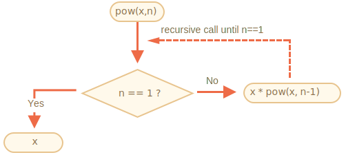
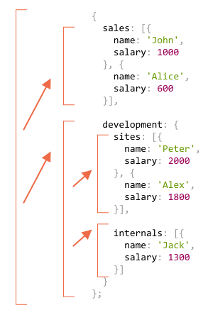
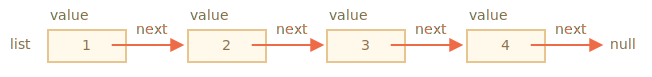
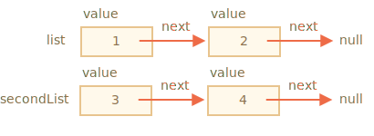
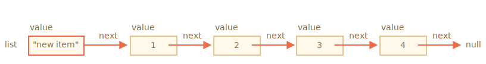
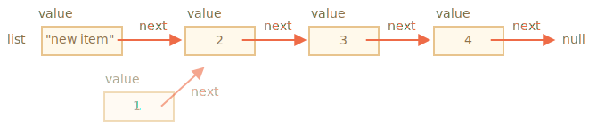

# Récursion et pile

Revenons aux fonctions et étudions-les plus en profondeur.

Notre premier sujet sera la *recursion*.

Si vous n’êtes pas novice en programmation, cela vous est probablement familier et vous pouvez sauter ce chapitre.

La récursion est un modèle de programmation utile dans les situations où une tâche peut être naturellement divisée en plusieurs tâches du même type, mais plus simple. Ou lorsqu'une tâche peut être simplifiée en une action facile plus une variante plus simple de la même tâche. Ou, comme nous le verrons bientôt, pour traiter certaines structures de données.

Lorsqu'une fonction résout une tâche, elle peut appeler de nombreuses autres fonctions. Cela se produit partiellement lorsqu'une fonction s'appelle *elle-même*. Cela s'appelle la *récursion*.

## Deux façons de penser

Prenons quelque chose de simple pour commencer -- écrivons une fonction `pow(x, n)` qui élève `x` à une puissance naturel de `n`. En d'autres termes, multiplie `x` par lui-même `n` fois.

```js
pow(2, 2) = 4
pow(2, 3) = 8
pow(2, 4) = 16
```

Il y a deux façons de le mettre en œuvre.

1. La pensée itérative: la boucle `for`:

    ```js run
    function pow(x, n) {
      let result = 1;

      // multiplier le résultat par x n fois dans la boucle
      for (let i = 0; i < n; i++) {
        result *= x;
      }

      return result;
    }

    alert( pow(2, 3) ); // 8
    ```

2. La pensée récursive: simplifie la tâche et s'appele elle-même:

    ```js run
    function pow(x, n) {
      if (n == 1) {
        return x;
      } else {
        return x * pow(x, n - 1);
      }
    }

    alert( pow(2, 3) ); // 8
    ```

Veuillez noter en quoi la variante récursive est fondamentalement différente.

Quand `pow(x, n)` est appelé,  l'exécution se scinde en deux branches:

```js
              if n==1  = x
             /
pow(x, n) =
             \
              else     = x * pow(x, n - 1)
```

1. Si `n == 1`, alors tout est trivial. On l'appelle *la base* de la récursion, car elle produit immédiatement le résultat évident: `pow(x, 1)` équivaut à `x`.
2. Sinon, nous pouvons représenter `pow(x, n)` comme `x * pow(x, n - 1)`. En maths, on écrirait <code>x<sup>n</sup> = x * x<sup>n-1</sup></code>. Ceci s'appelle *une étape récursive*: nous transformons la tâche en une action plus simple (multiplication par `x`) et un appel plus simple de la même tâche (`pow` avec le petit `n`). Les prochaines étapes le simplifient de plus en plus jusqu’à ce que `n` atteigne `1`.

On peut aussi dire que `pow` *s'appelle récursivement* jusqu'à ce que `n == 1`.




Par exemple, pour calculer `pow(2, 4)` la variante récursive effectue ces étapes:

1. `pow(2, 4) = 2 * pow(2, 3)`
2. `pow(2, 3) = 2 * pow(2, 2)`
3. `pow(2, 2) = 2 * pow(2, 1)`
4. `pow(2, 1) = 2`

Ainsi, la récursion réduit un appel de fonction à un processus plus simple, puis -- à un processus encore plus simple, etc. jusqu'à ce que le résultat devienne évident.

````smart header="La récursion est généralement plus courte"
Une solution récursive est généralement plus courte qu'une solution itérative.

Ici, nous pouvons réécrire la même chose en utilisant l'opérateur conditionnel `?` Au lieu de `if` pour rendre `pow (x, n)` plus concis et toujours très lisible:

```js run
function pow(x, n) {
  return (n == 1) ? x : (x * pow(x, n - 1));
}
```
````

Le nombre maximal d'appels imbriqués (y compris le premier) est appelé la *profondeur de récursivité*. Dans notre cas, ce sera exactement `n`.

La profondeur maximale de récursion est limitée par le moteur JavaScript. Nous sommes sur qu'il va jusqu'à 10000, certains moteurs en autorisent plus, mais 100000 est probablement hors limite pour la majorité d'entre eux. Il existe des optimisations automatiques qui aident à atténuer ce problème ("optimisation des appels de queue"), mais elles ne sont pas encore prises en charge partout et ne fonctionnent que dans des cas simples.

Cela limite l'application de la récursion, mais cela reste très large. Il y a beaucoup de tâches pour lesquelles la pensée récursive donne un code plus simple et plus facile à gérer.

## Le contexte d'exécution et la pile

Voyons maintenant comment fonctionnent les appels récursifs. Pour cela, nous allons regarder sous le capot des fonctions.

Les informations sur le processus d'exécution d'une fonction en cours d'exécution sont stockées dans son *contexte d'exécution*.

Le [contexte d'exécution](https://tc39.github.io/ecma262/#sec-execution-contexts) est une structure de données interne contenant des détails sur l'exécution d'une fonction: où le flux de contrôle est maintenant, les variables actuelles, la valeur de `this` (nous ne l'utilisons pas ici) et quelques autres détails internes.

Un appel de fonction est associé à exactement un contexte d'exécution.

Lorsqu'une fonction effectue un appel imbriqué, les événements suivants se produisent:

- La fonction en cours est suspendue.
- Le contexte d’exécution qui lui est associé est mémorisé dans une structure de données spéciale appelée *pile de contexte d’exécution*.
- L'appel imbriqué s'exécute.
- Une fois terminé, l'ancien contexte d'exécution est extrait de la pile et la fonction externe reprend à partir de son point d'arrêt.

Voyons ce qui se passe pendant l'appel de `pow(2, 3)`.

### pow(2, 3)

Au début de l'appel de `pow(2, 3)` le contexte d'exécution stockera des variables: `x = 2, n = 3`, le flux d'exécution est à la ligne `1` de la fonction.

Nous pouvons l'esquisser comme:

<ul class="function-execution-context-list">
  <li>
    <span class="function-execution-context">Context: { x: 2, n: 3, at line 1 }</span>
    <span class="function-execution-context-call">pow(2, 3)</span>
  </li>
</ul>

C'est à ce moment que la fonction commence à s'exécuter. La condition`n == 1` est faux, donc le flux continue dans la deuxième branche de `if`:

```js run
function pow(x, n) {
  if (n == 1) {
    return x;
  } else {
*!*
    return x * pow(x, n - 1);
*/!*
  }
}

alert( pow(2, 3) );
```


Les variables sont les mêmes, mais la ligne change, le contexte est donc le suivant:

<ul class="function-execution-context-list">
  <li>
    <span class="function-execution-context">Context: { x: 2, n: 3, at line 5 }</span>
    <span class="function-execution-context-call">pow(2, 3)</span>
  </li>
</ul>

Pour calculer `x * pow(x, n - 1)`, nous devons faire un sous-appel de `pow` avec de nouveaux arguments `pow(2, 2)`.

### pow(2, 2)

Pour effectuer un appel imbriqué, JavaScript se souvient du contexte d'exécution actuel dans le *contexte d'exécution de la pile*.

Ici, nous appelons la même fonction `pow`, mais cela n’a absolument aucune importance. Le processus est le même pour toutes les fonctions:

1. Le contexte actuel est "mémorisé" en haut de la pile.
2. Le nouveau contexte est créé pour le sous-appel.
3. Quand le sous-appel est fini -- le contexte précédent est extrait de la pile et son exécution se poursuit.

Voici la pile de contexte lorsque nous sommes entrés dans le sous-appel `pow(2, 2)`:

<ul class="function-execution-context-list">
  <li>
    <span class="function-execution-context">Context: { x: 2, n: 2, at line 1 }</span>
    <span class="function-execution-context-call">pow(2, 2)</span>
  </li>
  <li>
    <span class="function-execution-context">Context: { x: 2, n: 3, at line 5 }</span>
    <span class="function-execution-context-call">pow(2, 3)</span>
  </li>
</ul>

Le nouveau contexte d'exécution actuel est en haut (et en gras) et les contextes précédemment mémorisés sont en dessous.

Quand on termine le sous-appel -- il est facile de reprendre le contexte précédent, car il conserve les deux variables et l'emplacement exact du code où il s'est arrêté. 

```smart
Ici, dans l'image, nous utilisons le mot "line", comme dans notre exemple, il n'y a qu'un seul sous-appel en ligne, mais généralement une seule ligne de code peut contenir plusieurs sous-appels, comme `pow(…) + pow(…) + somethingElse(…)`.

Il serait donc plus précis de dire que l'exécution reprend "immédiatement après le sous-appel".
```

### pow(2, 1)

Le processus se répète: un nouveau sous-appel est fait à la ligne `5`, maintenant avec des arguments `x=2`, `n=1`.

Un nouveau contexte d'exécution est créé, le précédent est placé en haut de la pile:

<ul class="function-execution-context-list">
  <li>
    <span class="function-execution-context">Context: { x: 2, n: 1, at line 1 }</span>
    <span class="function-execution-context-call">pow(2, 1)</span>
  </li>
  <li>
    <span class="function-execution-context">Context: { x: 2, n: 2, at line 5 }</span>
    <span class="function-execution-context-call">pow(2, 2)</span>
  </li>
  <li>
    <span class="function-execution-context">Context: { x: 2, n: 3, at line 5 }</span>
    <span class="function-execution-context-call">pow(2, 3)</span>
  </li>
</ul>

Il y a 2 anciens contextes et 1 en cours d'exécution pour `pow(2, 1)`.

### La sortie

Pendant l'exécution de `pow(2, 1)`, contrairement à avant, la condition `n == 1` est la vérité, donc la première branche de `if` fonctionne:

```js
function pow(x, n) {
  if (n == 1) {
*!*
    return x;
*/!*
  } else {
    return x * pow(x, n - 1);
  }
}
```

Il n'y a plus d'appels imbriqués, donc la fonction se termine en renvoyant`2`.

Lorsque la fonction se termine, son contexte d'exécution n'est plus nécessaire, il est donc supprimé de la mémoire. La précédente est restaurée en haut de la pile:


<ul class="function-execution-context-list">
  <li>
    <span class="function-execution-context">Context: { x: 2, n: 2, at line 5 }</span>
    <span class="function-execution-context-call">pow(2, 2)</span>
  </li>
  <li>
    <span class="function-execution-context">Context: { x: 2, n: 3, at line 5 }</span>
    <span class="function-execution-context-call">pow(2, 3)</span>
  </li>
</ul>

L'exécution de `pow(2, 2)` est repris. Il a le résultat du sous-appel `pow(2, 1)`, de sorte qu'il peut également terminer l'évaluation de `x * pow(x, n - 1)`, retournant `4`.

Ensuite, le contexte précédent est restauré:

<ul class="function-execution-context-list">
  <li>
    <span class="function-execution-context">Context: { x: 2, n: 3, at line 5 }</span>
    <span class="function-execution-context-call">pow(2, 3)</span>
  </li>
</ul>

Quand il se termine, nous avons un résultat de `pow(2, 3) = 8`.

La profondeur de récursion dans ce cas était: **3**.

Comme nous pouvons le voir dans les illustrations ci-dessus, la profondeur de récursion est égale au nombre maximal de contextes dans la pile.

Notez les besoins en mémoire. Les contextes prennent de la mémoire. Dans notre cas, augmenter à la puissance de `n` nécessite en réalité de la mémoire pour les contextes `n`, pour toutes les valeurs inférieures de `n`.

Un algorithme basé sur des boucles est plus économe en mémoire:

```js
function pow(x, n) {
  let result = 1;

  for (let i = 0; i < n; i++) {
    result *= x;
  }

  return result;
}
```

Le `pow` itératif utilise un contexte unique qui change les processus `i` et `result` dans le processus. Ses besoins en mémoire sont faibles, fixes et ne dépendent pas de `n`.

**Toute récursion peut être réécrite sous forme de boucle. La variante de boucle peut généralement être rendue plus efficace.**

<<<<<<< HEAD
..Parfois, la réécriture n’est pas triviale, en particulier lorsque la fonction utilise différents sous-appels récursifs en fonction des conditions et fusionne leurs résultats ou lorsque la création de branche est plus complexe. Et l'optimisation risque de ne pas être nécessaire et de ne pas valoir la peine.
=======
...But sometimes the rewrite is non-trivial, especially when a function uses different recursive subcalls depending on conditions and merges their results or when the branching is more intricate. And the optimization may be unneeded and totally not worth the efforts.
>>>>>>> bf7d8bb1af3b416d393af1c15b03cb1352da1f9c

La récursion peut donner un code plus court, plus facile à comprendre et à supporter. Les optimisations ne sont pas nécessaires à chaque endroit, nous avons surtout besoin d'un bon code, c'est pourquoi il est utilisé.

## Traversées récursives

Une autre grande application de la récursion est une traversée récursive.

Imaginez, nous avons une entreprise. La structure du personnel peut être présentée comme un objet:

```js
let company = {
  sales: [{
    name: 'John',
    salary: 1000
  }, {
    name: 'Alice',
    salary: 1600
  }],

  development: {
    sites: [{
      name: 'Peter',
      salary: 2000
    }, {
      name: 'Alex',
      salary: 1800
    }],

    internals: [{
      name: 'Jack',
      salary: 1300
    }]
  }
};
```

En d'autres termes, une entreprise a des départements.

- Un département peut avoir un tableau de personnel. Par exemple, le département des ventes compte 2 employés: John et Alice.
- Ou bien un département peut être divisé en sous-départements, comme `development` a deux branches: `sites` et `internes`. Chacun d'entre eux a son propre personnel.
- Il est également possible que lorsqu'un sous-département s'agrandisse, il se divise en sous-départements (ou équipes).

    Par exemple, le département `sites` peut être divisé en équipes pour les sites `siteA` et `siteB`. Et, potentiellement, ils peuvent être diviser encore plus. Ce n'est pas sur la photo, c'est juste quelque chose qu'ont pourrait immaginer.

Maintenant, disons que nous voulons une fonction pour obtenir la somme de tous les salaires. Comment peut-on faire ça?

Une approche itérative n’est pas facile, car la structure n’est pas simple. La première idée peut être de créer une boucle `for` sur `company` avec une sous-boucle imbriqué sur les départements de premier niveau. Mais ensuite, nous avons besoin de plus de sous-boucles imbriquées pour parcourir le personnel des départements de second niveau, tels que les `sites`... Et puis une autre sous-boucle dans ceux des départements de 3ème niveau qui pourraient apparaître dans le futur ? Si nous mettons 3-4 sous-boucles imbriquées dans le code pour traverser un seul objet, cela devient plutôt moche.

Essayons la récursion.

Comme nous pouvons le constater, lorsque notre fonction demande à un département de faire la somme, il existe deux cas possibles:

1. S’il s’agit d’un "simple" département avec un *tableau* de personnes, nous pouvons alors additionner les salaires en une simple boucle.
2. Ou bien *c'est un objet* avec `N` sous-départements -- alors nous pouvons faire des appels` N` récursifs pour obtenir la somme de chaque sous-étape et combiner les résultats.

Le premier cas est la base de la récursivité, le cas trivial, lorsque nous obtenons un tableau.

Le 2ème cas où nous obtenons un objet est l'étape récursive. Une tâche complexe est divisée en sous-tâches pour les plus petits départements. Ils peuvent à leur tour se séparer à nouveau, mais tôt ou tard, la scission se terminera à (1).

L'algorithme est probablement encore plus facile à lire à partir du code:


```js run
let company = { // le même objet, compressé pour la brièveté
  sales: [{name: 'John', salary: 1000}, {name: 'Alice', salary: 1600 }],
  development: {
    sites: [{name: 'Peter', salary: 2000}, {name: 'Alex', salary: 1800 }],
    internals: [{name: 'Jack', salary: 1300}]
  }
};

// La fonction pour faire le travail
*!*
function sumSalaries(department) {
  if (Array.isArray(department)) { // case (1)
    return department.reduce((prev, current) => prev + current.salary, 0); // additionne le tableau
  } else { // case (2)
    let sum = 0;
    for (let subdep of Object.values(department)) {
      sum += sumSalaries(subdep); // appel récursivement pour les sous-départements, additionnez les résultats
    }
    return sum;
  }
}
*/!*

alert(sumSalaries(company)); // 7700
```

Le code est court et facile à comprendre (tout va bien?). C'est le pouvoir de la récursion. Cela fonctionne également pour tous les niveaux d'imbrication de sous-départements.

Voici le schéma des appels:



On peut facilement voir le principe: pour un objet `{...}` les sous-appels sont faits, alors que les tableaux `[...]` sont les "feuilles" de l'arbre de récurrence, elles donnent un résultat immédiat.

Notez que le code utilise des fonctionnalités intelligentes que nous avons déjà abordées:

- La méthode `arr.reduce` a été expliquée dans le chapitre <info:array-methods> pour obtenir la somme du tableau. 
- La boucle `for(val of Object.values(obj))` itérer sur les valeurs d'objet: `Object.values` retourne un tableau d'eux-mêmes.


## Structures récursives

Une structure de données récursive (définie de manière récursive) est une structure qui se réplique par parties.

Nous venons de le voir dans l'exemple d'une structure d'entreprise ci-dessus.

Un *département* d'entreprise est:
- Soit un éventail de personnes.
- Ou un objet avec des *départements*.

Pour les développeurs Web, il existe des exemples bien mieux connus: les documents HTML et XML.

Dans le document HTML, une balise *HTML* peut contenir une liste de:
- Morceaux de texte.
- Commentaires HTML.
- Autres *balises HTML* (pouvant à leur tour contenir des morceaux de texte/commentaires ou d’autres balises, etc.).

C'est encore une définition récursive.

Pour une meilleure compréhension, nous allons couvrir une autre structure récursive nommée "Liste chaînée" qui pourrait être une meilleure alternative aux tableaux dans certains cas.

### Liste chaînée

Imaginez, nous voulons stocker une liste ordonnée d'objets.

Le choix naturel serait un tableau:

```js
let arr = [obj1, obj2, obj3];
```

... Mais il y a un problème avec les tableaux. Les opérations "delete element" et "insert element" sont coûteuses. Par exemple, l'opération `arr.unshift(obj)` doit renuméroter tous les éléments pour faire de la place pour un nouvel `obj`, et si le tableau est grand, cela prend du temps. Même chose avec `arr.shift()`.

Les seules modifications structurelles ne nécessitant pas de renumérotation en masse sont celles qui fonctionnent avec la fin du tableau: `arr.push/pop`. Ainsi, un tableau peut être assez lent pour les grandes files d'attente, lorsque nous devons travailler avec sont début.

Alternativement, si nous avons vraiment besoin d'une insertion/suppression rapide, nous pouvons choisir une autre structure de données appelée la [Liste chaînée](https://fr.wikipedia.org/wiki/Liste_cha%C3%AEn%C3%A9e).

*L'élémentde la liste liée* est défini de manière récursive en tant qu'objet avec:
- `value`.
- `next` propriété référençant le prochain *élément de liste liée* ou `null` si c'est la fin.

Par exemple:

```js
let list = {
  value: 1,
  next: {
    value: 2,
    next: {
      value: 3,
      next: {
        value: 4,
        next: null
      }
    }
  }
};
```

Représentation graphique de la liste:



An alternative code for creation:

```js no-beautify
let list = { value: 1 };
list.next = { value: 2 };
list.next.next = { value: 3 };
list.next.next.next = { value: 4 };
list.next.next.next.next = null;
```

Ici, nous pouvons voir encore plus clairement qu'il y a plusieurs objets, chacun ayant les valeurs `value` et` next` pointant vers le voisin. La variable `list` est le premier objet de la chaîne. Par conséquent, en suivant les pointeurs `next`, nous pouvons atteindre n'importe quel élément.

La liste peut être facilement divisée en plusieurs parties et ultérieurement réunie:

```js
let secondList = list.next.next;
list.next.next = null;
```



Pour joindre:

```js
list.next.next = secondList;
```

Et nous pouvons sûrement insérer ou retirer des objets n’importe où.

Par exemple, pour ajouter une nouvelle valeur, nous devons mettre à jour la tête de la liste:

```js
let list = { value: 1 };
list.next = { value: 2 };
list.next.next = { value: 3 };
list.next.next.next = { value: 4 };

*!*
// ajoute la nouvelle valeur à la liste
list = { value: "new item", next: list };
*/!*
```



Pour supprimer une valeur du milieu, changez le `next` de la précédente:

```js
list.next = list.next.next;
```



`List.next` a sauté `1` à la valeur `2`. La valeur `1` est maintenant exclue de la chaîne. Si elle n'est pas stocké ailleurs, elle sera automatiquement supprimé de la mémoire.

Contrairement aux tableaux, il n'y a pas de renumérotation en masse, nous pouvons facilement réorganiser les éléments.

Naturellement, les listes ne sont pas toujours meilleures que les tableaux. Sinon, tout le monde n'utiliserait que des listes.

Le principal inconvénient est que nous ne pouvons pas facilement accéder à un élément par son numéro. Dans un tableau simple: `arr [n]` est une référence directe. Mais dans la liste, nous devons commencer à partir du premier élément et aller `next``N` fois pour obtenir le Nième élément.

...Mais nous n’avons pas toujours besoin de telles opérations. Par exemple, quand on a besoin d’une file d’attente ou même d’un [deque](https://en.wikipedia.org/wiki/Double-ended_queue) -- la structure ordonnée qui doit permettre l'ajout/suppression très rapide d'éléments des deux extrémités, mais l'accès au milieu n'est pas nécessaire.


Les listes peuvent être améliorées:
- Nous pouvons ajouter la propriété `prev` en plus de `next` pour référencer l'élément précédent, pour revenir facilement.
- Nous pouvons également ajouter une variable nommée `tail` faisant référence au dernier élément de la liste (et la mettre à jour lors de l'ajout/suppression d'éléments de la fin).
- ... La structure de données peut varier en fonction de nos besoins.

## Résumé

Terms:
- *Recursion*  est un terme de programmation qui signifie q'une fonction s'appelle elle-même. Les fonctions récursives peuvent être utilisées pour résoudre des tâches de manière élégante.

Lorsqu'une fonction s'appelle elle-même, cela s'appelle une *étape de récursion*. La *base* de la récursion est constituée par les arguments de la fonction qui rendent la tâche si simple que la fonction ne fait plus d'appels.

- Une structure de données de [Type récursif](https://fr.wikipedia.org/wiki/Type_r%C3%A9cursif) est une structure de données qui peut être définie à l'aide de elle-même.

    Par exemple, la liste chaînée peut être définie comme une structure de données consistant en un objet référençant une liste (ou null).

    ```js
    list = { value, next -> list }
    ```

<<<<<<< HEAD
    Les arbres tels que l’arbre des éléments HTML ou l’arbre des départements de ce chapitre sont également naturellement récursifs: ils ont des branchent et chaque branche peut avoir d’autres branches.
=======
    Trees like HTML elements tree or the department tree from this chapter are also naturally recursive: they have branches and every branch can have other branches.
>>>>>>> bf7d8bb1af3b416d393af1c15b03cb1352da1f9c

    Des fonctions récursives peuvent être utilisées pour les parcourir, comme nous l'avons vu dans l'exemple `sumSalary`.

Toute fonction récursive peut être réécrite en une fonction itérative. Et c'est parfois nécessaire pour optimiser les choses. Mais pour de nombreuses tâches, une solution récursive est assez rapide et plus facile à écrire et à supporter.
