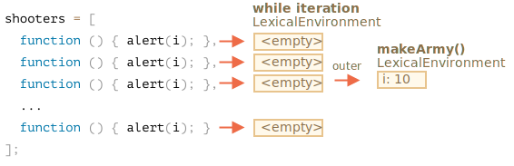
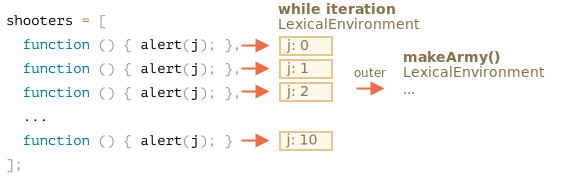
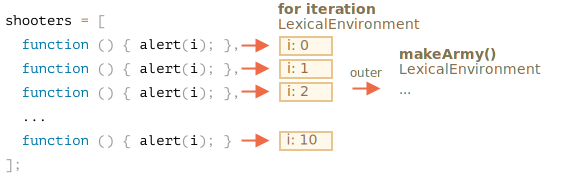

<<<<<<< HEAD
Examinons ce qui se fait à l'intérieur de `makeArmy`, et la solution deviendra évidente.
=======
Let's examine what exactly happens inside `makeArmy`, and the solution will become obvious.
>>>>>>> ff152b126ec70a9de919bfdc1913215539d37187

1. Elle crée un tableau vide `shooters`:

    ```js
    let shooters = [];
    ```
2. Le remplit dans la boucle via `shooters.push(function...)`.

    Chaque élément est une fonction, le tableau résultant ressemble à ceci :

    ```js no-beautify
    shooters = [
      function () { alert(i); },
      function () { alert(i); },
      function () { alert(i); },
      function () { alert(i); },
      function () { alert(i); },
      function () { alert(i); },
      function () { alert(i); },
      function () { alert(i); },
      function () { alert(i); },
      function () { alert(i); }
    ];
    ```

3. Le tableau est renvoyé depuis la fonction.

<<<<<<< HEAD
Ensuite, plus tard, l'appel à `army[5]()` obtiendra l'élément `army[5]` du tableau (ce sera une fonction) et l'appellera.

Maintenant, pourquoi toutes ces fonctions affichent la même chose ?
=======
Then, later, the call to any member, e.g. `army[5]()` will get the element `army[5]` from the array (that's a function) and call it.

Now why do all such functions show the same value, `10`?
>>>>>>> ff152b126ec70a9de919bfdc1913215539d37187

C'est parce qu'il n'y a pas de variable locale `i` dans les fonctions `shooter`. Quand une telle fonction est appelée, elle tire `i` de son environnement lexical externe.

Quelle sera la valeur de `i` ?

Si on regarde la source :

```js
function makeArmy() {
  ...
  let i = 0;
  while (i < 10) {
    let shooter = function() { // fonction shooter
      alert( i ); // devrait afficher son numéro
    };
    ...
  }
  ...
}
```

<<<<<<< HEAD
... Nous pouvons voir qu'il réside dans l'environnement lexical associé à l'exécution actuelle de `makeArmy()`. Mais lorsque l'option `army[5]()` est appelée, `makeArmy` a déjà terminé son travail et `i` a la dernière valeur : `10` (la fin de `while`).

En conséquence, toutes les fonctions `shooter` obtiennent la même valeur, dernière valeur `i = 10`, à partir de l'environnement lexical externe.

Nous pouvons réparer cela en déplaçant la définition de variable dans la boucle :
=======
We can see that all `shooter` functions are created in the lexical environment, associated with the one `makeArmy()` run. But when `army[5]()` is called, `makeArmy` has already finished its job, and the final value of `i` is `10`(`while` finishes at `10`).

As the result, all `shooter` functions get the same value from the outer lexical environment and that is, the last value, `i=10`.


>>>>>>> ff152b126ec70a9de919bfdc1913215539d37187

As you can see above, on each iteration of a `while {...} ` block, a new lexical environment is created. 

So, to fix a problem we can copy the value of `i` into a variable within the `while {...}` block, like this:

```js run
function makeArmy() {
  let shooters = [];

<<<<<<< HEAD
*!*
  for(let i = 0; i < 10; i++) {
*/!*
    let shooter = function() { // fonction shooter
      alert( i ); // devrait afficher son numéro
    };
=======
  let i = 0;
  while (i < 10) {
    *!*
      let j = i;
    */!*
      let shooter = function() { // shooter function
        alert( *!*j*/!* ); // should show its number
      };
>>>>>>> ff152b126ec70a9de919bfdc1913215539d37187
    shooters.push(shooter);
    i++;
  }

  return shooters;
}

let army = makeArmy();

// Now the code works correctly
army[0](); // 0
army[5](); // 5
```

<<<<<<< HEAD
Maintenant, cela fonctionne correctement, car à chaque fois que le bloc de code dans `for (let i = 0 ...) {...}` est exécuté, un nouvel environnement lexical est créé pour celui-ci, avec la variable correspondante `i`.

Ainsi, la valeur de `i` vit maintenant un peu plus près. Pas dans l'environnement lexical `makeArmy()`, mais dans l'environnement lexical qui correspond à l'itération de la boucle en cours. C'est la raison pour laquelle maintenant ça fonctionne.
=======
Here `let j = i` declares an "iteration-local" variable `j` and copies `i` into it. Primitives are copied "by value", so we actually get an independent copy of `i`, belonging to the current loop iteration.

The shooters work correctly, because, the value of `i` now lives a little bit closer. Not in `makeArmy()` Lexical Environment, but in the Lexical Environment that corresponds the current loop iteration:
>>>>>>> ff152b126ec70a9de919bfdc1913215539d37187



<<<<<<< HEAD
Ici, nous avons réécrit `while` dans` for`.

Une autre astuce pourrait être possible, voyons-la pour une meilleure compréhension du sujet :

```js run
=======
Such problem could also be avoided if we used `for` in the beginning, like this:

```js run demo
>>>>>>> ff152b126ec70a9de919bfdc1913215539d37187
function makeArmy() {

  let shooters = [];

*!*
  for(let i = 0; i < 10; i++) {
*/!*
<<<<<<< HEAD
    let shooter = function() { // fonction shooter
      alert( *!*j*/!* ); // devrait afficher son numéro
=======
    let shooter = function() { // shooter function
      alert( i ); // should show its number
>>>>>>> ff152b126ec70a9de919bfdc1913215539d37187
    };
    shooters.push(shooter);
  }

  return shooters;
}

let army = makeArmy();

army[0](); // 0
army[5](); // 5
```

<<<<<<< HEAD
La boucle `while`, tout comme `for`, crée un nouvel environnement lexical pour chaque exécution. Nous nous assurons donc ici que la valeur obtenue pour un `shooter` soit correcte.

Nous copions `let j = i`. Cela crée un corps de boucle local `j` et y copie la valeur de `i`. Les primitives sont copiées "par valeur", nous obtenons donc une copie complète et indépendante de `i`, appartenant à l'itération de la boucle en cours.
=======
That's essentially, the same, as `for` on each iteration generates the new lexical environment, with its own variable `i`. So `shooter` generated in every iteration references its own `i`, from that very iteration.



Now, as you've put so much effort into reading this, and the final recipe is so simple - just use `for`, you may wonder: was it worth that?

Well, if you could easily answer the question of that task, you wouldn't read the solution, so hopefully this task must have helped you to understand things a bit better. 

Besides, there are indeed cases when one prefers `while` to `for`, and other scenarios where such problems are real.

>>>>>>> ff152b126ec70a9de919bfdc1913215539d37187
