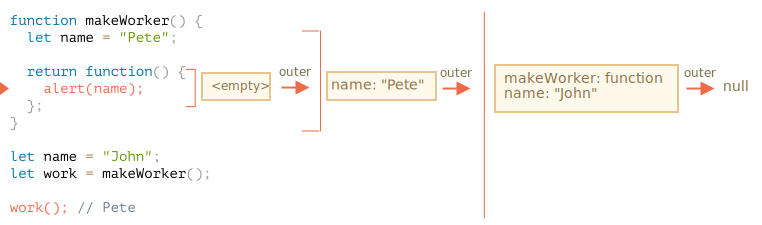

La réponse est : **Pete**.

La fonction `work()` dans le code ci-dessous obtient `name` du lieu de son origine via la référence d'environnement lexical externe :

Donc, le résultat est `"Pete"` ici.

Mais s'il n'y avait pas de `let name` dans `makeWorker()`, alors la recherche irait à l'extérieur et prendrait la variable globale comme nous pouvons le voir dans la chaîne ci-dessus. Dans ce cas, le résultat serait `"John"`.
