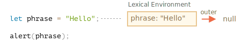
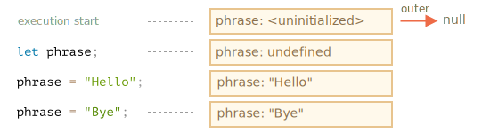
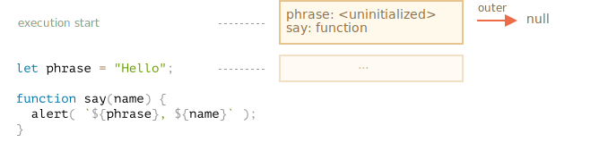
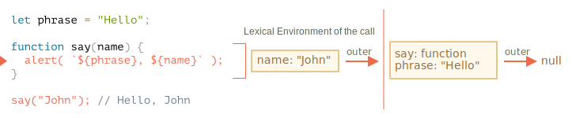
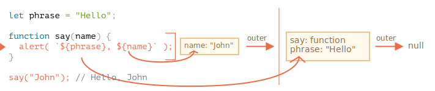
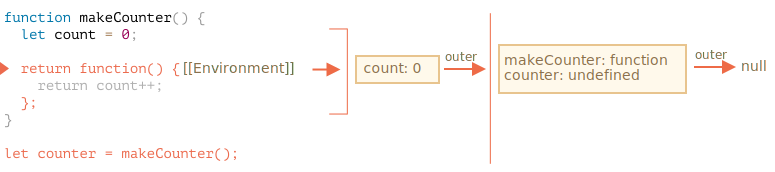
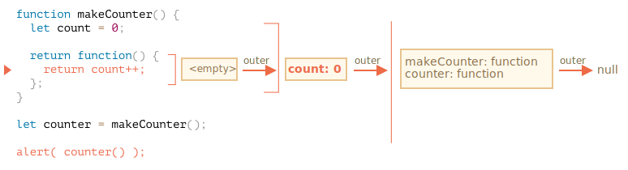
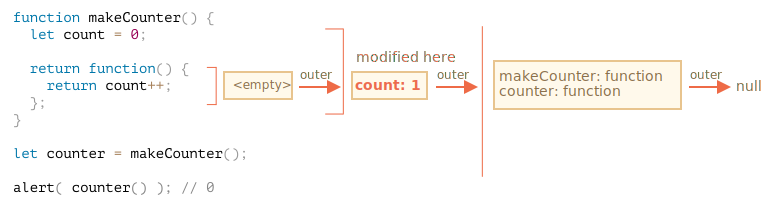

# Variable scope, closure

JavaScript est un langage orienté vers le fonctionnel. Cela nous donne beaucoup de liberté. Une fonction peut être créée dynamiquement, passée en argument à une autre fonction et appelée ultérieurement à partir d'un code totalement différent.

Nous savons déjà qu'une fonction peut accéder à des variables en dehors de celle-ci (variables externes).

Mais que se passe-t-il si les variables externes changent depuis la création d'une fonction ? La fonction obtiendra-t-elle des valeurs plus récentes ou les anciennes ?

<<<<<<< HEAD
Et si une fonction est transmise en tant que paramètre et appelée depuis un autre endroit de code, aura-t-elle accès aux variables externes au nouvel endroit ?
=======
And what if a function is passed along as a parameter and called from another place of code, will it get access to outer variables at the new place?
>>>>>>> 58f6599df71b8d50417bb0a52b1ebdc995614017

Développons maintenant nos connaissances pour inclure des scénarios plus complexes.

```smart header="Nous parlerons ici des variables `let/const`"
En JavaScript, il y a 3 façons de déclarer une variable: `let`, `const`(les modernes) et `var` (le vestige du passé).

- Dans cet article, nous utiliserons des variables `let` dans les exemples.
- Les variables, déclarées avec `const`, se comportent de la même manière, donc cet article concerne également `const`.
- L'ancien `var` a quelques différences notables, elles seront traitées dans l'article <info:var>.
```

## Code blocks

Si une variable est déclarée à l'intérieur d'un bloc de code `{...}`, elle n'est visible qu'à l'intérieur de ce bloc.

Par exemple :

```js run
{
  // faire un travail avec des variables locales qui ne devraient pas être vues à l'extérieur

  let message = "Hello"; // visible uniquement dans ce bloc

  alert(message); // Hello
}

alert(message); // Error: message is not defined
```

Nous pouvons l'utiliser pour isoler un morceau de code qui fait sa propre tâche, avec des variables qui lui appartiennent uniquement :

```js run
{
  // show message
  let message = "Hello";
  alert(message);
}

{
  // show another message
  let message = "Goodbye";
  alert(message);
}
```

````smart header="Il y aurait une erreur sans blocs"
Veuillez noter que sans blocs séparés, il y aurait une erreur, si nous utilisons `let` avec le nom de variable existant :

```js run
// show message
let message = "Hello";
alert(message);

// show another message
*!*
let message = "Goodbye"; // Error: variable already declared
*/!*
alert(message);
```
````

Pour `if`, `for`, `while` et ainsi de suite, les variables déclarées dans `{...}` ne sont également visibles qu'à l'intérieur :

```js run
if (true) {
  let phrase = "Hello!";

  alert(phrase); // Hello!
}

alert(phrase); // Error, no such variable!
```

Here, after `if` finishes, the `alert` below won't see the `phrase`, hence the error.

C'est super, car cela nous permet de créer des variables locales, spécifiques à une branche `if`.

La même chose vaut pour les boucles `for` et `while` :

```js run
for (let i = 0; i < 3; i++) {
  // la variable i n'est visible que dans ce for
  alert(i); // 0, ensuite 1, ensuite 2
}

alert(i); // Error, no such variable
```

Visually, `let i` is outside of `{...}`. But the `for` construct is special here: the variable, declared inside it, is considered a part of the block.

## Fonctions imbriquées

Une fonction est appelée "imbriquée" lorsqu'elle est créée dans une autre fonction.

Il est facilement possible de faire cela avec JavaScript.

Nous pouvons l'utiliser pour organiser notre code, comme ceci :

```js
function sayHiBye(firstName, lastName) {

  // helper nested function to use below
  function getFullName() {
    return firstName + " " + lastName;
  }

  alert( "Hello, " + getFullName() );
  alert( "Bye, " + getFullName() );

}
```

Ici, la fonction *imbriquée* `getFullName()` est faite pour plus de commodité. Elle peut accéder aux variables externes et peut donc renvoyer le nom complet. Les fonctions imbriquées sont assez courantes dans JavaScript.

Ce qui est beaucoup plus intéressant, une fonction imbriquée peut être retournée : soit en tant que propriété d'un nouvel objet, soit en tant que résultat par elle-même. Elle peut ensuite être utilisée ailleurs. Peu importe où, elle a toujours accès aux mêmes variables externes.

Ci-dessous, `makeCounter` crée la fonction "counter" qui renvoie le nombre suivant à chaque appel :

```js run
function makeCounter() {
  let count = 0;

  return function() {
    return count++;
  };
}

let counter = makeCounter();

alert( counter() ); // 0
alert( counter() ); // 1
alert( counter() ); // 2
```

Bien que simples, des variantes légèrement modifiées de ce code ont des utilisations pratiques, par exemple un [générateur de nombres aléatoires](https://fr.wikipedia.org/wiki/G%C3%A9n%C3%A9rateur_de_nombres_pseudo-al%C3%A9atoires) pour générer des valeurs aléatoires pour des tests automatisés.

Comment cela marche-t-il ? Si nous créons plusieurs compteurs, seront-ils indépendants ? Que se passe-t-il avec les variables ici ?

La compréhension de ce genre de choses est excellente pour la connaissance globale de JavaScript et bénéfique pour les scénarios plus complexes. Allons donc un peu en profondeur.

## Lexical Environment

```warn header="Voilà des dragons !"
L'explication technique approfondie reste à venir.

Bien que je souhaiterai éviter les détails de bas niveau du langage, toute compréhension sans eux serait manquante et incomplète, alors préparez-vous.
```

Pour plus de clarté, l'explication est divisée en plusieurs étapes.

### Étape 1. Variables

En JavaScript, chaque fonction en cours d'exécution, bloc de code `{...}` et le script dans son ensemble ont un objet associé interne (caché) connu sous le nom de *Environnement Lexical*.

L'objet environnement lexical se compose de deux parties :

1. *Environment Record* -- un objet qui stocke toutes les variables locales comme ses propriétés (et quelques autres informations comme la valeur de `this`).
2. Une référence à *l'environnement lexical externe*, celui associé au code externe.

**Une "variable" est juste une propriété de l'objet interne spécial `Environment Record`. "Pour obtenir ou modifier une variable" signifie "pour obtenir ou modifier une propriété de cet objet".**

Dans ce code simple sans fonctions, il n'y a qu'un seul environnement lexical :



Il s'agit de l'environnement Lexical dit *global*, associé à l'ensemble du script.

Sur l'image ci-dessus, le rectangle signifie Environment Record(stockage de variable) et la flèche signifie la référence externe. L'environnement lexical global n'a pas de référence externe, c'est pourquoi la flèche pointe vers `null`.

À mesure que le code commence à s'exécuter et se poursuit, l'environnement lexical change.

Voici un peu plus de code :



Les rectangles sur le côté droit montrent comment l'environnement lexical global change pendant l'exécution :

1. Lorsque le script démarre, l'environnement lexical est prérempli avec toutes les variables déclarées.
    - Initialement, elles sont à l'état "non initialisé". C'est un état interne spécial, cela signifie que le moteur connaît la variable, mais elle ne peut pas être référencée tant qu'elle n'a pas été déclarée avec `let`. C'est presque la même chose que si la variable n'existait pas.
2. Ensuite, la définition de `let phrase` apparaît. Il n'y a pas encore d'affectation, donc sa valeur est `undefined`. Nous pouvons utiliser la variable depuis ce moment.
3. `phrase` se voit attribuer une valeur.
4. `phrase` change la valeur.

Tout semble simple pour l'instant, non ?

- Une variable est la propriété d'un objet interne spécial, associé au bloc/fonction/script en cours d'exécution.
- Travailler avec des variables, c'est travailler avec les propriétés de cet objet.

```smart header="L'environnement lexical est un objet de spécification"
"L'environnement lexical" est un objet de spécification : il n'existe que "théoriquement" dans la [spécification du language](https://tc39.es/ecma262/#sec-lexical-environments) pour décrire comment les choses fonctionnent. nous ne pouvons pas obtenir cet objet dans notre code et le manipuler directement.

JavaScript engines also may optimize it, discard variables that are unused to save memory and perform other internal tricks, as long as the visible behavior remains as described.
```

### Step 2. Fonctions Declarations

Une fonction est également une valeur, comme une variable.

**La différence est qu'une fonction déclaration est instantanément et complètement initialisée.**

Lorsqu'un environnement lexical est créé, une fonction déclaration devient immédiatement une fonction prête à l'emploi (contrairement à `let`, qui est inutilisable jusqu'à la déclaration).

C'est pourquoi nous pouvons utiliser une fonction, déclarée comme fonction déclaration, avant même la déclaration elle-même.

Par exemple, voici l'état initial de l'environnement lexical global lorsque nous ajoutons une fonction :



Naturellement, ce comportement ne s'applique qu'aux fonctions déclarations, pas aux fonctions expressions où nous attribuons une fonction à une variable, telle que `let say = function(name)...`.

### Step 3. Environnement lexical intérieur et extérieur

Lorsqu'une fonction s'exécute, au début de l'appel, un nouvel environnement lexical est créé automatiquement pour stocker les variables locales et les paramètres de l'appel.

Par exemple, pour `say("John")`, cela ressemble à ceci (l'exécution est à la ligne, marquée d'une flèche) :

<!--
    ```js
    let phrase = "Hello";

    function say(name) {
     alert( `${phrase}, ${name}` );
    }

    say("John"); // Hello, John
    ```-->



Pendant l'appel de la fonction, nous avons deux environnements lexicaux : l'intérieur(pour l'appel de la fonction) et l'extérieur(global) :

- L'environnement lexical interne correspond à l'exécution actuelle de `say`. Il a une seule propriété: `nom`, l'argument de la fonction. Nous avons appelé `say("John")`, donc la valeur du `name` est `"John"`.
- L'environnement lexical externe est l'environnement lexical global. Il a la variable `phrase` et la fonction elle-même.

L'environnement lexical intérieur a une référence à l'environnement `outer`(extérieur).

**Lorsque le code veut accéder à une variable - l'environnement lexical interne est recherché en premier, puis celui externe, puis le plus externe et ainsi de suite jusqu'à celui global.**

Si une variable n'est trouvée nulle part, c'est une erreur en mode strict (sans `use strict` une affectation à une variable non existante crée une nouvelle variable globale, pour la compatibilité avec l'ancien code).

Dans cet exemple, la recherche se déroule comme ceci :

- Pour la variable `name`, l'`alert` à l'intérieur de `say` la trouve immédiatement dans l'environnement lexical interne.
- Lorsqu'elle veut accéder à `phrase`, il n'y a pas de `phrase` localement, elle suit donc la référence à l'environnement lexical externe et la trouve là.




### Step 4. Retourner une fonction

Revenons à l'exemple `makeCounter`.

```js
function makeCounter() {
  let count = 0;

  return function() {
    return count++;
  };
}

let counter = makeCounter();
```

Au début de chaque appel `makeCounter()`, un nouvel objet environnement lexical est créé, pour stocker les variables pour cette exécution `makeCounter`.

Nous avons donc deux environnements lexicaux imbriqués, comme dans l'exemple ci-dessus :


Ce qui est différent, c'est que, pendant l'exécution de `makeCounter()`, une minuscule fonction imbriquée est créée à partir d'une seule ligne : `return count++`. Nous ne l'exécutons pas encore, nous créons seulement.

Toutes les fonctions se souviennent de l'environnement lexical dans lequel elles ont été créées. Techniquement, il n'y a pas de magie ici : toutes les fonctions ont la propriété cachée nommée `[[Environment]]`, qui garde la référence à l'environnement lexical où la fonction a été créée :



Ainsi, `counter.[[Environment]]` a la référence à l'environnement lexical `{count: 0}`. C'est ainsi que la fonction se souvient de l'endroit où elle a été créée, quel que soit son nom. La référence `[[Environnement]]` est définie une fois pour toutes au moment de la création de la fonction.

Plus tard, lorsque `counter()` est appelé, un nouvel environnement lexical est créé pour l'appel, et sa référence externe à l'environnement lexical est tirée de `counter.[[Environnement]]` :



Maintenant, lorsque le code à l'intérieur de `counter()` recherche la variable `count`, il recherche d'abord son propre environnement lexical (vide, car il n'y a pas de variables locales), puis l'environnement lexical de l'appel externe `makeCounter()`, où le trouve et change.

**Une variable est mise à jour dans l'environnement lexical où elle se trouve.**

Voici l'état après l'exécution :



Si nous appelons `counter()` plusieurs fois, la variable `count` sera augmentée à `2`, `3` et ainsi de suite, au même endroit.

```smart header="Closure"
Il existe un terme général de programmation "closure", que les développeurs devraient généralement connaître.

Une [closure](https://fr.wikipedia.org/wiki/Fermeture_(informatique)) est une fonction qui se souvient de ses variables externes et peut y accéder. Dans certains langages, ce n'est pas possible, ou une fonction doit être écrite d'une manière spécifique pour y arriver. Mais comme expliqué ci-dessus, en JavaScript, toutes les fonctions sont naturellement des fermetures (il n'y a qu'une seule exception, à couvrir dans <info:new-function>).

C'est-à-dire : elles se souviennent automatiquement de l'endroit où elles ont été créées en utilisant une propriété cachée `[[Environnement]]`, puis leur code peut accéder aux variables externes.

Lors d'un entretien d'embauche, un développeur frontend reçoit assez souvent une question du genre "qu'est-ce qu'une closure ?". Une réponse valide serait une définition de la closure ainsi qu'une explication sure le fait que toutes les fonctions en JavaScript sont des closures, et peut-être quelques mots de plus sur les détails techniques : la propriété `[[Environment]]` et comment fonctionnent les environnements lexicaux.
```

## Garbage collection

Habituellement, un environnement lexical est supprimé de la mémoire avec toutes les variables une fois l'appel de fonction terminé. C'est parce qu'il n'y a plus aucune référence à cela. Comme tout objet JavaScript, il n'est conservé en mémoire que lorsqu'il est accessible.

… Mais s'il y a une fonction imbriquée qui est toujours accessible après la fin d'une fonction, alors elle a la propriété `[[Environment]]` qui fait référence à l'environnement lexical.

Dans ce cas, l'environnement lexical est toujours accessible même après la fin de la fonction, il reste donc en vie.

Par exemple :

```js
function f() {
  let value = 123;

  return function() {
    alert(value);
  }
}

let g = f(); // g.[[Environment]] stocke une référence à l'environnement lexical
// de l'appel f() correspondant
```

veuillez noter que si `f()` est appelé plusieurs fois et que les fonctions résultantes sont sauvegardées, tous les objets d'environnement lexicaux correspondants seront également conservés en mémoire. tous les 3 dans le code ci-dessous :

```js
function f() {
  let value = math.random();

  return function() { alert(value); };
}

// 3 fonctions dans un tableau, chacune d'entre elles étant liée à l'environnement lexical
// à partir de l'exécution de f() correspondante
let arr = [f(), f(), f()];
```

un objet environnement lexical meurt lorsqu'il devient inaccessible (comme tout autre objet). en d'autres termes, il n'existe que s'il existe au moins une fonction imbriquée qui le référence.

Dans le code ci-dessous, une fois que la fonction imbriquée est supprimée, son environnement lexical englobant (et donc la `value`) est nettoyé de la mémoire :

```js
function f() {
  let value = 123;

  return function() {
    alert(value);
  }
}

let g = f(); // tant que la fonction g existe, la valeur reste en mémoire

g = null; // … et maintenant la mémoire est nettoyée
```

### Optimisations réelles

Comme nous l'avons vu, en théorie, lorsqu'une fonction est vivante, toutes les variables externes sont également conservées.

Mais dans la pratique, les moteurs JavaScript tentent d'optimiser cela. Ils analysent l'utilisation des variables et s'il est évident d'après le code qu'une variable externe n'est pas utilisée -- elle est supprimée.

**Un effet secondaire important de V8 (Chrome, Opera) est qu’une telle variable ne sera plus disponible lors du débogage.**

Essayez d'exécuter l'exemple ci-dessous sous Chrome avec les outils de développement ouverts.

Quand il se met en pause, dans la console, tapez `alert(value)`.

```js run
function f() {
  let value = Math.random();

  function g() {
    debugger; // dans la console : tapez alert(value); No such variable!
  }

  return g;
}

let g = f();
g();
```

Comme vous avez pu le constater, cette variable n'existe pas! En théorie, elle devrait être accessible, mais le moteur l'a optimisé.

Cela peut conduire à des problèmes de débogage amusants (voire fastidieux). L'un d'eux -- nous pouvons voir une variable externe portant le même nom au lieu de celle attendue :

```js run global
let value = "Surprise!";

function f() {
  let value = "the closest value";

  function g() {
    debugger; // dans la console : tapez alert(value); Surprise!
  }

  return g;
}

let g = f();
g();
```

Cette fonctionnalité du V8 est bonne à savoir. Si vous déboguez avec Chrome/Opera, tôt ou tard vous la rencontrerez.

Ce n'est pas un bogue dans le débogueur, mais plutôt une caractéristique spéciale de V8. Peut-être que cela sera changé un jour. Vous pouvez toujours le vérifier en exécutant les exemples sur cette page.
