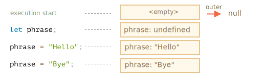
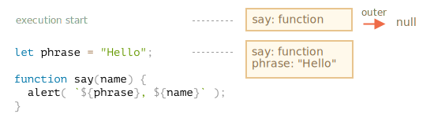
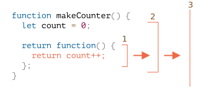
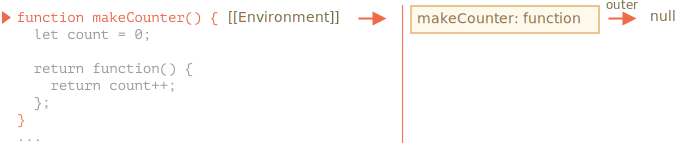
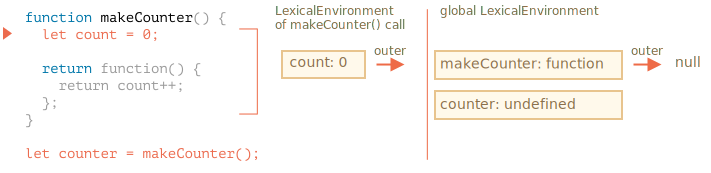
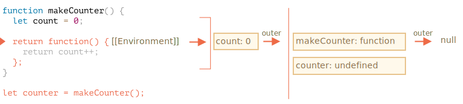
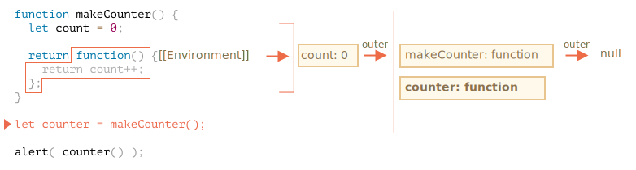
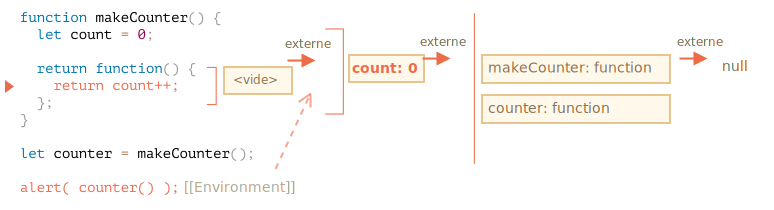
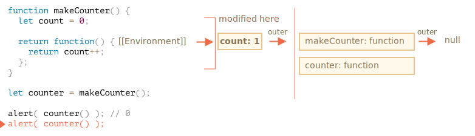
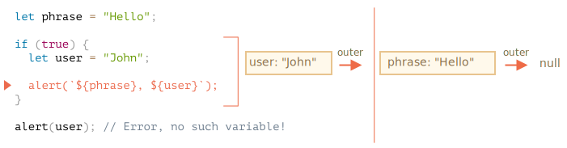

# Closure

JavaScript est un langage très fonctionnel. Cela nous donne beaucoup de liberté. Une fonction peut être créée dynamiquement, copiée dans une autre variable ou transmise en tant qu'argument à une autre fonction et appelée ultérieurement à partir d'un endroit totalement différent.

Nous savons qu'une fonction peut accéder aux variables en dehors de celle-ci, cette fonctionnalité est utilisée assez souvent.

Mais que se passe-t-il quand une variable externe change ? Une fonction obtient-elle la valeur la plus récente ou celle qui existait lors de la création de la fonction ?

De plus, que se passe-t-il lorsqu'une fonction se déplace à un autre endroit du code et est appelée à partir de là - a-t-elle accès aux variables externes du nouvel endroit ?

Les différents langages se comportent différemment ici, dans ce chapitre, nous traitons du comportement de JavaScript en particulier.

## Quelques questions

Examinons d’abord deux situations, puis étudions la mécanique interne pièce par pièce pour pouvoir répondre aux questions suivantes et à des questions plus complexes à venir.

1. La fonction `sayHi` utilise une variable externe `name`. Lorsque la fonction est exécutée, quelle valeur va-t-elle utiliser ?

    ```js
    let name = "John";

    function sayHi() {
      alert("Hi, " + name);
    }

    name = "Pete";

    *!*
    sayHi(); // qu'est-ce que ça va afficher : "John" ou "Pete" ?
    */!*
    ```

    De telles situations sont courantes dans les développements côté navigateur et côté serveur. Une fonction peut être planifiée pour s'exécuter plus tard que sa création, par exemple après une action de l'utilisateur ou une requête du réseau.

    Donc, la question est : est-ce que cela prend en compte les dernières modifications ?


2. La fonction `makeWorker` crée une autre fonction et la renvoie. Cette nouvelle fonction peut être appelée ailleurs. Aura-t-elle accès aux variables externes à partir de son lieu de création, ou du lieu d'invocation, ou des deux ?

    ```js
    function makeWorker() {
      let name = "Pete";

      return function() {
        alert(name);
      };
    }

    let name = "John";

    // create a function
    let work = makeWorker();

    // appel
    *!*
    work(); // qu'est-ce que ça va afficher ? "Pete" (nom où elle a été créé) ou "John" (nom où elle a été appelée) ?
    */!*
    ```


## Environnement Lexical

Pour comprendre ce qui se passe, voyons d’abord ce qu’est une "variable".

En JavaScript, chaque fonction en cours d'exécution, le bloc de code `{...}` et le script dans son ensemble ont un objet associé interne (masqué) appelé *Environnement Lexical*.

L'objet Environnement Lexical comprend deux parties :

1. *Environnement Record (Enregistrement d'Environnement)* -- un objet qui stocke toutes les variables locales en tant que propriétés (et d'autres informations telles que la valeur de `this`).
2. Une référence à *l'environnement lexical externe*, celui associé au code externe.

**Une "variable" est simplement une propriété de l'objet interne spécial `Environment Record`. "obtenir ou modifier une variable" signifie "obtenir ou modifier une propriété de cet objet".**

Par exemple, dans ce code simple, il n’existe qu’un seul Environnement Lexical :


Appelé aussi Environnement Lexical global, il est associé à l'ensemble du script.

Sur l'image ci-dessus, le rectangle correspond à l'enregistrement de l'environnement (magasin de variables) et la flèche à la référence externe. L'environnement lexical global n'a pas de référence externe, il pointe donc sur `null`.

Et c'est comme ça que ça change quand une variable est définie et assignée :



Les rectangles de droite nous montrent comment l'environnement lexical global change au cours de l'exécution :

1. Lorsque le script démarre, l'environnement lexical est vide.
2. La déclaration de `let phrase` apparaît. Aucune valeur n’a été affectée, donc `undefined` est stocké.
3. Une valeur est assignée à `phrase`.
4. `phrase` change de valeur.

Tout a l'air simple pour l'instant, non ?

Pour résumer :

- Une variable est une propriété d'un objet interne spécial, associée au bloc / fonction / script en cours d'exécution.
- Travailler avec des variables, c'est travailler avec les propriétés de cet objet.

### Fonction Declaration

Jusqu'à présent, nous n'avons observé que des variables. Maintenant, entrons dans les Fonctions Declaration.

**Contrairement aux variables `let`, elles sont entièrement initialisées non pas lorsque l'exécution les atteint, mais plus tôt, lorsqu'un environnement lexical est créé.**

Pour les fonctions de niveau supérieur, cela signifie le moment où le script est lancé.

C'est pourquoi nous pouvons appeler une fonction déclaration avant qu'elle ne soit définie.

Le code ci-dessous montre que l'environnement lexical n'est pas vide depuis le début. Il a `say`, parce que c'est une fonction déclaration. Et plus tard, il obtient `phrase`, déclaré avec` let` :




### Environnement lexical intérieur et extérieur

Voyons maintenant ce qu’il se passe quand une fonction accède à une variable externe.

Pendant l'appel, `say()` utilise la variable externe `phrase`, regardons les détails de ce qui se passe.

Lorsqu'une fonction est exécutée, un nouvel environnement lexical est créé automatiquement pour stocker les variables locales et les paramètres de l'appel.

Par exemple, pour `say("John")`, cela ressemble à ceci (l'exécution est à la ligne, marquée d'une flèche) :

<!--
    ```js
    let phrase = "Hello";

    function say(name) {
     alert( `${phrase}, ${name}` );
    }

    say("John"); // Hello, John
    ```-->


Ainsi, pendant l'appel de la fonction, nous avons deux environnements lexicaux : l'environnement interne (pour l'appel de fonction) et l'environnement externe (global) :

- L'environnement lexical interne correspond à l'exécution en cours de `say`.

    Il a une propriété unique: `name`, l'argument de la fonction. Nous avons appelé `say("John")`, donc la valeur de `name` est `John`.
- L'environnement lexical externe est l'environnement lexical global.

    Il a la variable `phrase` et la fonction elle-même.

L'environnement lexical interne a une référence à l'environnement "externe".

**Lorsque le code veut accéder à une variable -- l'environnement lexical interne est recherché en premier, puis l'environnement externe, puis l'environnement externe et ainsi de suite jusqu'à l'environnement global.**

Si une variable n’est trouvée nulle part, c’est une erreur en mode strict (sans `use strict`, une assignation à une variable inexistante, comme `user = "John"` crée une nouvelle variable globale `user`, c’est pour des soucis de compatibilité).

Voyons comment se déroule la recherche dans notre exemple :

- Lorsque le `alert` à l'intérieur de `say` veut accéder à `name`, il le trouve immédiatement dans l'environnement lexical de la fonction.
- Lorsqu'il souhaite accéder à `phrase`, il n'y a pas de `phrase` localement, il suit donc la référence à l'environnement lexical englobant et la trouve à cet emplacement.


Nous pouvons maintenant répondre à la première question du début de ce chapitre.

**Une fonction récupère les variables externes telles qu'elles sont maintenant, elle utilise les valeurs les plus récentes**

Les anciennes valeurs de variables ne sont enregistrées nulle part. Lorsqu'une fonction souhaite une variable, elle prend la valeur actuelle de son propre environnement lexical ou de l'environnement externe.

Donc, la réponse à la première question est `Pete` :

```js run
let name = "John";

function sayHi() {
  alert("Hi, " + name);
}

name = "Pete"; // (*)

*!*
sayHi(); // Pete
*/!*
```


Le flux d'exécution du code ci-dessus :

1. L’environnement lexical global a `name: "John"`.
2. A la ligne `(*)` la variable globale est changée, maintenant elle a `name: "Pete"`.
3. Lorsque la fonction `sayHi()` est exécutée elle prend `name` de l'extérieur. Ici, cela provient de l’environnement lexical global qui correspond à `"Pete"`.


```smart header="Un appel -- un environnement lexical"
Veuillez noter qu'un nouvel Environnement Lexical de fonction est créée à chaque exécution d'une fonction.

Et si une fonction est appelée plusieurs fois, chaque appel aura son propre environnement lexical, avec des variables locales et des paramètres spécifiques à cette exécution.
```

```smart header="L'environnement lexical est un objet de spécification"
"L'Environnement Lexical" est un objet de spécification : il n'existe que "théoriquement" dans le [language specification](https://tc39.es/ecma262/#sec-lexical-environments) pour décrire comment fonctionnent les choses. Nous ne pouvons pas obtenir cet objet dans notre code et le manipuler directement. Les moteurs JavaScript peuvent également l'optimiser, ignorer les variables non utilisées pour économiser de la mémoire et effectuer d'autres astuces internes, tant que le comportement visible reste tel que décrit.
```


## Fonctions imbriquées

Une fonction est appelée "imbriquée" lorsqu'elle est créée dans une autre fonction.

Il est facilement possible de faire cela avec JavaScript.

Nous pouvons l'utiliser pour organiser notre code, comme ceci :

```js
function sayHiBye(firstName, lastName) {

  // helper nested function to use below
  function getFullName() {
    return firstName + " " + lastName;
  }

  alert( "Hello, " + getFullName() );
  alert( "Bye, " + getFullName() );

}
```

Ici, la fonction *imbriquée* `getFullName()` est faite pour plus de commodité. Elle peut accéder aux variables externes et peut donc renvoyer le nom complet. Les fonctions imbriquées sont assez courantes dans JavaScript.

Plus intéressant encore, une fonction imbriquée peut être renvoyée : soit en tant que propriété d’un nouvel objet (si la fonction externe crée un objet avec des méthodes), soit en tant que résultat seul. Elle peut ensuite être utilisée ailleurs. Peu importe où, elle a toujours accès aux mêmes variables externes.

Par exemple, ici la fonction imbriquée est assignée au nouvel objet par le [constructeur de fonction](info:constructor-new):

```js run
// le constructeur de fonction retourne un nouvel objet
function User(name) {

  // la méthode de l'objet est créée en tant que fonction imbriquée
  this.sayHi = function() {
    alert(name);
  };
}

let user = new User("John");
user.sayHi(); // le code de la méthode "sayHi" a accès au "name" extérieur
```

Et ici, nous venons de créer et de renvoyer une fonction "counting" :

```js run
function makeCounter() {
  let count = 0;

  return function() {
    return count++; // a accès au "count" extérieur
  };
}

let counter = makeCounter();

alert( counter() ); // 0
alert( counter() ); // 1
alert( counter() ); // 2
```

Continuons avec l'exemple `makeCounter`. Il crée la fonction "count" qui renvoie le nombre suivant à chaque appel. Bien qu’elles soient simples, des variantes légèrement modifiées de ce code ont des utilisations pratiques, par exemple  en tant que [pseudorandom number generator](https://en.wikipedia.org/wiki/Pseudorandom_number_generator), et plus.

Comment fonctionne le compteur en interne ?

Lorsque la fonction interne est exécutée, la variable dans `count ++` est recherchée de l'intérieur. Pour l'exemple ci-dessus, l'ordre sera :



1. Les locaux de la fonction imbriquée …
2. Les variables de la fonction externe …
3. Et ainsi de suite jusqu'à atteindre les variables globales.

Dans cet exemple, `count` se trouve à l'étape `2`. Lorsqu'une variable externe est modifiée, elle est modifiée à l'endroit où elle est trouvée. Donc `count ++` trouve la variable externe et l'augmente dans l'environnement lexical auquel elle appartient. Comme si nous avions `let count = 1`.

Voici deux questions à considérer :

1. Pouvons-nous en quelque sorte réinitialiser le compteur `count` à partir du code qui n'appartient pas à `makeCounter` ? Par exemple. après les appels `alert` dans l'exemple ci-dessus.
2. Si nous appelons `makeCounter()` plusieurs fois, cela retourne de nombreuses fonctions `counter`. Sont-ils indépendants ou partagent-ils le même `count` ?

Essayez d'y répondre avant de continuer à lire.

...

Terminé ?

Ok, passons en revue les réponses.

1. Il n'y a aucun moyen : `count` est une variable de fonction locale, nous ne pouvons y accéder de l'extérieur.
2. Pour chaque appel à `makeCounter()`, un nouveau Environnement Lexical de fonction est créé, avec son propre `count`. Les fonctions `counter` résultantes sont donc indépendantes.

Voici la démo :

```js run
function makeCounter() {
  let count = 0;
  return function() {
    return count++;
  };
}

let counter1 = makeCounter();
let counter2 = makeCounter();

alert( counter1() ); // 0
alert( counter1() ); // 1

alert( counter2() ); // 0 (independent)
```


Espérons que la situation avec les variables externes est claire maintenant. Dans la plupart des situations, une telle compréhension suffit. Il y a peu de détails dans la spécification que nous avons omis par souci de brièveté. Donc, dans la section suivante, nous couvrirons plus de détails.

## Les environnements en détail

Voici ce qui se passe dans l'exemple `makeCounter` pas à pas, suivez-le pour vous assurer de comprendre comment cela fonctionne en détail.

Veuillez noter que la propriété additionnelle `[[Environment]]` est couverte ici. Nous ne l'avions pas mentionné avant pour la simplicité.

1. Lorsque le script vient de commencer, il n’existe qu’un environnement lexical global :

    

    A ce moment, il n'y a qu'une fonction `makeCounter`, car c'est une fonction déclaration. Elle n'a pas encore été exécutée.

    **Toutes les fonctions "à la naissance" reçoivent une propriété cachée `[[Environment]]` avec une référence à l'environnement lexical de leur création.**

    Nous n'en avons pas encore parlé, c'est ainsi que la fonction sait où elle a été créée.

    Ici, `makeCounter` est créé dans l'environnement lexical global, donc `[[Environment]]` en garde une référence.

    En d'autres termes, une fonction est "imprimée" avec une référence à l'environnement lexical où elle est née. Et `[[Environment]]` est la propriété cachée de la fonction qui a cette référence.

2. Le code s'exécute, la nouvelle variable globale `counter` est déclarée et obtient le résultat de l'appel de `makeCounter() `. Voici un instantané du moment où l'exécution est sur la première ligne de `makeCounter()` :

    

    Au moment de l'appel de `makeCounter()`, l'environnement lexical est créé pour contenir ses variables et ses arguments.

    Comme tous les environnements lexicaux, il stocke deux choses :
    1. Un enregistrement d'environnement avec des variables locales. Dans notre cas, `count` est la seule variable locale (qui apparaît lorsque la ligne avec `let count` est exécutée).

    2. La référence lexicale externe, qui est définie sur la valeur de `[[Environment]]` de la fonction. Ici `[[Environnement]]` de `makeCounter` fait référence à l'environnement lexical global.

    Nous avons donc maintenant deux environnements lexicaux: le premier est global, le second est pour l’appel `makeCounter` actuel, avec la référence externe à global.

3. Lors de l'exécution de `makeCounter()`, une petite fonction imbriquée est créée.

    Peu importe que la fonction soit créée à l'aide de la fonction déclaration ou de la fonction expression. Toutes les fonctions obtiennent la propriété `[[Environment]]` qui fait référence à l'environnement lexical dans lequel elles ont été créées. Donc, notre nouvelle fonction imbriquée l'obtient également.

    Pour notre nouvelle fonction imbriquée, la valeur de `[[Environment]]` est l'environnement lexical actuel de `makeCounter()` (où elle est née) :

    

    Veuillez noter qu'à cette étape, la fonction interne a été créée, mais pas encore appelée. Le code à l'intérieur de `function() { return count ++; }` n'est pas en cours d'exécution.

4. Au fur et à mesure de l'exécution, l'appel à `makeCounter()` se termine et le résultat (la fonction imbriquée minuscule) est affecté à la variable globale `counter` :

    

    Cette fonction n'a qu'une seule ligne: `return count++`, qui sera exécutée lors de son exécution.

5. Lorsque `counter()` est appelé, un nouvel environnement lexical est créé pour l'appel. Il est vide, parce que `counter` n'a pas de variable locale par lui-même. Mais le `[[Environnement]]` de `counter` est utilisé comme référence `externe` pour lui, ce qui donne accès aux variables de l'ancien appel `makeCounter()` où il a été créé :

    

<<<<<<< HEAD
    Désormais, lorsque l'appel recherche la variable `count`, il commence par rechercher son propre environnement lexical (vide), puis l'environnement lexical de l'appel` makeCounter() `extérieur, où il le trouve.
=======
    Now when the call looks for `count` variable, it first searches its own Lexical Environment (empty), then the Lexical Environment of the outer `makeCounter()` call, where it finds it.
>>>>>>> a0bfa924a17cad8e7fee213904b27dbf57c2dbac

    Veuillez noter comment fonctionne la gestion de la mémoire ici. Bien que l'appel de `makeCounter()` se soit terminé quelques temps auparavant, son environnement lexical a été conservé en mémoire, car il existe une fonction imbriquée avec `[[Environment]]` le référençant.

    Généralement, un objet Environnement Lexical existe tant qu'il existe une fonction qui peut l'utiliser. Il est effacé uniquement lorsqu'il n'y en a plus.

    L'appel à `counter()` renvoie non seulement la valeur de `count`, mais l'augmente également. Notez que la modification est faite "en place". La valeur de `count` est modifiée exactement dans l'environnement où elle a été trouvée.

    

7. Les prochains appels de `counter()` font de même.

La réponse à la deuxième question du début du chapitre devrait maintenant être évidente.

La fonction `work()` dans le code ci-dessous obtient `name` à partir de l'emplacement de son origine via la référence d'environnement lexical externe :


Donc, le résultat est `"Pete"` ici.

Mais s'il n'y avait pas de `let name` dans `makeWorker() `, alors la recherche irait à l'extérieur et prendrait la variable globale comme nous pouvons le voir à partir de la chaîne ci-dessus. Dans ce cas, ce serait `"John"`.

```smart header="Closures"
Il existe un terme général de programmation "closure", que les développeurs devraient généralement connaître.

Une [closure](https://fr.wikipedia.org/wiki/Fermeture_(informatique)) est une fonction qui mémorise ses variables externes et peut y accéder. Dans certains langages, ce n'est pas possible ou une fonction doit être écrite de manière spéciale pour que cela se produise. Mais comme expliqué ci-dessus, en JavaScript, toutes les fonctions sont naturellement des fermetures (il n’existe qu’une seule exclusion, à couvrir dans le chapitre <info:new-function>).

Autrement dit, elles se souviennent automatiquement de l'endroit où elles ont été créées à l'aide d'une propriété `[[Environment]]` masquée, et toutes peuvent accéder aux variables externes.

Lors d’un entretien d'embauche, les développeurs front-end reçoivent souvent une question du genre "qu’est-ce qu’une closure ?", une réponse valable serait une définition de la closure et une explication selon laquelle toutes les fonctions en JavaScript sont des closures, et peut-être quelques mots supplémentaires sur les détails techniques : Propriété `[[Environment]]` et comment fonctionnent les environnements lexicaux.
```

## Blocs de code et boucles, IIFE

Les exemples ci-dessus se sont concentrés sur les fonctions. Mais un environnement lexical existe pour tout bloc de code `{...}`.

Un environnement lexical est créé lors de l’exécution d’un bloc de code et contient des variables locales au bloc. Voici quelques exemples.

### If

Dans l'exemple ci-dessous, la variable `user` n'existe que dans le bloc` if` :

<!--
    ```js run
    let phrase = "Hello";

    if (true) {
        let user = "John";

        alert(`${phrase}, ${user}`); // Hello, John
    }

    alert(user); // Error, ne peut pas voir une telle variable !
    ```
  -->



Lorsque l'exécution entre dans le bloc `if`, le nouvel environnement lexical "if-only" est créé.

Il a la référence à la partie externe, donc `phrase` peut être trouvée. Mais toutes les variables et fonctions expressions, déclarées à l'intérieur de `if`, résident dans cet environnement lexical et ne peuvent pas être vues de l'extérieur.

Par exemple, après la fin de `if`, l'`alert` ci-dessous ne verra pas `user`, d'où l'erreur.

### For, while

Pour une boucle, chaque itération a un environnement lexical séparé. Si une variable est déclarée dans `for(let ...)`, alors c'est aussi dedans :

```js run
for (let i = 0; i < 10; i++) {
  // Chaque boucle a son propre environnement lexical
  // {i: value}
}

alert(i); // Error, no such variable
```

Veuillez noter que `let i` est visuellement en dehors de `{...}`. La construction `for` est spéciale ici : chaque itération de la boucle a son propre environnement lexical contenant le `i` actuel.

De la même manière que `if`, après la boucle, `i` n'est pas visible.

### Blocs de code

Nous pouvons également utiliser un bloc de code "nu" `{…}` pour isoler des variables dans une "portée locale".

Par exemple, dans un navigateur Web, tous les scripts (sauf avec `type="module"`) partagent la même zone globale. Donc, si nous créons une variable globale dans un script, elle devient disponible pour les autres. Mais cela devient une source de conflits si deux scripts utilisent le même nom de variable et s’écrasent.

Cela peut arriver si le nom de la variable est un mot répandu et que les auteurs de script ne se connaissent pas.

Si nous voulons éviter cela, nous pouvons utiliser un bloc de code pour isoler tout ou partie du script :

```js run
{
  // travailer avec des variables locales qui ne doivent pas être vues à l'extérieur

  let message = "Hello";

  alert(message); // Hello
}

alert(message); // Error: message is not defined
```

Le code en dehors du bloc (ou à l'intérieur d'un autre script) ne voit pas les variables à l'intérieur du bloc, car le bloc a son propre environnement lexical.

### IIFE

Dans le passé, il n’existait pas d’environnement lexical au niveau des blocs en JavaScript.

Les programmeurs ont donc dû inventer quelque chose. Et ce qu'ils ont fait s'appelle "immediately-invoked function expressions" (fonction expression immédiatement invoquées, en abrégé IIFE).

Ce n'est pas une chose que nous devrions utiliser de nos jours, mais vous pouvez les trouver dans d'anciens scripts, il est donc préférable de les comprendre.

IIFE ressemble à ceci :

```js run
(function() {

  let message = "Hello";

  alert(message); // Hello

})();
```

Ici, une fonction expression est créée et appelée immédiatement. Donc, le code s'exécute tout de suite et a ses propres variables privées.

La fonction expression est entourée de parenthèses `(function {...})`, parce que lorsque JavaScript rencontre `"function"` dans le flux de code principal, il est compris comme le début d'une fonction déclaration. Mais une fonction déclaration doit avoir un nom, donc ce type de code donnera une erreur :

```js run
// Essayons de déclarer et d'appeler immédiatement une fonction
function() { // <-- Error: Unexpected token (

  let message = "Hello";

  alert(message); // Hello

}();
```

Même si nous disons : "d'accord, ajoutons un nom", cela ne fonctionnera pas, car JavaScript ne permet pas d'appeler immédiatement les fonctions déclarations :

```js run
// erreur de syntaxe à cause des parenthèses ci-dessous
function go() {

}(); // <-- ne peut pas appeler la déclaration de fonction immédiatement
```

Ainsi, les parenthèses autour de la fonction sont une astuce pour montrer à JavaScript que la fonction est créée dans le contexte d’une autre expression et qu’il s’agit donc d’une fonction expression, elle n’a pas besoin de nom et peut être appelée immédiatement.

Il existe d'autres moyens que les parenthèses pour indiquer à JavaScript qu'il s'agit d'une fonction expression :

```js run
// Façons de créer des IIFE

(function() {
  alert("Parentheses around the function");
}*!*)*/!*();

(function() {
  alert("Parentheses around the whole thing");
}()*!*)*/!*;

*!*!*/!*function() {
  alert("Bitwise NOT operator starts the expression");
}();

*!*+*/!*function() {
  alert("Unary plus starts the expression");
}();
```

Dans tous les cas ci-dessus, nous déclarons une fonction expression et l'exécutons immédiatement. Notons encore : de nos jours, il n'y a aucune raison d'écrire un tel code.

## Garbage collection

Généralement, un environnement lexical est nettoyé et supprimé après l'exécution de la fonction. Par exemple :

```js
function f() {
  let value1 = 123;
  let value2 = 456;
}

f();
```

Ici, deux valeurs sont techniquement les propriétés de l'environnement lexical. Mais après la fin de `f()`, l'environnement lexical devient inaccessible, il est donc supprimé de la mémoire.

... Mais s'il y a une fonction imbriquée qui est toujours accessible après la fin de `f`, alors elle a la propriété `[[Environment]]` qui fait référence à l'environnement lexical externe, elle est donc aussi accessible et vivante :

```js
function f() {
  let value = 123;

  function g() { alert(value); }

*!*
  return g;
*/!*
}

let g = f(); // g est accessible et garde en mémoire l'environnement lexical externe
```

Veuillez noter que si `f()` est appelé plusieurs fois et que les fonctions résultantes sont sauvegardées, tous les objets d'environnement lexicaux correspondants seront également conservés en mémoire. Tous les 3 dans le code ci-dessous :

```js
function f() {
  let value = Math.random();

  return function() { alert(value); };
}

// 3 fonctions dans un tableau, chacune d'entre elles étant liée à l'environnement lexical
// à partir de l'exécution de f() correspondante
let arr = [f(), f(), f()];
```

Un objet Environnement lexical meurt lorsqu'il devient inaccessible (comme tout autre objet). En d'autres termes, il n'existe que s'il existe au moins une fonction imbriquée qui le référence.

Dans le code ci-dessous, lorsque `g` devient inaccessible, l'environnement lexical englobant (et par conséquent `value`) est nettoyé de la mémoire.

```js
function f() {
  let value = 123;

  function g() { alert(value); }

  return g;
}

let g = f(); // while g is alive
// leur environnement lexical correspondant vit

g = null; // ... et maintenant la mémoire est nettoyée
```

### Optimisations réelles

Comme nous l'avons vu, en théorie, lorsqu'une fonction est vivante, toutes les variables externes sont également conservées.

Mais dans la pratique, les moteurs JavaScript tentent d'optimiser cela. Ils analysent l'utilisation des variables et s'il est évident d'après le code qu'une variable externe n'est pas utilisée -- elle est supprimée.

**Un effet secondaire important de V8 (Chrome, Opera) est qu’une telle variable ne sera plus disponible lors du débogage.**

Essayez d'exécuter l'exemple ci-dessous sous Chrome avec les outils de développement ouverts.

Quand il se met en pause, dans la console, tapez `alert(value)`.

```js run
function f() {
  let value = Math.random();

  function g() {
    debugger; // dans la console : tapez alert(value); No such variable!
  }

  return g;
}

let g = f();
g();
```

Comme vous avez pu le constater, cette variable n'existe pas! En théorie, elle devrait être accessible, mais le moteur l'a optimisé.

Cela peut conduire à des problèmes de débogage amusants (voire fastidieux). L'un d'eux -- nous pouvons voir une variable externe portant le même nom au lieu de celle attendue :

```js run global
let value = "Surprise!";

function f() {
  let value = "the closest value";

  function g() {
    debugger; // dans la console : tapez alert(value); Surprise!
  }

  return g;
}

let g = f();
g();
```

```warn header="À plus!"
Cette fonctionnalité de V8 est bonne à savoir. Si vous déboguez avec Chrome/Opera, vous le rencontrerez tôt ou tard.

Ce n'est pas un bug dans le débogueur, mais plutôt une fonctionnalité spéciale de V8. Peut-être que cela changera un jour.
Vous pouvez toujours le vérifier en exécutant les exemples de cette page.
```
