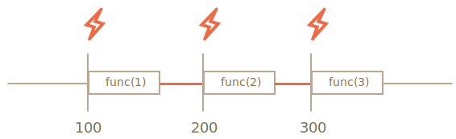
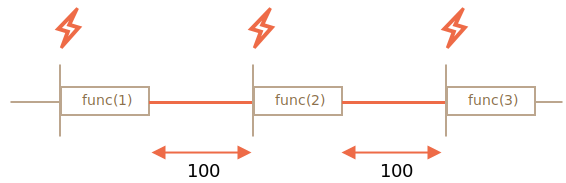

# L'ordonnancement avec setTimeout et setInterval

Peut-être que nous ne voulons pas exécuter une fonction tout de suite, mais à un certain moment dans le futur. Cela s'appelle "ordonnancer (ou planifier) un appel de fonction".

Il existe deux méthodes pour cela :
- `setTimeout` permet d'exécuter une fonction une unique fois après un certain laps de temps.
- `setInterval` nous permet d'exécuter une fonction de manière répétée, en commençant après l'intervalle de temps, puis en répétant continuellement à cet intervalle.

Ces méthodes ne font pas partie de la spécification JavaScript. Mais la plupart des environnements ont un planificateur interne et fournissent ces méthodes. En particulier, elles sont supportées par tous les navigateurs et Node.js.

## setTimeout

La syntaxe:

```js
let timerId = setTimeout(func|code, [delay], [arg1], [arg2], ...)
```

Les paramètres:

`func|code`
: Fonction ou chaîne de caractères représentant du code à exécuter.
En général, c'est une fonction. Pour des raisons historiques, une chaîne de caractères représentant du code peut être donnée en argument, mais ce n'est pas recommandé.

`delay`
: La durée d'attente avant l'exécution, en millisecondes (1000ms = 1 seconde), par défaut 0.

`arg1`, `arg2`...
: Arguments à passer à la fonction (incompatible avec IE9-).

Par exemple, le code ci-dessous appelle la fonction `sayHi()` une unique fois au bout de 1 seconde :

```js run
function sayHi() {
  alert('Hello');
}

*!*
setTimeout(sayHi, 1000);
*/!*
```

Dans le cas où fonction `sayHi()` requiert des arguments :

```js run
function sayHi(phrase, who) {
  alert( phrase + ', ' + who );
}

*!*
setTimeout(sayHi, 1000, "Bonjour", "Jean"); // Bonjour, Jean
*/!*
```

Si le premier argument est une chaîne de caractères, JavaScript crée alors une fonction à partir de celle-ci.

Ce qui fait que le code ci-dessous fonctionne aussi :

```js run no-beautify
setTimeout("alert('Bonjour')", 1000);
```

Cependant, utiliser des chaînes de caractères n'est pas recommandé, il est préférable d'utiliser des fonctions fléchées à la place, comme ceci :

```js run no-beautify
setTimeout(() => alert('Bonjour'), 1000);
```

````smart header="Passer une fonction, mais sans l'exécuter"
Les développeurs novices font parfois l'erreur d'ajouter des parenthèses `()` après la fonction :

```js
// Faux!
setTimeout(sayHi(), 1000);
```
Cela ne fonctionne pas car `setTimeout` attend une référence à une fonciton. Ici `sayHi()` appelle la fonction et le *résultat de cette exécution* est passé à `setTimeout`. Dans notre cas, le résultat de `sayHi()` est `undefined` (la fonction ne renvoie rien), du coup, rien n'est planifié.
````

### Annuler une tâche avec clearTimeout

Un appel à `setTimeout` renvoie un "identifiant de timer" `timerId` que l'on peut utiliser pour annuler l'exécution de la fonction.

La syntaxe pour annuler une tâche planifiée est la suivante :

```js
let timerId = setTimeout(...);
clearTimeout(timerId);
```

Dans le code ci-dessous, nous planifions l'appel à la fonction avant de l'annuler, au final rien ne s'est passé :

```js run no-beautify
let timerId = setTimeout(() => alert("Je n'arriverai jamais"), 1000);
alert(timerId); // Identifiant du timer

clearTimeout(timerId);
alert(timerId); // Le même identifiant (ne devient pas null après l'annulation)
```

Comme on peut le voir dans les résultats des `alert`, dans notre navigateur, l'identifiant du timer est un nombre. Selon l'environnement, il peut être d'un autre type. Par exemple, Node.js renvoie un objet timer équipé d'autres méthodes.

Encore une fois, il n'y a pas de spécification universelle pour ces méthodes, donc ce n'est pas gênant.

Dans le cas des navigateurs web, les timers sont décrits dans [la section sur les timers](https://www.w3.org/TR/html5/webappapis.html#timers) de la documentation du standard HTML5.

## setInterval

La méthode `setInterval` a la même syntaxe que `setTimeout`:

```js
let timerId = setInterval(func|code, [delay], [arg1], [arg2], ...)
```

Tous ses arguments ont la même signfication que précédemment, mais contrairement à `setTimeout`, `setInterval` appelle la fonction non pas une fois, mais périodiquement après un interval de temps donné.

Afin d'annuler les appels futurs à la fonction, il est nécessaire d'appeler `clearInterval(timerId)`.

L'exemple suivant affiche le message toutes les 2 secondes, puis arrête la tâche au bout de 5 secondes :

```js run
// Se répète toutes les 2 secondes
let timerId = setInterval(() => alert('tick'), 2000);

// S'arrête après 5 secondes
setTimeout(() => { clearInterval(timerId); alert('stop'); }, 5000);
```

```smart header="Le temps continue de s'écouler pendant que `alert` est affiché"
Dans la majorité des navigateurs, dont Chrome et Firefox, le timer interne continue à s'incrémenter pendant qu'un message est affiché (via `alert`, `confirm` ou `prompt`).

Donc, si vous exécutez le code ci-dessus et que vous ne fermez pas la fenêtre `alert` pendant un certain temps, la prochaine `alert` sera affichée immédiatement lorsque vous le faites. L'intervalle réel entre les alertes sera inférieur à 2 secondes.
```

## setTimeout imbriqué

Il y a deux façon d'ordonnancer l'exécution périodique d'une tâche.

L'un est `setInterval`. L'autre est un `setTimeout` imbriqué, comme ceci :

```js
/** Au lieu de :
let timerId = setInterval(() => alert('tick'), 2000);
*/

let timerId = setTimeout(function tick() {
  alert('tick');
*!*
  timerId = setTimeout(tick, 2000); // (*)
*/!*
}, 2000);
```

Le `setTimeout` ci-dessus planifie le prochain appel de la fonction à la fin de l'appel en cours `(*)`.

Le `setTimeout` imbriqué est une méthode plus flexible que `setInterval`. Ainsi, le prochain appel peut être programmé différemment, en fonction des résultats de l'appel en cours.

Par exemple, on peut avoir besoin d'implémenter un service qui envoie une requête à un serveur toutes les 5 secondes pour récupérer de la donnée, mais dans le cas où le serveur est surchargé, on doit augmenter le délai à 10 secondes, puis 20 secondes, 40 secondes...

Voici le pseudo-code correspondant :
```js
let delay = 5000;

let timerId = setTimeout(function request() {
  ...send request...

  if (request failed due to server overload) {
    // Augmente l'intervalle avant le prochain appel
    delay *= 2;
  }

  timerId = setTimeout(request, delay);

}, delay);
```

Ou par exemple, si les fonction qu'on souhaite planifier demandent beaucoup de ressources CPU, on peut alors mesurer leur temps d'exécution et planifier le prochain appel en fonction.

Et si les fonctions que nous planifions sont gourmandes en ressources processeur, nous pouvons mesurer le temps pris par l'exécution et planifier le prochain appel tôt ou tard.

**Un `setTimeout` imbriqué permet de définir le délai entre les exécutions plus précisément que `setInterval`.**

Comparons deux blocs de codes, le premier utilise `setInterval` :

```js
let i = 1;
setInterval(function() {
  func(i++);
}, 100);
```

Le second utilise un `setTimeout` imbriqué :

```js
let i = 1;
setTimeout(function run() {
  func(i++);
  setTimeout(run, 100);
}, 100);
```

Dans le cas du `setInterval` l'ordonnanceur interne va appeler `func(i++)` toutes les 100ms :



Rien d'étrange ?

**Le vrai délai entre deux appels à `func` est plus court que dans le code.**

C'est normal car le temps d'exécution de `func` "consomme" une partie de ce délai.

Il est donc possible que le temps d'exécution de `func` soit plus long que prévu et prenne plus de 100ms.

Dans ce cas le moteur interne attend que l'exécution de `func` soit terminée, puis consulte l'ordonnanceur et si le délai est déjà "consommé", il réexécute la fonction *immédiatement*.

Dans ce cas extrême, si la fonction qui s'exécute met toujours plus de temps que `delay` ms, alors les appels successifs vont s'effectuer sans aucun temps de pause.

Et voici l'image pour le `setTimeout` imbriqué :



**Le `setTimeout` imbriqué garantit le délai fixé (ici 100 ms).**

Dans ce cas, c'est parce que le nouvel appel est planifié à la fin du précédent.

````smart header="Le ramasse-miettes et le callback setInterval/setTimeout"
Quand une fonction est passée à `setInterval`/`setTimeout`, une référence interne à cette fonction est créée et conservée dans l'ordonnanceur. Cela empêche que la fonction soit détruite par le ramasse-miettes, même si il n'y a pas d'autres références à cette dernière.

```js
// La fonction reste en mémoire jusqu'à ce que l'ordonnanceur l'exécute
setTimeout(function() {...}, 100);
```

Pour `setInterval`, la fonction reste en mémoire jusqu'à ce qu'on appelle `clearInterval`.

<<<<<<< HEAD
Mais il y a un effet de bord, une fonction référence l'environement lexical extérieur, donc tant qu'elle existe, les variables extérieures existent aussi. Ces variables peuvent occuper autant d'espace mémoire que la fonction elle-même. De ce fait quand on n'a plus besoin d'une fonction planifiée, il est préférable de l'annuler, même si elle est courte.
=======
There's a side effect. A function references the outer lexical environment, so, while it lives, outer variables live too. They may take much more memory than the function itself. So when we don't need the scheduled function anymore, it's better to cancel it, even if it's very small.
>>>>>>> 206485fc3a5465f961608b6e7303fae2e1a0e0b5
````

## setTimeout sans délai

Il y a un cas d'usage particulier : `setTimeout(func, 0)` ou plus simplement `setTimeout(func)`.

Ceci programme l'exécution de `func` dès que possible. Mais le planificateur ne l'invoquera qu'une fois le script en cours d'exécution terminé.

La fonction est donc programmée pour s'exécuter "juste après" le script en cours.

Par exemple, le code ci dessous affiche "Hello", et immédiatement après, "World" :

```js run
setTimeout(() => alert("World"));

alert("Hello");
```

La première ligne "met l'appel dans le calendrier après 0 ms". Mais le planificateur "vérifiera le calendrier" uniquement une fois le script en cours terminé. `"Hello"` est donc le premier, et `"World"` -- après.

Il y a aussi d'autres cas d'usage avancés d'ordonnancement à délai nul, spécifique au cas des navigateurs web, dont nous parlerons dans le chapitre <info:event-loop>.

````smart header="Un délai nul n'est pas vraiment nul (pour un navigateur)"
Il y a une limitation intrinsèque à chaque navigateur sur la fréquence à laquelle des timers consécutifs peuvent s'exécuter. Le [standard HTML5](https://html.spec.whatwg.org/multipage/timers-and-user-prompts.html#timers) indique : "au delà de 5 timers consécutifs, l'interval est obligatoirement d'au moins 4 millisecondes.".

Nous allons illustrer ce que cela veut dire dans l'exemple ci-dessous. L'appel à `setTimeout` s'y ré-ordonnance lui-même avec un délai nul. Chaque appel se souvient de l'heure de l'appel précédent grâce au tableau `times`. Cela va nous permettre de mesurer les délais réels entre les exécutions :

```js run
let start = Date.now();
let times = [];

setTimeout(function run() {
  times.push(Date.now() - start); // on garde en mémoire le délai depuis l'appel précédent

  if (start + 100 < Date.now()) alert(times); // on affiche les délais si plus de 100ms se sont écoulées
  else setTimeout(run); // sinon on planifie un nouvel appel
});

// voici un exemple de résultat :
// 1,1,1,1,9,15,20,24,30,35,40,45,50,55,59,64,70,75,80,85,90,95,100
```

Les 4 premiers timers s'exécutent immédiatemment (comme indiqué dans la spécification), ensuite on peut voir `9, 15, 20, 24...`. Le délai minimum de 4ms entre appel entre alors en jeu.

Cette même limitation s'applique si on utilise `setInterval` au lieu de `setTimeout` : `setInterfal(f)` appelle `f` un certain nombre de fois avec un délai nul avant d'observer un délai d'au moins 4ms.

Cette limitation est l'héritage d'un lointain passé et beaucoup de scripts se basent dessus, d'où la nécessité de cette limitation pour des raisons historiques.

Pour le JavaScript côté serveur, cette limitation n'existe pas, et il existe d'autres façon de planifier immédiatement des tâches asynchrones, notamment [setImmediate](https://nodejs.org/api/timers.html) pour Node.js. Il faut donc garder à l'esprit que ce nota bene est spécifique aux navigateurs web.
````

## Résumé

- Les méthodes `setInterval(func, delay, ...args)` et `setTimeout(func, delay, ...args)` permettent d'exécuter `func` respectivement une seul fois/périodiquement après `delay` millisecondes.
- Pour annuler l'exécution, nous devons appeler `clearInterval/clearTimeout` avec la valeur renvoyée par `setInterval/setTimeout`.
- Les appels de `setTimeout` imbriqués sont une alternative plus flexible à `setInterval`, ils permettent de configurer le temps *entre* les exécution plus précisément.
- L'ordonnancement à délai nul avec `setTimeout(func, 0)` (le même que `setTimeout(func)`) permet de planifier l'exécution "dès que possible, mais seulement une fois que le bloc de code courant a été exécuté".
- Le navigateur limite le délai minimal pour cinq appels imbriqués ou plus de `setTimeout` ou pour` setInterval` (après le 5ème appel) à 4 ms. C'est pour des raisons historiques.

Veuillez noter que toutes les méthodes de planification ne garantissent pas le délai exact.

Par exemple, le timer interne au navigateur peut être ralenti pour de nombreuses raisons :
- Le CPU est surchargé.
- L'onglet du navigateur est en tâche de fond.
- L'ordinateur est en mode économie d'énergie.

Tout ceci peut augmenter la résolution de l'horloge (le délai minimum) jusqu'à 300ms voire 1000ms en fonction du navigateur et des paramètres de performance au niveau du système d'exploitation.
