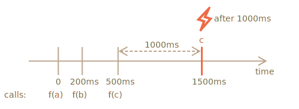

importance: 5

---

# Décorateur debounce

Le résultat du décorateur `debounce(f, ms)` est un wrapper qui suspend les appels à `f` jusqu'à ce qu'il y ait `ms` millisecondes d'inactivité (pas d'appels, "période de cooldown"), puis invoque `f` une fois avec les derniers arguments.

En d'autres termes, `debounce` est comme une secrétaire qui accepte les "appels téléphoniques", et attend jusqu'à ce qu'il y ait des millisecondes de silence. Et alors seulement, elle transfère les dernières informations d'appel au "boss" (appellez le "f" réel).

Par exemple, nous avons eu une fonction `f` et l'avons remplacée par `f = debounce(f, 1000)`.

Ensuite, si la fonction encapsulée est appelée à 0ms, 200ms et 500ms, et qu'il n'y a aucun appel, alors le `f` actuel ne sera appelé qu'une seule fois, à 1500 ms. Autrement dit: après la période de temps de recharge de 1000 ms à partir du dernier appel.



... Et il récupérera les arguments du tout dernier appel, les autres appels sont ignorés.

Voici le code pour cela (utilise le décorateur debounce de la [librairie Lodash](https://lodash.com/docs/4.17.15#debounce)):

```js
let f = _.debounce(alert, 1000);

f("a");
setTimeout( () => f("b"), 200);
<<<<<<< HEAD
setTimeout( () => f("c"), 500); 
// la fonction debounce attend 1000ms après le dernier appel puis exécute : alert("c")
=======
setTimeout( () => f("c"), 500);
// debounced function waits 1000ms after the last call and then runs: alert("c")
>>>>>>> 13da056653754765b50aa5a9f706f84a4a0d6293
```


Maintenant, un exemple pratique. Disons que l'utilisateur tape quelque chose et que nous aimerions envoyer une requête au serveur lorsque l'entrée est terminée.

Il ne sert à rien d'envoyer la requête pour chaque caractère saisi. Au lieu de cela, nous aimerions attendre, puis traiter l'ensemble du résultat.

Dans un navigateur Web, nous pouvons configurer un gestionnaire d'événements - une fonction qui est appelée à chaque modification d'un champ de saisie. Normalement, un gestionnaire d'événements est appelé très souvent, pour chaque touche tapée. Mais si on le `debounce` de 1000ms, il ne sera appelé qu'une seule fois, après 1000ms après la dernière entrée.

```online

Dans cet exemple en live, le gestionnaire place le résultat dans une case ci-dessous, essayez-le :

[iframe border=1 src="debounce" height=200]

Vous voyez ? La deuxième entrée appelle la fonction "debounced", donc son contenu est traité après 1000ms à partir de la dernière entrée.
```

Donc, `debounce` est un excellent moyen de traiter une séquence d'événements: que ce soit une séquence de touches, de mouvements de souris ou autre.


Il attend le temps donné après le dernier appel, puis exécute sa fonction, qui peut traiter le résultat.

La tâche est d'implémenter le décorateur `debounce`.

Indice : ce ne sont que quelques lignes si vous y réfléchissez :)
