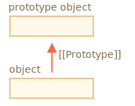
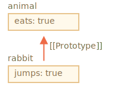
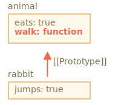
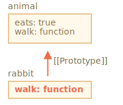
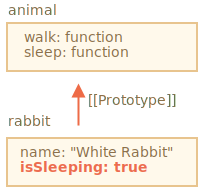

# Héritage prototypal

En programmation, nous voulons souvent prendre quelque chose et l’étendre.

Par exemple, nous avons un objet `user` avec ses propriétés et méthodes et souhaitons en faire des variantes `admin` et `guest` légèrement modifiées. Nous aimerions réutiliser ce que nous avons dans `user`, et non pas copier/réimplémenter ses méthodes, mais simplement créer un nouvel objet par-dessus.

*L'héritage prototypal* est une fonctionnalité de langage qui aide à cela.

## [[Prototype]]

En JavaScript, les objets ont une propriété cachée spéciale `[[Prototype]]` (comme indiqué dans la spécification), qui est soit `null` ou fait référence à un autre objet. Cet objet s'appelle "un prototype" :



Lorsque nous lisons une propriété depuis `object`, et qu'elle est manquante, JavaScript la prend automatiquement du prototype. En programmation, une telle chose est appelée "héritage prototypal". Et bientôt, nous étudierons de nombreux exemples d'un tel héritage, ainsi que des fonctionnalités de langage plus cool qui en découlent.

La propriété `[[Prototype]]` est interne et cachée, mais il y a plusieurs façons de la définir.

L'un d'eux est d'utiliser le nom spécial `__proto__`, comme ceci :

```js run
let animal = {
  eats: true
};
let rabbit = {
  jumps: true
};

*!*
rabbit.__proto__ = animal; // sets rabbit.[[Prototype]] = animal
*/!*
```

Si nous recherchons une propriété dans `rabbit`, et qu'elle en manque, JavaScript la prend automatiquement à partir de `animal`.

Par exemple:

```js
let animal = {
  eats: true
};
let rabbit = {
  jumps: true
};

*!*
rabbit.__proto__ = animal; // (*)
*/!*

// nous pouvons maintenant trouver les deux propriétés dans rabbit:
*!*
alert( rabbit.eats ); // true (**)
*/!*
alert( rabbit.jumps ); // true
```

Ici, la ligne `(*)` définit `animal` pour être un prototype de` lapin`.

Ensuite, lorsque `alert` essaie de lire la propriété `rabbit.eats` `(**)`, ce n'est pas dans `rabbit`, donc JavaScript suit la référence `[[Prototype]]` et la trouve dans `animal` (regarde de bas en haut) :



Ici, nous pouvons dire que "`animal` est le prototype de `rabbit`" ou que "`rabit` hérite de manière prototypal de `animal`".

Donc, si `animal` a beaucoup de propriétés et de méthodes utiles, elles deviennent automatiquement disponibles dans `rabbit`. De telles propriétés sont appelées "héritées".

Si nous avons une méthode dans `animal`, elle peut être appelée sur `rabbit` :

```js run
let animal = {
  eats: true,
*!*
  walk() {
    alert("Animal walk");
  }
*/!*
};

let rabbit = {
  jumps: true,
  __proto__: animal
};

// walk est prise à partir du prototype
*!*
rabbit.walk(); // Animal walk
*/!*
```

La méthode est automatiquement prise à partir du prototype, comme ceci :



La chaîne de prototypes peut être plus longue :

```js run
let animal = {
  eats: true,
  walk() {
    alert("Animal walk");
  }
};

let rabbit = {
  jumps: true,
*!*
  __proto__: animal
*/!*
};

let longEar = {
  earLength: 10,
*!*
  __proto__: rabbit
*/!*
};

// walk est prise à partir de la chaîne de prototype
longEar.walk(); // Animal walk
alert(longEar.jumps); // true (de rabbit)
```


Maintenant, si nous lisons quelque chose de `longEar`, et qu'il est manquant, JavaScript le recherchera dans `rabbit`, puis dans `animal`.

Il n'y a que deux limitations :

1. Les références ne peuvent pas tourner en rond. JavaScript va générer une erreur si nous essayons d'assigner `__proto__` dans un cercle.
2. La valeur de `__proto__` peut être un objet ou `null`. Les autres types sont ignorés.

Cela peut aussi être évident, mais quand même: il ne peut y avoir qu'un seul `[[Prototype]]`. Un objet ne peut pas hériter de deux autres.

<<<<<<< HEAD

```smart header="`__proto__` est un getter/setter historique pour [[Prototype]]`"
C'est une erreur courante des développeurs novices de ne pas connaître la différence entre les deux.
=======
```smart header="`__proto__` is a historical getter/setter for `[[Prototype]]`"
It's a common mistake of novice developers not to know the difference between these two.
>>>>>>> 7000ede297bfd688f9a3767e8ca43abd9242f322

Veuillez noter que `__proto__` n'est *pas la même* que la propriété interne `[[Prototype]]`. C'est un getter/setter pour `[[Prototype]]`. Plus tard, nous verrons des situations où cela compte, pour l'instant gardons cela à l'esprit, alors que nous construisons notre compréhension du langage JavaScript.

La propriété `__proto__` est un peu obsolète. Elle existe pour des raisons historiques, le JavaScript moderne suggère que nous devrions utiliser les fonctions `Object.getPrototypeOf/Object.setPrototypeOf` à la place pour obtenir/définir le prototype. Nous aborderons également ces fonctions plus tard.

Selon la spécification, `__proto__` ne doit être pris en charge que par les navigateurs. En fait cependant, tous les environnements, y compris côté serveur, prennent en charge `__proto__`, donc nous sommes assez sûrs de l'utiliser.

Comme la notation `__proto__` est un peu plus évidente, nous l'utilisons dans les exemples.
```

## L'écriture n'utilise pas de prototype

Le prototype n'est utilisé que pour la lecture des propriétés.

Les opérations d'écriture/suppression fonctionnent directement avec l'objet.

Dans l'exemple ci-dessous, nous affectons sa propre méthode `walk` à `rabbit` :

```js run
let animal = {
  eats: true,
  walk() {
    /* cette méthode ne sera pas utilisée par rabbit */  
  }
};

let rabbit = {
  __proto__: animal
};

*!*
rabbit.walk = function() {
  alert("Rabbit! Bounce-bounce!");
};
*/!*

rabbit.walk(); // Rabbit! Bounce-bounce!
```

A partir de maintenant, l'appel `rabbit.walk()` trouve la méthode immédiatement dans l'objet et l'exécute, sans utiliser le prototype :



Les propriétés d'accesseur constituent une exception, car l'affectation est gérée par une fonction mutateur. Donc, écrire dans une telle propriété revient en fait à appeler une fonction.

Pour cette raison, `admin.fullName` fonctionne correctement dans le code ci-dessous :

```js run
let user = {
  name: "John",
  surname: "Smith",

  set fullName(value) {
    [this.name, this.surname] = value.split(" ");
  },

  get fullName() {
    return `${this.name} ${this.surname}`;
  }
};

let admin = {
  __proto__: user,
  isAdmin: true
};

alert(admin.fullName); // John Smith (*)

// le mutateur se déclanche!
admin.fullName = "Alice Cooper"; // (**)

alert(admin.fullName); // Alice Cooper, state of admin modified
alert(user.fullName); // John Smith, state of user protected
```

Ici dans la ligne `(*)` la propriété `admin.fullName` a un accesseur dans le prototype `user`, donc c'est appelé. Et dans la ligne `(**)` la propriété a un mutateur dans le prototype, donc c'est appelé.

## La valeur de "this"

Une question intéressante peut se poser dans l'exemple ci-dessus : quelle est la valeur de `this` dans `set fullName(value)` ? Où sont écrites les propriétés `this.name` et `this.surname` : dans `user` ou `admin` ?

La réponse est simple: `this` n'est pas du tout affecté par les prototypes.

**Peu importe où la méthode est trouvée: dans un objet ou son prototype. Dans un appel de méthode, `this` est toujours l'objet avant le point.**

Ainsi, l'appel du groupe `admin.fullName=` utilise `admin` comme `this`, pas `user`.

C'est en fait une chose très importante, car nous pouvons avoir un gros objet avec de nombreuses méthodes et en hériter. Ensuite, les objets hérités peuvent exécuter ces méthodes héritées, ils ne modifieront que leurs propres états, pas l'état du gros objet.

Par exemple, ici `animal` représente un "stockage de méthode" et `rabbit` en fait usage.

L'appel `rabbit.sleep()` définit `this.isSleeping` sur l'objet `rabbit` :

```js run
// animal a des méthodes
let animal = {
  walk() {
    if (!this.isSleeping) {
      alert(`I walk`);
    }
  },
  sleep() {
    this.isSleeping = true;
  }
};

let rabbit = {
  name: "White Rabbit",
  __proto__: animal
};

// modifie rabbit.isSleeping
rabbit.sleep();

alert(rabbit.isSleeping); // true
alert(animal.isSleeping); // undefined (aucune propriété de ce type dans le prototype)
```

L'image résultante :



Si nous avions d'autres objets tels que `bird`, `snake` etc. héritant de `animal`, ils auraient également accès aux méthodes de `animal`. Mais `this` dans chaque appel de méthode serait l'objet correspondant, évalué au moment de l'appel (avant le point), et non `animal`. Ainsi, lorsque nous écrivons des données dans `this`, elles sont stockées dans ces objets.

En conséquence, les méthodes sont partagées, mais pas l'état d'objet.

## La boucle for..in

La boucle `for..in` itère aussi sur les propriétés héritées.

Par exemple :

```js run
let animal = {
  eats: true
};

let rabbit = {
  jumps: true,
  __proto__: animal
};

*!*
// Object.keys ne renvoie que ses propres clés
alert(Object.keys(rabbit)); // jumps
*/!*

*!*
// for..in boucle sur les clés propres et héritées
for(let prop in rabbit) alert(prop); // jumps, puis eats
*/!*
```

Si ce n'est pas ce que nous voulons et que nous aimerions exclure les propriétés héritées, il existe une méthode intégrée [obj.hasOwnProperty(key)](https://developer.mozilla.org/fr/docs/Web/JavaScript/Reference/Objets_globaux/Object/hasOwnProperty): elle renvoie `true` si `obj` a sa propre propriété (non héritée) nommée `key`.

Nous pouvons donc filtrer les propriétés héritées (ou faire autre chose avec elles) :

```js run
let animal = {
  eats: true
};

let rabbit = {
  jumps: true,
  __proto__: animal
};

for(let prop in rabbit) {
  let isOwn = rabbit.hasOwnProperty(prop);

  if (isOwn) {
    alert(`Our: ${prop}`); // Our : jumps
  } else {
    alert(`Inherited: ${prop}`); // Inherited: eats
  }
}
```

Nous avons ici la chaîne d'héritage suivante: `rabbit` hérite de `animal`, qui lui hérite de `Object.prototype` (car `animal` est un objet littéral `{...}`, donc c'est par défaut), puis `null` au-dessus :


Remarque, il y a une chose amusante. D'où vient la méthode `rabbit.hasOwnProperty`? Nous ne l'avons pas défini. En regardant la chaîne, nous pouvons voir que la méthode est fournie par `Object.prototype.hasOwnProperty`. En d'autres termes, c'est hérité.

...Mais pourquoi `hasOwnProperty` n'apparaît pas dans la boucle `for..in`, comme `eats` et `jumps`, s'il répertorie toutes les propriétés héritées.

La réponse est simple: ce n'est pas énumérable. Comme toutes les autres propriétés de `Object.prototype`, il possède l'attribut `enumerable: false`. C'est pourquoi ils ne sont pas répertoriés. Et `for..in` ne répertorie que les propriétés énumérables. C'est pourquoi elle et le reste des propriétés `Object.prototype` ne sont pas listés.

```smart header="Presque toutes les autres méthodes d'obtention de clé/valeur ignorent les propriétés héritées"
Presque toutes les autres méthodes d'obtention de clé/valeur, telles que `Object.keys`, `Object.values` et ainsi de suite ignorent les propriétés héritées.

Ils ne fonctionnent que sur l'objet lui-même. Les propriétés du prototype ne sont *pas* prises en compte.
```

## Résumé

- En JavaScript, tous les objets ont une propriété masquée `[[Prototype]]` qui est soit un autre objet, soit `null`.
- Nous pouvons utiliser `obj.__ proto__` pour y accéder (un accesseur/mutateur historique, il existe d'autres moyens, à couvrir bientôt).
- L'objet référencé par `[[Prototype]]` s'appelle un "prototype".
- Si nous voulons lire une propriété de `obj` ou appeler une méthode, et que celle-ci n'existe pas, alors JavaScript essaye de la trouver dans le prototype.
- Les opérations d'écriture/suppression agissent directement sur l'objet, elles n'utilisent pas le prototype (en supposant qu'il s'agisse d'une propriété de données, et non d'un setter).
- Si nous appelons `obj.method()`, et que la `méthode` est extraite du prototype, `this` fait toujours référence à `obj`. Les méthodes fonctionnent donc toujours avec l'objet actuel, même si elles sont héritées.
- La boucle `for..in` parcourt les propriétés propres et héritées. Toutes les autres méthodes d'obtention de clé / valeur ne fonctionnent que sur l'objet lui-même.
