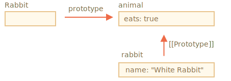
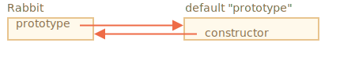
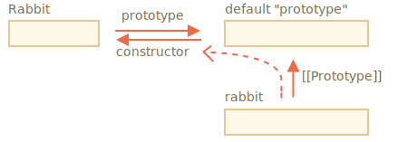

# F.prototype

Rappelez-vous que de nouveaux objets peuvent être créés avec une fonction constructeur, comme `new F()`.

Si `F.prototype` est un objet, alors l'opérateur `new` l'utilise pour définir `[[Prototype]]` pour le nouvel objet.

```smart header="Veuillez noter"
JavaScript avait l'héritage prototypique depuis le début. C'était l'une des caractéristiques principales du langage.

Mais dans le passé, il n'y avait pas d'accès direct. La seule chose qui fonctionnait de manière fiable est une propriété `"prototype"` de la fonction constructeur décrite dans ce chapitre. Donc, il y a beaucoup de scripts qui l'utilisent encore.
```

Veuillez noter que `F.prototype` signifie ici une propriété régulière nommée `"prototype"` sur `F`. Cela ressemble quelque peu au terme "prototype", mais nous entendons ici une propriété régulière portant ce nom.

Voici l'exemple :

```js run
let animal = {
  eats: true
};

function Rabbit(name) {
  this.name = name;
}

*!*
Rabbit.prototype = animal;
*/!*

let rabbit = new Rabbit("White Rabbit"); //  rabbit.__proto__ == animal

alert( rabbit.eats ); // true
```

Définir `Rabbit.prototype=animal` énonce littéralement ce qui suit : "Lorsqu'un `new Rabbit` est créé, assigner son `[[Prototype]]` à `animal`".

Voici l'image résultante :



Sur l'image, `"prototype"` est une flèche horizontale, ce qui signifie une propriété normale, et `[[Prototype]]` est vertical, ce qui signifie l'héritage de `rabbit` de `animal`.

```smart header="`F.prototype` utilisé uniquement pendant `new F`"
La propriété `F.prototype` est utilisée uniquement lorsque `new F` est appelé, elle attribue `[[Prototype]]` du nouvel objet. Après cela, il n'y a plus de connexion entre `F.prototype` et le nouvel objet.

Si, après la création, la propriété `F.prototype` change (`F.prototype = <un autre objet>`), les nouveaux objets créés par `new F` auront un autre objet comme `[[Prototype]]`, mais les objets déjà existants conservent l'ancien.
```

## F.prototype par défaut, propriété du constructeur

Chaque fonction a la propriété `"prototype"` même si nous ne la fournissons pas.

Le `"prototype"` par défaut est un objet avec comme seule propriété `constructor` qui renvoie à la fonction elle-même.

Comme ça :

```js
function Rabbit() {}

/* prototype par défaut
Rabbit.prototype = { constructor: Rabbit };
*/
```



Nous pouvons le vérifier :

```js run
function Rabbit() {}
// par défaut:
// Rabbit.prototype = { constructor: Rabbit }

alert( Rabbit.prototype.constructor == Rabbit ); // true
```

Naturellement, si nous ne faisons rien, la propriété `constructor` est disponible pour tous les "rabbits" via `[[Prototype]]` :

```js run
function Rabbit() {}
// par défaut:
// Rabbit.prototype = { constructor: Rabbit }

let rabbit = new Rabbit(); // hérite de {constructor: Rabbit}

alert(rabbit.constructor == Rabbit); // true (de prototype)
```



Nous pouvons utiliser la propriété `constructor` pour créer un nouvel objet en utilisant le même constructeur que l'existant.

Comme ici :

```js run
function Rabbit(name) {
  this.name = name;
  alert(name);
}

let rabbit = new Rabbit("White Rabbit");

*!*
let rabbit2 = new rabbit.constructor("Black Rabbit");
*/!*
```

C'est pratique lorsque nous avons un objet, ne sachant pas quel constructeur a été utilisé pour cela (par exemple, il provient d'une bibliothèque externe), et nous devons en créer un autre du même type.

Mais probablement la chose la plus importante à propos de `"constructor"` est que...

**...JavaScript lui-même n'assure pas la bonne valeur de `"constructor"`.**

Oui, il existe dans le `"prototype"` par défaut des fonctions, mais c'est tout. Ce qu'il en adviendra par la suite dépend entièrement de nous.

En particulier, si nous remplaçons le prototype par défaut dans son ensemble, il ne contiendra pas de "constructor".

Par exemple :

```js run
function Rabbit() {}
Rabbit.prototype = {
  jumps: true
};

let rabbit = new Rabbit();
*!*
alert(rabbit.constructor === Rabbit); // false
*/!*
```

Donc, pour garder le bon `"constructor"`, nous pouvons choisir d'ajouter/supprimer des propriétés au `"prototype"` par défaut au lieu de l'écraser dans son ensemble :

```js
function Rabbit() {}

// Ne pas écraser Rabbit.prototype totalement
// juste y ajouter
Rabbit.prototype.jumps = true
// le Rabbit.prototype.constructor par défaut est conservé
```

Ou bien, recréez manuellement la propriété `constructor` :

```js
Rabbit.prototype = {
  jumps: true,
*!*
  constructor: Rabbit
*/!*
};

// maintenant le constructeur est également correct, car nous l'avons ajouté
```

## Résumé

Dans ce chapitre, nous avons brièvement décrit la manière de définir un `[[Prototype]]` pour les objets créés via une fonction constructeur. Plus tard, nous verrons des modèles de programmation plus avancés qui en dépendent.

Tout est assez simple, juste quelques précisions pour clarifier les choses :

- La propriété `F.prototype` (ne pas confondre avec `[[Prototype]]`) définit `[[Prototype]]` sur les nouveaux objets lorsque `new F()` est appelée.
- La valeur de `F.prototype` devrait soit être un objet ou `null` : les autres valeurs ne fonctionneront pas.
- La propriété `"prototype"` n'a cet effet spécial que lorsqu'elle est définie dans une fonction constructeur et invoquée avec `new`.

Sur les objets ordinaires, le `prototype` n'a rien de spécial :

```js
let user = {
  name: "John",
  prototype: "Bla-bla" // pas de magie
};
```

Par défaut, toutes les fonctions ont `F.prototype={constructor:F}`, nous pouvons donc obtenir le constructeur d'un objet en accédant à sa propriété `"constructor"`.
