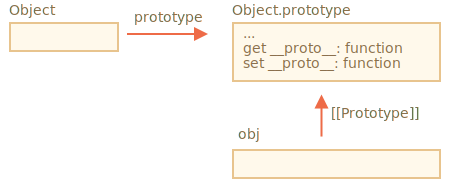
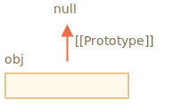

# Méthodes de prototypes, objets sans __proto__

Dans le premier chapitre de cette section, nous avons indiqué qu'il existe des méthodes modernes pour configurer un prototype.

La définition ou la lecture du prototype avec `obj.__proto__` est considérée comme obsolète et dépréciée (déplacée dans la soi-disant "annexe B" de la norme JavaScript, destinée uniquement aux navigateurs).

Les méthodes modernes pour obtenir/définir un prototype sont :

- [Object.getPrototypeOf(obj)](mdn:js/Object/getPrototypeOf) -- retourn le `[[Prototype]]` de `obj`.
- [Object.setPrototypeOf(obj, proto)](mdn:js/Object/setPrototypeOf) -- configure le `[[Prototype]]` de `obj` à `proto`.

La seule utilisation de `__proto__`, qui n'est pas mal vue, est en tant que propriété lors de la création d'un nouvel objet : `{ __proto__: ... }`.

Bien qu'il existe également une méthode spéciale pour cela :

<<<<<<< HEAD
- [Object.create(proto, [descriptors])](mdn:js/Object/create) -- crée un objet vide avec `proto` donné comme `[[Prototype]]` et des descripteurs de propriété facultatifs.
=======
- [Object.create(proto[, descriptors])](mdn:js/Object/create) -- creates an empty object with given `proto` as `[[Prototype]]` and optional property descriptors.
>>>>>>> 1dce5b72b16288dad31b7b3febed4f38b7a5cd8a

Par exemple :

```js run
let animal = {
  eats: true
};

// créer un nouvel objet avec animal comme prototype
*!*
let rabbit = Object.create(animal); // identique à {__proto__: animal}
*/!*

alert(rabbit.eats); // true

*!*
alert(Object.getPrototypeOf(rabbit) === animal); // true
*/!*

*!*
Object.setPrototypeOf(rabbit, {}); // change le prototype de rabbit en {}
*/!*
```

La méthode `Object.create` est un peu plus puissante, car elle a un deuxième argument facultatif : les descripteurs de propriété.

Nous pouvons fournir des propriétés supplémentaires au nouvel objet, comme ceci :

```js run
let animal = {
  eats: true
};

let rabbit = Object.create(animal, {
  jumps: {
    value: true
  }
});

alert(rabbit.jumps); // true
```

Les descripteurs sont dans le même format que décrit dans le chapitre <info:property-descriptors>.

Nous pouvons utiliser `Object.create` pour effectuer un clonage d'objet plus puissant que la copie des propriétés dans la boucle `for..in` :

```js
let clone = Object.create(
  Object.getPrototypeOf(obj), Object.getOwnPropertyDescriptors(obj)
);
```

Cet appel crée une copie véritablement exacte de `obj`, y compris de toutes les propriétés : énumérable et non-énumérable, des propriétés de données et des accesseurs/mutateurs - tout, et avec le bon `[[Prototype]]`.

## Bref historique

Il y a tellement de façons de gérer `[[Prototype]]`. Comment est-ce arrivé ? Pourquoi ?

C'est pour des raisons historiques.

L'héritage prototypal était dans le langage depuis son aube, mais les façons de le gérer ont évolué au fil du temps.

- La propriété `prototype` d'une fonction constructeur fonctionne depuis des temps très anciens. C'est la manière la plus ancienne de créer des objets avec un prototype donné.
- Plus tard, en 2012, `Object.create` est apparu dans la norme. Il a donné la possibilité de créer des objets avec un prototype donné, mais n'a pas fourni la possibilité de l'obtenir/le définir. Certains navigateurs ont implémenté l'accesseur non standard `__proto__` qui permettait à l'utilisateur d'obtenir/définir un prototype à tout moment, pour donner plus de flexibilité aux développeurs.
- Plus tard, en 2015, `Object.setPrototypeOf` et `Object.getPrototypeOf` ont été ajoutés à la norme, pour exécuter la même fonctionnalité que `__proto__`. Comme `__proto__` était de facto implémenté partout, il était en quelque sorte obsolète et a fait son chemin vers l'annexe B de la norme, c'est-à-dire facultatif pour les environnements sans navigateur.
- Plus tard, en 2022, il a été officiellement autorisé d'utiliser `__proto__` dans les objets littéraux `{...}` (sortie de l'annexe B), mais pas en tant que getter/setter `obj.__proto__` (toujours dans l'annexe B).

Pourquoi `__proto__` a été remplacé par les fonctions `getPrototypeOf`/`setPrototypeOf` ?

Pourquoi `__proto__` a-t-il été partiellement réhabilité et son utilisation autorisée dans `{...}`, mais pas en tant que getter/setter ?

C'est une question intéressante, qui nous oblige à comprendre pourquoi `__proto__` est mauvais.

Et bientôt nous aurons la réponse.

```warn header="Ne changez pas `[[Prototype]]` sur des objets existants si la vitesse est importante"
Techniquement, nous pouvons accéder/muter `[[Prototype]]` à tout moment. Mais en général, nous ne le définissons qu’une fois au moment de la création de l’objet, puis nous ne le modifions pas : `rabbit` hérite de `animal`, et cela ne changera pas.

Et les moteurs JavaScript sont hautement optimisés pour cela. Changer un prototype "à la volée" avec `Object.setPrototypeOf` ou `obj.__ proto __=` est une opération très lente, elle rompt les optimisations internes pour des opérations d'accès aux propriétés d'objet. Alors évitez-la à moins que vous ne sachiez ce que vous faites, ou que la vitesse de JavaScript n'a pas d'importance pour vous.
```

## Objets "très simples" [#very-plain]

Comme nous le savons, les objets peuvent être utilisés en tant que tableaux associatifs pour stocker des paires clé/valeur.

...Mais si nous essayons de stocker des clés *fournies par l'utilisateur* (par exemple, un dictionnaire saisi par l'utilisateur), nous verrons un petit problème intéressant : toutes les clés fonctionnent très bien, sauf `"__proto __"`.

Découvrez l'exemple :

```js run
let obj = {};

let key = prompt("What's the key?", "__proto__");
obj[key] = "some value";

alert(obj[key]); // [object Object], pas "some value" !
```

Ici, si l'utilisateur tape `__proto__`, l'assignation à la ligne 4 est ignorée !

<<<<<<< HEAD
Cela pourrait sûrement être surprenant pour un non-développeur, mais assez compréhensible pour nous. La propriété `__proto__` est spéciale : elle doit être soit un objet, soit `null`. Une chaîne de caractères ne peut pas devenir un prototype. C'est pourquoi une affectation d'une chaîne à `__proto__` est ignorée.
=======
That could surely be surprising for a non-developer, but pretty understandable for us. The `__proto__` property is special: it must be either an object or `null`. A string can not become a prototype. That's why assigning a string to `__proto__` is ignored.
>>>>>>> 1dce5b72b16288dad31b7b3febed4f38b7a5cd8a

Mais nous n'avions pas *l'intention* de mettre en œuvre un tel comportement, non ? Nous voulons stocker des paires clé/valeur, et la clé nommée `"__proto__"` n'a pas été correctement enregistrée. Donc c'est un bug !

Ici les conséquences ne sont pas terribles. Mais dans d'autres cas, nous pouvons stocker des objets au lieu de chaînes dans `obj`, puis le prototype sera effectivement modifié. En conséquence, l'exécution ira mal de manière totalement inattendue.

Ce qui est pire -- généralement les développeurs ne pensent pas du tout à cette possibilité. Cela rend ces bugs difficiles à remarquer et même à les transformer en vulnérabilités, en particulier lorsque JavaScript est utilisé côté serveur.

Des choses inattendues peuvent également se produire lors de l'affectation à `obj.toString`, car il s'agit d'une méthode d'objet intégrée.

Comment pouvons-nous éviter ce problème ?

Tout d'abord, nous pouvons simplement passer à l'utilisation de `Map` pour le stockage au lieu d'objets simples, puis tout va bien.

```js run
let map = new Map();

let key = prompt("What's the key?", "__proto__");
map.set(key, "some value");

alert(map.get(key)); // "some value" (comme prévu)
```

...Mais la syntaxe `Object` est souvent plus attrayante, car elle est plus concise.

Heureusement, nous *pouvons* utiliser des objets, car les créateurs du langage ont réfléchi à ce problème il y a longtemps.

Comme nous le savons, `__proto__` n'est pas une propriété d'un objet, mais un accesseur sur la propriété `Object.prototype` :



Ainsi, si `obj.__proto__` est lu ou muté, l'accésseur/mutateur correspondant est appelé à partir de son prototype et il accède/mute `[[Prototype]]`.

Comme il a été dit au début de cette section de tutoriel : `__proto__` est un moyen d'accéder `[[Prototype]]`, il n'est pas `[[Prototype]]` lui-même.

Maintenant, si nous avons l'intention d'utiliser un objet comme tableau associatif et de ne pas avoir de tels problèmes, nous pouvons le faire avec une petite astuce :

```js run
*!*
let obj = Object.create(null);
// ou : obj = { __proto__: null }
*/!*

let key = prompt("What's the key?", "__proto__");
obj[key] = "some value";

alert(obj[key]); // "some value"
```

`Object.create(null)` crée un objet vide sans prototype (`[[Prototype]]` est `null`) :



Donc, il n'y a pas d'accésseur/mutateur hérité pour `__proto__`. Maintenant, il est traité comme une propriété de données normale, ainsi l'exemple ci-dessus fonctionne correctement.

Nous pouvons appeler de tels objets des objets "très simples" ou "dictionnaire pur", car ils sont encore plus simples que les objets simples ordinaires `{...}`.

L'inconvénient est que de tels objets ne possèdent aucune méthode d'objet intégrée, par exemple `toString` :

```js run
*!*
let obj = Object.create(null);
*/!*

alert(obj); // Error (pas de toString)
```

...Mais c'est généralement acceptable pour les tableaux associatifs.

Notez que la plupart des méthodes liées aux objets sont `Object.quelquechose(...)`, comme `Object.keys(obj)` - elles ne sont pas dans le prototype, elles continueront donc à travailler sur de tels objets :

```js run
let chineseDictionary = Object.create(null);
chineseDictionary.hello = "你好";
chineseDictionary.bye = "再见";

alert(Object.keys(chineseDictionary)); // hello,bye
```

## Résumé

- Pour créer un objet avec le prototype donné, utilisez :

<<<<<<< HEAD
    - la syntaxe littérale : `{ __proto__: ... }`, permet de spécifier plusieurs propriétés
    - ou [Object.create(proto, [descriptors])](mdn:js/Object/create), permet de spécifier des descripteurs de propriété.
=======
    - literal syntax: `{ __proto__: ... }`, allows to specify multiple properties
    - or [Object.create(proto[, descriptors])](mdn:js/Object/create), allows to specify property descriptors.
>>>>>>> 1dce5b72b16288dad31b7b3febed4f38b7a5cd8a

    Le `Object.create` fournit un moyen simple de copier superficiellement un objet avec tous les descripteurs :

    ```js
    let clone = Object.create(Object.getPrototypeOf(obj), Object.getOwnPropertyDescriptors(obj));
    ```

- Les méthodes modernes pour obtenir/définir le prototype sont :

    - [Object.getPrototypeOf(obj)](mdn:js/Object/getPrototypeOf) -- renvoie le `[[Prototype]]` de `obj` (identique au getter `__proto__`).
    - [Object.setPrototypeOf(obj, proto)](mdn:js/Object/setPrototypeOf) -- définit le `[[Prototype]]` de `obj` à `proto` (identique au setter `__proto__`).

- Obtenir/définir le prototype en utilisant le getter/setter intégré. `__proto__` n'est pas recommandé, il est maintenant dans l'annexe B de la spécification.

- Nous avons également couvert les objets sans prototype, créés avec `Object.create(null)` ou `{__proto__: null}`.

    Ces objets sont utilisés comme dictionnaires, pour stocker toutes les clés (éventuellement générées par l'utilisateur).

    Normalement, les objets héritent des méthodes intégrées et du getter/setter `__proto__` de `Object.prototype`, rendant les clés correspondantes "occupées" et provoquant potentiellement des effets secondaires. Avec le prototype "null", les objets sont vraiment vides.
