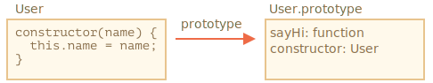

# Syntaxe de base de la Classe

```quote author="Wikipedia"
En langage orienté objet, une *classe* est un modèle de code programme extensible servant à créer des objets. Elle fournit les valeurs initiales de l'état (les variables membres) et de l'implémentation du comportement (les fonctions ou méthodes membres).
```

En pratique, nous avons souvent besoin de créer beaucoup d'objets de même type, tels que des utilisateurs, des biens ou toute autre chose.

Comme nous le savons dans le chapitre <info:constructor-new>, `new function` peut nous aider à faire cela.

Mais dans le JavaScript moderne, il y a une construction de la "classe" plus avancée qui introduit de nombreux nouveaux aspects utiles en langage orienté objet.

## La syntaxe de "classe"

La syntaxe de base est:
```js
class MyClass {
  // Les méthodes de la classe
  constructor() { ... }
  method1() { ... }
  method2() { ... }
  method3() { ... }
  ...
}
```

Vous pouvez ensuite utiliser `new MyClass()` pour créer un nouvel objet ayant toute la liste des méthodes.

La méthode `constructor()`  est automatiquement appelée par `new`, donc nous pouvons initialiser l'objet à ce niveau.

Par exemple:

```js run
class User {

  constructor(name) {
    this.name = name;
  }

  sayHi() {
    alert(this.name);
  }

}

// Usage:
let user = new User("John");
user.sayHi();
```

Lorsque `new User("John")` est appelé:
1. Un nouvel objet est créé.
2. Le `constructor` s'exécute avec les arguments qui lui sont passés et assigne `this.name` a l'objet.

...ensuite nous pouvons appeler les méthodes de l'objet, tel que `user.sayHi()`.


```warn header="Pas de virgule entre les méthodes de la classe"
Un piège fréquent des développeurs novices est de mettre une virgule entre les méthodes de la classe,  entrainant ainsi une erreur syntaxique.

La notation ici ne doit pas être confondue avec les objets littéraux. A l'intérieure d'une classe, aucune virgule n'est requise.
```

## Qu'est-ce qu'une classe?

Alors, c'est quoi exactement une `class`? Ce n'est pas totalement une nouvelle  entité au niveau de la langue, comme on pourrait le penser.

Dévoilons maintenant la magie et regardons ce qu'est réellement une classe.  Cela va nous aider à comprendre plusieurs aspects complexes.

En JavaScript, une classe est une sorte de fonction.

Regardons ici:

```js run
class User {
  constructor(name) { this.name = name; }
  sayHi() { alert(this.name); }
}

// La preuve: User est une fonction
*!*
alert(typeof User); // function
*/!*
```

Ce que `class User {...}` la construction fait en réalité est de:

1. Créer une fonction nommée `User`,  qui devient le résultat de la déclaration de la classe. Le code  de la fonction est tirée de la méthode `constructor` (considérée comme étant vide au cas ou cette méthode n'est pas écrite).
2. Garde les méthodes de la classe, telle que `sayHi`, dans `User.prototype`.

Après la création de `new User`, lorsque nous appelons sa méthode, elle est extraite du prototype, comme décrit dans le chapitre <info:function-prototype>. Donc, l'objet a accès aux méthodes de classe.

Nous pouvons illustrer le résultat de la déclaration de `class User` par :

Nous pouvons illustrer le résultat de la déclaration de `class User` ainsi:


Voici le code pour une introspection:

```js run
class User {
  constructor(name) { this.name = name; }
  sayHi() { alert(this.name); }
}

// classe est une function
alert(typeof User); // function

// ...ou, plus précisément, le constructeur de la méthode
alert(User === User.prototype.constructor); // true

// Les méthodes sont dans  User.prototype, e.g:
alert(User.prototype.sayHi); // alert(this.name);

// Il y a exactement deux méthodes dans le prototype
alert(Object.getOwnPropertyNames(User.prototype)); // constructeur, sayHi
```

## Pas simplement un sucre syntaxique 

Parfois certaines personnes disent que la notion de `class` est un "sucre syntaxique" (une syntaxe qui est destinée à rendre la lecture plus facile, mais elle n'introduit  rien de nouveau), parce que en réalité nous pouvons  déclarer la même chose sans aucunement utiliser le mot clé `classe` :

```js run
// Réécriture de class User en fonctions pures

// 1. Créer la fonction constructeur 
function User(name) {
  this.name = name;
}
<<<<<<< HEAD
// Tout prototype de fonction a une propriété constructeur par défaut,
// Alors  nous n'avons pas besoin de le créer
=======
// a function prototype has "constructor" property by default,
// so we don't need to create it
>>>>>>> ae1171069c2e50b932d030264545e126138d5bdc

// 2. Ajouter la méthode au prototype
User.prototype.sayHi = function() {
  alert(this.name);
};

// Usage:
let user = new User("John");
user.sayHi();
```

Le résultat de cette définition est à peu près la même chose. Donc, il y a bien des raisons de vouloir considérer `class` comme pouvant être un sucre syntaxique pour définir un constructeur ensemble avec ses méthodes de prototype.

Cependant, il existe des différences importantes.

1. Tout d'abord, une fonction crée par une `classe` est labélisé par une propriété interne spéciale nommée `[[FunctionKind]]:"classConstructor"`. Donc ce n'est pas tout à fait la même chose que de la créer manuellement.

<<<<<<< HEAD
    Contrairement à une fonction normale, un constructeur de class doit être invoquée avec `new` :
=======
    The language checks for that property in a variety of places. For example, unlike a regular function, it must be called with `new`:
>>>>>>> ae1171069c2e50b932d030264545e126138d5bdc

    ```js run
    class User {
      constructor() {}
    }

    alert(typeof User); // fonction
    User(); // Erreur: le constructeur Class User ne peut être invoque sans 'new'
    ```

    Aussi, la représentation en chaine de caractère d'un constructeur de class dans la plupart des moteurs de JavaScript commence avec la "class..."

    ```js run
    class User {
      constructor() {}
    }

    alert(User); // class User { ... }
    ```
    There are other differences, we'll see them soon.

2. Les méthodes de Class sont non-énumérable.
    Une définition de la classe attribue à la propriété  `énumérable` le drapeau de `false` a  les méthodes du `"prototype"`.

    C'est bien, parce que si nous exécutons un `for..in` sur un Object, souvent nous ne voulons pas accéder aux méthodes de sa classe.

3. Les Classes utilisent toujours `use strict`.
    Tout code à l'intérieur de la construction de la classe est automatiquement en mode strict.

En outres, la syntaxe `classe` apporte beaucoup d'autres caractéristiques que nous allons explorer plus tard.

##  L'Expression Class

Tout comme les fonctions, les classes peuvent être définies a l'intérieur d'une autre expression, passées en paramètres, retournées, assignées etc.

Voici un exemple d'expression d'une classe:

```js
let User = class {
  sayHi() {
    alert("Hello");
  }
};
```

Similairement aux Fonction Expressions nommées, les expressions de classe peuvent avoir un nom.

Si une expression de classe a un nom, il est visible à l'intérieur de la classe uniquement:

```js run
// "Expression de Classe nommée"
// (Terme non existant dans la spécification, mais elle est similaire a une Expression de Fonction nommée)
let User = class *!*MyClass*/!* {
  sayHi() {
    alert(MyClass); // le nom MyClass  est seulement visible dans la classe
  }
};

new User().sayHi(); // ça fonctionne, montre la définition de MyClass 

alert(MyClass); // erreur, le nom MyClass n'est pas visible en dehors de la classe
```

<<<<<<< HEAD

Nous pouvons même créer les classes dynamiquement "a la demande", comme ainsi:
=======
We can even make classes dynamically "on-demand", like this:
>>>>>>> ae1171069c2e50b932d030264545e126138d5bdc

```js run
function makeClass(phrase) {
  // déclare une classe et la retourne 
  return class {
    sayHi() {
      alert(phrase);
    };
  };
}

// Cree une nouvelle classe
let User = makeClass("Hello");

new User().sayHi(); // Hello
```


<<<<<<< HEAD
## Accesseurs/Mutateurs, autres syntaxes de raccourcis
=======
## Getters/setters
>>>>>>> ae1171069c2e50b932d030264545e126138d5bdc

Tout comme les objets littéraux, les classes peuvent inclure des accesseurs/mutateurs, des propriétés évaluées etc.

Voici un exemple pour `user.name` implémente en utilisant les propriétés `get/set`:

```js run
class User {

  constructor(name) {
    // invoque l'accesseur (the setter)
    this.name = name;
  }

*!*
  get name() {
*/!*
    return this._name;
  }

*!*
  set name(value) {
*/!*
    if (value.length < 4) {
      alert("Name is too short.");
      return;
    }
    this._name = value;
  }

}

let user = new User("John");
alert(user.name); // John

user = new User(""); // le nom est trop court.
```

<<<<<<< HEAD
La déclaration de la classe Cree des accesseurs et des mutateurs dans `User.prototype`, ainsi:
=======
Technically, such class declaration works by creating getters and setters in `User.prototype`.
>>>>>>> ae1171069c2e50b932d030264545e126138d5bdc

## Computed names [...]

<<<<<<< HEAD
Voici un exemple avec une propriété évaluée entre crochets `[...]` :
=======
Here's an example with a computed method name using brackets `[...]`:
>>>>>>> ae1171069c2e50b932d030264545e126138d5bdc

```js run
class User {

*!*
  ['say' + 'Hi']() {
*/!*
    alert("Hello");
  }

}

new User().sayHi();
```

<<<<<<< HEAD
## Proprietes de Classe
=======
Such features are easy to remember, as they resemble that of literal objects.

## Class fields
>>>>>>> ae1171069c2e50b932d030264545e126138d5bdc

```warn header="les anciens navigateurs peuvent avoir besoin de polyfill"
Les propriétés de classe sont un ajout récent au langage.
```

<<<<<<< HEAD
Auparavant, les classes n'avaient que des méthodes.
=======
Previously, our classes only had methods.
>>>>>>> ae1171069c2e50b932d030264545e126138d5bdc

Les "Class fields" (champs de classe) sont une syntaxe qui permet d'ajouter des propriétés.

Par exemple, ajoutons la propriété `name` à `class User` :

```js run
class User {
*!*
  name = "John";
*/!*

  sayHi() {
    alert(`Hello, ${this.name}!`);
  }
}

new User().sayHi(); // Hello, John!
```

So, we just write "<property name> = <value>" in the declaration, and that's it.

The important difference of class fields is that they are set on individual objects, not `User.prototype`:

```js run
class User {
*!*
  name = "John";
*/!*
}

let user = new User();
alert(user.name); // John
alert(User.prototype.name); // undefined
```

<<<<<<< HEAD
La chose importante à propos des champs de classe est qu'ils sont définis sur des objets individuels, pas `User.prototype`.

Techniquement, ils sont traités une fois que le constructeur a fait son travail.
=======
We can also assign values using more complex expressions and function calls:

```js run
class User {
*!*
  name = prompt("Name, please?", "John");
*/!*
}

let user = new User();
alert(user.name); // John
```

>>>>>>> ae1171069c2e50b932d030264545e126138d5bdc

### Création de méthodes liées avec des champs de classe

Comme démontré dans le chapitre <info:bind> les fonctions en JavaScript ont un `this` dynamique. Cela dépend du contexte de l'appel.

Donc, si une méthode objet est contournée et appelée dans un autre contexte, `this` ne sera plus une référence à son objet.

Par exemple, ce code affichera `undefined` :

```js run
class Button {
  constructor(value) {
    this.value = value;
  }

  click() {
    alert(this.value);
  }
}

let button = new Button("hello");

*!*
setTimeout(button.click, 1000); // undefined
*/!*
```

Le problème est appelé "perdre le `this`".

Il existe deux approches pour le corriger, comme indiqué dans le chapitre <info:bind> :

<<<<<<< HEAD
1. Passer une fonction wrapper, telle que `setTimeout(() => button.click(), 1000)`.
2. Liez la méthode à un objet, par exemple chez le constructeur :

```js run
class Button {
  constructor(value) {
    this.value = value;
*!*
    this.click = this.click.bind(this);
*/!*
  }

  click() {
    alert(this.value);
  }
}

let button = new Button("hello");

*!*
setTimeout(button.click, 1000); // hello
*/!*
```

Les champs de classe fournissent une syntaxe plus élégante pour cette dernière solution :
=======
1. Pass a wrapper-function, such as `setTimeout(() => button.click(), 1000)`.
2. Bind the method to object, e.g. in the constructor.

Class fields provide another, quite elegant syntax:
>>>>>>> ae1171069c2e50b932d030264545e126138d5bdc

```js run
class Button {
  constructor(value) {
    this.value = value;
  }
*!*
  click = () => {
    alert(this.value);
  }
*/!*
}

let button = new Button("hello");

setTimeout(button.click, 1000); // hello
```

<<<<<<< HEAD
Le champ de classe `click = () => {...}` crée une fonction indépendante sur chaque objet `Button`, avec` this` lié à l'objet. Ensuite, nous pouvons passer `button.click` partout, et il sera appelé avec le bon` this`.

Cela est particulièrement utile dans un environnement de navigateur, lorsque nous devons configurer une méthode comme un écouteur d'événements.
=======
The class field `click = () => {...}` is created on a per-object basis, there's a separate function for each `Button` object, with `this` inside it referencing that object. We can pass `button.click` around anywhere, and the value of `this` will always be correct.

That's especially useful in browser environment, for event listeners.
>>>>>>> ae1171069c2e50b932d030264545e126138d5bdc

## Résumé

La syntaxe de base d'une classe ressemble à ceci:

```js
class MyClass {
  prop = value; // propriete

  constructor(...) { // constructeur
    // ...
  }

  method(...) {} // methode

  get something(...) {} //  méthode définie avec un accesseur
  set something(...) {} //  méthode définie avec un mutateur

  [Symbol.iterator]() {} // méthode avec un nom évalué (symbole ici)
  // ...
}
```

`MyClass` est techniquement une fonction (celle que nous fournissons en tant que `constructor`), tandis que les méthodes, accesseurs et mutateurs sont écrits dans `MyClass.prototype`.

Dans les prochains chapitres nous apprendrons plus à propos des classes, y compris la notion d'héritage et les autres caractéristiques.
