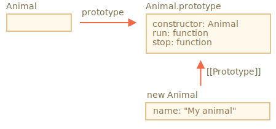
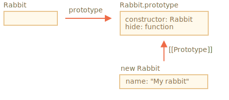
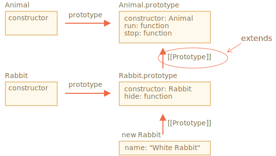
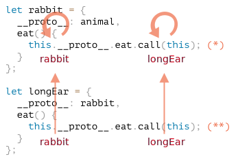
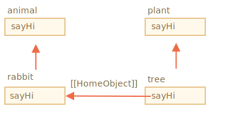

# Héritage de classe

Disons que nous avons deux classes.

`Animal`:

```js
class Animal {
  constructor(name) {
    this.speed = 0;
    this.name = name;
  }
  run(speed) {
    this.speed += speed;
    alert(`${this.name} runs with speed ${this.speed}.`);
  }
  stop() {
    this.speed = 0;
    alert(`${this.name} stands still.`);
  }
}

let animal = new Animal("My animal");
```




...Et `Rabbit`:

```js
class Rabbit {
  constructor(name) {
    this.name = name;
  }
  hide() {
    alert(`${this.name} hides!`);
  }
}

let rabbit = new Rabbit("My rabbit");
```




En ce moment, ils sont totalement indépendants.

Mais nous voudrions que `Rabbit` étende `Animal`. En d'autres termes, les lapins devraient être basés sur des animaux, avoir accès aux méthodes de `Animal` et les étendre avec ses propres méthodes.

Pour hériter d'une autre classe, nous devrions spécifier `"extend"` et la classe parente avant les accolades `{..}`.

Ici `Rabbit` hérite de `Animal`:

```js run
class Animal {
  constructor(name) {
    this.speed = 0;
    this.name = name;
  }
  run(speed) {
    this.speed += speed;
    alert(`${this.name} runs with speed ${this.speed}.`);
  }
  stop() {
    this.speed = 0;
    alert(`${this.name} stands still.`);
  }
}

// Hériter d'Animal en spécifiant "extends Animal"
*!*
class Rabbit extends Animal {
*/!*
  hide() {
    alert(`${this.name} hides!`);
  }
}

let rabbit = new Rabbit("White Rabbit");

rabbit.run(5); // White Rabbit court à la vitesse 5.
rabbit.hide(); // White Rabbit se cache!
```

Maintenant, le code `Rabbit` est devenu un peu plus court, car il utilise le constructeur `Animal` par défaut, et il peut aussi `courir`, comme le font les animaux.

En interne, le mot clé `extend` ajoute la référence `[[Prototype]]` de `Rabbit.prototype` à `Animal.prototype`:



Donc, si une méthode ne se trouve pas dans `Rabbit.prototype`, JavaScript prend de `Animal.prototype`.

Comme nous pouvons nous en rappeler dans le chapitre <info:native-prototypes>, JavaScript utilise l'héritage prototypique pour les objets intégrés. Par exemple. `Date.prototype.[[Prototype]]` est `Object.prototype`, les dates ont donc des méthodes d'objet générique.

````smart header="Toute expression est autorisée après `extend`"
La syntaxe de classe permet de spécifier non seulement une classe, mais toute expression après `extend`.

Par exemple, un appel de fonction qui génère la classe parent:

```js run
function f(phrase) {
  return class {
    sayHi() { alert(phrase) }
  }
}

*!*
class User extends f("Hello") {}
*/!*

new User().sayHi(); // Hello
```
Ici la classe `user` hérite du résultat de `f("Hello")`.

Cela peut être utile pour les modèles de programmation avancés lorsque nous utilisons des fonctions pour générer des classes en fonction de nombreuses conditions et que nous pouvons en hériter.
````

## Remplacer une méthode

Maintenant, avançons et remplaçons une méthode. À l'instant, `Rabbit` hérite de la méthode `stop` qui définit `this.speed=0` à partir de `Animal`.

Si nous spécifions notre propre `stop` dans `Rabbit`, il sera utilisé à la place:

```js
class Rabbit extends Animal {
  stop() {
    // ...this will be used for rabbit.stop()
  }
}
```

...Mais en général, nous ne voulons pas remplacer totalement une méthode parente, mais plutôt construire dessus, modifier ou étendre ses fonctionnalités. Nous faisons quelque chose dans notre méthode, mais appelons la méthode parente avant / après ou dans le processus.

Les classes fournissent le mot clé `"super"` pour cela.

- `super.method(...)` pour appeler une méthode parente.
- `super(...)` pour appeler un constructeur parent (dans notre constructeur uniquement).

Par exemple, laisson rabbit se cacher automatiquement à l’arrêt:

```js run
class Animal {

  constructor(name) {
    this.speed = 0;
    this.name = name;
  }

  run(speed) {
    this.speed += speed;
    alert(`${this.name} runs with speed ${this.speed}.`);
  }

  stop() {
    this.speed = 0;
    alert(`${this.name} stands still.`);
  }

}

class Rabbit extends Animal {
  hide() {
    alert(`${this.name} hides!`);
  }

*!*
  stop() {
    super.stop(); // appeler stop du parent
    this.hide(); // puis hide
  }
*/!*
}

let rabbit = new Rabbit("White Rabbit");

rabbit.run(5); // White Rabbit court à la vitesse 5.
rabbit.stop(); // White Rabbit reste immobile. White Rabbit se cache!
```

Maintenant, `Rabbit` a la méthode `stop` qui appelle le `super.stop()` du parent dans le processus.

````smart header="Les fonctions fléchées n'ont pas de `super`"
Comme mentionné dans le chapitre <info: arrow-functions>, les fonctions fléchées n'ont pas `super`.

Si on y accède, c'est tiré de la fonction externe. Par exemple:
```js
class Rabbit extends Animal {
  stop() {
    setTimeout(() => super.stop(), 1000); // appel stop du parent après 1sec
  }
}
```

Le `super` dans la fonction fléchée est le même que dans `stop()`, donc cela fonctionne comme prévu. Si nous spécifions ici une fonction "régulière", il y aurait une erreur:

```js
// Super inattendu
setTimeout(function() { super.stop() }, 1000);
```
````


## Remplacement du constructeur

Avec les constructeurs, cela devient un peu délicat.

Jusqu'à maintenant, `Rabbit` n'avait pas son propre `constructor`.

Selon la [spécification](https://tc39.github.io/ecma262/#sec-runtime-semantics-classdefinitionevaluation), si une classe étend une autre classe et n'a pas de 'constructeur', alors le `constructor` "vide" suivant est généré:

```js
class Rabbit extends Animal {
  // généré pour l'extension de classes sans propres constructeurs
*!*
  constructor(...args) {
    super(...args);
  }
*/!*
}
```

Comme nous pouvons le constater, il appelle essentiellement le `constructor` du parent en lui passant tous les arguments. Cela se produit si nous n'écrivons pas notre propre constructeur.

Ajoutons maintenant un constructeur personnalisé à `Rabbit`. Il spécifiera le `earLength` en plus de `name`:

```js run
class Animal {
  constructor(name) {
    this.speed = 0;
    this.name = name;
  }
  // ...
}

class Rabbit extends Animal {

*!*
  constructor(name, earLength) {
    this.speed = 0;
    this.name = name;
    this.earLength = earLength;
  }
*/!*

  // ...
}

*!*
// Ça ne marche pas!
let rabbit = new Rabbit("White Rabbit", 10); // Error: this is not defined.
*/!*
```

Oups! Nous avons une erreur. Maintenant, nous ne pouvons pas créer de lapins. Qu'est-ce qui s'est passé?

La réponse courte est: les constructeurs dans les classes qui héritent doivent appeler `super(...)`, et (!) Le faire avant d'utiliser `this`.

...Mais pourquoi? Que se passe t-il ici? En effet, l'exigence semble étrange.

Bien sûr, il y a une explication. Entrons dans les détails pour que vous compreniez vraiment ce qui se passe.

En JavaScript, il existe une distinction entre une "fonction constructeur d'une classe héritante" et toutes les autres. Dans une classe qui hérite, la fonction constructeur correspondante est étiquetée avec une propriété interne spéciale `[[ConstructorKind]]:"derived"`.

La différence est:

- Lorsqu'un constructeur normal s'exécute, il crée un objet vide et l'assigne à `this`.
- Mais lorsqu'un constructeur dérivé s'exécute, il ne le fait pas. Il s'attend à ce que le constructeur parent fasse ce travail.

Donc, si nous fabriquons notre propre constructeur, nous devons appeler `super`, car sinon l'objet de `this` ne sera pas créé. Et nous aurons une erreur.

Pour que le constructeur `Rabbit` fonctionne, il doit appeler `super()` avant d'utiliser `this`, comme ici:

```js run
class Animal {

  constructor(name) {
    this.speed = 0;
    this.name = name;
  }

  // ...
}

class Rabbit extends Animal {

  constructor(name, earLength) {
*!*
    super(name);
*/!*
    this.earLength = earLength;
  }

  // ...
}

*!*
// now fine
let rabbit = new Rabbit("White Rabbit", 10);
alert(rabbit.name); // White Rabbit
alert(rabbit.earLength); // 10
*/!*
```


## Super: les internes, [[HomeObject]]

```warn header="Informations avancées"
Si vous lisez le tutoriel pour la première fois - cette section peut être ignorée.

Il concerne les mécanismes internes de l'héritage et du "super".
```

Passons un peu plus loin sous le capot de `super`. Nous verrons des choses intéressantes au passage.

Tout d'abord, d'après tout ce que nous avons appris jusqu'à présent, `super` ne devrait pas fonctionner du tout!

Oui, en effet, demandons-nous comment cela devrait fonctionner techniquement? Lorsqu'une méthode d'objet est exécutée, l'objet actuel est remplacé par `this`. Si nous appelons `super.method()`, le moteur doit obtenir la `méthode` à partir du prototype de l'objet actuel. Mais comment?

La tâche peut sembler simple, mais elle ne l’est pas. Le moteur connaît l'objet en cours `this`, de sorte qu'il pourrait obtenir la méthode `méthode` parent sous la forme `this.__proto__.Method`. Malheureusement, une telle solution "naïve" ne fonctionnera pas.

Montrons le problème. Sans les classes, en utilisant des objets simples pour des raisons de simplicité.

Si vous ne voulez pas connaître les détails, vous pouvez sauter cette partie et aller en bas à la sous-section `[[HomeObject]]`. Cela ne fera pas de mal. Ou lisez si vous souhaitez comprendre les choses en profondeur.

Dans l'exemple ci-dessous, `rabbit.__proto__=animal`. Essayons maintenant: dans `rabbit.eat()` nous appellerons `animal.eat()`, en utilisant `this.__proto__`:

```js run
let animal = {
  name: "Animal",
  eat() {
    alert(`${this.name} eats.`);
  }
};

let rabbit = {
  __proto__: animal,
  name: "Rabbit",
  eat() {
*!*
    // c'est ainsi que super.eat() pourrait fonctionner
    this.__proto__.eat.call(this); // (*)
*/!*
  }
};

rabbit.eat(); // Rabbit eats.
```

À la ligne `(*)` nous prenons `eat` du prototype (`animal`) et l'appelons dans le contexte de l'objet actuel. Veuillez noter que `.call(this)` est important ici, car un simple `this.__proto__.Eat()` exécuterait le `eat` du parent dans le contexte du prototype et non de l'objet actuel.

Et dans le code ci-dessus, cela fonctionne réellement comme prévu: nous avons la bonne `alert`.

Ajoutons maintenant un objet de plus à la chaîne. Nous verrons comment les choses se casse:

```js run
let animal = {
  name: "Animal",
  eat() {
    alert(`${this.name} eats.`);
  }
};

let rabbit = {
  __proto__: animal,
  eat() {
    // ...rebondir et appeler la méthode du parent (animal)
    this.__proto__.eat.call(this); // (*)
  }
};

let longEar = {
  __proto__: rabbit,
  eat() {
    // ...faire quelque chose puis appeler la méthode du parent (rabbit)
    this.__proto__.eat.call(this); // (**)
  }
};

*!*
longEar.eat(); // Error: Maximum call stack size exceeded
*/!*
```

Le code ne fonctionne plus! Nous pouvons voir l'erreur en essayant d'appeler `longEar.eat()`.

Ce n'est peut-être pas si évident, mais si nous suivons l'appel de `longEar.eat()`, nous pouvons voir pourquoi. Dans les deux lignes `(*)` et `(**)`, la valeur de `this` est l'objet actuel (`longEar`). C'est essentiel: toutes les méthodes d'objet obtiennent l'objet actuel sous la forme `this`, pas un prototype ou quelque chose d'autre.

Ainsi, dans les deux lignes `(*)` et `(**)`, la valeur de `this.__proto__` est exactement la même: `rabbit`. Ils appellent tous deux `rabbit.eat` sans remonter la chaîne, dans une boucle infinie.

Voici l'image de ce qui se passe:



1. Dans `longEar.eat()`, la ligne `(**)` appelle `rabbit.eat` et lui fournit `this = longEar`.
    ```js
    // dans longEar.eat() nous avons this = longEar
    this.__proto__.eat.call(this) // (**)
    // devient
    longEar.__proto__.eat.call(this)
    // à savoir
    rabbit.eat.call(this);
    ```
2. Ensuite, dans la ligne `(*)` de `rabbit.eat`, nous aimerions passer l'appel encore plus haut dans la chaîne, mais `this = longEar`, donc `this.__proto__.eat` est encore `rabbit.eat`!

    ```js
    // dans rabbit.eat() nous avons aussi this = longEar
    this.__proto__.eat.call(this) // (*)
    // devient
    longEar.__proto__.eat.call(this)
    // ou (encore)
    rabbit.eat.call(this);
    ```

3. ...Donc `rabbit.eat` s’appelle lui-même dans une boucle infinie, car il ne peut pas monter plus loin.

Le problème ne peut pas être résolu en utilisant seulement `this`.

### `[[HomeObject]]`

Pour fournir la solution, JavaScript ajoute une propriété interne spéciale supplémentaire pour les fonctions: `[[HomeObject]]`.

Lorsqu'une fonction est spécifiée en tant que méthode de classe ou d'objet, sa propriété `[[HomeObject]]` devient cet objet.

Ensuite, `super` l'utilise pour résoudre le prototype parent et ses méthodes.

Voyons comment cela fonctionne, d'abord avec les objets simples:

```js run
let animal = {
  name: "Animal",
  eat() {         // animal.eat.[[HomeObject]] == animal
    alert(`${this.name} eats.`);
  }
};

let rabbit = {
  __proto__: animal,
  name: "Rabbit",
  eat() {         // rabbit.eat.[[HomeObject]] == rabbit
    super.eat();
  }
};

let longEar = {
  __proto__: rabbit,
  name: "Long Ear",
  eat() {         // longEar.eat.[[HomeObject]] == longEar
    super.eat();
  }
};

*!*
// fonctionne correctement
longEar.eat();  // Long Ear eats.
*/!*
```

Cela fonctionne comme prévu, en raison de la mécanique `[[HomeObject]]`. Une méthode, telle que `longEar.eat`, connaît son `[[HomeObject]]` et prend la méthode parente de son prototype. Sans aucune utilisation de `this`.

### Les méthodes ne sont pas "libres"

Comme nous l'avons vu précédemment, les fonctions sont généralement "libres" et ne sont pas liées à des objets en JavaScript. Ils peuvent donc être copiés entre des objets et appelés avec un autre `this`.

L'existence même de `[[HomeObject]]` viole ce principe, car les méthodes se souviennent de leurs objets. `[[HomeObject]]` ne peut pas être changé, ce lien est donc permanent.

Le seul endroit dans la langue où `[[HomeObject]]` est utilisé - est `super`. Donc, si une méthode n'utilise pas `super`, on peut toujours la considérer comme libre et la copier entre les objets. Mais avec `super`, les choses peuvent mal tourner.

Voici la démo d'un mauvais résultat de `super` après la copie:

```js run
let animal = {
  sayHi() {
    console.log(`I'm an animal`);
  }
};

// rabbit hérite de animal
let rabbit = {
  __proto__: animal,
  sayHi() {
    super.sayHi();
  }
};

let plant = {
  sayHi() {
    console.log("I'm a plant");
  }
};

// tree hérite de plant
let tree = {
  __proto__: plant,
*!*
  sayHi: rabbit.sayHi // (*)
*/!*
};

*!*
tree.sayHi();  // I'm an animal (?!?)
*/!*
```

Un appel à `tree.sayHi()` indique "I'm an animal". Certainement faux.

La raison est simple:
- Dans la ligne `(*)`, la méthode `tree.sayHi` a été copiée à partir de `rabbit`. Peut-être que nous voulions simplement éviter la duplication de code?
- Son `[[[HomeObject]]` est `rabbit`, comme il a été créé dans `rabbit`. Il n'y a aucun moyen de changer `[[HomeObject]]`.
- Le code de `tree.sayHi()` a `super.sayHi()` à l'intérieur. Il monte de `rabbit` et prend la méthode de `animal`.

Voici le schéma de ce qui se passe:



### Méthodes, pas des propriétés de fonction

`[[HomeObject]]` est défini pour les méthodes à la fois dans les classes et dans les objets simples. Mais pour les objets, les méthodes doivent être spécifiées exactement comme `method()`, pas comme `"method: function()"`.

La différence peut être non essentielle pour nous, mais c'est important pour JavaScript.

Dans l'exemple ci-dessous, une syntaxe non-méthode est utilisée pour la comparaison. La propriété `[[HomeObject]]` n'est pas définie et l'héritage ne fonctionne pas:

```js run
let animal = {
<<<<<<< HEAD
  eat: function() { // devrait être la syntaxe courte: eat() {...}
=======
  eat: function() { // intentially writing like this instead of eat() {...
>>>>>>> 3dd8ca09c1a7ed7a7b04eefc69898559902478e1
    // ...
  }
};

let rabbit = {
  __proto__: animal,
  eat: function() {
    super.eat();
  }
};

*!*
rabbit.eat();  // Error calling super (parce qu'il n'y a pas de [[HomeObject]])
*/!*
```

## Résumé

1. Pour étendre une classe: `class Child extends Parent`:
    - Cela signifie que `Child.prototype.__proto__` sera `Parent.prototype`, donc les méthodes sont héritées.
2. Lors du remplacement d'un constructeur:
    - Nous devons appeler le constructeur parent en tant que `super()` dans le constructeur `Child` avant d'utiliser `this`.
3. Lors du remplacement d'une autre méthode:
    - Nous pouvons utiliser `super.method()` dans une méthode `Child` pour appeler la méthode `Parent`.
4. Internes:
    - Les méthodes se souviennent de leur classe/objet dans la propriété interne `[[HomeObject]]`. C'est ainsi que `super` résout les méthodes parent.
    - Il n'est donc pas prudent de copier une méthode avec `super` d'un objet à un autre.

Également:
- Les fonctions de fléchées n'ont pas leurs propre `this` ou `super`, elles s'adaptent donc de manière transparente au contexte environnant.
