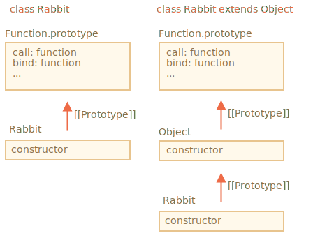

Voyons d'abord pourquoi ce dernier code ne fonctionne pas.

La raison devient évidente si nous essayons de l'exécuter. Un constructeur de classe héritant doit appeler `super()`. Sinon `"this"` ne sera pas "défini".

Alors, voici la solution:

```js run
class Rabbit extends Object {
  constructor(name) {
*!*
    super(); // besoin d'appeler le constructeur parent lors de l'héritage
*/!*
    this.name = name;
  }
}

let rabbit = new Rabbit("Rab");

alert( rabbit.hasOwnProperty('name') ); // true
```

Mais ce n'est pas tout.

<<<<<<< HEAD
Même après le correctif, il existe toujours une différence importante entre `"class Rabbit extends Object"` et `class Rabbit`.
=======
Even after the fix, there's still an important difference between `"class Rabbit extends Object"` and `class Rabbit`.
>>>>>>> 206485fc3a5465f961608b6e7303fae2e1a0e0b5

Comme on le sait, la syntaxe "extend" configure deux prototypes:

1. Entre le `"prototype"` des fonctions du constructeur (pour les méthodes).
2. Entre les fonctions du constructeur elles-mêmes (pour les méthodes statiques).

<<<<<<< HEAD
Dans notre cas, pour `class Rabbit extends Object`, cela signifie:
=======
In the case of `class Rabbit extends Object` it means:
>>>>>>> 206485fc3a5465f961608b6e7303fae2e1a0e0b5

```js run
class Rabbit extends Object {}

alert( Rabbit.prototype.__proto__ === Object.prototype ); // (1) true
alert( Rabbit.__proto__ === Object ); // (2) true
```

<<<<<<< HEAD
Donc `Rabbit` donne maintenant accès aux méthodes statiques de `Object` via `Rabbit`, comme ceci:
=======
So `Rabbit` now provides access to the static methods of `Object` via `Rabbit`, like this:
>>>>>>> 206485fc3a5465f961608b6e7303fae2e1a0e0b5

```js run
class Rabbit extends Object {}

*!*
// normalement nous appelons Object.getOwnPropertyNames
alert ( Rabbit.getOwnPropertyNames({a: 1, b: 2})); // a,b
*/!*
```

Mais si nous n’avons pas `extends Object`, alors `Rabbit.__proto__` n'est pas défini sur `Object`.

Voici la démo:

```js run
class Rabbit {}

alert( Rabbit.prototype.__proto__ === Object.prototype ); // (1) true
alert( Rabbit.__proto__ === Object ); // (2) false (!)
alert( Rabbit.__proto__ === Function.prototype ); // comme toute fonction par défaut

*!*
// error, no such function in Rabbit
alert ( Rabbit.getOwnPropertyNames({a: 1, b: 2})); // Error
*/!*
```

Donc, `Rabbit` ne donne pas accès aux méthodes statiques de `Object` dans ce cas.

<<<<<<< HEAD
En passant, `Function.prototype` a des méthodes de fonction  "génériques", comme `call`, `bind`, etc. Elles sont finalement disponibles dans les deux cas, car pour le constructeur `Object` intégré, `Object.__proto__ === Function.prototype`.
=======
By the way, `Function.prototype` also has "generic" function methods, like `call`, `bind` etc. They are ultimately available in both cases, because for the built-in `Object` constructor, `Object.__proto__ === Function.prototype`.
>>>>>>> 206485fc3a5465f961608b6e7303fae2e1a0e0b5

Voici l'image:



Donc, pour faire court, il y a deux différences:

| class Rabbit | class Rabbit extends Object  |
|--------------|------------------------------|
| --             | doit appeler `super()` dans le constructeur |
| `Rabbit.__proto__ === Function.prototype` | `Rabbit.__proto__ === Object` |
