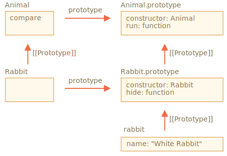

# Propriétés et méthodes statiques

<<<<<<< HEAD
Nous pouvons aussi assigner une méthode à la fonction de classe elle-même, pas à son `"prototype"`. De telles méthodes sont appelées *statique*.

Dans une classe, ils sont précédés du mot clé `static`, comme ceci:
=======
We can also assign a method to the class as a whole. Such methods are called *static*.

In a class declaration, they are prepended by `static` keyword, like this:
>>>>>>> 45934debd9bb31376ea5da129e266df5b43e545f

```js run
class User {
*!*
  static staticMethod() {
*/!*
    alert(this === User);
  }
}

User.staticMethod(); // true
```

Cela revient en fait à l'affecter directement à une propriété:

```js run
class User { }

User.staticMethod = function() {
  alert(this === User);
};

User.staticMethod(); // true
```

La valeur de `this` dans l'appel `User.staticMethod()` est le constructeur de la classe `User` lui-même (la règle "objet avant le point").

<<<<<<< HEAD
Généralement, les méthodes statiques sont utilisées pour implémenter des fonctions appartenant à la classe, mais pas à un objet particulier de celle-ci.

Par exemple, nous avons des objets `Article` et avons besoin d'une fonction pour les comparer. Une solution naturelle serait d’ajouter la méthode `Article.compare`, comme ceci:
=======
Usually, static methods are used to implement functions that belong to the class as a whole, but not to any particular object of it.

For instance, we have `Article` objects and need a function to compare them.

A natural solution would be to add `Article.compare` static method:
>>>>>>> 45934debd9bb31376ea5da129e266df5b43e545f

```js run
class Article {
  constructor(title, date) {
    this.title = title;
    this.date = date;
  }

*!*
  static compare(articleA, articleB) {
    return articleA.date - articleB.date;
  }
*/!*
}

// usage
let articles = [
  new Article("HTML", new Date(2019, 1, 1)),
  new Article("CSS", new Date(2019, 0, 1)),
  new Article("JavaScript", new Date(2019, 11, 1))
];

*!*
articles.sort(Article.compare);
*/!*

alert( articles[0].title ); // CSS
```

<<<<<<< HEAD
Ici, `Article.compare` est "au dessus" des articles, comme un moyen de les comparer. Ce n'est pas une méthode d'article, mais plutôt de toute la classe.

Un autre exemple serait une méthode dite "d'usine". Imaginez, nous avons besoin de peu de façons de créer un article:
=======
Here `Article.compare` method stands "above" articles, as a means to compare them. It's not a method of an article, but rather of the whole class.

Another example would be a so-called "factory" method.

Let's say, we need multiple ways to create an article:
>>>>>>> 45934debd9bb31376ea5da129e266df5b43e545f

1. Créez avec des paramètres donnés (`title`, `date` etc.).
2. Créez un article vide avec la date du jour.
3. ... ou d'une certaine manière.

Le premier moyen peut être implémenté par le constructeur. Et pour le second, nous pouvons créer une méthode statique de la classe.

<<<<<<< HEAD
Comme `Article.createTodays()` ici:
=======
Such as `Article.createTodays()` here:
>>>>>>> 45934debd9bb31376ea5da129e266df5b43e545f

```js run
class Article {
  constructor(title, date) {
    this.title = title;
    this.date = date;
  }

*!*
  static createTodays() {
    // rappelez vous, this = Article
    return new this("Today's digest", new Date());
  }
*/!*
}

let article = Article.createTodays();

alert( article.title ); // Today's digest
```

Maintenant, chaque fois que nous avons besoin de créer le résumé d'aujourd'hui, nous pouvons appeler `Article.createTodays()`. Encore une fois, ce n'est pas une méthode d'article, mais une méthode de toute la classe.

Les méthodes statiques sont également utilisées dans les classes liées à la base de données pour rechercher/enregistrer/supprimer des entrées dans la base de données, comme ceci:

```js
<<<<<<< HEAD
// en supposant que Article est une classe spéciale pour la gestion d'articles
// méthode statique pour supprimer l'article:
=======
// assuming Article is a special class for managing articles
// static method to remove the article by id:
>>>>>>> 45934debd9bb31376ea5da129e266df5b43e545f
Article.remove({id: 12345});
```

## Propriétés statiques

[recent browser=Chrome]

Les propriétés statiques sont également possibles, elles ressemblent aux propriétés de classe ordinaires, mais précédées de `static`:

```js run
class Article {
  static publisher = "Ilya Kantor";
}

alert( Article.publisher ); // Ilya Kantor
```

C’est la même chose qu’une assignation directe à `Article`:

```js
Article.publisher = "Ilya Kantor";
```

## Héritage de méthodes et de propriétés statiques [#heritage-de-methodes-et-proprietes-statiques]

Les propriétés et méthodes statiques sont héritées.

Par exemple, `Animal.compare` et `Animal.planet` dans le code ci-dessous sont hérités et accessibles  par `Rabbit.compare` `Rabbit.planet` :

```js run
class Animal {
  static planet = "Earth";

  constructor(name, speed) {
    this.speed = speed;
    this.name = name;
  }

  run(speed = 0) {
    this.speed += speed;
    alert(`${this.name} runs with speed ${this.speed}.`);
  }

*!*
  static compare(animalA, animalB) {
    return animalA.speed - animalB.speed;
  }
*/!*

}

// Hérite de Animal
class Rabbit extends Animal {
  hide() {
    alert(`${this.name} hides!`);
  }
}

let rabbits = [
  new Rabbit("White Rabbit", 10),
  new Rabbit("Black Rabbit", 5)
];

*!*
rabbits.sort(Rabbit.compare);
*/!*

rabbits[0].run(); // Black Rabbit runs with speed 5.

alert(Rabbit.planet); // Earth
```

Maintenant, lorsque nous appellerons `Rabbit.compare`, le `Animal.compare` hérité sera appelé.

Comment cela fonctionne t-il? Encore une fois, en utilisant des prototypes. Comme vous l'avez peut-être déjà deviné, `extends` donne à `Rabbit` la référence de `[[Prototype]]` à `Animal`.



Ainsi, `Rabbit extends Animal` crée deux références `[[Prototype]]`:

1. La fonction `Rabbit` hérite de façon prototypique de la fonction `Animal`.
2. `Rabbit.prototype` hérite de façon prototypique de `Animal.prototype`.

En conséquence, l'héritage fonctionne à la fois pour les méthodes régulières et statiques.

Vérifions cela par code:

```js run
class Animal {}
class Rabbit extends Animal {}

// pour les méthodes statiques
alert(Rabbit.__proto__ === Animal); // true

// pour les méthodes régulières
alert(Rabbit.prototype.__proto__ === Animal.prototype); // true
```

## Résumé

Les méthodes statiques sont utilisées pour les fonctionnalités appartenant à la classe "dans son ensemble". Cela ne concerne pas une instance de classe concrète.

Par exemple, une méthode de comparaison `Article.compare(article1, article2)` ou une méthode d'usine `Article.createTodays()`.

Ils sont étiquetés par le mot `static` dans la déclaration de classe.

Les propriétés statiques sont utilisées lorsque nous souhaitons stocker des données au niveau de la classe, également non liées à une instance.

La syntaxe est la suivante:

```js
class MyClass {
  static property = ...;

  static method() {
    ...
  }
}
```

Techniquement, la déclaration statique revient à assigner à la classe elle-même:

```js
MyClass.property = ...
MyClass.method = ...
```

Les propriétés et méthodes statiques sont héritées.

Pour `class B extends A`, le prototype de la classe `B` pointe lui-même à `A`: `B.[[Prototype]] = A`. Donc, si un champ n'est pas trouvé dans `B`, la recherche continue dans `A`.
