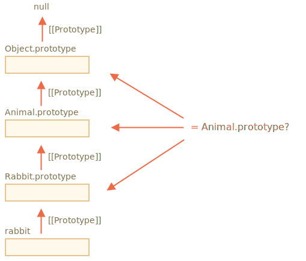

# Vérification de classe: "instanceof"

L'opérateur `instanceof` permet de vérifier si un objet appartient à une certaine classe. Il prend également en compte l'héritage.

Une telle vérification peut être nécessaire dans de nombreux cas. Nous l'utilisons ici pour construire une fonction *polymorphique*, celle qui traite les arguments différemment en fonction de leur type.

## L'opérateur instanceof [#ref-instanceof]

La syntaxe est la suivante:
```js
obj instanceof Class
```

Cela renvoie `true` si `obj` appartient à la `Class` ou à une classe qui en hérite.

Par exemple:

```js run
class Rabbit {}
let rabbit = new Rabbit();

// est-ce un objet de la classe Rabbit?
*!*
alert( rabbit instanceof Rabbit ); // true
*/!*
```

Cela fonctionne aussi avec les fonctions constructeur:

```js run
*!*
// au lieu de classe
function Rabbit() {}
*/!*

alert( new Rabbit() instanceof Rabbit ); // true
```

...Et avec des classes intégrées comme `Array`:

```js run
let arr = [1, 2, 3];
alert( arr instanceof Array ); // true
alert( arr instanceof Object ); // true
```

Veuillez noter que `arr` appartient également à la classe `Object`. C'est parce que `Array` hérite de manière prototypale de `Object`.

Normalement, l’opérateur `instanceof` examine la chaîne prototypale pour la vérification. Nous pouvons également définir une logique personnalisée dans la méthode statique `Symbol.hasInstance`.

L'algorithme de `obj instanceof Class` fonctionne à peu près comme suit:

1. S'il existe une méthode statique `Symbol.hasInstance`, appelez-la simplement: `Class[Symbol.hasInstance](obj)`. Cela devrait renvoyer `true` ou `false`, et nous avons terminé. C'est ainsi que nous pouvons personnaliser le comportement de `instanceof`.

     Par exemple:

```js run
// configuration du contrôle de instanceOf qui suppose que
// tout ce qui a la propriété canEat est un animal
class Animal {
  static [Symbol.hasInstance](obj) {
    if (obj.canEat) return true;
  }
}

let obj = { canEat: true };

alert(obj instanceof Animal); // true: Animal[Symbol.hasInstance](obj) est appelée
```

2. La plupart des classes n'ont pas `Symbol.hasInstance`. Dans ce cas, la logique standard est utilisée: `obj instanceOf Class` vérifie si `Class.prototype` est égale à l'un des prototypes de la chaîne prototypale `obj`.

    En d'autres termes, comparez les uns après les autres:
```js
obj.__proto__ === Class.prototype?
obj.__proto__.__proto__ === Class.prototype?
obj.__proto__.__proto__.__proto__ === Class.prototype?
...
// si une réponse est vraie, renvoie true
// sinon, si nous arrivons au bout de la chaîne, renvoie false
```

    Dans l'exemple ci-dessus, `rabbit.__ proto__ === Rabbit.prototype`, donne donc la réponse immédiatement.

     Dans le cas d'un héritage, le match sera à la deuxième étape:

```js run
class Animal {}
class Rabbit extends Animal {}

let rabbit = new Rabbit();
*!*
alert(rabbit instanceof Animal); // true
*/!*

// rabbit.__proto__ === Rabbit.prototype
*!*
// rabbit.__proto__.__proto__ === Animal.prototype (match!)
*/!*
```

Voici l'illustration de ce que `rabbit instanceof Animal` compare avec `Animal.prototype`:



À propos, il y a aussi une méthode [objA.isPrototypeOf(objB)](https://developer.mozilla.org/fr/docs/Web/JavaScript/Reference/Objets_globaux/Object/isPrototypeOf), qui renvoie `true` si `objA` se trouve quelque part dans la chaîne de prototypes pour `objB`. Ainsi, le test de `obj instanceof Class` peut être reformulé comme suit: `Class.prototype.isPrototypeOf(obj) `.

C'est drôle, mais le constructeur `Class` lui-même ne participe pas au contrôle! Seule la chaîne de prototypes et `Class.prototype` compte.

Cela peut avoir des conséquences intéressantes lorsque une propriété `prototype` est modifiée après la création de l'objet.

Comme ici:

```js run
function Rabbit() {}
let rabbit = new Rabbit();

// le prototype est changé
Rabbit.prototype = {};

// ...plus un rabbit!
*!*
alert( rabbit instanceof Rabbit ); // false
*/!*
```

## Bonus: Object.prototype.toString pour le type

Nous savons déjà que les objets simples sont convertis en chaîne sous la forme `[objet Objet]`:

```js run
let obj = {};

alert(obj); // [object Object]
alert(obj.toString()); // la même chose
```

C'est leur implémentation de `toString`. Mais il existe une fonctionnalité cachée qui rend `toString` beaucoup plus puissant que cela. Nous pouvons l'utiliser comme un `typeof` étendu et une alternative pour `instanceof`.

Cela semble étrange? Effectivement. Démystifions.

Par [spécification](https://tc39.github.io/ecma262/#sec-object.prototype.tostring), le `toString` intégré peut être extrait de l'objet et exécuté dans le contexte de toute autre valeur. Et son résultat dépend de cette valeur.

- Pour un nombre, ce sera `[object Number]`
- Pour un booléen, ce sera `[object Boolean]`
- Pour `null`: `[objet Null]`
- Pour `undefined`: `[objet Undefined]`
- Pour les tableaux: `[objet Array]`
- ... etc (personnalisable).

Montrons cela:

```js run
// copier la méthode toString dans une variable pour plus d'utilité
let objectToString = Object.prototype.toString;

// quel type est-ce?
let arr = [];

alert( objectToString.call(arr) ); // [object *!*Array*/!*]
```

Ici nous avons utilisé [call](https://developer.mozilla.org/fr/docs/Web/JavaScript/Reference/Objets_globaux/Function/call) comme décrit dans le chapitre [](info:call-apply-decorators) exécuter la fonction `objectToString` dans le contexte `this=arr`.

En interne, l'algorithme `toString` examine `this` et renvoie le résultat correspondant. Plus d'exemples:

```js run
let s = Object.prototype.toString;

alert( s.call(123) ); // [object Number]
alert( s.call(null) ); // [object Null]
alert( s.call(alert) ); // [object Function]
```

### Symbol.toStringTag

Le comportement de Object `toString` peut être personnalisé à l'aide d'une propriété d'objet spéciale `Symbol.toStringTag`.

Par exemple:

```js run
let user = {
  [Symbol.toStringTag]: "User"
};

alert( {}.toString.call(user) ); // [object User]
```

Pour la plupart des objets spécifiques à l'environnement, il existe une telle propriété. Voici quelques exemples spécifiques à votre navigateur :

```js run
<<<<<<< HEAD
// toStringTag pour l'objet et la classe spécifiques à l'environnement:
alert( window[Symbol.toStringTag]); // window
=======
// toStringTag for the environment-specific object and class:
alert( window[Symbol.toStringTag]); // Window
>>>>>>> ae1171069c2e50b932d030264545e126138d5bdc
alert( XMLHttpRequest.prototype[Symbol.toStringTag] ); // XMLHttpRequest

alert( {}.toString.call(window) ); // [object Window]
alert( {}.toString.call(new XMLHttpRequest()) ); // [object XMLHttpRequest]
```

Comme vous pouvez le constater, le résultat est exactement `Symbol.toStringTag` (s'il existe), encapsulé dans `[objet ...]`.

À la fin, nous avons "typeof sur stéroïdes" qui fonctionne non seulement pour les types de données primitifs, mais aussi pour les objets intégrés et peut même être personnalisé.

Nous pouvons utiliser `{}.toString.call` au lieu de `instanceof` pour les objets intégrés lorsque nous voulons obtenir le type sous forme de chaîne plutôt que simplement pour vérifier.

## Résumé

Résumons les méthodes de vérification de type que nous connaissons:

|               | fonctionne pour   |  renvoie      |
|---------------|-------------|---------------|
| `typeof`      | primitives  |  string       |
| `{}.toString` | primitives, objets intégrés, objets avec `Symbol.toStringTag`   |       string |
| `instanceof`  | objects     |  true/false   |

Comme on peut le constater, `{}.toString` est techniquement un `typeof` "plus avancé".

Et l'opérateur `instanceof` excelle lorsque nous travaillons avec une hiérarchie de classes et voulons vérifier si la classe prend en compte l'héritage.
