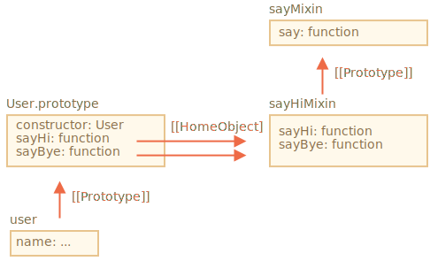

# Les mixins

En JavaScript, nous ne pouvons hériter que d'un seul objet. Il ne peut y avoir qu'un `[[Prototype]]` pour un objet. Et une classe peut étendre qu'une seule autre classe.

Mais parfois, cela semble limitant. Par exemple, nous avons une classe `StreetSweeper` et une classe `Bicycle`, et nous voulons faire leur mélange: un `StreetSweepingBicycle`.

Ou nous avons une classe `User` et une classe `EventEmitter` qui implémente la génération d'événements, et nous aimerions ajouter la fonctionnalité de `EventEmitter` à` User 'afin que nos utilisateurs puissent émettre des événements.

Il existe un concept qui peut aider ici, appelé "mixins".

Comme défini dans Wikipedia, un [mixin](https://fr.wikipedia.org/wiki/Mixin) est une classe contenant des méthodes qui peuvent être utilisées par d'autres classes sans avoir à en hériter.

En d'autres termes, un *mixin* fournit des méthodes qui implémentent un certain comportement, mais nous ne l'utilisons pas seul, nous l'utilisons pour ajouter le comportement à d'autres classes.

## Un exemple de mixin

Le moyen le plus simple d'implémenter un mixin en JavaScript est de créer un objet avec des méthodes utiles, de sorte que nous puissions facilement les fusionner dans un prototype de n'importe quelle classe.

Par exemple ici, le mixin `sayHiMixin` est utilisé pour ajouter un peu de "discours" à `User`:

```js run
*!*
// mixin
*/!*
let sayHiMixin = {
  sayHi() {
    alert(`Hello ${this.name}`);
  },
  sayBye() {
    alert(`Bye ${this.name}`);
  }
};

*!*
// usage:
*/!*
class User {
  constructor(name) {
    this.name = name;
  }
}

// copier les méthodes
Object.assign(User.prototype, sayHiMixin);

// maintenant User peut dire bonjour
new User("Dude").sayHi(); // Hello Dude!
```

Il n'y a pas d'héritage, mais une méthode de copie simple. Ainsi, `User` peut hériter d'une autre classe et inclure le mixin pour ajouter les méthodes supplémentaires, comme ceci:

```js
class User extends Person {
  // ...
}

Object.assign(User.prototype, sayHiMixin);
```

Les mixins peuvent utiliser l'héritage à l'intérieur d'eux-mêmes.

Par exemple, ici `sayHiMixin` hérite de `sayMixin`:

```js run
let sayMixin = {
  say(phrase) {
    alert(phrase);
  }
};

let sayHiMixin = {
  __proto__: sayMixin, // (ou nous pourrions utiliser Object.setPrototypeOf pour définir le prototype ici)

  sayHi() {
    *!*
    // appeler la méthode du parent
    */!*
    super.say(`Hello ${this.name}`); // (*)
  },
  sayBye() {
    super.say(`Bye ${this.name}`); // (*)
  }
};

class User {
  constructor(name) {
    this.name = name;
  }
}

// copier les méthodes
Object.assign(User.prototype, sayHiMixin);

// maintenant User peut dire bonjour
new User("Dude").sayHi(); // Hello Dude!
```

Veuillez noter que l’appel à la méthode du parent `super.say()` à partir de `sayHiMixin` (aux lignes étiquetées avec `(*)`) recherche la méthode dans le prototype de ce mixin, pas la classe.

Voici le schéma (voir la partie droite):



C'est parce que les méthodes `sayHi` et `sayBye` ont été initialement créées dans `sayHiMixin`. Ainsi, même si elles ont été copiées, leur propriété interne `[[HomeObject]]` fait référence à `sayHiMixin`, comme indiqué sur l’image ci-dessus.

<<<<<<< HEAD
Comme `super` cherche des méthodes du parent dans `[[HomeObject]].[[Prototype]]`, cela signifie qu'il cherche `sayHiMixin.[[Prototype]]`, et non pas `User.[[Prototype]]`.
=======
As `super` looks for parent methods in `[[HomeObject]].[[Prototype]]`, that means it searches `sayHiMixin.[[Prototype]]`.
>>>>>>> bf7d8bb1af3b416d393af1c15b03cb1352da1f9c

## EventMixin

Faisons maintenant un mixin concret.

Une caractéristique importante de nombreux objets de navigateur (par exemple) est qu'ils peuvent générer des événements. Les événements sont un excellent moyen de "diffuser des informations" à tous ceux qui le souhaitent. Faisons donc un mixin qui permet d’ajouter facilement des fonctions relatives aux événements à n’importe quelle classe/objet.

- Le mixin fournira une méthode `.trigger(name, [... data])` pour "générer un événement" quand quelque chose d'important lui arrive. L'argument `name` est un nom de l'événement, éventuellement suivi d'arguments supplémentaires avec les données d'événement.
- Egalement la méthode `.on(name, handler)` qui ajoute la fonction `handler` en tant qu'écouteur aux événements portant le nom donné. Il sera appelé lorsqu’un événement avec le `name` donné se déclenche, et récupérera les arguments de l’appel `.trigger`.
- ... Et la méthode `.off(name, handler)` qui supprime le programme d'écoute `handler`.

Après avoir ajouté le mixin, un objet `user` sera capable de générer un événement `"login"` lorsque le visiteur se connectera. Un autre objet, par exemple, `calendar` peut vouloir écouter de tels événements pour charger le calendrier de la personne connectée.

Ou bien, un `menu` peut générer l'événement `"select"` lorsqu'un élément de menu est sélectionné, et d'autres objets peuvent affecter des gestionnaires pour réagir à cet événement. Etc.

Voici le code:

```js run
let eventMixin = {
  /**
   * Souscrire à l'événement, usage:
   *  menu.on('select', function(item) { ... }
  */
  on(eventName, handler) {
    if (!this._eventHandlers) this._eventHandlers = {};
    if (!this._eventHandlers[eventName]) {
      this._eventHandlers[eventName] = [];
    }
    this._eventHandlers[eventName].push(handler);
  },

  /**
   * Annuler la souscription, usage:
   *  menu.off('select', handler)
   */
  off(eventName, handler) {
    let handlers = this._eventHandlers?.[eventName];
    if (!handlers) return;
    for (let i = 0; i < handlers.length; i++) {
      if (handlers[i] === handler) {
        handlers.splice(i--, 1);
      }
    }
  },

  /**
   * Générer un événement avec le nom et les données donnés
   *  this.trigger('select', data1, data2);
   */
  trigger(eventName, ...args) {
    if (!this._eventHandlers?.[eventName]) {
      return; // aucun gestionnaire pour ce nom d'événement
    }

    // appeler les gestionnaires
    this._eventHandlers[eventName].forEach(handler => handler.apply(this, args));
  }
};
```


- `.on(eventName, handler)` - assigne la fonction `handler` à exécuter lorsque l'événement portant ce nom se produit. Techniquement, il existe une propriété `_eventHandlers`, qui stocke un tableau de gestionnaires pour chaque nom d'événement, et simplement ajouté à la liste.
- `.off(eventName, handler)` - supprime la fonction de la liste des gestionnaires.
- `.trigger(eventName, ... args)` - génère l'événement: tous les gestionnaires de `_eventHandlers[eventName]` sont appelés, avec une liste d'arguments `...args`.

Usage:

```js run
// Créez une classe
class Menu {
  choose(value) {
    this.trigger("select", value);
  }
}
// Ajouter le mixin avec les méthodes liées aux événements
Object.assign(Menu.prototype, eventMixin);

let menu = new Menu();

// ajouter un gestionnaire, à appeler lors de la sélection:
*!*
menu.on("select", value => alert(`Value selected: ${value}`));
*/!*

// déclenche l'événement => le gestionnaire ci-dessus s'exécute et affiche:
// Value selected: 123
menu.choose("123");
```

Maintenant, si nous souhaitons que le code réagisse lors de la sélection du menu, nous pouvons l'écouter avec `menu.on(...)`.

Et `eventMixin` mixin facilite l'ajout d'un tel comportement à autant de classes que nous le voudrions, sans interférer avec la chaîne d'héritage.

## Résumé

*Mixin* -- est un terme générique de programmation orienté objet: une classe contenant des méthodes pour d’autres classes.

D'autres langages autorisent l'héritage multiple. JavaScript ne prend pas en charge l'héritage multiple, mais les mixins peuvent être implémentés en copiant les méthodes dans le prototype.

Nous pouvons utiliser les mixins comme moyen d'ajouter à une classe plusieurs comportements, comme la gestion d'événements, comme nous l'avons vu ci-dessus.

Les mixins peuvent devenir un point de conflit s'ils écrasent accidentellement les méthodes de classe existantes. En règle générale, il convient de bien réfléchir aux méthodes de nommage d’un mixin, afin de minimiser la probabilité que cela se produise.
