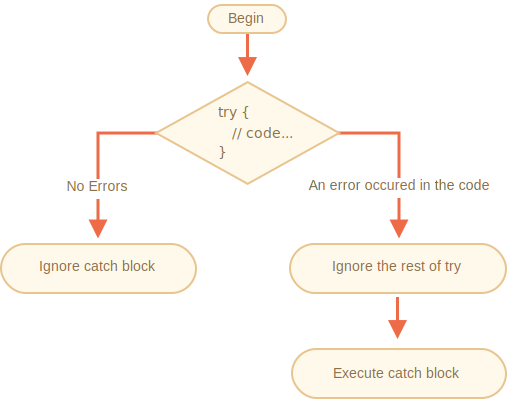

# Gestion des erreurs, "try...catch"

Peu importe notre niveau en programmation, nos scripts comportent parfois des erreurs. Elles peuvent être dues à nos erreurs, à une entrée utilisateur imprévue, à une réponse erronée du serveur et à mille autres raisons.

Généralement, un script "meurt" (s'arrête immédiatement) en cas d'erreur, en l'imprimant sur la console.

Mais il existe une construction de syntaxe `try...catch` qui permet au script "d'attraper" les erreurs et, au lieu de mourir en cas de problème, de faire quelque chose de plus raisonnable.

## La syntaxe "try...catch"

La construction `try...catch` a deux blocs principaux: `try`, puis `catch`:

```js
try {

  // code...

} catch (err) {

  // Gestion des erreurs

}
```

Cela fonctionne comme ceci:

1. Tout d'abord, le code dans `try {...}` est exécuté.
2. S'il n'y a pas eu d'erreur, alors `catch(err)` est ignoré : l'exécution arrive à la fin de `try` et continue en ignorant `catch`.
3. Si une erreur survient, alors l'exécution de `try` est arrêtée et le contrôle se place au début de `catch(err) `. La variable `err` (qui peut utiliser n'importe quel nom) contient un objet d'erreur avec des détails sur ce qui s'est passé.



Donc, une erreur dans le bloc `try {...}` ne tue pas le script -- nous avons une opportunité de la gérer dans `catch`.

Voyons des exemples.

- Un exemple sans erreur: affiche `alert` `(1)` et `(2)`:

    ```js run
    try {

      alert('Start of try runs');  // *!*(1) <--*/!*

      // ...pas d'erreur

      alert('End of try runs');   // *!*(2) <--*/!*

    } catch (err) {

      alert('Catch is ignored, because there are no errors'); // (3)

    }
    ```
- Un exemple avec une erreur: montre `(1)` et `(3)`:

    ```js run
    try {

      alert('Start of try runs');  // *!*(1) <--*/!*

    *!*
      lalala; // error, variable is not defined!
    */!*

      alert('End of try (never reached)');  // (2)

    } catch (err) {

      alert(`Error has occurred!`); // *!*(3) <--*/!*

    }
    ```


````warn header="`try...catch` ne fonctionne que pour les erreurs d'exécution"
Pour que `try...catch` fonctionne, le code doit être exécutable. En d'autres termes, le code doit être du JavaScript valide.

Cela ne fonctionnera pas si le code est syntaxiquement incorrect, par exemple, il a des accolades inégalées:

```js run
try {
  {{{{{{{{{{{{
} catch (err) {
  alert("The engine can't understand this code, it's invalid");
}
```

Le moteur JavaScript lit d'abord le code, puis l'exécute. Les erreurs qui se produisent lors de la phase de lecture sont appelées erreurs "d'analyse" et sont irrécupérables (de l'intérieur de ce code). C'est parce que le moteur ne peut pas comprendre le code.

Ainsi, `try...catch` ne peut gérer que les erreurs qui se produisent dans du code valide. De telles erreurs sont appelées "erreurs d'exécution" ou, parfois, "exceptions".
````


````warn header="`try...catch` fonctionne de manière synchrone"
Si une exception se produit dans le code "planifié", comme dans `setTimeout`,`try...catch` ne l'attrapera pas :

```js run
try {
  setTimeout(function() {
    noSuchVariable; // le script mourra ici
  }, 1000);
} catch (err) {
  alert( "won't work" );
}
```

C’est parce que la fonction elle-même est exécutée ultérieurement, lorsque le moteur a déjà quitté la construction `try...catch`.

Pour capturer une exception dans une fonction planifiée, `try...catch` doit être à l'intérieur de cette fonction :
```js run
setTimeout(function() {
  try {    
    noSuchVariable; // try...catch gère l'erreur!
  } catch {
    alert( "error is caught here!" );
  }
}, 1000);
```
````

## Objet d'erreur

En cas d'erreur, JavaScript génère un objet contenant les détails à son sujet. L'objet est ensuite passé en argument à `catch`:

```js
try {
  // ...
} catch(err) { // <-- "l'objet d'erreur", pourrait utiliser un autre mot au lieu de err
  // ...
}
```

Pour toutes les erreurs intégrées, l'objet d'erreur a deux propriétés principales:

`name`
: Nom de l'erreur. Par exemple, pour une variable non définie, il s'agit de `"ReferenceError"`.

`message`
: Message textuel sur les détails de l'erreur.

Il existe d'autres propriétés non standard disponibles dans la plupart des environnements. L'un des plus largement utilisés et supportés est:

`stack`
: Pile d'exécution en cours: chaîne contenant des informations sur la séquence d'appels imbriqués ayant entraîné l'erreur. Utilisé à des fins de débogage.

Par exemple:

```js run untrusted
try {
*!*
  lalala; // error, variable is not defined!
*/!*
} catch (err) {
  alert(err.name); // ReferenceError
  alert(err.message); // lalala is not defined
  alert(err.stack); // ReferenceError: lalala is not defined at (...call stack)

  // Peut aussi montrer une erreur dans son ensemble
  // L'erreur est convertie en chaîne comme "name: message"
  alert(err); // ReferenceError: lalala is not defined
}
```

## Omission facultative pour "catch"

[recent browser=new]

Si nous n'avons pas besoin de détails d'erreur, `catch` peut l'omettre:

```js
try {
  // ...
} catch { // <-- sans (err)
  // ...
}
```

## L'utilisation de "try..catch"

Explorons un cas d'utilisation réel de `try...catch`.

Comme nous le savons déjà, JavaScript prend en charge la méthode [JSON.parse(str)](https://developer.mozilla.org/fr/docs/Web/JavaScript/Reference/Objets_globaux/JSON/parse) pour lire les valeurs encodées en JSON.

Il est généralement utilisé pour décoder les données reçues sur le réseau, par le serveur ou par une autre source.

Nous le recevons et appelons `JSON.parse` comme ceci:

```js run
let json = '{"name":"John", "age": 30}'; // données du serveur

*!*
let user = JSON.parse(json); // convertir la représentation textuelle en objet JS
*/!*

// maintenant, user est un objet avec les propriétés de la chaîne
alert( user.name ); // John
alert( user.age );  // 30
```

Vous trouverez des informations plus détaillées sur JSON dans le chapitre <info:json>.

**Si `json` est malformé, `JSON.parse` génère une erreur, de sorte que le script "meurt".**

Devrions-nous en être satisfaits ? Bien sûr que non!

De cette façon, si quelque chose ne va pas avec les données, le visiteur ne le saura jamais (à moins d'ouvrir la console du développeur). Et les gens n'aiment vraiment pas quand quelque chose "meurt" sans aucun message d'erreur.

Utilisons `try...catch` pour gérer l'erreur :

```js run
let json = "{ bad json }";

try {

*!*
  let user = JSON.parse(json); // <-- quand une erreur se produit...
*/!*
  alert( user.name ); // ne fonctionne pas

} catch (err) {
*!*
  // ...l'exécution saute ici
  alert( "Our apologies, the data has errors, we'll try to request it one more time." );
  alert( err.name );
  alert( err.message );
*/!*
}
```

Ici, nous utilisons le bloc `catch` uniquement pour afficher le message, mais nous pouvons faire beaucoup plus: envoyer une nouvelle requête réseau, suggérer une alternative au visiteur, envoyer des informations sur l'erreur à un enregistrement des erreurs, ... . Bien mieux que de juste mourir.

## Lever nos propres exceptions

Que se passe-t-il si `json` est correct du point de vue syntaxique, mais qu'il n'a pas de propriété requise `name`?

Comme ceci:

```js run
let json = '{ "age": 30 }'; // données incomplètes

try {

  let user = JSON.parse(json); // <-- pas d'erreurs
*!*
  alert( user.name ); // pas de "name"!
*/!*

} catch (err) {
  alert( "doesn't execute" );
}
```

Ici, `JSON.parse` fonctionne normalement, mais l'absence de `name` est en réalité une erreur pour nous.

Pour unifier le traitement des erreurs, nous allons utiliser l'opérateur `throw`.

### L'instruction "throw"

L'instruction `throw` génère une erreur.

La syntaxe est la suivante:

```js
throw <error object>
```

Techniquement, on peut utiliser n'importe quoi comme objet d'erreur. Cela peut même être une primitive, comme un nombre ou une chaîne, mais il est préférable d’utiliser des objets, de préférence avec les propriétés `name` et `message` (pour rester quelque peu compatibles avec les erreurs intégrées).

JavaScript comporte de nombreux constructeurs intégrés pour les erreurs standard: `Error`, `SyntaxError`, `ReferenceError`, `TypeError` et autres. Nous pouvons également les utiliser pour créer des objets d'erreur.

Leur syntaxe est la suivante:

```js
let error = new Error(message);
// ou
let error = new SyntaxError(message);
let error = new ReferenceError(message);
// ...
```

Pour les erreurs intégrées (pas pour les objets, mais pour les erreurs), la propriété `name` est exactement le nom du constructeur. Et `message` est tiré de l'argument.

Par exemple:

```js run
let error = new Error("Things happen o_O");

alert(error.name); // Error
alert(error.message); // Things happen o_O
```

Voyons quel type d'erreur `JSON.parse` génère:

```js run
try {
  JSON.parse("{ bad json o_O }");
} catch (err) {
*!*
  alert(err.name); // SyntaxError
*/!*
  alert(err.message); // Unexpected token b in JSON at position 2
}
```

Comme on peut le constater, c’est une `SyntaxError`.

Et dans notre cas, l’absence de `name` est une erreur, car les utilisateurs doivent avoir un` name`.

Alors utilisons throw:

```js run
let json = '{ "age": 30 }'; // données incomplètes

try {

  let user = JSON.parse(json); // <-- pas d'erreurs

  if (!user.name) {
*!*
    throw new SyntaxError("Incomplete data: no name"); // (*)
*/!*
  }

  alert( user.name );

} catch (err) {
  alert( "JSON Error: " + err.message ); // JSON Error: Incomplete data: no name
}
```

Dans la ligne `(*)`, l'instruction `throw` génère une `SyntaxError` avec le `message` donné, de la même manière que JavaScript le générerait lui-même. L'exécution de `try` s'arrête immédiatement et le flux de contrôle saute dans `catch`.

Maintenant, `catch` est devenu un emplacement unique pour toutes les erreurs de traitement: à la fois pour `JSON.parse` et d'autres cas.

## Propager une exception

Dans l'exemple ci-dessus, nous utilisons `try...catch` pour gérer des données incorrectes. Mais est-il possible qu’*une autre erreur inattendue* se produise dans le bloc `try {...}` ? Comme une erreur de programmation (variable is not defined) ou quelque chose d'autre, pas seulement cette "donnée incorrecte".

Par exemple :

```js run
let json = '{ "age": 30 }'; // données incomplètes

try {
  user = JSON.parse(json); // <-- oublié de mettre "let" avant user

  // ...
} catch (err) {
  alert("JSON Error: " + err); // JSON Error: ReferenceError: user is not defined
  // (aucune erreur JSON)
}
```

Bien sûr, tout est possible! Les programmeurs font des erreurs. Même dans les utilitaires à code source ouvert utilisés par des millions de personnes pendant des décennies, on découvre soudainement un bug qui conduit à de terribles piratages.

Dans notre cas, `try...catch` est destiné à intercepter les erreurs "incorrect data". Mais par sa nature, `catch` obtient *toutes* les erreurs de `try`. Ici, une erreur inattendue se produit, mais le même message `"JSON Error"` est toujours affiché. C'est faux et rend également le code plus difficile à déboguer.

Pour éviter de tels problèmes, nous pouvons utiliser la technique du "rethrowing" (re-lancement). La règle est simple :

**Catch ne doit traiter que les erreurs qu'il connaît et "renvoyer" toutes les autres.**

La technique "rethrowing" peut être expliqué plus en détail comme :

1. Catch obtient toutes les erreurs.
2. Dans le bloc `catch (err) {...}` nous analysons l'objet d'erreur `err`.
3. Si nous ne savons pas comment le gérer, nous faisons `throw err`.

Habituellement, nous pouvons vérifier le type d'erreur en utilisant l'opérateur `instanceof` :

```js run
try {
  user = { /*...*/ };
} catch (err) {
*!*
  if (err instanceof ReferenceError) {
*/!*
    alert('ReferenceError'); // "ReferenceError" for accessing an undefined variable
  }
}
```

Nous pouvons également obtenir le nom de la classe d'erreur à partir de la propriété `err.name`. Toutes les erreurs natives l'ont. Une autre option est de lire `err.constructor.name`.

Dans le code ci-dessous, nous utilisons la technique de "propagation" pour que `catch` ne traite que `SyntaxError`:

```js run
let json = '{ "age": 30 }'; // données incomplètes
try {

  let user = JSON.parse(json);

  if (!user.name) {
    throw new SyntaxError("Incomplete data: no name");
  }

*!*
  blabla(); // erreur inattendue
*/!*

  alert( user.name );

} catch (err) {

*!*
  if (err instanceof SyntaxError) {
    alert( "JSON Error: " + err.message );
  } else {
    throw err; // propager (*)
  }
*/!*

}
```

L’erreur de l’instruction throw à la ligne `(*)` de l’intérieur du bloc `catch` "tombe" de `try...catch` et peut être interceptée par une construction externe `try...catch` (si elle existe), ou tue le script.

Ainsi, le bloc `catch` ne traite que les erreurs qu’il sait gérer et" ignore "toutes les autres.

L'exemple ci-dessous montre comment de telles erreurs peuvent être interceptées par un niveau supplémentaire de `try...catch` :

```js run
function readData() {
  let json = '{ "age": 30 }';

  try {
    // ...
*!*
    blabla(); // error!
*/!*
  } catch (err) {
    // ...
    if (!(err instanceof SyntaxError)) {
*!*
      throw err; // propager (ne sachant pas comment gérer)
*/!*
    }
  }
}

try {
  readData();
} catch (err) {
*!*
  alert( "External catch got: " + err ); // attrapé!
*/!*
}
```

Ici, `readData` ne sait que gérer `SyntaxError`, alors que le `try...catch` extérieur sait comment tout gérer.

## try...catch...finally

Attends, ce n'est pas tout.

La construction `try...catch` peut avoir une autre clause de code : `finally`.

S'il existe, il s'exécute dans tous les cas:

- après `try`, s'il n'y a pas eu d'erreur,
- après `catch`, s'il y a eu des erreurs.

La syntaxe étendue ressemble à ceci:

```js
*!*try*/!* {
   ... try to execute the code ...
} *!*catch*/!* (err) {
   ... handle errors ...
} *!*finally*/!* {
   ... execute always ...
}
```

Essayez d'exécuter ce code:

```js run
try {
  alert( 'try' );
  if (confirm('Make an error?')) BAD_CODE();
} catch (err) {
  alert( 'catch' );
} finally {
  alert( 'finally' );
}
```

Le code a deux manières d'exécution:

1. Si vous répondez "Yes" à "Make an error?", Alors `try -> catch -> finally`.
2. Si vous dites "No", alors `try -> finally`.

La clause `finally` est souvent utilisée lorsque nous commençons à faire quelque chose et que nous voulons le finaliser dans tous les cas de résultats.

Par exemple, nous voulons mesurer le temps que prend une fonction de nombre de Fibonacci `fib(n)`. Naturellement, nous pouvons commencer à mesurer avant l'exécution et finir ensuite. Mais que se passe-t-il s'il y a une erreur lors de l'appel de la fonction? En particulier, la mise en oeuvre de `fib(n)` dans le code ci-dessous renvoie une erreur pour les nombres négatifs ou non entiers.

La clause `finally` est un bon endroit pour finir les mesures, quoi qu’il arrive.

Ici, `finally` garantit que le temps sera correctement mesuré dans les deux situations - en cas d’exécution réussie de `fib` et en cas d’erreur:

```js run
let num = +prompt("Enter a positive integer number?", 35)

let diff, result;

function fib(n) {
  if (n < 0 || Math.trunc(n) != n) {
    throw new Error("Must not be negative, and also an integer.");
  }
  return n <= 1 ? n : fib(n - 1) + fib(n - 2);
}

let start = Date.now();

try {
  result = fib(num);
} catch (err) {
  result = 0;
*!*
} finally {
  diff = Date.now() - start;
}
*/!*

alert(result || "error occurred");

alert( `execution took ${diff}ms` );
```

Vous pouvez vérifier en exécutant le code en entrant `35` dans `prompt` - il s'exécute normalement, `finally` après `try`. Puis entrez `-1` -- il y aura une erreur immédiate, puis l'exécution prendra `0ms`. Les deux mesures sont effectuées correctement.

En d'autres termes, la fonction peut finir par `return` ou `throw`, cela n'a pas d'importance. La clause `finally` s'exécute dans les deux cas.


```smart header="Les variables sont locales à l'intérieur de `try...catch...finally`"
Veuillez noter que les variables `result` et `diff` dans le code ci-dessus sont déclarées *avant* `try...catch`.

Sinon, si nous déclarions `let` dans le bloc `try`, il ne serait visible qu'à l'intérieur de celui-ci.
```

````smart header="`finally` et `return`"
La clause `finally` fonctionne pour *toute* sortie de `try...catch`. Cela inclut un `return` explicite.

Dans l'exemple ci-dessous, il y a `return` dans `try`. Dans ce cas, `finally` est exécuté juste avant que le contrôle ne retourne au code externe.

```js run
function func() {

  try {
*!*
    return 1;
*/!*

  } catch (err) {
    /* ... */
  } finally {
*!*
    alert( 'finally' );
*/!*
  }
}

alert( func() ); // en premièr l'alert du `finally`, puis celle-ci
```
````

````smart header="`try...finally`"

La construction `try...finally`, sans la clause `catch`, est également utile. Nous l'appliquons lorsque nous ne voulons pas gérer les erreurs ici (laissez-les tomber), mais nous voulons être sûrs que les processus que nous avons démarrés sont finalisés.

```js
function func() {
  // commencer à faire quelque chose qui doit être complété (comme des mesures)
  try {
    // ...
  } finally {
    // compléter cette chose, même si tout meurt
  }
}
```
Dans le code ci-dessus, une erreur à l'intérieur de `try` tombe toujours, car il n'y a pas de `catch`. Mais `finally` fonctionne avant que le flux d’exécution ne quitte la fonction.
````

## Catch globale

```warn header="Spécifique à l'environnement"
Les informations de cette section ne font pas partie du code JavaScript principal.
```

Imaginons que nous ayons une erreur fatale en dehors de `try...catch` et que le script soit mort. Comme une erreur de programmation ou autre chose terrible.

Y a-t-il un moyen de réagir à de tels événements ? Nous pouvons vouloir enregistrer l'erreur, montrer quelque chose à l'utilisateur (normalement, ils ne voient pas les messages d'erreur), etc.

Il n'y en a pas dans la spécification, mais les environnements le fournissent généralement, car c'est vraiment utile. Par exemple, Node.js a [`process.on("uncaughtException")`](https://nodejs.org/api/process.html#process_event_uncaughtexception) pour ça. Et dans le navigateur, nous pouvons attribuer une fonction à la propriété [window.onerror](https://developer.mozilla.org/fr/docs/Web/API/GlobalEventHandlers/onerror), qui fonctionnera en cas d'erreur non interceptée.

La syntaxe:

```js
window.onerror = function(message, url, line, col, error) {
  // ...
};
```

`message`
: Message d'erreur.

`url`
: URL du script où l'erreur s'est produite.

`line`, `col`
: Numéros de ligne et de colonne où une erreur s'est produite.

`error`
: Objet d'erreur.

Par exemple:

```html run untrusted refresh height=1
<script>
*!*
  window.onerror = function(message, url, line, col, error) {
    alert(`${message}\n At ${line}:${col} of ${url}`);
  };
*/!*

  function readData() {
    badFunc(); // Whoops, quelque chose s'est mal passé!
  }

  readData();
</script>
```

Le rôle du gestionnaire global `window.onerror` est généralement de ne pas récupérer l'exécution du script - c'est probablement impossible en cas d'erreur de programmation, mais d'envoyer le message d'erreur aux développeurs.

Il existe également des services Web fournissant un journal des erreurs pour de tels cas, comme<https://errorception.com> ou <http://www.muscula.com>.

Ils fonctionnent comme ceci:

1. Nous nous inscrivons au service et obtenons un morceau de JS (ou une URL de script) à insérer sur des pages.
2. Ce script JS définit une fonction `window.onerror` personnalisée.
3. Lorsqu'une erreur se produit, une demande réseau à ce sujet est envoyée au service.
4. Nous pouvons nous connecter à l'interface Web du service et voir les erreurs.

## Résumé

La construction `try...catch` permet de gérer les erreurs d'exécution. Cela permet littéralement "d'essayer" (`try`) d'exécuter le code et "d’attraper" (`catch`) les erreurs qui peuvent s'y produire.

La syntaxe est la suivante:

```js
try {
  // exécuter ce code
} catch(err) {
  // si une erreur s'est produite, alors saute ici
  // err est l'objet d'erreur
} finally {
  // faire dans tous les cas après try / catch
}
```

Il peut ne pas y avoir de section `catch` ou de `finally`, donc les constructions plus courtes `try...catch` et `try...finally` sont également valides.

Les objets d'erreur ont les propriétés suivantes:

- `message` - le message d'erreur.
- `name` - la chaîne avec le nom d'erreur (nom du constructeur de l'erreur).
- `stack` (non standard, mais bien supporté) - la pile d'exécution au moment de la création de l'erreur.

Si un objet d'erreur n'est pas nécessaire, nous pouvons l'omettre en utilisant `catch {` au lieu de `catch(err) {`.

Nous pouvons également générer nos propres erreurs en utilisant l'opérateur `throw`. Techniquement, l'argument de `throw` peut être n'importe quoi, mais il s'agit généralement d'un objet d'erreur héritant de la classe `Error` intégrée. Plus d'informations sur l'extension des erreurs dans le chapitre suivant.

La technique de *propagation* est un modèle très important de gestion des erreurs: un bloc `catch` s'attend généralement à savoir comment gérer le type d'erreur particulier et sait comment le gérer. Il doit donc "propager" les erreurs qu'il ne connaît pas.

Même si nous n'avons pas `try...catch`, la plupart des environnements permettent de configurer un gestionnaire d'erreurs "globale" pour intercepter les erreurs qui "tombent". Dans le navigateur, c'est `window.onerror`.
