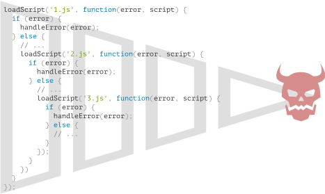

# Introduction: callbacks

```warn header="Nous utilisons ici des méthodes du navigateur dans les exemples"
Pour démontrer l'utilisation des callbacks, des promesses et d'autres concepts abstraits, nous utiliserons certaines méthodes du navigateur : plus précisément, nous chargerons des scripts et effectuerons des manipulations simples de documents.

Si vous n'êtes pas familier avec ces méthodes, et que leur utilisation dans les exemples est confuse, vous pouvez lire quelques chapitres de la [partie suivante](/document) du tutoriel.

Mais nous allons quand même essayer de rendre les choses claires. Il n'y aura rien de vraiment complexe au niveau du navigateur.
```

De nombreuses fonctions sont fournies par les environnements hôtes JavaScript qui vous permettent de planifier des actions *asynchrones*. En d'autres termes, des actions que nous lançons maintenant, mais qui se terminent plus tard.

Par exemple, une de ces fonctions est la fonction `setTimeout`.

Il existe d'autres exemples concrets d'actions asynchrones, par exemple le chargement de scripts et de modules (nous les aborderons dans les chapitres suivants).

Regardez la fonction `loadScript(src)`, qui charge un script avec le `src` donné:

```js
function loadScript(src) {
  // crée une balise <script> et l'ajoute à la page
  // ceci fait que le script avec la src donnée commence à se charger et s'exécute une fois terminé.
  let script = document.createElement('script');
  script.src = src;
  document.head.append(script);
}
```

Il insère dans le document une nouvelle balise, créée dynamiquement, `<script src="...">` avec le `src` donné. Le navigateur commence automatiquement à la charger et l'exécute lorsqu'elle est terminée.

Nous pouvons utiliser cette fonction comme suit :

```js
// charger et exécuter le script au chemin donné
loadScript('/my/script.js');
```

Le script est exécuté de manière "asynchrone", car il commence à se charger maintenant, mais s'exécute plus tard, lorsque la fonction est déjà terminée.

S'il y a du code sous `loadScript(...)`, il n'attend pas que le chargement du script soit terminé.

```js
loadScript('/my/script.js');
// le code dessous loadScript
// n'attend pas que le chargement du script soit terminé
// ...
```

Disons que nous devons utiliser le nouveau script dès qu'il est chargé. Il déclare de nouvelles fonctions, et nous voulons les exécuter.

Mais si nous le faisons immédiatement après l'appel `loadScript(...)`, cela ne fonctionnera pas:

```js
loadScript('/my/script.js'); // le script a "function newFunction() {…}"

*!*
newFunction(); // aucune fonction de ce type!
*/!*
```

Naturellement, le navigateur n'a probablement pas eu le temps de charger le script. Pour l'instant, la fonction `loadScript` ne permet pas de suivre l'achèvement du chargement. Le script se charge et finit par s'exécuter, c'est tout. Mais nous aimerions savoir quand cela se produit, pour utiliser les nouvelles fonctions et variables de ce script.

Ajoutons une fonction `callback` comme second argument à `loadScript` qui doit s'exécuter lorsque le script se charge :

```js
function loadScript(src, *!*callback*/!*) {
  let script = document.createElement('script');
  script.src = src;

*!*
  script.onload = () => callback(script);
*/!*

  document.head.append(script);
}
```

<<<<<<< HEAD
Maintenant, si nous voulons appeler de nouvelles fonctions depuis le script, nous devons l'écrire dans le callback:
=======
The `onload` event is described in the article <info:onload-onerror#loading-a-script>, it basically executes a function after the script is loaded and executed.

Now if we want to call new functions from the script, we should write that in the callback:
>>>>>>> 30a5d5e2a7c3504c9afd5028f83f4a696e60aede

```js
loadScript('/my/script.js', function() {
  // le callback est exécuté après le chargement du script
  newFunction(); // maintenant cela fonctionne
  ...
});
```

C'est l'idée: le deuxième argument est une fonction (généralement anonyme) qui s'exécute lorsque l'action est terminée.

Voici un exemple exécutable avec un vrai script :

```js run
function loadScript(src, callback) {
  let script = document.createElement('script');
  script.src = src;
  script.onload = () => callback(script);
  document.head.append(script);
}

*!*
loadScript('https://cdnjs.cloudflare.com/ajax/libs/lodash.js/3.2.0/lodash.js', script => {
  alert(`Cool, the script ${script.src} is loaded`);
<<<<<<< HEAD
  alert( _ ); // fonction déclarée dans le script chargé
=======
  alert( _ ); // _ is a function declared in the loaded script
>>>>>>> 30a5d5e2a7c3504c9afd5028f83f4a696e60aede
});
*/!*
```

C'est ce qu'on appelle un style de programmation asynchrone basé sur les "callbacks". Une fonction qui fait quelque chose de manière asynchrone doit fournir un argument `callback` où nous mettons la fonction à exécuter après qu'elle soit terminée.

Ici nous l'avons fait dans `loadScript`, mais bien sûr c'est une approche générale.

## Callback imbriqué

Comment charger deux scripts de manière séquentielle: le premier, puis le second après lui ?

La solution naturelle serait de placer le second appel `loadScript` à l'intérieur du callback, comme ceci:

```js
loadScript('/my/script.js', function(script) {

  alert(`Cool, the ${script.src} is loaded, let's load one more`);

*!*
  loadScript('/my/script2.js', function(script) {
    alert(`Cool, the second script is loaded`);
  });
*/!*

});
```

Une fois que le `loadScript` externe est terminé, le callback lance le `loadScript` interne.

Et si nous voulons un script de plus... ?

```js
loadScript('/my/script.js', function(script) {

  loadScript('/my/script2.js', function(script) {

*!*
    loadScript('/my/script3.js', function(script) {
      // ...continue après que tous les scripts soient chargés
    });
*/!*

  });

});
```

Ainsi, chaque nouvelle action se trouve dans une callback. C'est bien pour peu d'actions, mais pas pour beaucoup, donc nous verrons bientôt d'autres variantes.

## Gestion des erreurs

Dans les exemples ci-dessus, nous n'avons pas tenu compte des erreurs. Que se passe-t-il si le chargement du script échoue ? Notre callback doit être capable de réagir à cette situation.

Voici une version améliorée de `loadScript` qui suit les erreurs de chargement :

```js
function loadScript(src, callback) {
  let script = document.createElement('script');
  script.src = src;

*!*
  script.onload = () => callback(null, script);
  script.onerror = () => callback(new Error(`Script load error for ${src}`));
*/!*

  document.head.append(script);
}
```

Il appelle `callback(null, script)` en cas de chargement réussi et `callback(error)` dans le cas contraire.

L'utilisation:
```js
loadScript('/my/script.js', function(error, script) {
  if (error) {
    // erreur dans le chargement du script
  } else {
    // script chargé avec succès
  }
});
```

Une fois encore, la recette que nous avons utilisée pour `loadScript` est en fait assez commune. C'est le style "error-first callback".

La convention est:
1. Le premier argument de la `callback` est réservé pour une erreur si elle se produit. Ensuite, `callback(err)` est appelé.
2. Le deuxième argument (et les suivants si nécessaire) sont pour le résultat réussi. Ensuite, `callback(null, result1, result2...)` est appelé.

Ainsi, la fonction unique `callback` est utilisée à la fois pour signaler les erreurs et pour renvoyer les résultats.

## Pyramide du malheur

À première vue, il s'agit d'un moyen viable de codage asynchrone. Et c'est effectivement le cas. Pour un ou peut-être deux appels imbriqués, cela semble correct.

Mais pour de multiples actions asynchrones qui se succèdent, nous aurons un code comme celui-ci:

```js
loadScript('1.js', function(error, script) {

  if (error) {
    handleError(error);
  } else {
    // ...
    loadScript('2.js', function(error, script) {
      if (error) {
        handleError(error);
      } else {
        // ...
        loadScript('3.js', function(error, script) {
          if (error) {
            handleError(error);
          } else {
  *!*
            // ...continue après que tous les scripts soient chargés (*)
  */!*
          }
        });

      }
    });
  }
});
```

Dans le code ci-dessus:
1. Nous chargeons `1.js`, puis s'il n'y a pas d'erreur …
2. Nous chargeons `2.js`, puis s'il n'y a pas d'erreur …
3. Nous chargeons `3.js`, puis s'il n'y a pas d'erreur -- fait autre chose `(*)`.

Au fur et à mesure que les appels deviennent plus imbriqués, le code devient plus profond et de plus en plus difficile à gérer, surtout si nous avons du vrai code au lieu de `...` qui peut inclure plus de boucles, des déclarations conditionnelles et ainsi de suite.

C'est ce qu'on appelle parfois "l'enfer du rappel" ou "la pyramide du malheur".

<!--
loadScript('1.js', function(error, script) {
  if (error) {
    handleError(error);
  } else {
    // ...
    loadScript('2.js', function(error, script) {
      if (error) {
        handleError(error);
      } else {
        // ...
        loadScript('3.js', function(error, script) {
          if (error) {
            handleError(error);
          } else {
            // ...
          }
        });
      }
    });
  }
});
-->



La "pyramide" d'appels imbriqués croît vers la droite à chaque action asynchrone. Bientôt, elle devient incontrôlable.

Donc cette façon de coder n'est pas très bonne.

Nous pouvons essayer d'atténuer le problème en faisant de chaque action une fonction autonome, comme ceci:

```js
loadScript('1.js', step1);

function step1(error, script) {
  if (error) {
    handleError(error);
  } else {
    // ...
    loadScript('2.js', step2);
  }
}

function step2(error, script) {
  if (error) {
    handleError(error);
  } else {
    // ...
    loadScript('3.js', step3);
  }
}

function step3(error, script) {
  if (error) {
    handleError(error);
  } else {
    // ...continue après que tous les scripts soient chargés (*)
  }
}
```

Vous voyez ? Il fait la même chose, et il n'y a pas d'imbrication profonde maintenant parce que nous avons fait de chaque action une fonction séparée de haut niveau.

Cela fonctionne, mais le code ressemble à une feuille de calcul déchirée. Il est difficile à lire, et vous avez probablement remarqué qu'il faut passer d'un morceau à l'autre en le lisant. Ce n'est pas pratique, surtout si le lecteur n'est pas familier avec le code et ne sait pas où sauter du regard.

De plus, les fonctions nommées `step*` sont toutes à usage unique, elles sont créées uniquement pour éviter la "pyramide du malheur". Personne ne va les réutiliser en dehors de la chaîne d'action. Il y a donc un peu d'encombrement de l'espace de noms ici.

Nous aimerions avoir quelque chose de mieux.

Heureusement, il existe d'autres moyens d'éviter de telles pyramides. L'un des meilleurs moyens est d'utiliser des "promesses", décrites dans le chapitre suivant.
