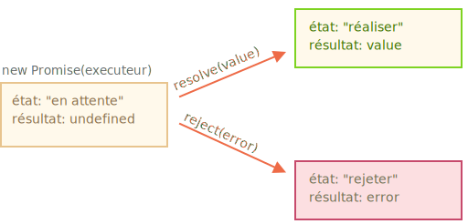
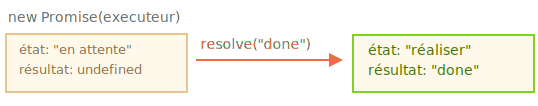
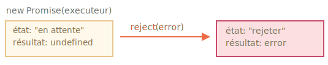

# Promesse (promise)

Imaginez que vous êtes un grand chanteur et les fans vous demandent jour et nuit votre prochaine chanson.

Pour avoir un peu de paix, vous promettez de leur envoyer dès que celle-ci est publiée. Vous donnez à vos fans une liste d'abonnement. Ils peuvent y ajouter leur adresse mail, comme cela, quand le single est sorti, tous les emails reçoivent votre single. Et même si quelque chose arrive, comme un feu dans le studio, et que vous ne pouvez pas sortir le single, ils en seront aussi notifiés.

Tout le monde est content : vous, puisque l'on vous laisse plus tranquille, et vos fans parce qu'ils savent qu'ils ne rateront pas la chanson.

C'est une analogie réelle à un problème courant de programmation :

1. Un "producteur de code" qui réalise quelque chose mais nécessite du temps. Par exemple, un code qui charge des données à travers un réseau. C'est le "chanteur".
2. Un "consommateur de code" qui attend un résultat du "producteur de code" quand il est prêt. Beaucoup de fonctions peuvent avoir besoin de ce résultat. Ces fonctions sont les "fans".
3. Une *promesse* (promise) est un objet spécial en JavaScript qui lie le "producteur de code" et le "consommateur de code" ensemble. En comparant à notre analogie c'est la "liste d'abonnement". Le "producteur de code" prend le temps nécessaire pour produire le résultat promis, et la "promesse" donne le résultat disponible pour le code abonné quand c'est prêt.


L'analogie n'est pas la plus correcte, car les promesses en JavaScript sont un peu plus complexes qu'une simple liste d'abonnement : elles ont d'autres possibilités mais aussi certaines limitations. Toutefois c'est suffisant pour débuter.


La syntaxe du constructeur pour une promesse est :

```js
let promise = new Promise(function(resolve, reject) {
  // L'exécuteur (le code produit, le "chanteur")
});
```

La fonction passée à `new Promise` est appelée l'*exécuteur*. Quand `new Promise` est créée, elle est lancée automatiquement. Elle contient le producteur de code, qui doit produire un résulat final. Dans l'analogie ci-dessus : l'exécuteur est le "chanteur".

Ses arguments `resolve` (tenir) et `reject` (rompre) sont les fonctions de retour directement fournies par JavaScript. Notre code est inclus seulement dans l'exécuteur.

Quand l'exécuteur obtient un résultat, qu'il soit rapide ou pas, cela n'a pas d'importance, il appellera une des deux fonctions de retour :

- `resolve(value)` -  si la tâche s'est terminée avec succès, avec le résultat `value`.
- `reject(error)` - si une erreur est survenue, `error` est l'objet erreur.

Donc, pour résumer : l'exécuteur s'exécute automatiquement et tente d’effectuer un travail. Ensuite, il devrait appeler `resolve` s'il a réussi ou `reject` s'il y avait une erreur.

L'objet `promise` retourné par le constructeur `new Promise` a des propriétés internes :

- `state` (état) - initialement à `"pending"` (en attente), se change soit en `"fulfilled"` (tenue) lorsque `resolve` est appelé ou `"rejected"` (rompue) si `reject` est appelé.
- `result` - initialement à `undefined` se change en `value` quand `resolve(value)` est appelé ou en `error` quand `reject(error)` est appelé.

Ainsi l'exécuteur changera la promesse à un de ces états :



Plus tard nous verrons comment les "fans" peuvent s'abonner à ces changements.

Voici un exemple d'un constructeur d'une promesse et d'une fonction exécutrice simple avec un "code produit" qui prend du temps (utilisant `setTimeout`) :

```js
let promise = new Promise(function(resolve, reject) {
  // la fonction est exécutée automatiquement quand la promesse est construite

  // On signale au bout d'une seconde que la tâche est terminée avec le résultat "done"
  setTimeout(() => *!*resolve("done")*/!*, 1000);
});
```
On peut voir deux choses en lançant le code ci-dessus :

1. L'exécuteur est appelé automatiquement et immédiatement (avec `new Promise`).
2. L'exécuteur reçoit deux arguments : `resolve` et `reject` - ces deux fonctions sont pré-définies par le moteur JavaScript, ainsi nous n'avons pas besoin de les créer. Nous devons seulement appeler l'une ou l'autre quand le résultat est prêt.

    Après une seconde de "traitement" l'exécuteur appelle `resolve("done")` pour produire le résultat. Cela change l'état de l'objet `promise` :

    

Nous avons vu un exemple d'une tâche terminée avec succès, une promesse "tenue".

Voyons maintenant un exemple d'un exécuteur rompant la promesse avec une erreur :

```js
let promise = new Promise(function(resolve, reject) {
  // On signale après 1 seconde que la tâche est terminée avec une erreur
  setTimeout(() => *!*reject(new Error("Whoops!"))*/!*, 1000);
});
```

L'appel a `reject(...)` change l'object promesse à l'état `"rejected"` :



Pour résumer, l'exécuteur devrait réaliser une tâche (normalement quelque chose qui prend du temps) puis appelle `resolve` ou `reject` pour changer l'état de l'objet promesse correspondant.

Une promesse qui est soit tenue soit rejetée est appelée "settled" (acquitttée) par opposition à une promesse initialisée à "en attente".

````smart header="Il ne peut y avoir qu'un seul résultat ou une erreur"
L'exécuteur devrait appeler seulement une fois `resolve` ou `reject`. N'importe quel changement d'état est définitif.

Les appels supplémentaires à `resolve` et `reject` sont ignorés :

```js
let promise = new Promise(function(resolve, reject) {
*!*
  resolve("done");
*/!*

  reject(new Error("…")); // ignoré
  setTimeout(() => resolve("…")); // ignoré
});
```

L'idée est que la tâche exécutée par un exécuteur ne peut avoir qu'un seul résultat ou une erreur.

De plus, `resolve`/`reject` n'attend qu'un seul argument (ou aucun) et ignorera les arguments suivants.
````

```smart header="Rompre avec l'objet `Error`"
Dans le cas ou quelque chose se passe mal, l'exécuteur doit appeler `reject`. Cela est possible avec n'importe type d'argument (comme pour `resolve`). Mais  il est plutôt recommandé d'utiliser l'objet `Error` (ou les objets en héritant). La raison va vous paraître évidente dans un instant.
```

````smart header="Appel de `resolve`/`reject` immédiat"
En pratique, un exécuteur réalise normalement une opération asynchrone et appelle `resolve`/`reject` après un certain temps, mais il n'est pas obligatoire d'être asynchrone. On peut aussi appeler immédiatement `resolve` ou `reject`, comme cela :

```js
let promise = new Promise(function(resolve, reject) {
  // La tâche ne prend pas de temps
  resolve(123); // rend immédiatement le résultat : 123
});
```

Par exemple, cela peut arriver quand nous commençons une tâche mais nous voyons que la tâche est déja réalisée et en cache.

Pas de soucis. Nous acquittons immédiatement la promesse.
````

```smart header="Le `state` et `result` est interne"
Les propriétés `state` et `result` de l'objet `Promise` sont internes. Nous ne pouvons directement accéder à celles-ci. Nous pouvons utiliser `.then`/`.catch`/`.finally` pour cela. Elles sont décrites ci-dessous.
```

## Les consommateurs : then, catch

Un objet promesse permet le lien entre l'exécuteur (le "code produit" ou "chanteur") et les fonctions consommatrices (les "fans"), lesquels recevront un résultat ou une erreur. Ces fonctions consommatrices peuvent s'abonner (subscribed) en utilisant les méthodes `.then`, `.catch`.

### then (alors)

Le plus important, le plus crucial est `.then`.

La syntaxe est :

```js
promise.then(
  function(result) { *!*/* gère un résultat correct */*/!* },
  function(error) { *!*/* gère une erreur */*/!* }
);
```

Le premier argument de `.then` est une fonction qui se lance si la promesse est tenue, et reçoit le résultat.

Le deuxième argument de `.then` est une fonction qui se lance si la promesse est rompue, et reçoit l'erreur.

Par exemple, voyons la réponse à une requête correctement tenue :

```js run
let promise = new Promise(function(resolve, reject) {
  setTimeout(() => resolve("done!"), 1000);
});

// resolve lance la première fonction dans .then
promise.then(
*!*
  result => alert(result), // affiche "done!" après 1 seconde
*/!*
  error => alert(error) // ne se lance pas
);
```

La première fonction s'est exécutée.

Et dans le cas d'un rejet -- la deuxième seulement s'exécute :

```js run
let promise = new Promise(function(resolve, reject) {
  setTimeout(() => reject(new Error("Whoops!")), 1000);
});

// reject lance la seconde fonction dans .then
promise.then(
  result => alert(result), // ne se lance pas
*!*
  error => alert(error) // affiche "Error: Whoops!" après 1 seconde
*/!*
);
```
Si nous sommes seulement intéressés par les promesses tenues, nous pouvons alors seulement fournir une fonction en argument à `.then` :

```js run
let promise = new Promise(resolve => {
  setTimeout(() => resolve("done!"), 1000);
});

*!*
promise.then(alert); // affiche "done!" après 1 seconde
*/!*
```

### catch

Si nous sommes seulement intéressés par les erreurs, alors nous pouvons mettre `null` comme premier argument : `.then(null, fonctionGerantLErreur)`. Ou nous pouvons utiliser `.catch(fonctionGerantLErreur)`, qui revient au même :

```js run
let promise = new Promise((resolve, reject) => {
  setTimeout(() => reject(new Error("Whoops!")), 1000);
});

*!*
// .catch(f) est similaire à promise.then(null, f)
promise.catch(alert); // affiche "Error: Whoops!" après 1 seconde
*/!*
```

L'appel à `.catch(f)` est complètement analogue à `.then(null, f)`, c'est juste un raccourci.

## Cleanup: finally

Comme il y a un terme `finally` dans un `try {...} catch {...}`, il y a des `finally` dans les promesses.

L'appel à `.finally(f)` est similaire à `.then(f, f)` dans le sens où `f` se lance toujours quand la promesse est aquittée : qu'elle soit tenue ou rompue.

L'idée de `finally` est de configurer un gestionnaire pour effectuer le nettoyage/la finalisation une fois les opérations précédentes terminées.

Par exemple l'arrêt des voyants de charge, la fermeture des connexions devenues inutiles, etc.

<<<<<<< HEAD
Considérez-le comme un nettoyeur de fête. Peu importe qu'une fête soit bonne ou mauvaise, combien d'amis y participaient, nous devons toujours (ou du moins devrions) faire un nettoyage après.
=======
Think of it as a party finisher. Irresepective of whether a party was good or bad, how many friends were in it, we still need (or at least should) do a cleanup after it.
>>>>>>> 1dce5b72b16288dad31b7b3febed4f38b7a5cd8a

Le code peut ressembler à ceci :

```js
new Promise((resolve, reject) => {
  /* faire quelque chose qui prend du temps, puis appeler resolve ou peut-être reject */
})
*!*
  // se lance quand la promesse est acquittée, peu importe si celle-ci est tenue ou rompue
  .finally(() => stop loading indicator)
  // donc l'indicateur de chargement est toujours arrêté avant de continuer
*/!*
  .then(result => show result, err => show error)
```

Veuillez noter que `finally(f)` n'est pas exactement un alias de `then(f,f)`.

Il existe des différences importantes :

1. Un gestionnaire `finally` n'a pas d'arguments. Dans `finally` nous ne savons pas si la promesse est réussie ou non. Ce n'est pas grave, car notre tâche consiste généralement à effectuer des procédures de finalisation "générales".

    Veuillez jeter un coup d'œil à l'exemple ci-dessus : comme vous pouvez le voir, le gestionnaire "finally" n'a pas d'arguments et le résultat de la promesse est géré par le gestionnaire suivant.
2. Un gestionnaire "finally" "transmet" le résultat ou l'erreur au prochain gestionnaire approprié.

    Par exemple, ici, le résultat est passé de `finally` à `then` :

    ```js run
    new Promise((resolve, reject) => {
      setTimeout(() => resolve("value"), 2000);
    })
      .finally(() => alert("Promise ready")) // triggers first
      .then(result => alert(result)); // <-- .then shows "value"
    ```

    Comme vous pouvez le voir, la `value` renvoyée par la première promesse est transmise par `finally` au prochain `then`.

    C'est très pratique, car `finally` n'est pas destiné à traiter un résultat de promesse. Comme déjà dit, c'est un endroit pour faire un nettoyage générique, quel que soit le résultat.

    Et voici un exemple d'erreur, pour que nous puissions voir comment elle est passée de `finally` à `catch` :

    ```js run
    new Promise((resolve, reject) => {
      throw new Error("error");
    })
      .finally(() => alert("Promise ready")) // triggers first
      .catch(err => alert(err));  // <-- .catch shows the error
    ```

3. Un gestionnaire `finally` ne devrait pas non plus renvoyer quoi que ce soit. Si c'est le cas, la valeur renvoyée est silencieusement ignorée.

    La seule exception à cette règle est lorsqu'un gestionnaire `finally` génère une erreur. Ensuite, cette erreur passe au gestionnaire suivant, à la place de tout résultat précédent.

Pour résumer :

- Un gestionnaire `finally` n'obtient pas le résultat du gestionnaire précédent (il n'a pas d'arguments). Ce résultat est transmis à la place au prochain gestionnaire approprié.
- Si un gestionnaire `finally` renvoie quelque chose, il est ignoré.
- Lorsque `finally` génère une erreur, l'exécution passe au gestionnaire d'erreurs le plus proche.

Ces fonctionnalités sont utiles et permettent aux choses de fonctionner correctement si nous utilisons `finally` comme elles sont censées être utilisées : pour les procédures de nettoyage génériques.

````smart header="Nous pouvons attacher des gestionnaires aux promesses réglées"
Si une promesse est en attente, les gestionnaires `.then/catch/finally` attendent son résultat.

Parfois, il se peut qu'une promesse soit déjà réglée lorsque nous y ajoutons un gestionnaire.

Dans ce cas, ces gestionnaires s'exécutent immédiatement :

```js run
// la prommesse est acquittée immédiatement à la création
let promise = new Promise(resolve => resolve("done!"));

promise.then(alert); // done! (s'affiche immédiatement)
```

Notez que cela rend les promesses plus puissantes que le scénario réel de "liste d'abonnement". Si le chanteur a déjà sorti sa chanson et qu'une personne s'inscrit sur la liste d'abonnement, elle ne recevra probablement pas cette chanson. Les abonnements dans la vraie vie doivent être effectués avant l'événement.

Les promesses sont plus flexibles. Nous pouvons ajouter des gestionnaires à tout moment : si le résultat est déjà là, ils s'exécutent simplement.
````

## Example: loadScript [#loadscript]

Ensuite, voyons des exemples plus pratiques pour lesquels les promesses nous aident à écrire du code asynchrone.

Nous avons la fonction `loadScript` pour charger un script du chapitre précédent.

Pour rappel voyons la solution avec des fonctions de retour :

```js
function loadScript(src, callback) {
  let script = document.createElement('script');
  script.src = src;

  script.onload = () => callback(null, script);
  script.onerror = () => callback(new Error(`Script load error for ${src}`));

  document.head.append(script);
}
```

Re-écrivons-la avec une promesse.

La nouvelle fonction `loadScript` ne nécessite aucune fonction de retour. À la place, elle va créer et retournera une promesse qui s'acquittera lorque le chargement sera complet. Le code externe peut ajouter des gestionnaires (fonction s'abonnant) à celle-ci en utilisant `.then`.

```js run
function loadScript(src) {
  return new Promise(function(resolve, reject) {
    let script = document.createElement('script');
    script.src = src;

    script.onload = () => resolve(script);
    script.onerror = () => reject(new Error(`Script load error for ${src}`));

    document.head.append(script);
  });
}
```

Utilisation:

```js run
let promise = loadScript("https://cdnjs.cloudflare.com/ajax/libs/lodash.js/4.17.11/lodash.js");

promise.then(
  script => alert(`${script.src} is loaded!`),
  error => alert(`Error: ${error.message}`)
);

promise.then(script => alert('Another handler...'));
```

On peut remarquer immédiatement quelques avantages par rapport aux fonctions de retour :

| Promesses | Fonctions de retour |
|-----------|----------------------|
| Les promesses nous permettent de faire des choses dans un ordre naturel. D'abord, nous lançons `loadScript(script)`, puis avec `.then` nous codons quoi faire avec le résultat. | Nous devons avoir une fonction de retour à notre disposition quand nous appelons `loadScript(script, callback)`. En d'autres termes, nous devons savoir quoi faire du résultat *avant* que `loadScript` soit appelé. |
| Nous pouvons appeler `.then` sur une promesse autant de fois que nécessaire. À chaque fois, que nous ajoutons un nouveau "fan", une nouvelle fonction s'abonne à la "liste d'abonnés". Nous en verrons plus à ce sujet dans le prochain chapitre : [](info:promise-chaining). | Il ne peut y avoir qu'une seule fonction de retour. |

Les promesses nous permettent donc d'avoir plus de sens et une meilleure flexibilité. Mais il y a plus. Nous allons voir cela dans les chapitres suivants.
