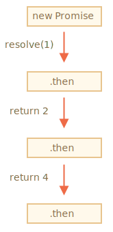
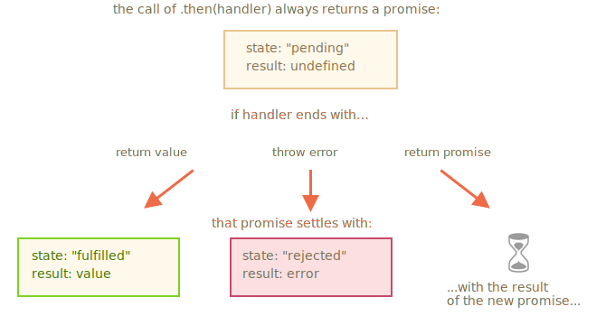

# Chaînage des promesses

Revenons au problème mentionné dans le chapitre <info:callbacks>: nous avons une séquence de tâches asynchrones à effectuer l'une après l'autre. Par exemple, charger des scripts. Comment pouvons-nous bien le coder ?

Les promesses fournissent quelques options pour le faire.

Dans ce chapitre, nous traitons de l'enchaînement des promesses.

Cela ressemble à ceci:

```js run
new Promise(function(resolve, reject) {

  setTimeout(() => resolve(1), 1000); // (*)

}).then(function(result) { // (**)

  alert(result); // 1
  return result * 2;

}).then(function(result) { // (***)

  alert(result); // 2
  return result * 2;

}).then(function(result) {

  alert(result); // 4
  return result * 2;

});
```

L'idée est que le résultat est transmis à travers la chaîne de gestionnaires `.then`.

Ici, le flux est:
1. La promesse initiale est résolue en 1 seconde `(*)`,
2. Ensuite, le gestionnaire `.then` est appelé `(**)`.
3. La valeur qu'elle renvoie est transmise au prochain gestionnaire `.then` `(***)`
4. ...et ainsi de suite.

Lorsque le résultat est transmis le long de la chaîne de gestionnaires, nous pouvons voir une séquence d'appels `alert`: `1` -> `2` -> `4`.



Le tout fonctionne, car un appel à `promise.then` renvoie une promesse, de sorte que nous puissions appeler le prochain` .then` dessus.

Lorsqu'un gestionnaire renvoie une valeur, cela devient le résultat de cette promesse. Le prochain `.then` est appelé avec.

**Une erreur classique pour les débutants: techniquement, nous pouvons également ajouter plusieurs `.then` à une seule promesse. Ceci n'est pas le chaînage des promesses.**

Par example:
```js run
let promise = new Promise(function(resolve, reject) {
  setTimeout(() => resolve(1), 1000);
});

promise.then(function(result) {
  alert(result); // 1
  return result * 2;
});

promise.then(function(result) {
  alert(result); // 1
  return result * 2;
});

promise.then(function(result) {
  alert(result); // 1
  return result * 2;
});
```

Ce que nous avons fait ici n’est que plusieurs gestionnaires pour une promesse. Ils ne se transmettent pas le résultat, ils la traitent de manière indépendante.

Voici la representation (comparez-la avec l'enchaînement ci-dessus):


Tous les `.then` sur la même promesse obtiennent le même résultat - le résultat de cette promesse. Donc, dans le code ci-dessus, les `alert` montre la même chose:` 1`.

En pratique, nous avons rarement besoin de plusieurs gestionnaires pour une même promesse. Le chaînage est utilisé beaucoup plus souvent.

## Renvoie de promesses

Un gestionnaire, utilisé dans `.then(handler)` peut créer et renvoyer une promesse.

Dans ce cas, les autres gestionnaires attendent que le problème soit réglé, puis le résultat est obtenu.

Par exemple:

```js run
new Promise(function(resolve, reject) {

  setTimeout(() => resolve(1), 1000);

}).then(function(result) {

  alert(result); // 1

*!*
  return new Promise((resolve, reject) => { // (*)
    setTimeout(() => resolve(result * 2), 1000);
  });
*/!*

}).then(function(result) { // (**)

  alert(result); // 2

  return new Promise((resolve, reject) => {
    setTimeout(() => resolve(result * 2), 1000);
  });

}).then(function(result) {

  alert(result); // 4

});
```

Ici, le premier `.then` affiche `1` et renvoie `new Promise(…)` à la ligne `(*)`. Au bout d'une seconde, le problème est résolu et le résultat (l'argument de `resolve`, ici, `result * 2`) est transmis au gestionnaire du deuxième `.then`. Ce gestionnaire est à la ligne `(**)`, il affiche `2` et fait la même chose.

Le résultat est donc le même que dans l'exemple précédent: 1 -> 2 -> 4, mais maintenant avec un délai d'une seconde entre les appels `alert`.

Le renvoie des promesses nous permet de construire des chaînes d’actions asynchrones.

## Exemple: loadScript

Utilisons cette fonctionnalité avec le `loadScript` promisifié, défini dans le [chapitre précédent](info:promise-basics#loadscript), afin de charger les scripts un à un, dans l'ordre:

```js run
loadScript("/article/promise-chaining/one.js")
  .then(function(script) {
    return loadScript("/article/promise-chaining/two.js");
  })
  .then(function(script) {
    return loadScript("/article/promise-chaining/three.js");
  })
  .then(function(script) {
    // utiliser les fonctions déclarées dans les scripts
    // pour montrer qu'ils ont effectivement chargé
    one();
    two();
    three();
  });
```

Ce code peut être un peu plus court avec les fonctions fléchées:

```js run
loadScript("/article/promise-chaining/one.js")
  .then(script => loadScript("/article/promise-chaining/two.js"))
  .then(script => loadScript("/article/promise-chaining/three.js"))
  .then(script => {
    // les scripts sont chargés, on peut utiliser les fonctions qui y sont déclarées
    one();
    two();
    three();
  });
```


Ici, chaque appel à `loadScript` renvoie une promesse et le prochain `.then` s'exécute lorsqu'il est résolu. Ensuite, il lance le chargement du script suivant. Les scripts sont donc chargés les uns après les autres.

Nous pouvons ajouter plus d'actions asynchrones à la chaîne. Noter que le code est toujours "plat", il grandit verticallement, pas vers la droite. Il n'y a aucun signe de "pyramid of doom".

Techniquement, nous pourrions ajouter `.then` directement à chaque `loadScript`, comme ceci:

```js run
loadScript("/article/promise-chaining/one.js").then(script1 => {
  loadScript("/article/promise-chaining/two.js").then(script2 => {
    loadScript("/article/promise-chaining/three.js").then(script3 => {
      // cette fonction a accès aux variables script1, script2 et script3
      one();
      two();
      three();
    });
  });
});
```

Ce code fait la même chose: charge 3 scripts en séquence. Mais il "pousse vers la droite". Nous avons donc le même problème qu'avec les callbacks.

Les gens qui commencent à utiliser leurs promesses ne savent parfois pas comment enchaîner, alors ils l'écrivent de cette façon. Généralement, le chaînage est préféré.

Parfois, il est correct d'écrire directement `.then`, car la fonction imbriquée a accès à la portée externe. Dans l'exemple ci-dessus, le rappel le plus imbriqué a accès à toutes les variables `script1`, `script2`, `script3`. Mais c'est une exception plutôt qu'une règle.


````smart header="Thenables"
Pour être précis, un gestionnaire peut renvoyer pas exactement une promesse, mais un soi-disant objet "thenable" - un objet arbitraire doté de la méthode `.then`. Il sera traité de la même manière q'une promesse.

L'idée est que les bibliothèques tierces peuvent implémenter leurs propres objets "compatibles avec les promesses". Elles peuvent avoir un ensemble étendu de méthodes, mais aussi être compatibles avec les promesses natives, car ils implémentent `.then`.

Voici un exemple d'un objet "thenable":

```js run
class Thenable {
  constructor(num) {
    this.num = num;
  }
  then(resolve, reject) {
    alert(resolve); // function() { native code }
    // promesse tenu avec this.num * 2 après 1 seconde
    setTimeout(() => resolve(this.num * 2), 1000); // (**)
  }
}

new Promise(resolve => resolve(1))
  .then(result => {
*!*
    return new Thenable(result); // (*)
*/!*
  })
  .then(alert); // shows 2 after 1000ms
```

JavaScript vérifie l'objet retourné par le gestionnaire `.then` à la ligne `(*)` : s il a une méthode appelable nommé `then`, il appelle cette méthode fournissant les fonctions natives `resolve` et `reject` comme arguments (semblable à un executeur) et attend que l’un d’eux soit appelé. Dans l'exemple ci-dessus, `resolve(2)` est appelé après 1 seconde `(**)`. Ensuite, le résultat est transmis plus loin dans la chaîne.

Cette fonctionnalité nous permet d'intégrer des objets personnalisés avec des chaînes de promesse sans avoir à hériter de `Promise`.
````


## Un plus grand exemple: fetch

Dans la programmation du front-end, les promesses sont souvent utilisées pour les requêtes réseau. Voyons donc un exemple étendu de cela.

Nous allons utiliser la méthode [fetch](info:fetch) pour charger les informations sur l'utilisateur à partir du serveur distant. Il a beaucoup de paramètres optionnels couverts dans [des chapitres séparés](info:fetch), mais la syntaxe de base est assez simple:

```js
let promise = fetch(url);
```

Cela fait une requête réseau à la `url` et renvoie une promesse. La promesse se résout avec un objet `response` lorsque le serveur distant répond avec des en-têtes, mais *avant le téléchargement complet de la réponse*.

Pour lire la réponse complète, nous devons appeler la méthode `response.text()` : elle renvoie une promesse qui résout le téléchargement du texte intégral à partir du serveur distant, avec ce texte en tant que résultat.

Le code ci-dessous envoie une requête à `user.json` et charge son texte depuis le serveur:

```js run
fetch('/article/promise-chaining/user.json')
  // .then ci-dessous s'exécute lorsque le serveur distant répond
  .then(function(response) {
    // response.text() renvoie une nouvelle promesse qui résout avec le texte de réponse complet
    // quand ça charge
    return response.text();
  })
  .then(function(text) {
<<<<<<< HEAD
    // ...et voici le contenu du fichier distant
    alert(text); // {"name": "iliakan", isAdmin: true}
=======
    // ...and here's the content of the remote file
    alert(text); // {"name": "iliakan", "isAdmin": true}
>>>>>>> 445bda39806050acd96f87166a7c97533a0c67e9
  });
```

L'objet `response` renvoyé par `fetch` comprend également la méthode `response.json()` qui lit les données distantes et les analyse en JSON. Dans notre cas, c'est encore plus pratique, alors passons-y.

Nous allons également utiliser les fonctions fléchées pour la brièveté:

```js run
// comme ci-dessus, mais response.json() analyse le contenu distant en tant que JSON
fetch('/article/promise-chaining/user.json')
  .then(response => response.json())
  .then(user => alert(user.name)); // iliakan, nom d'utilisateur obtenu
```

Maintenant faisons quelque chose avec l'utilisateur chargé.

Par exemple, nous pouvons faire une demande supplémentaire à GitHub, charger le profil de l'utilisateur et afficher l'avatar:

```js run
// Faire une demande pour user.json
fetch('/article/promise-chaining/user.json')
  // Charger en tant que json
  .then(response => response.json())
  // Faire une demande à GitHub
  .then(user => fetch(`https://api.github.com/users/${user.name}`))
  // Charger la réponse en tant que json
  .then(response => response.json())
  // Afficher l'image de l'avatar (githubUser.avatar_url) pendant 3 secondes (peut-être l'animer)
  .then(githubUser => {
    let img = document.createElement('img');
    img.src = githubUser.avatar_url;
    img.className = "promise-avatar-example";
    document.body.append(img);

    setTimeout(() => img.remove(), 3000); // (*)
  });
```

Le code fonctionne ; voir les commentaires à propos des détails. Pourtant, il y a un problème potentiel, une erreur typique de ceux qui commencent à utiliser les promesses.

Regardez la ligne `(*)`: comment pouvons-nous faire quelque chose *après* l'avatar a fini d'afficher et d'être supprimé? Par exemple, nous aimerions montrer un formulaire pour éditer cet utilisateur ou autre chose. Pour l'instant, il n'y a pas moyen.

Pour rendre la chaîne extensible, nous devons retourner une promesse qui sera résolue une fois que l'avatar aura fini de s'afficher.

Comme ceci:

```js run
fetch('/article/promise-chaining/user.json')
  .then(response => response.json())
  .then(user => fetch(`https://api.github.com/users/${user.name}`))
  .then(response => response.json())
*!*
  .then(githubUser => new Promise(function(resolve, reject) { // (*)
*/!*
    let img = document.createElement('img');
    img.src = githubUser.avatar_url;
    img.className = "promise-avatar-example";
    document.body.append(img);

    setTimeout(() => {
      img.remove();
*!*
      resolve(githubUser); // (**)
*/!*
    }, 3000);
  }))
  // se déclenche après 3 secondes
  .then(githubUser => alert(`Finished showing ${githubUser.name}`));
```

En d’autres termes, le gestionnaire `.then` à la ligne `(*)` renvoie `new Promise`, qui ne sera réglé qu’après l’appel de `resolve(githubUser)` dans `setTimeout` `(**)`. Le prochain `.then` dans la chaîne attendra cela.

Comme bonne pratique, une action asynchrone doit toujours renvoyer une promesse. Cela permet de planifier des actions après. Même si nous n'avons pas l'intention d'étendre la chaîne maintenant, nous en aurons peut-être besoin plus tard.

Enfin, nous pouvons scinder le code en fonctions réutilisables:

```js run
function loadJson(url) {
  return fetch(url)
    .then(response => response.json());
}

function loadGithubUser(name) {
  return fetch(`https://api.github.com/users/${name}`)
    .then(response => response.json());
}

function showAvatar(githubUser) {
  return new Promise(function(resolve, reject) {
    let img = document.createElement('img');
    img.src = githubUser.avatar_url;
    img.className = "promise-avatar-example";
    document.body.append(img);

    setTimeout(() => {
      img.remove();
      resolve(githubUser);
    }, 3000);
  });
}

// Utilise les:
loadJson('/article/promise-chaining/user.json')
  .then(user => loadGithubUser(user.name))
  .then(showAvatar)
  .then(githubUser => alert(`Finished showing ${githubUser.name}`));
  // ...
```

## Résumé

Si un gestionnaire `.then` (ou `catch/finally`, peu importe) renvoie une promesse, le reste de la chaîne attend jusqu'à ce qu'elle se règle. Quand cela se produit, son résultat (ou son erreur) est passé plus loin.

Voici une image complète:


