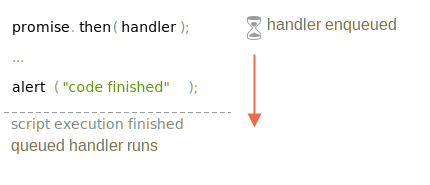

# Les micro-tâches

Les gestionnaires de promesses `.then`/`.catch`/`.finally` sont toujours asynchrones.

Même lorsqu'une promesse est immédiatement résolue, le code sur les lignes situées *ci-dessous* `.then`/`.catch`/`.finally` sera toujours exécuté avant ces gestionnaires.

Voici la démo:

```js run
let promise = Promise.resolve();

promise.then(() => alert("promise done!"));

alert("code finished"); // cette alerte s'affiche d'abord
```

Si vous exécutez, vous voyez `code finished` d'abord, puis `promise done!`.

C'est étrange, car la promesse est certainement résolue depuis le début.

Pourquoi le `.then` se déclenche par la suite? Que se passe-t-il?

## File d'attente pour micro-tâches

Les tâches asynchrones nécessitent une gestion appropriée.
Pour cela, la norme ECMA spécifie une file d'attente interne `PromiseJobs`, plus souvent appelée "microtask queue" en anglais (terme V8).

Comme indiqué dans la [spécification](https://tc39.github.io/ecma262/#sec-jobs-and-job-queues):

- La file d'attente est premier entré, premier sorti: les tâches mises en file d'attente en premier sont exécutées en premier.
- L'exécution d'une tâche est lancée uniquement lorsque rien d'autre n'est en cours d'exécution.

Ou, simplement, lorsqu'une promesse est prête, ses gestionnaires `.then/catch/finally` sont mis en file d'attente ; ils ne sont pas encore exécutés.
Lorsque le moteur JavaScript est libéré du code actuel, il extrait une tâche de la file d'attente et l'exécute.

C'est pourquoi "code finished" dans l'exemple ci-dessus s'affiche en premier.



Les gestionnaires de promesses passent toujours par cette file d'attente interne.

S'il existe une chaîne avec plusieurs `.then/catch/finally`, chacun d'entre eux est exécuté de manière asynchrone.
C'est-à-dire qu'il est d'abord mis en file d'attente et exécuté lorsque le code actuel est terminé et que les gestionnaires précédemment placés en file d'attente sont terminés.

**Et si l'ordre importait pour nous ? Comment pouvons-nous faire en sorte que `code finished` apparaisse après `promise done` ?**

Facile, il suffit de le mettre dans la file d'attente avec `.then`:

```js run
Promise.resolve()
  .then(() => alert("promise done!"))
  .then(() => alert("code finished"));
```

Maintenant, l'ordre est comme prévu.

## Rejet non traité

Souvenez-vous de l'événement `unhandledrejection` du chapitre <info:promise-error-handling> ?

Maintenant, nous pouvons voir exactement comment JavaScript découvre qu'il y a eu un rejet non géré

**Un "rejet non traité" se produit lorsqu'une erreur de promesse n'est pas traitée à la fin de la file d'attente des micro-tâches.**

Normalement, si nous nous attendons à une erreur, nous ajoutons `.catch` dans la chaîne de promesse pour la gérer:

```js run
let promise = Promise.reject(new Error("Promise Failed!"));
*!*
promise.catch(err => alert('caught'));
*/!*

// n'exécute pas: erreur gérée
window.addEventListener('unhandledrejection', event => alert(event.reason));
```

… Mais si nous oublions d’ajouter `.catch`, dans ce cas le moteur déclenche l’événement une fois que la file d’attente de micro-tâches est vide :

```js run
let promise = Promise.reject(new Error("Promise Failed!"));

// Promise Failed!
window.addEventListener('unhandledrejection', event => alert(event.reason));
```

Et si nous gérons l'erreur plus tard? Comme ceci:

```js run
let promise = Promise.reject(new Error("Promise Failed!"));
*!*
setTimeout(() => promise.catch(err => alert('caught')), 1000);
*/!*

// Error: Promise Failed!
window.addEventListener('unhandledrejection', event => alert(event.reason));
```

Maintenant, si vous l'exécutez, nous verrons d'abord le message `Promise Failed!`, Puis `caught`.

Si nous ne connaissions pas la file d'attente de micro-tâches, nous pourrions nous demander : "Pourquoi le gestionnaire `unhandledrejection` a-t-il été exécuté ? Nous avons capturé et géré l'erreur !".

Mais nous comprenons maintenant que `unhandledrejection` est généré à la fin de la file d'attente des micro-tâches : le moteur examine les promesses et, si l'une d'entre elles est à l'état "rejected", l'événement se déclenche.

Dans l'exemple ci-dessus, `.catch` ajouté par `setTimeout` se déclenche également, mais plus tard, après que `unhandledrejection` se soit déjà produit, mais cela ne change rien.

## Résumé

Le traitement des promesses est toujours asynchrone, car toutes les actions de promesse passent par la file d'attente interne "promise jobs", également appelée "microtask queue" (terme V8).

Ainsi, les gestionnaires `.then/catch/finally` sont toujours appelés une fois le code actuel terminé.

Si nous devons garantir qu'un morceau de code est exécuté après `.then/catch/finally`, nous pouvons l'ajouter à un appel `.then` enchaîné.

Dans la plupart des moteurs JavaScript, y compris les navigateurs et Node.js, le concept de micro-tâches est étroitement lié à la "boucle d'événement" et aux "macrotaches".
Comme elles n’ont pas de relation directe avec les promesses, elles sont décrites dans une autre partie du didacticiel, au chapitre <info:event-loop>.
