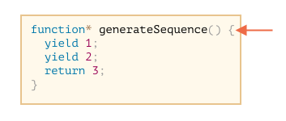
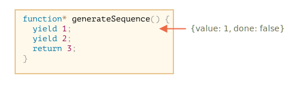
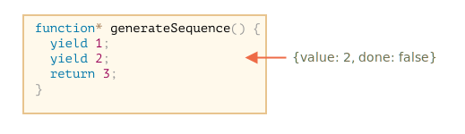
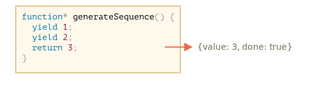
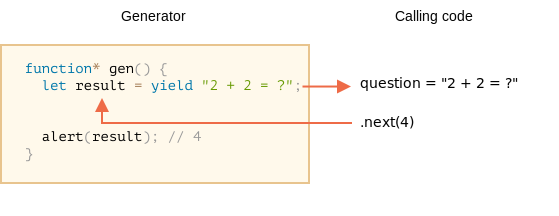
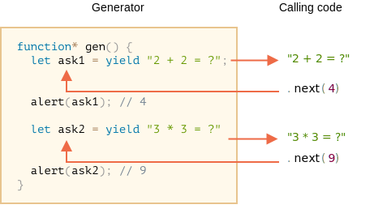

# Générateurs

Les fonctions régulières ne renvoient qu'une seule valeur (ou rien).

Les générateurs peuvent renvoyer ("rendement") plusieurs valeurs, l'une après l'autre, à la demande. Ils fonctionnent très bien avec les [iterables](info:iterable), permettant de créer des flux de données en toute simplicité.

## Fonctions de générateur

Pour créer un générateur, nous avons besoin d'une construction syntaxique spéciale: `fonction*`, appelée "fonction générateur".

Cela ressemble à ça:

```js
function* generateSequence() {
  yield 1;
  yield 2;
  return 3;
}
```

Les fonctions du générateur se comportent différemment des fonctions normales. Lorsqu'une telle fonction est appelée, elle n'exécute pas son code. Au lieu de cela, elle renvoie un objet spécial, appelé "objet générateur", pour gérer l'exécution.

Jetez un oeil ici:

```js run
function* generateSequence() {
  yield 1;
  yield 2;
  return 3;
}

// "fonction générateur" crée "objet générateur"
let generator = generateSequence();
*!*
alert(generator); // [object Generator]
*/!*
```

L'exécution du code de la fonction n'a pas encore commencé:



La principale méthode d'un générateur est `next()`. Lorsqu'il est appelé, il est exécuté jusqu'à la déclaration de `<valeur> yield` la plus proche (la `valeur` peut être omise, alors il est `undefined`). Ensuite, l'exécution de la fonction s'interrompt et la `valeur` yield est renvoyée au code externe.

Le résultat de `next()` est toujours un objet avec deux propriétés:
- `value`: la valeur yielded.
- `done`: `true` si le code de la fonction est terminé, sinon `false`.

Par exemple, ici nous créons le générateur et obtenons sa première valeur yield:

```js run
function* generateSequence() {
  yield 1;
  yield 2;
  return 3;
}

let generator = generateSequence();

*!*
let one = generator.next();
*/!*

alert(JSON.stringify(one)); // {value: 1, done: false}
```

Pour l'instant, nous n'avons obtenu que la première valeur, et l'exécution de la fonction est sur la deuxième ligne:



Appelons `generator.next()` encore une fois. Il reprend l'exécution du code et retourne le `yield` suivant:

```js
let two = generator.next();

alert(JSON.stringify(two)); // {value: 2, done: false}
```



Et, si nous l'appelons une troisième fois, l'exécution atteint l'instruction `return` qui termine la fonction:

```js
let three = generator.next();

alert(JSON.stringify(three)); // {value: 3, *!*done: true*/!*}
```



Le générateur est maintenant terminé. Nous devrions voir avec `done:true` et traiter `value:3` comme résultat final.

De nouveaux appels de `generator.next()` n'ont plus de sens maintenant. Si nous les faisons quand même, ils retournent le même objet: `{done: true}`.

```smart header="`function* f(…)` or `function *f(…)`?"
Les deux syntaxes sont correctes.

Mais généralement, la première syntaxe est préférée, car l'étoile `*` indique qu'il s'agit d'une fonction de générateur, elle décrit le type, pas le nom, elle doit donc rester avec le mot clé `function`.
```

## Les générateurs sont itérables

Comme vous l'avez probablement déjà deviné en regardant la méthode `next()`, les générateurs sont [iterable](info:iterable).

Nous pouvons parcourir leurs valeurs en utilisant `for..of` :

```js run
function* generateSequence() {
  yield 1;
  yield 2;
  return 3;
}

let generator = generateSequence();

for(let value of generator) {
  alert(value); // 1, then 2
}
```

Cela semble beaucoup plus agréable que d'appeler `.next().value`, non?

...Mais veuillez noter: l'exemple ci-dessus montre `1`, puis `2`, et c'est tout. le `3` n'est pas montré!

C'est parce que l'iteration `for..of` ignore la dernière `value`, quand`done: true`. Donc, si nous voulons que tous les résultats soient affichés par `for..of`, nous devons les retourner avec `yield`:

```js run
function* generateSequence() {
  yield 1;
  yield 2;
*!*
  yield 3;
*/!*
}

let generator = generateSequence();

for(let value of generator) {
  alert(value); // 1, then 2, then 3
}
```

Comme les générateurs sont itérables, nous pouvons appeler toutes les fonctionnalités associées, par exemple la syntaxe spread `...` :

```js run
function* generateSequence() {
  yield 1;
  yield 2;
  yield 3;
}

let sequence = [0, ...generateSequence()];

alert(sequence); // 0, 1, 2, 3
```

Dans le code ci-dessus, `...generateSequence()` transforme l'objet générateur itérable en tableau d'éléments (Essayer d'en savoir plus sur la syntaxe spread dans le chapitre [](info:rest-parameters-spread-operator#spread-operator))

## Utilisation de générateurs pour les itérables

Il y a quelque temps, dans le chapitre [](info:iterable) nous avons créé un objet `range` qui retourne les valeurs `from..to`.

Ici, rappelons-nous ce code:

```js run
let range = {
  from: 1,
  to: 5,

  // for..of range appelle cette méthode une fois au tout début
  [Symbol.iterator]() {
    // ...il renvoie l'objet itérateur:
    // en avant, for..of ne fonctionne qu'avec cet objet, lui demandant les valeurs suivantes
    return {
      current: this.from,
      last: this.to,

      // next() est appelé à chaque itération par la boucle for..of
      next() {
        // il doit renvoyer la valeur en tant qu'objet {done:.., value :...}
        if (this.current <= this.last) {
          return { done: false, value: this.current++ };
        } else {
          return { done: true };
        }
      }
    };
  }
};

// l'itération sur la plage renvoie des nombres de range.from à range.to
alert([...range]); // 1,2,3,4,5
```

Nous pouvons utiliser une fonction de générateur pour l'itération en la fournissant comme pour `Symbol.iterator`.

Voici la même `range`, mais beaucoup plus compact:

```js run
let range = {
  from: 1,
  to: 5,

  *[Symbol.iterator]() { // un raccourci pour [Symbol.iterator]: function*()
    for(let value = this.from; value <= this.to; value++) {
      yield value;
    }
  }
};

alert( [...range] ); // 1,2,3,4,5
```

Cela fonctionne, car `range[Symbol.iterator]()` renvoie maintenant un générateur, et les méthodes de générateur sont exactement ce que `for..of` attend:
- il a la méthode `.next()`
- qui renvoie des valeurs sous la forme `{value: ..., done: true/false}`

Ce n'est pas une coïncidence, bien sûr. Des générateurs ont été ajoutés au langage JavaScript en pensant aux itérateurs, pour les implémenter plus facilement.

La variante avec générateur est beaucoup plus concise que le code itérable original de `range`, et garde la même fonctionnalité.

```smart header="Les générateurs peuvent générer des valeurs pour toujours"
Dans les exemples ci-dessus, nous avons généré des séquences finies, mais nous pouvons également créer un générateur qui donne des valeurs pour toujours. Par exemple, une séquence sans fin de nombres pseudo-aléatoires.

Cela nécessiterait sûrement un `break` (ou un `return`) dans `for..of` sur un tel générateur, sinon la boucle se répéterait pour toujours et se bloquerait.
```

## Composition du générateur

La composition des générateurs est une caractéristique spéciale des générateurs qui permet "d'incorporer" les générateurs de manière transparente les uns dans les autres.

Par exemple, nous avons une fonction qui génère une séquence de nombres:

```js
function* generateSequence(start, end) {
  for (let i = start; i <= end; i++) yield i;
}
```

Maintenant, nous aimerions le réutiliser pour une séquence plus complexe:
- d'abord, les chiffres `0..9` (avec des codes de caractères 48..57),
- suivi de lettres de l'alphabet en majuscules `A..Z` (codes de caractères 65..90)
- suivi de lettres de l'alphabet en minuscules `a..z` (codes de caractères 97..122)

Nous pouvons utiliser cette séquence, par exemple pour créer des mots de passe en sélectionnant des caractères (pourrait également ajouter des caractères de syntaxe), mais générons-le d'abord.

Dans une fonction régulière, pour combiner les résultats de plusieurs autres fonctions, nous les appelons, stockons les résultats, puis les rejoignons à la fin.

Pour les générateurs, il existe une syntaxe spéciale `yield*` pour "incorporer" (composer) un générateur dans un autre.

Le générateur composé:

```js run
function* generateSequence(start, end) {
  for (let i = start; i <= end; i++) yield i;
}

function* generatePasswordCodes() {

*!*
  // 0..9
  yield* generateSequence(48, 57);

  // A..Z
  yield* generateSequence(65, 90);

  // a..z
  yield* generateSequence(97, 122);
*/!*

}

let str = '';

for(let code of generatePasswordCodes()) {
  str += String.fromCharCode(code);
}

alert(str); // 0..9A..Za..z
```

La directive `yield*` *délègue* l'exécution à un autre générateur. Ce terme signifie que `yield* gen` itère sur le générateur `gen` et transmet de manière transparente ses yiels à l'extérieur. Comme si les valeurs étaient fournies par le générateur extérieur.

Le résultat est le même que si nous insérions le code des générateurs imbriqués:

```js run
function* generateSequence(start, end) {
  for (let i = start; i <= end; i++) yield i;
}

function* generateAlphaNum() {

*!*
  // yield* generateSequence(48, 57);
  for (let i = 48; i <= 57; i++) yield i;

  // yield* generateSequence(65, 90);
  for (let i = 65; i <= 90; i++) yield i;

  // yield* generateSequence(97, 122);
  for (let i = 97; i <= 122; i++) yield i;
*/!*

}

let str = '';

for(let code of generateAlphaNum()) {
  str += String.fromCharCode(code);
}

alert(str); // 0..9A..Za..z
```

Une composition de générateur est un moyen naturel d'insérer le flux d'un générateur dans un autre. Il n'utilise pas de mémoire supplémentaire pour stocker les résultats intermédiaires.

## "yield" est une route à double sens

Jusqu'à présent, les générateurs étaient similaires aux objets itérables, avec une syntaxe spéciale pour générer des valeurs. Mais en fait, ils sont beaucoup plus puissants et flexibles.

C'est parce que `yield` est une route à double sens : il renvoie non seulement le résultat à l'extérieur, mais peut également transmettre la valeur à l'intérieur du générateur.

Pour ce faire, nous devons appeler `generator.next(arg)`, avec un argument. Cet argument devient le résultat de `yield`.

Voyons un exemple:

```js run
function* gen() {
*!*
  // Passe une question au code externe et attend une réponse
  let result = yield "2 + 2 = ?"; // (*)
*/!*

  alert(result);
}

let generator = gen();

let question = generator.next().value; // <-- yield retournes une valeur

generator.next(4); // --> passe le résultat dans le générateur  
```



1. Le premier appel `generator.next()` est toujours sans argument. Il démarre l'exécution et renvoie le résultat du premier `yield "2+2=?"`. À ce stade, le générateur suspend l'exécution (toujours sur cette ligne).
2. Ensuite, comme le montre l'image ci-dessus, le résultat de `yield` entre dans la variable `question` du code appelant.
3. Sur `generator.next(4)`, le générateur reprend et `4` entre comme résultat: `let result = 4`.

Veuillez noter que le code externe n'a pas à appeler immédiatement `next(4)`. Cela peut prendre du temps. Ce n'est pas un problème : le générateur attendra.

Par exemple:

```js
// reprend le générateur après un certain temps
setTimeout(() => generator.next(4), 1000);
```

Comme nous pouvons le voir, contrairement aux fonctions régulières, un générateur et le code appelant peuvent échanger les résultats en passant des valeurs dans `next/yield`.

Pour rendre les choses plus évidentes, voici un autre exemple, avec plus d'appels:

```js run
function* gen() {
  let ask1 = yield "2 + 2 = ?";

  alert(ask1); // 4

  let ask2 = yield "3 * 3 = ?"

  alert(ask2); // 9
}

let generator = gen();

alert( generator.next().value ); // "2 + 2 = ?"

alert( generator.next(4).value ); // "3 * 3 = ?"

alert( generator.next(9).done ); // true
```

L'image d'exécution:



1. Le premier `.next()` démarre l'exécution... Il atteint le premier `yield`.
2. Le résultat est renvoyé au code externe.
3. Le second `.next(4)` retourne `4` au générateur à la suite du premier `yield`, et reprend l'exécution.
4. ...Il atteint le deuxième `yield`, qui devient le résultat de l'appel du générateur.
5. Le troisième `next(9)` passe `9` dans le générateur à la suite du deuxième `yield` et reprend l'exécution qui atteint la fin de la fonction, donc `done: true`.

C'est comme un jeu de "ping-pong". Chaque `next(value)` (à l'exclusion du premier) passe une valeur dans le générateur, qui devient le résultat du `yield` actuel, puis récupère le résultat du prochain `yield`.

## generator.throw

Comme nous l'avons observé dans les exemples ci-dessus, le code externe peut transmettre une valeur au générateur, à la suite de `yield`.

...Mais il peut aussi y initier (lancer) une erreur. C'est naturel, car une erreur est une sorte de résultat.

Pour passer une erreur dans un `yield`, nous devons appeler `generator.throw(err)`. Dans ce cas, le `err` est jeté dans la ligne avec ce `yield`.

Par exemple, ici le yield de `"2 + 2 = ?"` conduit à une erreur:

```js run
function* gen() {
  try {
    let result = yield "2 + 2 = ?"; // (1)

    alert("L'exécution n'atteint pas ici, car l'exception est levée juste au-dessus");
  } catch(e) {
    alert(e); // montre l'erreur
  }
}

let generator = gen();

let question = generator.next().value;

*!*
generator.throw(new Error("La réponse est introuvable dans ma base de données")); // (2)
*/!*
```

L'erreur, jetée dans le générateur sur la ligne `(2)` conduit à une exception dans la ligne `(1)` avec `yield`. Dans l'exemple ci-dessus, `try..catch` l'attrape et s'affiche.

Si nous ne l'attrapons pas, alors comme toute exception, il fait "retomber" le générateur dans le code appelant.

La ligne actuelle du code appelant est la ligne avec `generator.throw`, étiquetée comme `(2)`. Nous pouvons donc l'attraper ici, comme ceci:

```js run
function* generate() {
  let result = yield "2 + 2 = ?"; // Error in this line
}

let generator = generate();

let question = generator.next().value;

*!*
try {
  generator.throw(new Error("La réponse est introuvable dans ma base de données"));
} catch(e) {
  alert(e); // shows the error
}
*/!*
```

Si nous n'attrapons pas l'erreur là, alors, comme d'habitude, elle passe au code d'appel externe (le cas échéant) et, s'il n'est pas détecté, tue le script.

## generator.return

`generator.return(value)` termine l'exécution du générateur et renvoie la `value` donnée.

```js
function* gen() {
  yield 1;
  yield 2;
  yield 3;
}

const g = gen();

g.next();        // { value: 1, done: false }
g.return('foo'); // { value: "foo", done: true }
g.next();        // { value: undefined, done: true }
```

Si nous utilisons à nouveau `generator.return()` dans un générateur terminé, il renverra à nouveau cette valeur ([MDN](https://developer.mozilla.org/fr/docs/Web/JavaScript/Reference/Global_Objects/Generator/return)).

Souvent, nous ne l'utilisons pas, car la plupart du temps, nous voulons obtenir toutes les valeurs de retour, mais cela peut être utile lorsque nous voulons arrêter le générateur dans une condition spécifique.

## Résumé

- Les générateurs sont créés par des fonctions de générateur `function* f(…) {…}`.
- À l'intérieur des générateurs (uniquement), il existe un operateur `yield`.
- Le code externe et le générateur peuvent échanger les résultats via les appels `next/yield`.

Dans le JavaScript moderne, les générateurs sont rarement utilisés. Mais parfois, ils sont utiles, car la capacité d'une fonction à échanger des données avec le code appelant pendant l'exécution est tout à fait unique. Et, certainement, ils sont parfaits pour fabriquer des objets itérables.

De plus, dans le chapitre suivant, nous apprendrons les générateurs asynchrones, qui sont utilisés pour lire des flux de données générées de manière asynchrone (par exemple, des récupérations paginées sur un réseau) dans la boucle `for wait ... of`.

Dans la programmation Web, nous travaillons souvent avec des données en streaming, c'est donc un autre cas d'utilisation très important.
