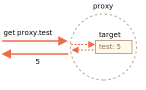

# Proxy et Reflect

Un objet `Proxy` encapsule un autre objet et intercepte des opérations, comme la lecture / écriture de propriétés et d'autres, éventuellement en les manipulant de lui-même ou en permettant à l'objet de les gérer de manière transparente.

Les proxys sont utilisés dans de nombreuses bibliothèques et certains frameworks de navigateur. Nous verrons de nombreux cas pratiques dans cet article.

## Proxy

La syntaxe:

```js
let proxy = new Proxy(target, handler)
```

- `target` (cible) -- est un objet à envelopper, cela peut être n'importe quoi, y compris des fonctions.
- `handler` -- configuration du proxy: un objet avec des "pièges" qui interceptent les opérations. - par exemple. `get` pour lire une propriété de `target`, `set` pour écrire une propriété dans `target`, etc.

Pour les opérations sur le `proxy`, s'il existe un piège correspondant dans le `handler`, il s'exécute et le proxy a une chance de le gérer, sinon l'opération est effectuée sur `target`.

Comme exemple de départ, créons un proxy sans aucun piège:

```js run
let target = {};
let proxy = new Proxy(target, {}); // handler vide

proxy.test = 5; // écrire dans proxy (1)
alert(target.test); // 5, la propriété est apparue dans target!

alert(proxy.test); // 5, nous pouvons aussi la lire à partir du proxy (2)

for(let key in proxy) alert(key); // test, les itérations fonctionne (3)
```

Comme il n'y a pas de pièges, toutes les opérations sur le `proxy` sont transmises à `target`.

1. Une opération d'écriture `proxy.test =` définit la valeur sur `target`.
2. Une opération de lecture `proxy.test` renvoie la valeur de `target`.
3. L'itération sur le `proxy` renvoie les valeurs de `target`.

Comme nous pouvons le voir, sans aucun piège, le `proxy` est un "wrapper transparent" autour de `target`.



Le `proxy` est un "objet exotique" spécial. Il n'a pas de propriétés propres. Avec un `handler` vide, il transfère de manière transparente les opérations vers `target`.

Pour activer plus de fonctionnalités, ajoutons des pièges.

Que pouvons-nous intercepter avec eux?

Pour la plupart des opérations sur les objets, il existe une soi-disant "méthode interne" dans la spécification JavaScript qui décrit comment cela fonctionne au plus bas niveau. Par exemple `[[Get]]`, la méthode interne pour lire une propriété, `[[Set]]`, la méthode interne pour écrire une propriété, etc. Ces méthodes ne sont utilisées que dans la spécification, nous ne pouvons pas les appeler directement par leur nom.

Les pièges proxy interceptent les invocations de ces méthodes. Ils sont répertoriés dans le [Spécification du proxy](https://tc39.es/ecma262/#sec-proxy-object-internal-methods-and-internal-slots) et dans le tableau ci-dessous

Pour chaque méthode interne, il y a un piège dans ce tableau: le nom de la méthode que nous pouvons ajouter au `handler` du `new Proxy` pour intercepter l'opération:

| Méthode interne | Méthode d'handler | Se déclenche lorsque... |
|-----------------|----------------|-------------|
| `[[Get]]` | `get` | lit une propriété |
| `[[Set]]` | `set` | écrit une propriété |
| `[[HasProperty]]` | `has` | utilise l'opérateur `in` |
| `[[Delete]]` | `deleteProperty` | utilise l'opérateur `delete`  |
| `[[Call]]` | `apply` | appel une fonction |
| `[[Construct]]` | `construct` | utilise l'opérateur `new` |
| `[[GetPrototypeOf]]` | `getPrototypeOf` | [Object.getPrototypeOf](https://developer.mozilla.org/fr/docs/Web/JavaScript/Reference/Objets_globaux/Object/getPrototypeOf) |
| `[[SetPrototypeOf]]` | `setPrototypeOf` | [Object.setPrototypeOf](https://developer.mozilla.org/fr/docs/Web/JavaScript/Reference/Objets_globaux/Object/setPrototypeOf) |
| `[[IsExtensible]]` | `isExtensible` | [Object.isExtensible](https://developer.mozilla.org/fr/docs/Web/JavaScript/Reference/Objets_globaux/Object/isExtensible) |
| `[[PreventExtensions]]` | `preventExtensions` | [Object.preventExtensions](https://developer.mozilla.org/fr/docs/Web/JavaScript/Reference/Objets_globaux/Object/preventExtensions) |
| `[[DefineOwnProperty]]` | `defineProperty` | [Object.defineProperty](https://developer.mozilla.org/fr/docs/Web/JavaScript/Reference/Objets_globaux/Object/defineProperty), [Object.defineProperties](https://developer.mozilla.org/fr/docs/Web/JavaScript/Reference/Objets_globaux/Object/defineProperties) |
| `[[GetOwnProperty]]` | `getOwnPropertyDescriptor` | [Object.getOwnPropertyDescriptor](https://developer.mozilla.org/fr/docs/Web/JavaScript/Reference/Objets_globaux/Object/getOwnPropertyDescriptor), `for..in`, `Object.keys/values/entries` |
| `[[OwnPropertyKeys]]` | `ownKeys` | [Object.getOwnPropertyNames](https://developer.mozilla.org/fr/docs/Web/JavaScript/Reference/Objets_globaux/Object/getOwnPropertyNames), [Object.getOwnPropertySymbols](https://developer.mozilla.org/fr/docs/Web/JavaScript/Reference/Objets_globaux/Object/getOwnPropertySymbols), `for..in`, `Object/keys/values/entries` |

```warn header="Invariants"
JavaScript applique certains invariants -- conditions qui doivent être remplies par des méthodes et des pièges internes.

La plupart d'entre eux sont destinés aux valeurs de retour:
- `[[Set]]` doit retourner `true` si la valeur a été écrite avec succès, sinon `false`.
- `[[Delete]]` doit retourner `true` si la valeur a été supprimée avec succès, sinon `false`.
- ...et ainsi de suite, nous en verrons plus dans les exemples ci-dessous.

Il y a d'autres invariants, comme:
- `[[GetPrototypeOf]]`, appliqué à l'objet proxy doit renvoyer la même valeur que `[[GetPrototypeOf]]` appliquée à l'objet cible de l'objet proxy. En d'autres termes, la lecture du prototype d'un proxy doit toujours renvoyer le prototype de l'objet cible.

Les pièges peuvent intercepter ces opérations, mais ils doivent suivre ces règles.

Les invariants garantissent un comportement correct et cohérent des fonctionnalités du langage. La liste complète des invariants est dans [la spécification](https://tc39.es/ecma262/#sec-proxy-object-internal-methods-and-internal-slots). Vous ne les violerez probablement pas si vous ne faites pas quelque chose de bizarre.
```

Voyons comment cela fonctionne dans des cas pratiques.

## Valeur par défaut avec le piège "get"

Les pièges les plus courants concernent les propriétés de lecture / écriture.

Pour intercepter la lecture, l'`handler` doit avoir une méthode `get (target, property, receiver)`.

Il se déclenche lorsqu'une propriété est lue, avec les arguments suivants:

- `target` -- est l'objet cible, celui passé comme premier argument au `new proxy`,
- `property` -- nom de la propriété,
- `receiver` -- si la propriété cible est un getter, le `receiver` est l'objet qui sera utilisé comme `this` dans son appel. Habituellement, c'est l'objet `proxy` lui-même (ou un objet qui en hérite, si nous héritons du proxy). Pour l'instant, nous n'avons pas besoin de cet argument, il sera donc expliqué plus en détail plus tard.

Utilisons `get` pour implémenter les valeurs par défaut d'un objet.

Nous allons créer un tableau numérique qui renvoie `0` pour les valeurs inexistantes.

Habituellement, quand on essaie d'obtenir un élément de tableau non existant, il est `undefined`, mais nous encapsulerons un tableau normal dans le proxy qui interceptera la lecture et retournera `0` s'il n'y a pas une telle propriété:

```js run
let numbers = [0, 1, 2];

numbers = new Proxy(numbers, {
  get(target, prop) {
    if (prop in target) {
      return target[prop];
    } else {
      return 0; // valeur par défaut
    }
  }
});

*!*
alert( numbers[1] ); // 1
alert( numbers[123] ); // 0 (élément inexistant)
*/!*
```

Comme nous pouvons le voir, c'est assez facile à faire avec un piège `get`.

Nous pouvons utiliser `Proxy` pour implémenter n'importe quelle logique pour les valeurs "par défaut".

Imaginez que nous ayons un dictionnaire, avec des phrases et leurs traductions:

```js run
let dictionary = {
  'Hello': 'Hola',
  'Bye': 'Adiós'
};

alert( dictionary['Hello'] ); // Hola
alert( dictionary['Welcome'] ); // undefined
```

À l'heure actuelle, s'il n'y a pas de phrase, la lecture de `dictionary` renvoie `undefined`. Mais en pratique, laisser une phrase non traduite est généralement mieux que `undefined`. Faisons donc renvoyer une phrase non traduite dans ce cas au lieu de `undefined`.

Pour y parvenir, nous allons envelopper le `dictionary` dans un proxy qui intercepte les opérations de lecture:

```js run
let dictionary = {
  'Hello': 'Hola',
  'Bye': 'Adiós'
};

dictionary = new Proxy(dictionary, {
*!*
  get(target, phrase) { // intercepter la lecture d'une propriété du dictionnaire
*/!*
    if (phrase in target) { // si nous l'avons dans le dictionnaire
      return target[phrase]; // retourne la traduction
    } else {
      // sinon, retourne la phrase non traduite
      return phrase;
    }
  }
});

// Rechercher des phrases arbitraires dans le dictionnaire!
// Au pire, ils ne sont pas traduits
alert( dictionary['Hello'] ); // Hola
*!*
alert( dictionary['Welcome to Proxy']); // Welcome to Proxy (pas de traduction)
*/!*
```

````smart
Veuillez noter comment le proxy écrase la variable:

```js
dictionary = new Proxy(dictionary, ...);
```

Le proxy doit remplacer totalement l'objet cible partout. Personne ne devrait jamais référencer l'objet cible après qu'il a été utilisé comme target du proxy.
````

## Validation avec le piège "set"

Disons que nous voulons un tableau exclusivement pour les nombres. Si une valeur d'un autre type est ajoutée, il devrait y avoir une erreur.

Le piège `set` se déclenche lorsqu'une propriété est écrite.

`set(target, property, value, receiver)`:

- `target` -- est l'objet cible, celui passé comme premier argument au `new proxy`,
- `property` -- nom de la propriété,
- `value` -- valeur de la propriété,
- `receiver` -- similaire au piège `get`, ne concerne que les propriétés du setter.

Le piège `set` doit retourner `true` si le réglage est réussi et `false` dans le cas contraire (déclenche `TypeError`).

Utilisons-le pour valider de nouvelles valeurs:

```js run
let numbers = [];

numbers = new Proxy(numbers, { // (*)
*!*
  set(target, prop, val) { // intercepter l'écriture de propriété
*/!*
    if (typeof val == 'number') {
      target[prop] = val;
      return true;
    } else {
      return false;
    }
  }
});

numbers.push(1); // ajouté avec succès
numbers.push(2); // ajouté avec succès
alert("Length is: " + numbers.length); // 2

*!*
numbers.push("test"); // TypeError ('set' sur proxy retourne false)
*/!*

alert("This line is never reached (error in the line above)");
```

Note: la fonctionnalité intégrée des tableaux fonctionne toujours! Les valeurs sont ajoutées par `push`. La propriété `length` augmente automatiquement lorsque des valeurs sont ajoutées. Notre proxy ne casse rien.

Nous n'avons pas à remplacer les méthodes de tableau à valeur ajoutée comme `push` et `unshift`, etc., pour y ajouter des vérifications, car en interne, elles utilisent l'opération `[[Set]]` interceptée par le proxy.

Le code est donc propre et concis.

```warn header="N'oubliez pas de retouner `true`"
Comme indiqué ci-dessus, il y a des invariants à tenir

Pour `set`, il doit retourner `true` pour une écriture réussie.

Si nous oublions de le faire ou retournons une valeur fausse, l'opération déclenche `TypeError`.
```

## Itération avec "ownKeys" et "getOwnPropertyDescriptor"

La boucle `Object.keys`,` for..in` et la plupart des autres méthodes qui itèrent sur les propriétés des objets utilisent la méthode interne `[[OwnPropertyKeys]]` (interceptée par le piège `ownKeys`) pour obtenir une liste des propriétés.

Ces méthodes diffèrent dans les détails:
- `Object.getOwnPropertyNames(obj)` renvoie des clés non symboliques.
- `Object.getOwnPropertySymbols(obj)` renvoie des clés symboliques.
- `Object.keys/values()` renvoie les clés / valeurs non symboliques avec l'indicateur `enumerable` (les indicateurs de propriété ont été expliqués dans l'article <info:property-descriptors>).
- `for..in` boucle sur les clés non symboliques avec le drapeau `enumerable`, ainsi que sur les clés prototypes.

... Mais tous commencent par cette liste.

Dans l'exemple ci-dessous, nous utilisons le piège `ownKeys` pour faire une boucle` for..in` sur `user`, ainsi que` Object.keys` et `Object.values`, pour ignorer les propriétés commençant par un trait de soulignement`_`:

```js run
let user = {
  name: "John",
  age: 30,
  _password: "***"
};

user = new Proxy(user, {
*!*
  ownKeys(target) {
*/!*
    return Object.keys(target).filter(key => !key.startsWith('_'));
  }
});

// "ownKeys" filtre _password
for(let key in user) alert(key); // name, après: age

// même effet sur ces méthodes:
alert( Object.keys(user) ); // name,age
alert( Object.values(user) ); // John,30
```

Jusqu'à présent, cela fonctionne.

Bien que, si nous renvoyons une clé qui n'existe pas dans l'objet, `Object.keys` ne la répertoriera pas:

```js run
let user = { };

user = new Proxy(user, {
*!*
  ownKeys(target) {
*/!*
    return ['a', 'b', 'c'];
  }
});

alert( Object.keys(user) ); // <empty>
```

Pourquoi? La raison est simple: `Object.keys` renvoie uniquement les propriétés avec l'indicateur `enumerable`. Pour le vérifier, il appelle la méthode interne `[[GetOwnProperty]]` pour chaque propriété à obtenir [son descripteur](info:property-descriptors). Et ici, comme il n'y a pas de propriété, son descripteur est vide, pas d'indicateur `enumerable`, il est donc ignoré.

Pour que `Object.keys` renvoie une propriété, nous avons besoin qu'elle existe dans l'objet, avec l'indicateur `enumerable`, ou nous pouvons intercepter les appels à `[[GetOwnProperty]]` (le piège `getOwnPropertyDescriptor` le fait), et renvoyer un descripteur avec `enumerable: true`.

Voici un exemple:

```js run
let user = { };

user = new Proxy(user, {
  ownKeys(target) { // appelé une fois pour obtenir une liste de propriétés
    return ['a', 'b', 'c'];
  },

  getOwnPropertyDescriptor(target, prop) { // appelé pour chaque propriété
    return {
      enumerable: true,
      configurable: true
      /* ...other flags, probable "value:..." */
    };
  }

});

alert( Object.keys(user) ); // a, b, c
```

Notons encore une fois: nous n'avons besoin d'intercepter `[[GetOwnProperty]]` que si la propriété est absente dans l'objet.

## Propriétés protégées avec "deleteProperty" et autres pièges

Il existe une convention répandue selon laquelle les propriétés et les méthodes précédées d'un trait de soulignement `_` sont internes. Ils ne doivent pas être accessibles depuis l'extérieur de l'objet.

Techniquement, c'est possible:

```js run
let user = {
  name: "John",
  _password: "secret"
};

alert(user._password); // secret
```

Utilisons des proxys pour empêcher tout accès aux propriétés commençant par `_`.

Nous aurons besoin des pièges:
- `get` lancer une erreur lors de la lecture d'une telle propriété,
- `set` lancer une erreur lors de l'écriture, 
- `deleteProperty` lancer une erreur lors de la suppression,
- `ownKeys` pour exclure les propriétés commençant par `_` de `for..in` et les méthodes comme `Object.keys`.

Voici le code:

```js run
let user = {
  name: "John",
  _password: "***"
};

user = new Proxy(user, {
*!*
  get(target, prop) {
*/!*
    if (prop.startsWith('_')) {
      throw new Error("Access denied");
    }
    let value = target[prop];
    return (typeof value === 'function') ? value.bind(target) : value; // (*)
  },
*!*
  set(target, prop, val) { // intercepter l'écriture de propriété
*/!*
    if (prop.startsWith('_')) {
      throw new Error("Access denied");
    } else {
      target[prop] = val;
      return true;
    }
  },
*!*
  deleteProperty(target, prop) { // pour intercepter la suppression de propriété
*/!*  
    if (prop.startsWith('_')) {
      throw new Error("Access denied");
    } else {
      delete target[prop];
      return true;
    }
  },
*!*
  ownKeys(target) { // intercepter la liste des propriétés
*/!*
    return Object.keys(target).filter(key => !key.startsWith('_'));
  }
});

// "get" ne permet pas de lire _password
try {
  alert(user._password); // Erreur: accès refusé
} catch(e) { alert(e.message); }

// "set" ne permet pas d'écrire _password
try {
  user._password = "test"; // Erreur: accès refusé
} catch(e) { alert(e.message); }

// "deleteProperty" ne permet pas de supprimer _password
try {
  delete user._password; // Erreur: accès refusé
} catch(e) { alert(e.message); }

// "ownKeys" filtre _password
for(let key in user) alert(key); // name
```

Veuillez noter les détails importants dans le piège `get`, dans la ligne `(*)`:

```js
get(target, prop) {
  // ...
  let value = target[prop];
*!*
  return (typeof value === 'function') ? value.bind(target) : value; // (*)
*/!*
}
```

Pourquoi avons-nous besoin d'une fonction pour appeler `value.bind(target)` ?

La raison est que les méthodes d'objet, telles que `user.checkPassword()`, doivent pouvoir accéder à `_password`:

```js
user = {
  // ...
  checkPassword(value) {
    // la méthode objet doit pouvoir lire _password
    return value === this._password;
  }
}
```


L'appel `user.checkPassword()` obtient l'`user` proxy comme `this` (l'objet avant le point devient `this`), donc quand il essaie d'accéder à `this._password`, le piège `get` s'active (il se déclenche sur n'importe quelle propriété lue) et génère une erreur.

Nous lions donc le contexte des méthodes objet à l'objet d'origine, `target`, dans la ligne `(*)`. Ensuite, leurs futurs appels utiliseront `target` comme `this`, sans aucun piège.

Cette solution fonctionne généralement, mais n'est pas idéale, car une méthode peut faire passer l'objet non sollicité ailleurs.

En outre, un objet peut être proxy plusieurs fois (plusieurs procurations peuvent ajouter différents "réglages" à l'objet), et si nous transmettons un objet non enveloppé à une méthode, il peut y avoir des conséquences inattendues.

Donc, un tel proxy ne devrait pas être utilisé partout.

```smart header="Propriétés privées d'une classe"
Les moteurs JavaScript modernes prennent en charge nativement les propriétés privées dans les classes, préfixées par `#`. Ils sont décrits dans l'article <info:private-protected-properties-methods>. Aucun proxy requis.

Ces propriétés ont cependant leurs propres problèmes. En particulier, ils ne sont pas hérités.
```

## "In range" avec le piège "has"

Voyons plus d'exemples.

Nous avons un objet `range`:

```js
let range = {
  start: 1,
  end: 10
};
```

Nous aimerions utiliser l'opérateur `in` pour vérifier qu'un nombre est `in range` (à portée).

Le piège `has` intercepte l'opérateur `in`.

`has(target, property)`

- `target` -- est l'objet cible, passé comme premier argument à `new Proxy`,
- `property` -- nom de la propriété

Voici la démo:

```js run
let range = {
  start: 1,
  end: 10
};

range = new Proxy(range, {
*!*
  has(target, prop) {
*/!*
    return prop >= target.start && prop <= target.end;
  }
});

*!*
alert(5 in range); // true
alert(50 in range); // false
*/!*
```

bon sucre syntaxique, non? Et très simple à mettre en œuvre.

## Wrapping functions: "apply" [#proxy-apply]

Nous pouvons également envelopper un proxy autour d'une fonction.

Le piège `apply(target, thisArg, args)` gère l'appel d'un proxy en tant que fonction:

- `target` est l'objet cible (la fonction est un objet en JavaScript),
- `thisArg` est la valeur de `this`.
- `args` est une liste d'arguments.

Par exemple, rappelons le décorateur `delay(f, ms)`, que nous avons fait dans l'article <info:call-apply-decorators>.

Dans cet article, nous l'avons fait sans proxy. Un appel à `delay(f, ms)` a renvoyé une fonction qui transfère tous les appels à `f` après `ms` millisecondes.

Voici l'implémentation précédente basée sur les fonctions:

```js run
function delay(f, ms) {
  // retourner un wrapper qui passe l'appel à f après le délai d'expiration
  return function() { // (*)
    setTimeout(() => f.apply(this, arguments), ms);
  };
}

function sayHi(user) {
  alert(`Hello, ${user}!`);
}

// après ce wrapping, les appels à sayHi seront retardés de 3 secondes
sayHi = delay(sayHi, 3000);

sayHi("John"); // Hello, John! (après 3 secondes)
```

Comme nous l'avons déjà vu, cela fonctionne souvent. La fonction wrapper `(*)` effectue l'appel après le délai d'expiration.

Mais une fonction wrapper ne transmet pas les opérations de lecture / écriture de propriété ni rien d'autre. Après le wrapping, l'accès est perdu pour les propriétés des fonctions d'origine, telles que le `name`, `length` et autres:

```js run
function delay(f, ms) {
  return function() {
    setTimeout(() => f.apply(this, arguments), ms);
  };
}

function sayHi(user) {
  alert(`Hello, ${user}!`);
}

*!*
alert(sayHi.length); // 1 (la longueur de la fonction est le nombre d'arguments dans sa déclaration)
*/!*

sayHi = delay(sayHi, 3000);

*!*
alert(sayHi.length); // 0 (dans la déclaration wrapper, il n'y a aucun argument)
*/!*
```

Le `proxy` est beaucoup plus puissant, car il transmet tout à l'objet cible.

Utilisons `Proxy` au lieu d'une fonction de "wrapping":

```js run
function delay(f, ms) {
  return new Proxy(f, {
    apply(target, thisArg, args) {
      setTimeout(() => target.apply(thisArg, args), ms);
    }
  });
}

function sayHi(user) {
  alert(`Hello, ${user}!`);
}

sayHi = delay(sayHi, 3000);

*!*
alert(sayHi.length); // 1 (*) le proxy transmet l'opération "get length" à la cible
*/!*

sayHi("John"); // Hello, John! (après 3 secondes)
```

Le résultat est le même, mais maintenant non seulement les appels, mais toutes les opérations sur le proxy sont transférés vers la fonction d'origine. Donc, `sayHi.length` est renvoyé correctement après le retour à la ligne `(*)`.

Nous avons un wrapper "plus riche".

D'autres pièges existent: la liste complète se trouve au début de cet article. Leur modèle d'utilisation est similaire à ce qui précède.

## Reflect

`Reflect` est un objet intégré qui simplifie la création de `Proxy`.

Il a été dit précédemment que les méthodes internes, telles que `[[Get]]`, `[[Set]]` et d'autres ne sont que des spécifications, elles ne peuvent pas être appelées directement.

L'objet `Reflect` rend cela possible. Ses méthodes sont des wrapper minimales autour des méthodes internes.

Voici des exemples d'opérations et d'appels `Reflect` identiques:

| Opération | Appel `Reflect` | Méthode interne |
|-----------------|----------------|-------------|
| `obj[prop]` | `Reflect.get(obj, prop)` | `[[Get]]` |
| `obj[prop] = value` | `Reflect.set(obj, prop, value)` | `[[Set]]` |
| `delete obj[prop]` | `Reflect.deleteProperty(obj, prop)` | `[[Delete]]` |
| `new F(value)` | `Reflect.construct(F, value)` | `[[Construct]]` |
| ... | ... | ... |

Par exemple:

```js run
let user = {};

Reflect.set(user, 'name', 'John');

alert(user.name); // John
```

`Reflect` nous permet d'appeler des opérateurs (`new`, `delete` ...) en tant que fonctions (`Reflect.construct`, `Reflect.deleteProperty`, ...). C'est une capacité intéressante, mais ici, une autre chose est importante.

**Pour chaque méthode interne, piégeable par `Proxy`, il existe une méthode correspondante dans `Reflect`, avec le même nom et les mêmes arguments que le piège dans `Proxy`.**

Nous pouvons donc utiliser `Reflect` pour transmettre une opération à l'objet d'origine.

Dans cet exemple, les deux pièges `get` et `set` de manière transparente (comme si elles n'existaient pas) transmettent les opérations de lecture / écriture à l'objet, affichant un message

```js run
let user = {
  name: "John",
};

user = new Proxy(user, {
  get(target, prop, receiver) {
    alert(`GET ${prop}`);
*!*
    return Reflect.get(target, prop, receiver); // (1)
*/!*
  },
  set(target, prop, val, receiver) {
    alert(`SET ${prop}=${val}`);
*!*
    return Reflect.set(target, prop, val, receiver); // (2)
*/!*
  }
});

let name = user.name; // affiche "GET name"
user.name = "Pete"; // affiche "SET name=Pete"
```

Ici:

- `Reflect.get` lit une propriété d'objet.
- `Reflect.set` écrit une propriété d'objet et renvoie `true` en cas de succès, `false` dans le cas contraire

Autrement dit, tout est simple: si un piège veut renvoyer l'appel à l'objet, il suffit d'appeler `Reflect.<method>` avec les mêmes arguments.

Dans la plupart des cas, nous pouvons faire de même sans `Reflect`, par exemple, la lecture d'une propriété `Reflect.get(target, prop, receiver)` peut être remplacée par `target[prop]`. Il y a cependant des nuances importantes.

### Proxying a getter

Voyons un exemple qui montre pourquoi `Reflect.get` est meilleur. Et nous verrons également pourquoi `get/set` a le troisième argument `receiver`, que nous n'avions pas utilisé auparavant.

Nous avons un objet `user` avec la propriété `_name` et un getter pour cela.

Voici un proxy autour de lui:

```js run
let user = {
  _name: "Guest",
  get name() {
    return this._name;
  }
};

*!*
let userProxy = new Proxy(user, {
  get(target, prop, receiver) {
    return target[prop];
  }
});
*/!*

alert(userProxy.name); // Guest
```

Le piège `get` est "transparent" ici, il renvoie la propriété d'origine et ne fait rien d'autre. Cela suffit pour notre exemple.

Tout semble aller bien. Mais rendons l'exemple un peu plus complexe.

Après avoir hérité d'un autre objet `admin` de l'`user`, nous pouvons observer le comportement incorrect:

```js run
let user = {
  _name: "Guest",
  get name() {
    return this._name;
  }
};

let userProxy = new Proxy(user, {
  get(target, prop, receiver) {
    return target[prop]; // (*) target = user
  }
});

*!*
let admin = {
  __proto__: userProxy,
  _name: "Admin"
};

// Attendu: Admin
alert(admin.name); // retourne: Guest (?!?)
*/!*
```

La lecture de `admin.name` devrait renvoyer `"Admin"`, pas `"Guest"`!

Quel est le problème? Peut-être que nous avons fait quelque chose de mal avec l'héritage?

Mais si nous supprimons le proxy, tout fonctionnera comme prévu.

Le problème est en fait dans le proxy, dans la ligne `(*)`.

1. Lorsque nous lisons `admin.name`, comme l'objet `admin` n'a pas une telle propriété, la recherche va à son prototype.
2. Le prototype est `userProxy`.
3. Lors de la lecture de la propriété `name` du proxy, son piège `get` se déclenche et la renvoie à partir de l'objet d'origine en tant que `target[prop]` dans la ligne `(*)`.

    Un appel à `target[prop]`, lorsque `prop` est un getter, exécute son code dans le contexte `this=target`. Le résultat est donc `this._name` de l'objet `target` d'origine , c'est-à-dire de l'`user`.

Pour résoudre de telles situations, nous avons besoin de `receiver`, le troisième argument du piège `get`. Il garde le bon `this` à transmettre à un getter. Dans notre cas, c'est `admin`.

Comment passer le contexte pour un getter? Pour une fonction régulière, nous pourrions utiliser `call/apply`, mais c'est un getter, ce n'est pas "appelé", juste accessible.

`Reflect.get` peut faire ça. Tout fonctionnera bien si nous l'utilisons.

Voici la variante corrigée:

```js run
let user = {
  _name: "Guest",
  get name() {
    return this._name;
  }
};

let userProxy = new Proxy(user, {
  get(target, prop, receiver) { // receiver = admin
*!*
    return Reflect.get(target, prop, receiver); // (*)
*/!*
  }
});


let admin = {
  __proto__: userProxy,
  _name: "Admin"
};

*!*
alert(admin.name); // Admin
*/!*
```

Maintenant, `receiver` garde une référence à `this` correct (c'est-à-dire `admin`), est transmis au getter en utilisant `Reflect.get` dans la ligne `(*)`.

On peut réécrire le piège encore plus court:

```js
get(target, prop, receiver) {
  return Reflect.get(*!*...arguments*/!*);
}
```


Les appels `Reflect` sont nommés exactement de la même manière que les pièges et acceptent les mêmes arguments. Ils ont été spécialement conçus de cette façon.

Donc, `return Reflect...` fournit un moyen sûr et simple de faire avancer l'opération et assure qu'on oubliera rien.

## Limitations du proxy

Les proxys offrent un moyen unique de modifier ou d'améliorer le comportement des objets existants au niveau le plus bas. Pourtant, ce n'est pas parfait. Il y a des limites.

### Objets intégrés: emplacements internes

De nombreux objets intégrés, par exemple `Map`, `Set`, `Date`, `Promise` et d'autres utilisent des «emplacements internes».

Ce sont des propriétés similaires, mais réservées à des fins internes uniquement. Par exemple, `Map` stocke les éléments dans l'emplacement interne `[[MapData]]`. Les méthodes intégrées y accèdent directement, pas via les méthodes internes `[[Get]]/[[Set]]`. Donc, `Proxy` ne peut pas intercepter cela.

Pourquoi s'en soucier? Ils sont internes de toute façon!

Eh bien, voici le problème. Une fois qu'un objet intégré comme celui-ci a été proxy, le proxy n'a pas ces emplacements internes, les méthodes intégrées échoueront donc.

Par exemple:

```js run
let map = new Map();

let proxy = new Proxy(map, {});

*!*
proxy.set('test', 1); // Erreur
*/!*
```

En interne, un `Map` stocke toutes les données dans son emplacement interne `[[MapData]]`. Le proxy n'a pas un tel emplacement. La [méthode intégrée `Map.prototype.set`](https://tc39.es/ecma262/#sec-map.prototype.set) essaie d'accéder à la propriété interne `this.[[MapData]]`, mais parce que `this=proxy`, elle ne peut pas la trouver dans le proxy et échoue.

Heureusement, il existe un moyen de le corriger:

```js run
let map = new Map();

let proxy = new Proxy(map, {
  get(target, prop, receiver) {
    let value = Reflect.get(...arguments);
*!*
    return typeof value == 'function' ? value.bind(target) : value;
*/!*
  }
});

proxy.set('test', 1);
alert(proxy.get('test')); // 1 (ça fonctionne!)
```

Maintenant, cela fonctionne très bien, car le piège `get` lie les propriétés de la fonction, telles que `map.set`, à l'objet cible (`map`) lui-même.

Contrairement à l'exemple précédent, la valeur de `this` dans `proxy.set(...)` ne sera pas `proxy`, mais le `map` d'origine. Ainsi, lorsque l'implémentation interne de `set` essaie d'accéder à l'emplacement interne `this.[[MapData]]`, il réussit.

```smart header="`Array` n'a pas d'emplacements internes"
Une exception notable: `Array` n'utilise pas d'emplacement internes. Pour des raisons historiques.

Il n'y a donc pas de problème de ce type lors de l'utilisation d'un proxy.
```

### Champs privés

La même chose se produit avec les champs de classe privés.

Par exemple, la méthode `getName()` accède à la propriété privée `#name` et s'arrête après le proxy:

```js run
class User {
  #name = "Guest";

  getName() {
    return this.#name;
  }
}

let user = new User();

user = new Proxy(user, {});

*!*
alert(user.getName()); // Erreur
*/!*
```

La raison est que les champs privés sont implémentés à l'aide d'emplacement internes. JavaScript n'utilise pas `[[Get]]/[[Set]]` pour y accéder.

Dans l'appel `getName()`, la valeur de `this` est l'`user` proxy, et il n'a pas l'emplacement avec des champs privés.

Encore une fois, la solution avec la liaison de la méthode fonctionne:

```js run
class User {
  #name = "Guest";

  getName() {
    return this.#name;
  }
}

let user = new User();

user = new Proxy(user, {
  get(target, prop, receiver) {
    let value = Reflect.get(...arguments);
    return typeof value == 'function' ? value.bind(target) : value;
  }
});

alert(user.getName()); // Guest
```

Cela dit, la solution présente des inconvénients, comme expliqué précédemment: elle expose l'objet d'origine à la méthode, ce qui peut potentiellement le faire passer plus loin et briser d'autres fonctionnalités proxy.

### Proxy != target

Le proxy et l'objet d'origine sont des objets différents. C'est normal, non?

Donc, si nous utilisons l'objet d'origine comme clé, puis le proxy, le proxy ne peut pas être trouvé:

```js run
let allUsers = new Set();

class User {
  constructor(name) {
    this.name = name;
    allUsers.add(this);
  }
}

let user = new User("John");

alert(allUsers.has(user)); // true

user = new Proxy(user, {});

*!*
alert(allUsers.has(user)); // false
*/!*
```

Comme nous pouvons le voir, après le proxy, nous ne pouvons pas trouver d'`user` dans l'ensemble `allUsers`, car le proxy est un objet différent.

```warn header=""Les proxy ne peuvent pas intercepter un test d'égalité strict `===`"
Les proxys peuvent intercepter de nombreux opérateurs, tels que `new` (avec `construct`), `in` (avec `has`), `delete` (avec `deleteProperty`), etc.

Mais il n'y a aucun moyen d'intercepter un test d'égalité strict pour les objets. Un objet est strictement égal à lui-même uniquement, et aucune autre valeur.

Ainsi, toutes les opérations et les classes intégrées qui comparent les objets pour l'égalité feront la différence entre l'objet et le proxy. Pas de remplacement transparent ici.
```

## Proxies révocables

Un proxy *révocable* est un proxy qui peut être désactivé.

Disons que nous avons une ressource et que nous aimerions en fermer l'accès à tout moment.

Ce que nous pouvons faire, c'est de l'envelopper dans un proxy révocable, sans aucun piège. Un tel proxy transmettra les opérations à l'objet, et nous pouvons le désactiver à tout moment.

La syntaxe est:

```js
let {proxy, revoke} = Proxy.revocable(target, handler)
```

L'appel renvoie un objet avec la fonction `proxy` et `revoke` pour le désactiver.

Voici un exemple:

```js run
let object = {
  data: "Valuable data"
};

let {proxy, revoke} = Proxy.revocable(object, {});

// passer le proxy quelque part au lieu de l'objet...
alert(proxy.data); // Valuable data

// plus tard dans le code
revoke();

// le proxy ne fonctionne plus (révoqué)
alert(proxy.data); // Erreur
```

Un appel à `revoke()` supprime toutes les références internes à l'objet cible du proxy, afin qu'elles ne soient plus connectées. L'objet cible peut être nettoyé (garbage-collected) après cela.

Nous pouvons également stocker `revoke` dans un `WeakMap`, pour pouvoir le retrouver facilement par un objet proxy:

```js run
*!*
let revokes = new WeakMap();
*/!*

let object = {
  data: "Valuable data"
};

let {proxy, revoke} = Proxy.revocable(object, {});

revokes.set(proxy, revoke);

// ..plus tard dans le code..
revoke = revokes.get(proxy);
revoke();

alert(proxy.data); // Erreur (révoqué)
```

L'avantage d'une telle approche est que nous n'avons pas à nous préoccuper du `revoke`. Nous pouvons l'obtenir par `proxy` à partir du `map` si nécessaire.

Nous utilisons ici `WeakMap` au lieu de `Map` car cela ne bloquera pas le "garbage collection". Si un objet proxy devient "inaccessible" (par exemple si plus aucune variable ne le référence), `WeakMap` permet de l'effacer de la mémoire en même temps que `revoke` dont nous n'aurons plus besoin.

## Références

- spécification: [Proxy](https://tc39.es/ecma262/#sec-proxy-object-internal-methods-and-internal-slots).
- MDN: [Proxy](https://developer.mozilla.org/fr/docs/Web/JavaScript/Reference/Objets_globaux/Proxy).

## Sommaire

Le `proxy` est un wrapper autour d'un objet, qui transfère des opérations sur celui-ci à l'objet, éventuellement en piégeant certains d'entre eux.

Il peut envelopper n'importe quel type d'objet, y compris les classes et les fonctions.

La syntaxe est:

```js
let proxy = new Proxy(target, {
  /* traps */
});
```

... Ensuite, nous devrions utiliser le `proxy` partout au lieu de `target`. Un proxy n'a pas ses propres propriétés ou méthodes. Il intercepte une opération si l'interruption est fournie, sinon la transmet à `target`.

Nous pouvons piéger :
- Lecture (`get`), écriture (`set`), suppression (`deleteProperty`) d'une propriété (même inexistante).
- Appeler une fonction (piège `apply`).
- L'opérateur `new` (piège `construct`).
- De nombreuses autres opérations (la liste complète se trouve au début de l'article et dans la [documentation](https://developer.mozilla.org/fr/docs/Web/JavaScript/Reference/Objets_globaux/Proxy)).

Cela nous permet de créer des propriétés et des méthodes "virtuelles", d'implémenter des valeurs par défaut, des objets observables, des décorateurs de fonctions et bien plus encore.

Nous pouvons également envelopper un objet plusieurs fois dans différents proxys, en le décorant avec divers aspects de la fonctionnalité.

L'API de [Reflect](https://developer.mozilla.org/fr/docs/Web/JavaScript/Reference/Objets_globaux/Reflect) est conçu pour compléter [Proxy](https://developer.mozilla.org/fr/docs/Web/JavaScript/Reference/Objets_globaux/Proxy). Pour tout piège `proxy`, il existe un appel `Reflect` avec les mêmes arguments. Nous devons les utiliser pour transférer des appels vers des objets cibles

Les proxy ont certaines limites:

- Les objets intégrés ont des "emplacements internes", l'accès à ceux-ci ne peut pas être proxy. Voir la solution de contournement ci-dessus.
- Il en va de même pour les champs de classe privés, car ils sont implémentés en interne à l'aide de slots. Les appels de méthode proxy doivent donc avoir l'objet cible comme `this` pour y accéder
- Les tests d'égalité strics `===` ne peuvent pas être interceptés
- Performances: les benchmarks dépendent d'un moteur, mais généralement accéder à une propriété à l'aide d'un proxy simple prend un peu plus de temps. En pratique, cela n'a d'importance que pour certains objets "bottleneck".
