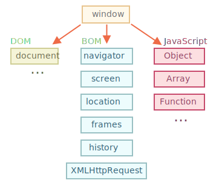

# L'environnement du navigateur, spécifications

Le langage JavaScript a été initialement créé pour les navigateurs web. Dès lors, il a évolué et est devenu un langage aux multiples utilisations et plateformes.

Une plate-forme peut être un navigateur, ou un serveur Web ou un autre *hôte*, ou même une machine à café "intelligente" si elle peut exécuter JavaScript. Chacun d'entre eux fournit des fonctionnalités spécifiques à la plate-forme. La spécification JavaScript appelle cela un *environnement hôte*.

Un environnement hôte fournit ses propres objets et fonctions en plus du noyau du langage. Les navigateurs Web permettent de contrôler les pages Web. Node.js fournit des fonctionnalités côté serveur, etc.

Voici une vue globale de ce que nous avons lorsque JavaScript s'exécute dans un navigateur Web :



Il existe un objet "racine" appelé `window`. Il a 2 rôles :

1. Premièrement, c'est un objet global pour le code JavaScript, comme décrit dans le chapitre <info:global-object>.
2. Deuxièmement, il représente la "fenêtre du navigateur" et fournit des méthodes pour la contrôler.

Par exemple, nous l'utilisons ici comme un objet global :

```js run global
function sayHi() {
  alert("Hello");
}

// les fonctions globales sont des méthodes de l'objet global :
window.sayHi();
```

Et nous l'utilisons ici comme une fenêtre du navigateur pour voir la hauteur de la fenêtre :

```js run
alert(window.innerHeight); // hauteur de la fenêtre intérieure
```

Il y a d'autres méthodes et propriétés spécifiques à la fenêtre, nous les étudierons plus tard.

## DOM (Document Object Model)

Document Object Model, ou DOM en abrégé, représente tout le contenu de la page sous forme d'objets pouvant être modifiés.

L'objet `document` est le "point d'entrée" principal de la page. Nous pouvons changer ou créer n'importe quoi sur la page en l'utilisant.

Par exemple :
```js run
// change la couleur de fond en rouge
document.body.style.background = "red";

// réinitialisation après 1 seconde
setTimeout(() => document.body.style.background = "", 1000);
```

```smart header="DOM n'est pas seulement pour les navigateurs"
La spécification DOM explique la structure d'un document et fournit des objets pour le manipuler. Il existe également des instruments autres que les navigateurs qui utilisent DOM.

Par exemple, les scripts côté serveur qui téléchargent des pages HTML et les traitent peuvent également utiliser le DOM. Ils peuvent cependant ne supporter qu'une partie de la spécification.
```

```smart header="CSSOM pour le style"
Il existe également une spécification distincte, [Modèle d'objet CSS (CSSOM)](https://www.w3.org/TR/cssom-1/) pour les règles CSS et les feuilles de style, qui explique comment elles sont représentées en tant qu'objets et comment les lire et les écrire.

CSSOM est utilisé avec DOM lorsque nous modifions les règles de style du document. En pratique cependant, CSSOM est rarement nécessaire, car nous avons rarement besoin de modifier les règles CSS à partir de JavaScript (généralement, nous ajoutons / supprimons simplement des classes CSS, pas de modifier leurs règles CSS), mais c'est également possible.
```

## BOM (Browser Object Model)

Le modèle d'objet du navigateur (BOM en anglais) contient des objets supplémentaires fournis par le navigateur (l'environnement hôte) pour travailler avec tout à l'exception du document.

Par exemple :

- L'objet [navigator](mdn:api/Window/navigator) fournit des informations contextuelles à propos du navigateur et du système d'exploitation. Il y a beaucoup de propriétés mais les deux plus connues sont : `navigator.userAgent` -- qui donne des informations sur le navigateur actuel, et `navigator.platform` sur la plateforme (peut permettre de faire la différence entre Windows/Linux/Mac etc).
- L'objet [location](mdn:api/Window/location) nous permet de lire l'URL courante et peut rediriger le navigateur vers une nouvelle adresse.

Voici comment l'on peut utiliser l'objet `location` :

```js run
alert(location.href); // affiche l'URL actuelle
if (confirm("Go to Wikipedia?")) {
  location.href = "https://wikipedia.org"; // rediriger le navigateur vers une autre URL
}
```

Les fonctions `alert/confirm/prompt` font aussi partie du BOM : elles ne sont pas directement liées au document, mais représentent des méthodes du navigateur de communication pure avec l'utilisateur.

```smart header="Specifications"
le BOM fait partie de la [spécification HTML](https://html.spec.whatwg.org) générale.

Oui, vous avez bien entendu. La spécification HTML disponible à l'adresse <https://html.spec.whatwg.org> ne parle pas seulement du "langage HTML" (balises, attributs), mais couvre également un tas d'objets, de méthodes et d'extensions DOM spécifiques au navigateur. C'est l'"HTML de manière générale". En outre, certaines parties ont des spécifications supplémentaires listées ici : <https://spec.whatwg.org>.
```

## Résumé

Quand on parle de normes, nous avons :

La spécification DOM
: Décrit la structure du document, ses manipulations et événements, voir <https://dom.spec.whatwg.org>.

La spécification CSSOM
: Décrit les feuilles de style et les règles de style, les manipulations de style les impliquant et leur liaisons aux documents, voir <https://www.w3.org/TR/cssom-1/>.

Spécification HTML
: Décrit le langage HTML (c'est à dire les balises) mais également le BOM (modèle d'objet du navigateur) -- diverses fonctions du navigateur : `setTimeout`, `alert`, `location` etc, voir <https://html.spec.whatwg.org>. Il récupère la spécification DOM et l'étend avec de nombreuses propriétés et méthodes additionnelles.

De plus, certaines classes sont décrites séparément sur <https://spec.whatwg.org/>.

Souvenez vous de ces liens, il y a tellement de choses à apprendre qu'il est impossible de tout couvrir et de se souvenir de tout.

Lorsque vous souhaitez en apprendre plus sur une propriété ou une méthode, le manuel de Mozilla disponible sur <https://developer.mozilla.org/en-US/search> est également une bonne ressource, mais la specification correspondante peut-être meilleure dans le sens qu'elle est plus complexe et longue à lire, mais rendra vos connaissances fondamentales saines et complètes.

Pour trouver quelque chose, il est souvent pratique de faire une simple recherche de "WHATWG [terme]" ou "MDN [terme]", par exemple <https://google.com?q=whatwg+localstorage>, <https://google.com?q=mdn+localstorage>.

Nous allons maintenant nous pencher sur le DOM, car le document joue un rôle essentiel dans l'interface utilisateur (UI).
