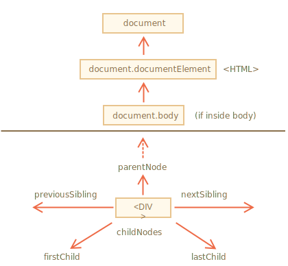
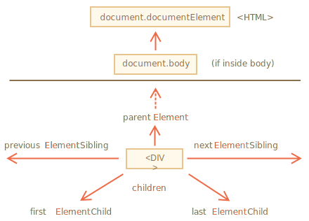

libs:
  - d3
  - domtree

---

# Parcourir le DOM

Le DOM nous permet de faire n'importe quoi avec les éléments et leur contenu, mais nous devons d'abord atteindre l'objet DOM correspondant.

Toutes les opérations sur le DOM commencent par l'objet `document`. C'est le "point d'entrée" principal du DOM. De là, nous pouvons accéder à n'importe quel nœud.

Voici une image des liens qui permettent de voyager entre les nœuds DOM :



Discutons-en plus en détail.

## En haut : documentElement et body

Les nœuds supérieurs de l'arbre sont disponibles directement en tant que propriétés de `document` :

`<html>` = `document.documentElement`
: Le nœud de document le plus haut est `document.documentElement`. C'est le noeud DOM de la balise `<html>`.

`<body>` = `document.body`
: Un autre nœud DOM largement utilisé est l'élément `<body>` -- `document.body`.

`<head>` = `document.head`
: La balise `<head>` est disponible en tant que `document.head`.

````warn header="Il y a un hic : `document.body` peut être `null`"
Un script ne peut pas accéder à un élément qui n'existe pas au moment de l'exécution.

En particulier, si un script se trouve dans `<head>`, alors `document.body` n'est pas disponible, car le navigateur ne l'a pas encore lu.

Ainsi, dans l'exemple ci-dessous, la première `alert` affiche `null` :

```html run
<html>

<head>
  <script>
*!*
    alert( "From HEAD: " + document.body ); // null, il n'y a pas encore de <body>
*/!*
  </script>
</head>

<body>

  <script>
    alert( "From BODY: " + document.body ); // HTMLBodyElement maintenant existe
  </script>

</body>
</html>
```
````

```smart header="Dans le monde du DOM, `null` signifie \"n'existe pas \""
Dans le DOM, la valeur `null` signifie "n'existe pas" ou "pas ce genre de nœud".
```

## Enfants : childNodes, firstChild, lastChild

Nous utiliserons désormais deux termes :

- **Noeuds enfants (ou enfants)** -- éléments qui sont des enfants directs. En d'autres termes, ils sont imbriqués dans celui donné. Par exemple, `<head>` et `<body>` sont des enfants de l'élément `<html>`.
- **Descendants** -- tous les éléments imbriqués dans l'élément donné, y compris les enfants, leurs enfants, etc.

Par exemple, ici `<body>` a des enfants `<div>` et `<ul>` (et quelques nœuds texte vides) :

```html run
<html>
<body>
  <div>Begin</div>

  <ul>
    <li>
      <b>Information</b>
    </li>
  </ul>
</body>
</html>
```

... Et les descendants de `<body>` ne sont pas seulement des enfants directs `<div>`, `<ul>` mais aussi des éléments plus profondément imbriqués, tels que `<li>` (un enfant de `<ul>` ) et `<b>` (un enfant de `<li>`) -- le sous-arbre entier.

**La collection `childNodes` répertorie tous les nœuds enfants, y compris les nœuds texte.**

L'exemple ci-dessous montre des enfants de `document.body` :

```html run
<html>
<body>
  <div>Begin</div>

  <ul>
    <li>Information</li>
  </ul>

  <div>End</div>

  <script>
*!*
    for (let i = 0; i < document.body.childNodes.length; i++) {
      alert( document.body.childNodes[i] ); // Text, DIV, Text, UL, ..., SCRIPT
    }
*/!*
  </script>
  ...more stuff...
</body>
</html>
```

Veuillez noter un détail intéressant ici. Si nous exécutons l'exemple ci-dessus, le dernier élément affiché est `<script>`. En fait, le document contient plus de choses en dessous, mais au moment de l'exécution du script, le navigateur ne l'a pas encore lu, donc le script ne le voit pas.

**Les propriétés `firstChild` et `lastChild` donnent un accès rapide aux premier et dernier enfants.**

Ce ne sont que des raccourcis. S'il existe des nœuds enfants, ce qui suit est toujours vrai :
```js
elem.childNodes[0] === elem.firstChild
elem.childNodes[elem.childNodes.length - 1] === elem.lastChild
```

Il y a aussi une fonction spéciale `elem.hasChildNodes()` pour vérifier s'il y a des nœuds enfants.

### Collections DOM

Comme nous pouvons le voir, `childNodes` ressemble à un tableau. Mais en réalité ce n'est pas un tableau, mais plutôt une * collection * -- un objet itérable spécial semblable à un tableau.

Il y a deux conséquences importantes :

1. Nous pouvons utiliser `for..of` pour itérer dessus :
  ```js
  for (let node of document.body.childNodes) {
    alert(node); // shows all nodes from the collection
  }
  ```
  C'est parce qu'il est itérable (fournit la propriété `Symbol.iterator`, selon les besoins).

2. Les méthodes de tableau ne fonctionneront pas, car ce n'est pas un tableau :
  ```js run
  alert(document.body.childNodes.filter); // undefined (there's no filter method!)
  ```

La première chose est sympa. La seconde est tolérable, car nous pouvons utiliser `Array.from` pour créer un "vrai" tableau à partir de la collection, si nous voulons des méthodes de tableau :

  ```js run
  alert( Array.from(document.body.childNodes).filter ); // function
  ```

```warn header="Les collections DOM sont en lecture seule"
Les collections DOM, et plus encore -- *toutes* les propriétés de navigation répertoriées dans ce chapitre sont en lecture seule.

Nous ne pouvons pas remplacer un enfant par autre chose en attribuant `childNodes[i] = ...`.

Changer le DOM nécessite d'autres méthodes. Nous les verrons dans le prochain chapitre.
```

```warn header="Les collections DOM sont live"
Presque toutes les collections DOM avec des exceptions mineures sont *live*. En d'autres termes, elles reflètent l'état actuel du DOM.

Si nous gardons une référence à `element.childNodes`, et ajoutons/supprimons des nœuds dans le DOM, alors ils apparaissent automatiquement dans la collection.
```

````warn header="N'utilisez pas `for..in` pour parcourir les collections"
Les collections sont itérables en utilisant `for..of`. Parfois, les gens essaient d'utiliser `for..in` pour cela.

À ne pas faire. La boucle `for..in` parcourt toutes les propriétés énumérables. Et les collections ont des propriétés "supplémentaires" rarement utilisées que nous ne voulons généralement pas obtenir :

```html run
<body>
<script>
  // affiche 0, 1, length, item, values et plus encore.
  for (let prop in document.body.childNodes) alert(prop);
</script>
</body>
````

## Frères, sœurs et parent

*Les frères et sœurs* sont des nœuds qui sont les enfants du même parent.

Par exemple, ici `<head>` et `<body>` sont des frères et sœurs :

```html
<html>
  <head>...</head><body>...</body>
</html>
```

- `<body>` est dit être le frère "suivant" ou "droit" de `<head>`,
- `<head>` est dit être le frère "précédent" ou "gauche" de `<body>`.

Le frère suivant est dans la propriété `nextSibling`, et le précédent - dans `previousSibling`.

Le parent est disponible en tant que `parentNode`.

Par exemple :

```js run
// le parent de <body> est <html>
alert( document.body.parentNode === document.documentElement ); // true

// après <head> vient <body>
alert( document.head.nextSibling ); // HTMLBodyElement

// avant <body> vient <head>
alert( document.body.previousSibling ); // HTMLHeadElement
```

## Navigation par élément uniquement

Les propriétés de navigation répertoriées ci-dessus font référence à *tous* les nœuds. Par exemple, dans `childNodes`, nous pouvons voir à la fois les nœuds texte, les nœuds élément et même les nœuds commentaire s'il en existe.

Mais pour de nombreuses tâches, nous ne voulons pas de nœuds texte ou commentaire. Nous voulons manipuler des nœuds élément qui représentent des balises et forment la structure de la page.

Voyons donc plus de liens de navigation qui ne prennent en compte que les *nœuds élément* :



Les liens sont similaires à ceux donnés ci-dessus, juste avec le mot `Element` à l'intérieur :

- `children` -- seuls les enfants qui sont des nœuds élément.
- `firstElementChild`, `lastElementChild` -- enfants du premier et du dernier élément.
- `previousElementSibling`, `nextElementSibling` -- éléments voisins.
- `parentElement` -- élément parent.

````smart header="Pourquoi `parentElement` ? Le parent peut-il ne *pas* être un élément ?"
La propriété `parentElement` renvoie l'élément parent, tandis que `parentNode` retourne le parent "peu importe le nœud". Ces propriétés sont généralement les mêmes : elles obtiennent toutes deux le parent.

À la seule exception de `document.documentElement` :

```js run
alert( document.documentElement.parentNode ); // document
alert( document.documentElement.parentElement ); // null
```

La raison en est que le nœud racine `document.documentElement` (`<html>`) a
`document` comme parent. Mais `document` n'est pas un nœud élément, donc `parentNode` le renvoie et pas `parentElement`.

Ce détail peut être utile lorsque nous voulons passer d'un élément arbitraire `elem` à `<html>`, mais pas au `document` :
```js
while(elem = elem.parentElement) { // remonter jusqu'à <html>
  alert( elem );
}
```
````

Modifions l'un des exemples ci-dessus : remplaçons `childNodes` par `children`. Maintenant, il ne montre que des éléments :

```html run
<html>
<body>
  <div>Begin</div>

  <ul>
    <li>Information</li>
  </ul>

  <div>End</div>

  <script>
*!*
    for (let elem of document.body.children) {
      alert(elem); // DIV, UL, DIV, SCRIPT
    }
*/!*
  </script>
  ...
</body>
</html>
```

## Plus de liens : tableaux [#dom-navigation-tables]

Jusqu'à présent, nous avons décrit les propriétés de navigation de base.

Certains types d'éléments DOM peuvent fournir des propriétés supplémentaires, spécifiques à leur type, pour plus de commodité.

Les tableaux en sont un excellent exemple et représentent un cas particulièrement important :

**L'élément `<table>`** supporte (en plus de ce qui précède) ces propriétés :
- `table.rows` -- la collection d'éléments `<tr>` du tableau.
- `table.caption/tHead/tFoot` -- références aux éléments `<caption>`, `<thead>`, `<tfoot>`.
- `table.tBodies` -- la collection d'éléments `<tbody>` (peut être multiple selon la norme, mais il y en aura toujours au moins une - même s'elle n'est pas dans le HTML source, le navigateur la mettra dans le DOM).

**`<thead>`, `<tfoot>`, `<tbody>`** les éléments fournissent la propriété `rows` :
- `tbody.rows` -- la collection de `<tr>` à l'intérieur.

**`<tr>`:**
- `tr.cells` -- la collection de cellules `<td>` et `<th>` à l'intérieur du `<tr>` donné.
- `tr.sectionRowIndex` -- la position (index) du `<tr>` donné à l'intérieur du `<thead>/<tbody>/<tfoot>`.
- `tr.rowIndex` -- le nombre de `<tr>` dans le tableau dans son ensemble (y compris toutes les lignes du tableau).

**`<td>` et `<th>` : **
- `td.cellIndex` -- le numéro de la cellule à l'intérieur du `<tr>` qui l'entoure.

Un exemple d'utilisation :

```html run height=100
<table id="table">
  <tr>
    <td>one</td><td>two</td>
  </tr>
  <tr>
    <td>three</td><td>four</td>
  </tr>
</table>

<script>
  // obtenir td avec "two" (première ligne, deuxième colonne)
  let td = table.*!*rows[0].cells[1]*/!*;
  td.style.backgroundColor = "red"; // le mettre en valeur
</script>
```

La spécification : [tabular data](https://html.spec.whatwg.org/multipage/tables.html).

Il existe également des propriétés de navigation supplémentaires pour les formulaires HTML. Nous les examinerons plus tard lorsque nous commencerons à travailler avec des formulaires.

## Résumé

Étant donné un nœud DOM, nous pouvons aller vers ses voisins immédiats en utilisant les propriétés de navigation.

Il en existe deux ensembles principaux :

- Pour tous les nœuds : `parentNode`, `childNodes`, `firstChild`, `lastChild`, `previousSibling`, `nextSibling`.
- Pour les nœuds élément uniquement : `parentElement`, `children`, `firstElementChild`, `lastElementChild`, `previousElementSibling`, `nextElementSibling`.

Certains types d'éléments DOM, par exemple , fournissent des propriétés et des collections supplémentaires pour accéder à leur contenu.
