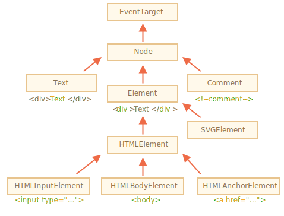

# Propriétés de nœud : type, balise et contenu

Voyons plus en détail les nœuds DOM.

Dans ce chapitre, nous verrons plus en détail ce qu'ils sont et découvrirons leurs propriétés les plus utilisées.

## Classes de nœud DOM

Différents nœuds DOM peuvent avoir des propriétés différentes. Par exemple, un nœud élément correspondant à la balise `<a>` a des propriétés liées aux liens, et celui correspondant à `<input>` a des propriétés liées aux entrées, etc. Les nœuds texte ne sont pas identiques aux nœuds élément. Mais il existe également des propriétés et des méthodes communes à chacun d'entre eux, car toutes les classes de nœuds DOM forment une hiérarchie unique.

Chaque nœud DOM appartient à la classe intégrée correspondante.

La racine de la hiérarchie est [EventTarget](https://dom.spec.whatwg.org/#eventtarget), hérité par [Node](http://dom.spec.whatwg.org/#interface-node), et d'autres nœuds DOM en héritent.

Voici l'image, les explications à suivre :



Les classes sont :

- [EventTarget](https://dom.spec.whatwg.org/#eventtarget) -- est la classe racine "abstraite". Les objets de cette classe ne sont jamais créés. Il sert de base, de sorte que tous les nœuds DOM prennent en charge les soi-disant "événements", nous les étudierons plus tard.
- [Node](http://dom.spec.whatwg.org/#interface-node) -- est également une classe "abstraite", servant de base aux nœuds DOM. Elle fournit la fonctionnalité d'arborescence de base : `parentNode`, `nextSibling`, `childNodes` et ainsi de suite (ce sont des getters). Les objets de la classe `Node` ne sont jamais créés. Mais il existe des classes de nœuds concrets qui en héritent, à savoir: `Text` pour les nœuds texte, `Element` pour les nœuds élément et plus exotiques comme `Comment` pour les nœuds commentaire.
- [Element](http://dom.spec.whatwg.org/#interface-element) -- est une classe de base pour les éléments DOM. Elle fournit une navigation au niveau des éléments comme `nextElementSibling`, `children` et des méthodes de recherche comme `getElementsByTagName`, `querySelector`. Un navigateur prend en charge non seulement HTML, mais aussi XML et SVG. La classe `Element` sert de base à des classes plus spécifiques : `SVGElement`, `XMLElement` et `HTMLElement`.
- [HTMLElement](https://html.spec.whatwg.org/multipage/dom.html#htmlelement) -- est enfin la classe de base pour tous les éléments HTML. Elle est héritée d'éléments concrets HTML :
    - [HTMLInputElement](https://html.spec.whatwg.org/multipage/forms.html#htmlinputelement) -- la classe pour les éléments `<input>`,
    - [HTMLBodyElement](https://html.spec.whatwg.org/multipage/semantics.html#htmlbodyelement) -- la classe pour les éléments `<body>`,
    - [HTMLAnchorElement](https://html.spec.whatwg.org/multipage/semantics.html#htmlanchorelement) -- la classe pour les éléments `<a>`,
    - ...et ainsi de suite, chaque balise a sa propre classe qui peut fournir des propriétés et des méthodes spécifiques.

Ainsi, l'ensemble complet des propriétés et des méthodes d'un nœud donné est le résultat de l'héritage.

Par exemple, considérons l'objet DOM pour un élément `<input>`. Il appartient à la classe  [HTMLInputElement](https://html.spec.whatwg.org/multipage/forms.html#htmlinputelement).

Il obtient les propriétés et les méthodes en superposition de (répertoriées dans l'ordre d'héritage) :

- `HTMLInputElement` -- cette classe fournit des propriétés spécifiques à l'entrée,
- `HTMLElement` -- elle fournit des méthodes d'élément HTML communes (et des getters/setters),
- `Element` -- fournit des méthodes d'élément génériques,
- `Node` -- fournit des propriétés de noeud DOM communes,
- `EventTarget` -- apporte du support aux événements (à couvrir),
- ...et finalement il hérite de `Object`, donc les méthodes "plain object" comme `hasOwnProperty` sont également disponibles.

Pour voir le nom de la classe de noeud DOM, nous pouvons rappeler qu'un objet a généralement la propriété `constructor`. Il fait référence au constructeur de classe, et `constructor.name` est son nom :

```js run
alert( document.body.constructor.name ); // HTMLBodyElement
```

...Or we can just `toString` it:

```js run
alert( document.body ); // [object HTMLBodyElement]
```

Nous pouvons également utiliser `instanceof` pour vérifier l'héritage :

```js run
alert( document.body instanceof HTMLBodyElement ); // true
alert( document.body instanceof HTMLElement ); // true
alert( document.body instanceof Element ); // true
alert( document.body instanceof Node ); // true
alert( document.body instanceof EventTarget ); // true
```

Comme nous pouvons le voir, les nœuds DOM sont des objets JavaScript normaux. Ils utilisent des classes basées sur des prototypes pour l'héritage.

C'est aussi facile à voir en sortant un élément avec `console.dir (elem)` dans un navigateur. Là, dans la console, vous pouvez voir `HTMLElement.prototype`, `Element.prototype` et ainsi de suite.

```smart header="`console.dir(elem)` versus `console.log(elem)`"
La plupart des navigateurs prennent en charge deux commandes dans leurs outils de développement : `console.log` et `console.dir`. Elles sortent leurs arguments dans la console. Pour les objets JavaScript, ces commandes font généralement la même chose.

Mais pour les éléments DOM, elles sont différents :

- `console.log(elem)` affiche l'arborescence DOM de l'élément.
- `console.dir(elem)` affiche l'élément en tant qu'objet DOM, bon pour explorer ses propriétés.

Essayez les sur `document.body`.
```

````smart header="IDL dans la spécification"
Dans la spécification, les classes DOM ne sont pas décrites en utilisant JavaScript, mais une [Interface description language](https://en.wikipedia.org/wiki/Interface_description_language) spéciale (IDL), qui est généralement facile à comprendre.

Dans IDL, toutes les propriétés sont précédées de leurs types. Par exemple, `DOMString`,  `boolean` et ainsi de suite.

En voici un extrait, avec des commentaires :

```js
// Definir HTMLInputElement
*!*
// Le signe deux-points ":" signifie que HTMLInputElement hérite de HTMLElement
*/!*
interface HTMLInputElement: HTMLElement {
  // ici les propriétés et méthodes des éléments <input>

*!*
  // "DOMString" signifie que la valeur d'une propriété est une chaîne de caractères
*/!*
  attribute DOMString accept;
  attribute DOMString alt;
  attribute DOMString autocomplete;
  attribute DOMString value;

*!*
  // propriété de valeur booléenne (true/false)
  attribute boolean autofocus;
*/!*
  ...
*!*
  // maintenant la méthode : "void" signifie que la méthode ne renvoie aucune valeur
*/!*
  void select();
  ...
}
```
````

## La propriété "nodeType"

La propriété `nodeType` fournit une autre méthode "à l'ancienne" pour obtenir le "type" d'un nœud DOM.

Il a une valeur numérique :
- `elem.nodeType == 1` pour les nœuds élément,
- `elem.nodeType == 3` pour les nœuds texte,
- `elem.nodeType == 9` pour l'objet document,
- il y a peu d'autres valeurs dans [la spécification](https://dom.spec.whatwg.org/#node).

Par exemple :

```html run
<body>
  <script>  
  let elem = document.body;

  // examinons ce que c'est ?
  alert(elem.nodeType); // 1 => élément

  // and the first child is...
  alert(elem.firstChild.nodeType); // 3 => texte

  // pour l'objet document, le type est 9
  alert( document.nodeType ); // 9
  </script>
</body>
```

Dans les scripts modernes, nous pouvons utiliser `instanceof` et d'autres tests basés sur les classes pour voir le type de nœud, mais parfois `nodeType` peut être plus simple. Nous pouvons seulement lire `nodeType`, pas le changer.

## Balise : nodeName et tagName

Étant donné un nœud DOM, nous pouvons lire son nom de balise dans les propriétés `nodeName` ou `tagName` :

Par exemple :

```js run
alert( document.body.nodeName ); // BODY
alert( document.body.tagName ); // BODY
```

Y a-t-il une différence entre `tagName` et `nodeName` ?

Bien sûr, la différence se reflète dans leurs noms, mais c'est en effet un peu subtile.

- La propriété `tagName` existe uniquement pour les nœuds `Element`.
- Le `nodeName` est défini pour tout `Node` :
    - pour les éléments, cela signifie la même chose que `tagName`.
    - pour les autres types de nœuds (texte, commentaire, etc.), il a une chaîne de caractères avec le type de nœud.

    En d'autres termes, `tagName` est uniquement pris en charge par les nœuds élément (car il provient de la classe `Element`), tandis que `nodeName` peut dire quelque chose sur d'autres types de nœuds.

Par exemple, comparons `tagName` et `nodeName` pour le `document` et un nœud de commentaire :


```html run
<body><!-- commentaire -->

  <script>
    // pour le commentaire
    alert( document.body.firstChild.tagName ); // undefined (pas un élément)
    alert( document.body.firstChild.nodeName ); // #comment

    // pour le document
    alert( document.tagName ); // undefined (pas un élément)
    alert( document.nodeName ); // #document
  </script>
</body>
```

Si nous ne traitons que des éléments, nous pouvons utiliser à la fois `tagName` et `nodeName` - il n'y a pas de différence.

```smart header="Le nom de la balise est toujours en majuscule sauf en mode XML"
Le navigateur a deux modes de traitement des documents: HTML et XML. Habituellement, le mode HTML est utilisé pour les pages Web. Le mode XML est activé lorsque le navigateur reçoit un document XML avec l'en-tête : `Content-Type: application/xml+xhtml`.

En mode HTML, `tagName/nodeName` est toujours en majuscule : c'est `BODY` pour `<body>` ou `<BoDy>`.

En mode XML, la casse est conservée "en l'état". De nos jours, le mode XML est rarement utilisé.
```


## innerHTML: les contenus

<<<<<<< HEAD
La propriété [innerHTML](https://w3c.github.io/DOM-Parsing/#widl-Element-innerHTML) permet d'obtenir le HTML à l'intérieur de l'élément sous forme de chaîne de caractères.
=======
The [innerHTML](https://w3c.github.io/DOM-Parsing/#the-innerhtml-mixin) property allows to get the HTML inside the element as a string.
>>>>>>> 99e59ba611ab11319ef9d0d66734b0bea2c3f058

Nous pouvons également le modifier. C'est donc l'un des moyens les plus puissants de modifier la page.

L'exemple montre le contenu de `document.body` puis le remplace complètement :

```html run
<body>
  <p>A paragraph</p>
  <div>A div</div>

  <script>
    alert( document.body.innerHTML ); // lit le contenu actuel
    document.body.innerHTML = 'The new BODY!'; // le remplace
  </script>

</body>
```

Nous pouvons essayer d'insérer du code HTML invalide, le navigateur corrigera nos erreurs :

```html run
<body>

  <script>
    document.body.innerHTML = '<b>test'; // oublié de fermer la balise
    alert( document.body.innerHTML ); // <b>test</b> (corrigé)
  </script>

</body>
```

```smart header="Les scripts ne s'exécutent pas"
Si `innerHTML` insère une balise `<script> `dans le document - elle devient une partie du HTML, mais ne s'exécute pas.
```

### Attention : "innerHTML+=" fait un écrasement complet

Nous pouvons ajouter du HTML à un élément en utilisant `elem.innerHTML+="more html"`.

Comme ceci :

```js
chatDiv.innerHTML += "<div>Hello !</div>";
chatDiv.innerHTML += "How goes?";
```

Mais nous devons faire très attention à le faire, car ce qui se passe n'est *pas* un ajout, mais une réécriture complète.

Techniquement, ces deux lignes font de même :

```js
elem.innerHTML += "...";
// is a shorter way to write:
*!*
elem.innerHTML = elem.innerHTML + "..."
*/!*
```

En d'autres termes, `innerHTML+=` fait ceci :

1. L'ancien contenu est supprimé.
2. Le nouveau `innerHTML` est écrit à la place (une concaténation de l'ancien et du nouveau).

**Comme le contenu est "remis à zéro" et réécrit à partir de zéro, toutes les images et autres ressources seront rechargées**.

Dans l'exemple `chatDiv` au-dessus de la ligne `chatDiv.innerHTML+="How goes?"` recrée le contenu HTML et recharge `smile.gif` (espérons qu'il est mis en cache). Si `chatDiv` a beaucoup d'autres textes et images, alors le rechargement devient clairement visible.

Il existe également d'autres effets secondaires. Par exemple, si le texte existant a été sélectionné avec la souris, la plupart des navigateurs supprimeront la sélection lors de la réécriture de "innerHTML". Et s'il y avait un `<input>` avec un texte entré par le visiteur, alors le texte sera supprimé. Etc.

Heureusement, il existe d'autres façons d'ajouter du HTML en plus de `innerHTML`, et nous les étudierons bientôt.

## outerHTML : HTML complet de l'élément

La propriété `outerHTML` contient le code HTML complet de l'élément. C'est comme `innerHTML` plus l'élément lui-même.

Voici un exemple :

```html run
<div id="elem">Hello <b>World</b></div>

<script>
  alert(elem.outerHTML); // <div id="elem">Hello <b>World</b></div>
</script>
```

**Attention : contrairement à `innerHTML`, l'écriture dans `outerHTML` ne modifie pas l'élément. Au lieu de cela, il le remplace dans le DOM.**

Oui, cela semble étrange, et c'est étrange, c'est pourquoi nous en faisons une note séparée ici. Jetez-y un oeil.

Prenons l'exemple :

```html run
<div>Hello, world!</div>

<script>
  let div = document.querySelector('div');

*!*
  // remplace div.outerHTML avec <p>...</p>
*/!*
  div.outerHTML = '<p>A new element</p>'; // (*)

*!*
  // Wow! 'div' est toujours la même !
*/!*
  alert(div.outerHTML); // <div>Hello, world!</div> (**)
</script>
```

Ça a l'air vraiment bizarre, non ?

Dans la ligne `(*)` nous avons remplacé `div` par `<p>A new element</p>`. Dans le document externe (le DOM), nous pouvons voir le nouveau contenu au lieu de `<div>`. Mais, comme nous pouvons le voir dans la ligne `(**)`, la valeur de l'ancienne variable `div` n'a pas changé !

L'affectation `outerHTML` ne modifie pas l'élément DOM (l'objet référencé, dans ce cas, la variable 'div'), mais le supprime du DOM et insère le nouveau HTML à sa place.

Donc, ce qui s'est passé dans `div.outerHTML=...` est :
- `div` a été supprimé du document.
- Un autre morceau du HTML `<p>A new element</p>` a été inséré à sa place.
- `div` a toujours son ancienne valeur. Le nouveau HTML n'a été enregistré dans aucune variable.

Il est si facile de faire une erreur ici : modifiez `div.outerHTML` puis continuez à travailler avec `div` comme s'il contenait le nouveau contenu. Mais ce n'est pas le cas. Ce genre de chose est correcte pour `innerHTML`, mais pas pour `outerHTML`.

Nous pouvons écrire dans `elem.outerHTML`, mais nous devons garder à l'esprit que cela ne change pas l'élément dans lequel nous écrivons ('elem'). Il place le nouveau HTML à sa place. Nous pouvons obtenir des références aux nouveaux éléments en interrogeant le DOM.

## nodeValue/data : contenu du nœud texte

La propriété `innerHTML` n'est valide que pour les nœuds élément.

D'autres types de nœuds, tels que les nœuds texte, ont leur contrepartie : les propriétés `nodeValue` et `data`. Ces deux sont presque les mêmes pour une utilisation pratique, il n'y a que des différences de spécifications mineures. Nous allons donc utiliser `data`, car il est plus court.

Un exemple de lecture du contenu d'un nœud texte et d'un commentaire :

```html run height="50"
<body>
  Hello
  <!-- Commentaire -->
  <script>
    let text = document.body.firstChild;
*!*
    alert(text.data); // Hello
*/!*

    let comment = text.nextSibling;
*!*
    alert(comment.data); // Commentaire
*/!*
  </script>
</body>
```

Pour les nœuds texte, nous pouvons imaginer une raison de les lire ou de les modifier, mais pourquoi des commentaires ?

Parfois, les développeurs incorporent des informations ou des instructions de modèle dans HTML, comme ceci :

```html
<!-- if isAdmin -->
  <div>Welcome, Admin!</div>
<!-- /if -->
```

...Ensuite, JavaScript peut le lire à partir de la propriété `data` et traiter les instructions intégrées.

## textContent: texte pur 

Le `textContent` donne accès au *texte* à l'intérieur de l'élément : seulement le texte, moins tous les `<tags>`.

Par exemple :

```html run
<div id="news">
  <h1>Headline!</h1>
  <p>Martians attack people!</p>
</div>

<script>
  // Headline! Martians attack people!
  alert(news.textContent);
</script>
```

Comme nous pouvons le voir, seul le texte est renvoyé, comme si tous les `<tags>` étaient supprimés, mais le texte qu'ils contenaient est resté.

En pratique, la lecture d'un tel texte est rarement nécessaire.

**Ecrire dans `textContent` est beaucoup plus utile, car il permet d'écrire du texte de "manière sûre".**

Disons que nous avons une chaîne de caractères arbitraire, par exemple entrée par un utilisateur, et que nous voulons l'afficher.

- Avec `innerHTML` nous allons l'insérer "au format HTML", avec toutes les balises HTML.
- Avec `textContent` nous allons l'insérer "en tant que texte", tous les symboles sont traités littéralement.

Comparez les deux :

```html run
<div id="elem1"></div>
<div id="elem2"></div>

<script>
  let name = prompt("What's your name?", "<b>Winnie-the-Pooh!</b>");

  elem1.innerHTML = name;
  elem2.textContent = name;
</script>
```

<<<<<<< HEAD
1. La première `<div>` obtient le nom "en HTML" : toutes les balises deviennent des balises, nous voyons donc le nom en gras.
2. La seconde `<div>` obtient le nom "sous forme de texte", donc nous voyons littéralement `<b>Winnie-the-pooh!</b>`.
=======
1. The first `<div>` gets the name "as HTML": all tags become tags, so we see the bold name.
2. The second `<div>` gets the name "as text", so we literally see `<b>Winnie-the-Pooh!</b>`.
>>>>>>> 99e59ba611ab11319ef9d0d66734b0bea2c3f058

Dans la plupart des cas, nous attendons le texte d'un utilisateur et souhaitons le traiter comme du texte. Nous ne voulons pas de HTML inattendu sur notre site. Une affectation à `textContent` fait exactement cela.

## La propriété "cachée"

L'attribut "hidden" (caché) et la propriété DOM spécifient si l'élément est visible ou non.

<<<<<<< HEAD
Nous pouvons l'utiliser dans le HTML ou l'attribuer en utilisant JavaScript, comme ceci :
=======
We can use it in HTML or assign it using JavaScript, like this:
>>>>>>> 99e59ba611ab11319ef9d0d66734b0bea2c3f058

```html run height="80"
<div>Both divs below are hidden</div>

<div hidden>With the attribute "hidden"</div>

<div id="elem">JavaScript assigned the property "hidden"</div>

<script>
  elem.hidden = true;
</script>
```

Techniquement, `hidden` fonctionne de la même manière que `style="display:none"`. Mais c'est plus court à écrire.

Voici un élément clignotant :


```html run height=50
<div id="elem">A blinking element</div>

<script>
  setInterval(() => elem.hidden = !elem.hidden, 1000);
</script>
```

## Plus de propriétés

Les éléments DOM ont également des propriétés supplémentaires, en particulier celles qui dépendent de la classe :

- `value` -- la valeur pour `<input>`, `<select>` et `<textarea>` (`HTMLInputElement`, `HTMLSelectElement`...).
- `href` -- le "href" pour `<a href="...">` (`HTMLAnchorElement`).
- `id` -- la valeur de l'attribut "id", pour tous les éléments (`HTMLElement`).
- ...et beaucoup plus...

Par exemple :

```html run height="80"
<input type="text" id="elem" value="value">

<script>
  alert(elem.type); // "text"
  alert(elem.id); // "elem"
  alert(elem.value); // value
</script>
```

La plupart des attributs HTML standard ont la propriété DOM correspondante, et nous pouvons y accéder comme ça.

Si nous voulons connaître la liste complète des propriétés prises en charge pour une classe donnée, nous pouvons les trouver dans la spécification. Par exemple, `HTMLInputElement` est documenté à <https://html.spec.whatwg.org/#htmlinputelement>.

Ou si nous voulons les obtenir rapidement ou encore si nous sommes intéressés par une spécification concrète de navigateur - nous pouvons toujours sortir l'élément en utilisant `console.dir(elem)` et lire les propriétés. Ou explorez les "propriétés DOM" dans l'onglet Éléments des outils de développement du navigateur.

## Résumé

Chaque nœud DOM appartient à une certaine classe. Les classes forment une hiérarchie. L'ensemble complet des propriétés et des méthodes résulte de l'héritage.

Les propriétés principales du nœud DOM sont :

`nodeType`
: Nous pouvons l'utiliser pour voir si un nœud est un texte ou un nœud d'élément. Il a une valeur numérique: `1` pour les éléments, `3` pour les nœuds de texte et quelques autres pour les autres types de nœuds. Lecture seulement.

`nodeName/tagName`
: Pour les éléments, nom de balise (en majuscules sauf en mode XML). Pour les nœuds non-élément, `nodeName` décrit ce que c'est. Lecture seulement.

`innerHTML`
: Le contenu HTML de l'élément. Peut être modifié.

`outerHTML`
: Le code HTML complet de l'élément. Une opération d'écriture dans `elem.outerHTML` ne touche pas `elem` lui-même. Au lieu de cela, il est remplacé par le nouveau HTML dans le contexte externe.

`nodeValue/data`
: Le contenu d'un nœud non élément (texte, commentaire). Ces deux sont presque les mêmes, nous utilisons généralement `data`. Peut être modifié.

`textContent`
: Le texte à l'intérieur de l'élément : le HTML moins tous les `<tags>`. L'écriture met le texte à l'intérieur de l'élément, avec tous les caractères spéciaux et balises traités exactement comme du texte. Peut insérer en toute sécurité du texte généré par l'utilisateur et protéger contre les insertions HTML indésirables.

`hidden`
: Lorsqu'il est défini sur `true`, fait la même chose que CSS `display:none`.

Les nœuds DOM ont également d'autres propriétés en fonction de leur classe. Par exemple, les éléments `<input>` (`HTMLInputElement`) prennent en charge `value`, `type`, tandis que les éléments `<a>` (`HTMLAnchorElement`) prennent en charge `href` etc. La plupart des attributs HTML standard ont une propriété DOM correspondante.

Cependant, les attributs HTML et les propriétés DOM ne sont pas toujours les mêmes, comme nous le verrons dans le chapitre suivant.
