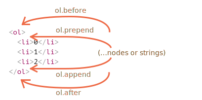
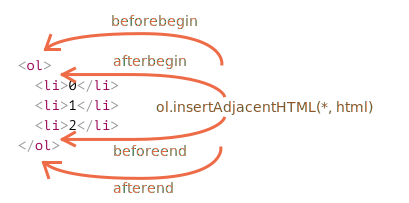

# Modification du document

La modification DOM est la clé pour créer des pages "live".

Ici, nous verrons comment créer de nouveaux éléments "à la volée" et modifier le contenu de la page existante.

## Exemple : afficher un message

Démontrons en utilisant un exemple. Nous allons ajouter un message sur la page qui est plus joli que `alert`.

Voici à quoi cela ressemblera :

```html autorun height="80"
<style>
.alert {
  padding: 15px;
  border: 1px solid #d6e9c6;
  border-radius: 4px;
  color: #3c763d;
  background-color: #dff0d8;
}
</style>

*!*
<div class="alert">
  <strong>Hi there!</strong> You've read an important message.
</div>
*/!*
```

C'était un exemple HTML. Créons maintenant la même `div` avec JavaScript (en supposant que les styles sont déjà dans le HTML ou un fichier CSS externe).

## Création d'un élément

Pour créer des nœuds DOM, il existe deux méthodes :

`document.createElement(tag)`
: Crée un nouveau *noeud élément* avec la balise donnée :

    ```js
    let div = document.createElement('div');
    ```

`document.createTextNode(text)`
: Crée un nouveau *nœud texte* avec le texte donné :

    ```js
    let textNode = document.createTextNode('Here I am');
    ```

La plupart du temps, nous devons créer des nœuds d'élément, tels que le `div` pour le message.

### Création du message

La création du message div prend 3 étapes :

```js
// 1. Create <div> element
let div = document.createElement('div');

// 2. Set its class to "alert"
div.className = "alert";

// 3. Fill it with the content
div.innerHTML = "<strong>Hi there!</strong> You've read an important message.";
```

Nous avons créé l'élément. Mais pour le moment, ce n'est que dans une variable nommée `div`, pas encore dans la page. Nous ne pouvons donc pas le voir.

## Méthodes d'insertion

Pour faire apparaître la `div`, nous devons l'insérer quelque part dans `document`. Par exemple, dans l'élément `<body>`, référencé par `document.body`.

Il existe une méthode spéciale `append` pour cela : `document.body.append(div)`.

Voici le code complet :

```html run height="80"
<style>
.alert {
  padding: 15px;
  border: 1px solid #d6e9c6;
  border-radius: 4px;
  color: #3c763d;
  background-color: #dff0d8;
}
</style>

<script>
  let div = document.createElement('div');
  div.className = "alert";
  div.innerHTML = "<strong>Hi there!</strong> You've read an important message.";

*!*
  document.body.append(div);
*/!*
</script>
```

Ici, nous avons appelé `append` sur `document.body`, mais nous pouvons appeler la méthode `append` sur n'importe quel autre élément, pour y mettre un autre élément. Par exemple, nous pouvons ajouter quelque chose à `<div>` en appelant `div.append(anotherElement)`.

Voici plus de méthodes d'insertion, elles spécifient différents endroits où insérer :

- `node.append(...nodes or strings)` -- ajouter des nœuds ou des chaînes de caractères *à la fin* de `node`,
- `node.prepend(...nodes or strings)` -- insérer des nœuds ou des chaînes de caractères *au début* de `node`,
- `node.before(...nodes or strings)` –- insérer des nœuds ou des chaînes de caractères *avant* `node`,
- `node.after(...nodes or strings)` –- insérer des nœuds ou des chaînes de caractères *après* `node`,
- `node.replaceWith(...nodes or strings)` –- remplace `node` avec les nœuds ou chaînes de caractères donnés.

Les arguments de ces méthodes sont une liste arbitraire de nœuds DOM à insérer ou des chaînes de texte (qui deviennent automatiquement des nœuds de texte).

Voyons-les en action.

Voici un exemple d'utilisation de ces méthodes pour ajouter des éléments à une liste et le texte avant/après :

```html autorun
<ol id="ol">
  <li>0</li>
  <li>1</li>
  <li>2</li>
</ol>

<script>
  ol.before('before'); // insère la chaîne de caractères "before" avant <ol>
  ol.after('after'); // insère la chaîne de caractères "after" après <ol>

  let liFirst = document.createElement('li');
  liFirst.innerHTML = 'prepend';
  ol.prepend(liFirst); // insère liFirst au début de <ol>

  let liLast = document.createElement('li');
  liLast.innerHTML = 'append';
  ol.append(liLast); // insère liLast à la fin de <ol>
</script>
```

Voici une image visuelle de ce que font les méthodes :



La liste finale sera donc :

```html
before
<ol id="ol">
  <li>prepend</li>
  <li>0</li>
  <li>1</li>
  <li>2</li>
  <li>append</li>
</ol>
after
```

Comme indiqué, ces méthodes peuvent insérer plusieurs nœuds et morceaux de texte en un seul appel.

Par exemple, ici une chaîne de caractères et un élément sont insérés :

```html run
<div id="div"></div>
<script>
  div.before('<p>Hello</p>', document.createElement('hr'));
</script>
```

Remarque: le texte est inséré "en tant que texte", pas "en tant que HTML", avec un échappement approprié des caractères tels que `<`, `>`.

Le HTML final est donc :

```html run
*!*
&lt;p&gt;Hello&lt;/p&gt;
*/!*
<hr>
<div id="div"></div>
```

En d'autres termes, les chaînes de caractères sont insérées de manière sûre, comme le fait `elem.textContent`.

Ainsi, ces méthodes ne peuvent être utilisées que pour insérer des nœuds DOM ou des morceaux de texte.

Mais que se passe-t-il si nous voulons insérer du HTML "en tant que html", avec toutes les balises et les trucs qui fonctionnent, comme `elem.innerHTML` le fait ?

## insertAdjacentHTML/Text/Element

Pour cela, nous pouvons utiliser une autre méthode assez polyvalente : `elem.insertAdjacentHTML(where, html)`.

Le premier paramètre est un mot de code, spécifiant où insérer par rapport à `elem`. Doit être l'un des suivants :

- `"beforebegin"` -- insère `html` immédiatement avant `elem`,
- `"afterbegin"` -- insère `html` dans `elem`, au début,
- `"beforeend"` -- insère `html` dans `elem`, à la fin,
- `"afterend"` -- insère `html` immédiatement après `elem`.

Le second paramètre est une chaîne HTML insérée "au format HTML".

Par exemple :

```html run
<div id="div"></div>
<script>
  div.insertAdjacentHTML('beforebegin', '<p>Hello</p>');
  div.insertAdjacentHTML('afterend', '<p>Bye</p>');
</script>
```

...Conduirait à :

```html run
<p>Hello</p>
<div id="div"></div>
<p>Bye</p>
```

Voilà comment nous pouvons ajouter du code HTML arbitraire à la page.

Voici l'image des variantes d'insertion :



Nous pouvons facilement remarquer des similitudes entre cette image et l'image précédente. Les points d'insertion sont en fait les mêmes, mais cette méthode insère du HTML.

La méthode a deux sœurs :

- `elem.insertAdjacentText(where, text)` -- la même syntaxe, mais une chaîne de caractères `text` est insérée `en tant que texte` au lieu de HTML,
- `elem.insertAdjacentElement(where, elem)` -- la même syntaxe, mais insère un élément.

Elles existent principalement pour rendre la syntaxe "uniforme". En pratique, seule `insertAdjacentHTML` est utilisée la plupart du temps. Parce que pour les éléments et le texte, nous avons des méthodes `append/prepend/before/after` -- elles sont plus courtes à écrire et peuvent insérer des nœuds/morceaux de texte.

Voici donc une variante alternative pour afficher un message :

```html run
<style>
.alert {
  padding: 15px;
  border: 1px solid #d6e9c6;
  border-radius: 4px;
  color: #3c763d;
  background-color: #dff0d8;
}
</style>

<script>
  document.body.insertAdjacentHTML("afterbegin", `<div class="alert">
    <strong>Hi there!</strong> You've read an important message.
  </div>`);
</script>
```

## Suppression de noeuds

Pour supprimer un nœud, il existe une méthode `node.remove()`.

Faisons disparaître notre message après une seconde :

```html run untrusted
<style>
.alert {
  padding: 15px;
  border: 1px solid #d6e9c6;
  border-radius: px;
  color: #3c763d;
  background-color: #dff0d8;
}
</style>

<script>
  let div = document.createElement('div');
  div.className = "alert";
  div.innerHTML = "<strong>Hi there!</strong> You've read an important message.";

  document.body.append(div);
*!*
  setTimeout(() => div.remove(), 1000);
*/!*
</script>
```

Veuillez noter : si nous voulons *déplacer* un élément vers un autre endroit -- il n'est pas nécessaire de le supprimer de l'ancien.

**Toutes les méthodes d'insertion suppriment automatiquement le nœud de l'ancien emplacement.**

Par exemple, permutons les éléments :

```html run height=50
<div id="first">First</div>
<div id="second">Second</div>
<script>
  // pas besoin d'appeler remove
  second.after(first); // prend #second et après insère #first
</script>
```

## Clonage de Noeuds : cloneNode

Comment insérer un autre message similaire ?

Nous pourrions créer une fonction et y mettre le code. Mais l'alternative serait de *cloner* la `div` existant et de modifier le texte à l'intérieur (si nécessaire).

Parfois, lorsque nous avons un gros élément, cela peut être plus rapide et plus simple.

- L'appel `elem.cloneNode(true)` crée un clone "profond" de l'élément -- avec tous les attributs et sous-éléments. Si nous appelons `elem.cloneNode(false)`, alors le clone est fait sans éléments enfants.

Un exemple de copie du message :

```html run height="120"
<style>
.alert {
  padding: 15px;
  border: 1px solid #d6e9c6;
  border-radius: 4px;
  color: #3c763d;
  background-color: #dff0d8;
}
</style>

<div class="alert" id="div">
  <strong>Hi there!</strong> You've read an important message.
</div>

<script>
*!*
  let div2 = div.cloneNode(true); // clone the message
  div2.querySelector('strong').innerHTML = 'Bye there!'; // change le clone

  div.after(div2); // affiche le clone après le div existant
*/!*
</script>
```

## DocumentFragment [#document-fragment]

`DocumentFragment` est un nœud DOM spécial qui sert de wrapper pour passer autour des listes de nœuds.

Nous pouvons y ajouter d'autres nœuds, mais lorsque nous l'insérons quelque part, son contenu est inséré à la place.

Par exemple, `getListContent` ci-dessous génère un fragment avec des éléments `<li>`, qui sont ensuite insérés dans `<ul>` :

```html run
<ul id="ul"></ul>

<script>
function getListContent() {
  let fragment = new DocumentFragment();

  for(let i=1; i<=3; i++) {
    let li = document.createElement('li');
    li.append(i);
    fragment.append(li);
  }

  return fragment;
}

*!*
ul.append(getListContent()); // (*)
*/!*
</script>
```

Veuillez noter qu'à la dernière ligne `(*)` nous ajoutons `DocumentFragment`, mais il "s'adapte", donc la structure résultante sera :

```html
<ul>
  <li>1</li>
  <li>2</li>
  <li>3</li>
</ul>
```

`DocumentFragment` est rarement utilisé explicitement. Pourquoi ajouter à un type spécial de nœud, si nous pouvons renvoyer un tableau de nœuds à la place ? Exemple réécrit :

```html run
<ul id="ul"></ul>

<script>
function getListContent() {
  let result = [];

  for(let i=1; i<=3; i++) {
    let li = document.createElement('li');
    li.append(i);
    result.push(li);
  }

  return result;
}

*!*
ul.append(...getListContent()); // append + "..." operator = friends!
*/!*
</script>
```

Nous mentionnons `DocumentFragment` principalement parce qu'il y a quelques concepts dessus, comme l'élément [template](info:template-element), que nous couvrirons beaucoup plus tard.

## Méthodes d'insertion/suppression à l'ancienne

[old]

Il existe également des méthodes de manipulation du DOM "à l'ancienne", qui existent pour des raisons historiques.

Ces méthodes viennent d'une époque très ancienne. De nos jours, il n'y a aucune raison de les utiliser, depuis qu'il existe des méthodes modernes, telles que `append`, `prepend`, `before`, `after`, `remove`, `replaceWith`, qui sont plus flexibles.

La seule raison pour laquelle nous listons ces méthodes ici est que vous pouvez les trouver dans de nombreux anciens scripts :

`parentElem.appendChild(node)`
: Appends `node` as the last child of `parentElem`.

    The following example adds a new `<li>` to the end of `<ol>`:

    ```html run height=100
    <ol id="list">
      <li>0</li>
      <li>1</li>
      <li>2</li>
    </ol>

    <script>
      let newLi = document.createElement('li');
      newLi.innerHTML = 'Hello, world!';

      list.appendChild(newLi);
    </script>
    ```

`parentElem.insertBefore(node, nextSibling)`
: Insère `node` avant `nextSibling` dans `parentElem`.

    Le code suivant insère un nouvel élément de liste avant le second `<li>` :

    ```html run height=100
    <ol id="list">
      <li>0</li>
      <li>1</li>
      <li>2</li>
    </ol>
    <script>
      let newLi = document.createElement('li');
      newLi.innerHTML = 'Hello, world!';

    *!*
      list.insertBefore(newLi, list.children[1]);
    */!*
    </script>
    ```
    Pour insérer `newLi` comme premier élément, nous pouvons le faire comme ceci :

    ```js
    list.insertBefore(newLi, list.firstChild);
    ```

`parentElem.replaceChild(node, oldChild)`
: Remplace `oldChild` avec `node` chez les enfants de `parentElem`.

`parentElem.removeChild(node)`
: Supprime `node` de `parentElem` (en supposant que `node` est son enfant).

    L'exemple suivant supprime d'abord `<li>` de `<ol>` :

    ```html run height=100
    <ol id="list">
      <li>0</li>
      <li>1</li>
      <li>2</li>
    </ol>

    <script>
      let li = list.firstElementChild;
      list.removeChild(li);
    </script>
    ```

Toutes ces méthodes renvoient le nœud inséré/supprimé. En d'autres termes, `parentElem.appendChild(node)` renvoie `node`. Mais généralement, la valeur retournée n'est pas utilisée, nous exécutons simplement la méthode.

## Un mot sur "document.write"

Il existe une autre méthode très ancienne pour ajouter quelque chose à une page Web : `document.write`.

La syntaxe :

```html run
<p>Somewhere in the page...</p>
*!*
<script>
  document.write('<b>Hello from JS</b>');
</script>
*/!*
<p>The end</p>
```

L'appel à `document.write(html)` écrit le `html` dans la page "ici et maintenant". La chaîne de caractères `html` peut être générée dynamiquement, donc c'est un peu flexible. Nous pouvons utiliser JavaScript pour créer une page Web à part entière et l'écrire.

La méthode vient de l'époque où il n'y avait pas de DOM, pas de standards ... Des temps vraiment anciens. Il vit toujours, car il existe des scripts qui l'utilisent.

Dans les scripts modernes, nous le voyons rarement, en raison de la limitation importante suivante :

**L'appel à `document.write` ne fonctionne que pendant le chargement de la page.**

Si nous l'appelons ensuite, le contenu du document existant est effacé.

Par exemple :

```html run
<p>After one second the contents of this page will be replaced...</p>
*!*
<script>
  // document.write après 1 seconde
  // cela après que la page soit chargée, donc il efface le contenu existant
  setTimeout(() => document.write('<b>...By this.</b>'), 1000);
</script>
*/!*
```

C'est donc un peu inutilisable au stade "post chargement", contrairement aux autres méthodes DOM que nous avons couvertes ci-dessus.

Voilà l'inconvénient.

Il y a aussi un avantage. Techniquement, lorsque `document.write` est appelé pendant que le navigateur lit ("analyse") le HTML entrant, et qu'il écrit quelque chose, le navigateur le consomme comme s'il était initialement là, dans le texte HTML.

Cela fonctionne donc très rapidement, car il n'y a *aucune modification du DOM* impliquée. Il écrit directement dans le texte de la page, tandis que le DOM n'est pas encore construit.

Donc, si nous devons ajouter beaucoup de texte en HTML de manière dynamique, et que nous sommes en phase de chargement de page, et que la vitesse compte, cela peut aider. Mais dans la pratique, ces exigences se rencontrent rarement. Et généralement, nous pouvons voir cette méthode dans les scripts simplement parce qu'ils sont anciens.

## Résumé

- Méthodes pour créer de nouveaux nœuds :
    - `document.createElement(tag)` -- crée un élément avec la balise donnée,
    - `document.createTextNode(value)` -- crée un nœud texte (rarement utilisé),
    - `elem.cloneNode(deep)` -- clone l'élément, si `deep==true` tous les descendants viennent avec.

- Insertion et suppression :
    - `node.append(...nodes or strings)` -- insère dans `node`, à la fin,
    - `node.prepend(...nodes or strings)` -- insère dans `node`, au début,
    - `node.before(...nodes or strings)` –- insère juste avant `node`,
    - `node.after(...nodes or strings)` –- insère juste après `node`,
    - `node.replaceWith(...nodes or strings)` –- remplace `node`.
    - `node.remove()` –- supprime le `node`.

    Les chaînes de caractères texte sont insérées "sous forme de texte".

- Il existe également des méthodes "old school" :
    - `parent.appendChild(node)`
    - `parent.insertBefore(node, nextSibling)`
    - `parent.removeChild(node)`
    - `parent.replaceChild(newElem, node)`

    Toutes ces méthodes retournent le `node`.

- Étant donné un peu de HTML dans `html`, `elem.insertAdjacentHTML(where, html)` l'insère en fonction de la valeur de `where` :
    - `"beforebegin"` -- insère `html` juste avant `elem`,
    - `"afterbegin"` -- insère `html` dans `elem`, au début,
    - `"beforeend"` -- insère `html` dans `elem`, à la fin,
    - `"afterend"` -- insère `html` juste après `elem`.

    Il existe également des méthodes similaires, `elem.insertAdjacentText` et `elem.insertAdjacentElement`, qui insèrent des chaînes de caractères texte et des éléments, mais ils sont rarement utilisés.

- Pour ajouter du HTML à la page avant la fin du chargement :
    - `document.write(html)`

    Une fois la page chargée, un tel appel efface le document. Surtout vu dans les anciens scripts.
