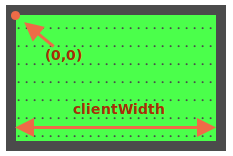

La balle a une `position:absolue`. Cela signifie que ses coordonnées `gauche/haut` sont mesurées à partir de l'élément positionné le plus proche, c'est-à-dire `#field` (car il a `position:relative`).

Les coordonnées commencent à partir du coin supérieur gauche intérieur du champ :



La largeur/hauteur du champ intérieur est `clientWidth/clientHeight`. Le centre de terrain a donc les coordonnées `(clientWidth/2, clientHeight/2)`.

...Mais si nous définissons `ball.style.left/top` à de telles valeurs, alors pas la balle dans son ensemble, mais le bord supérieur gauche de la balle serait au centre :

```js
ball.style.left = Math.round(field.clientWidth / 2) + 'px';
ball.style.top = Math.round(field.clientHeight / 2) + 'px';
```

Voici à quoi ça ressemble :

[iframe height=180 src="ball-half"]

Pour aligner le centre de la balle avec le centre du terrain, nous devons déplacer la balle sur la moitié de sa largeur à gauche et sur la moitié de sa hauteur vers le haut :

```js
ball.style.left = Math.round(field.clientWidth / 2 - ball.offsetWidth / 2) + 'px';
ball.style.top = Math.round(field.clientHeight / 2 - ball.offsetHeight / 2) + 'px';
```

Maintenant, la balle est enfin centrée.

````warn header="Attention : l'écueil !"

Le code ne fonctionnera pas de manière fiable tant que `` n'a pas de largeur/hauteur :

```html

```
````

Lorsque le navigateur ne connaît pas la largeur/hauteur d'une image (à partir des attributs de balise ou CSS), il suppose qu'ils sont égaux à `0` jusqu'à ce que le chargement de l'image soit terminé.

Ainsi, la valeur de `ball.offsetWidth` sera `0` jusqu'à ce que l'image se charge. Cela conduit à de mauvaises coordonnées dans le code ci-dessus.

Après le premier chargement, le navigateur met généralement l'image en cache et lors des rechargements, elle aura immédiatement la taille. Mais lors du premier chargement, la valeur de `ball.offsetWidth` est `0`.

Nous devons corriger cela en ajoutant `width/height` à `` :

```html

```

...Ou indiquez la taille en CSS :

```css
#ball {
  width: 40px;
  height: 40px;
}
```
