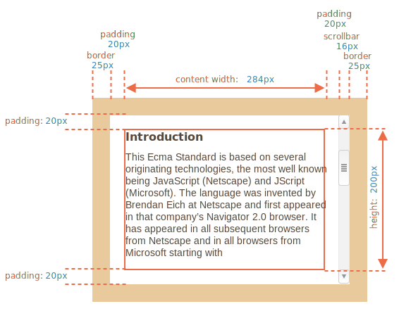
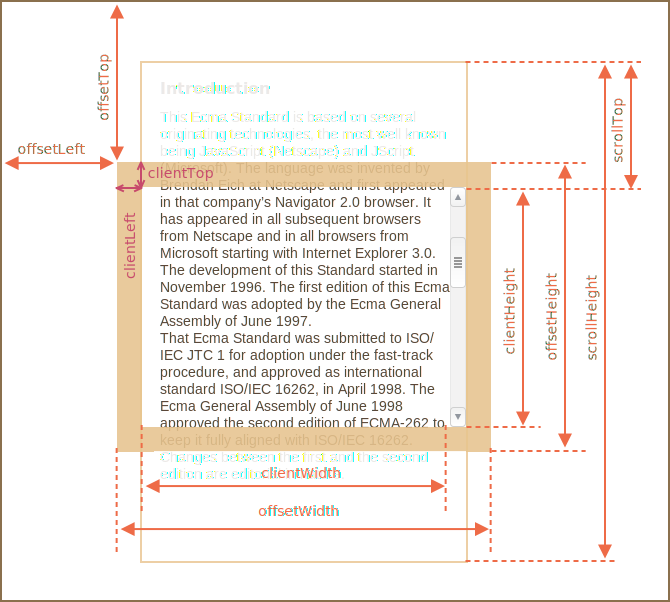
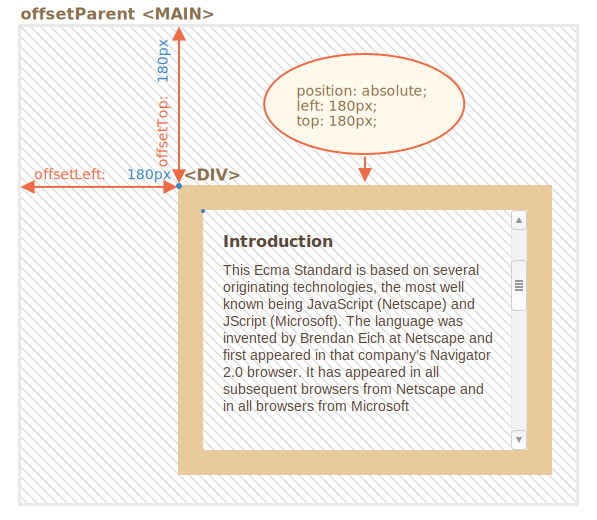
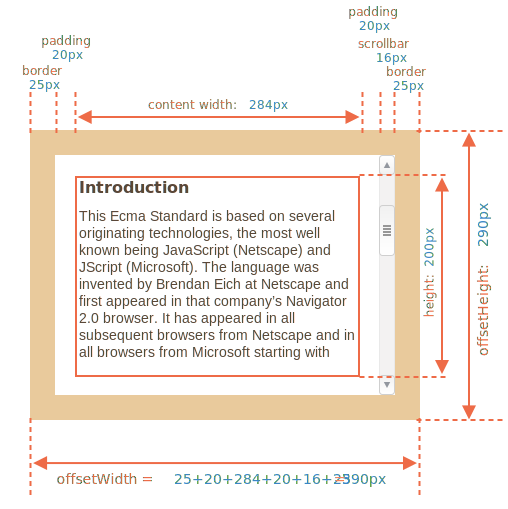
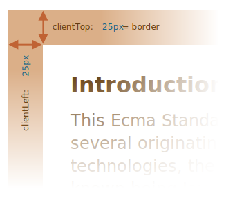
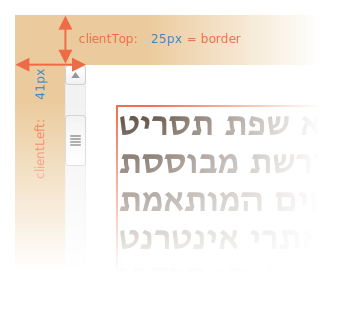
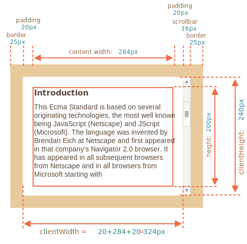
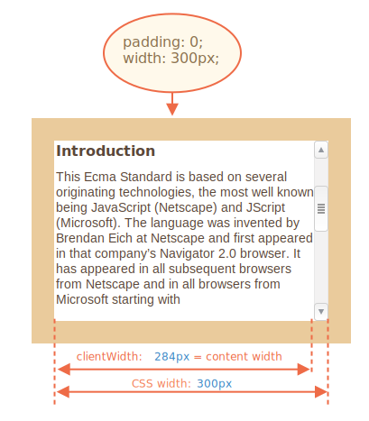
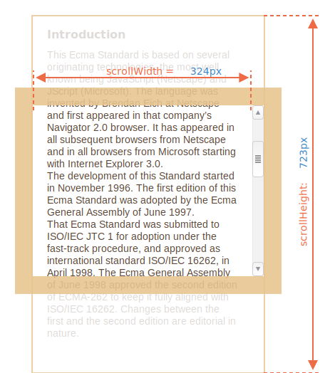
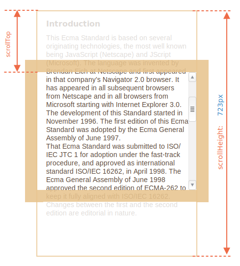

# Taille des éléments et défilement

Il existe de nombreuses propriétés JavaScript qui nous permettent de lire des informations sur la largeur, la hauteur des éléments et d'autres caractéristiques géométriques.

Nous en avons souvent besoin lors du déplacement ou du positionnement d'éléments en JavaScript.

## Exemple d'élément

Comme exemple d'élément pour démontrer les propriétés, nous utiliserons celui donné ci-dessous :

```html no-beautify
<div id="example">
  ...Text...
</div>
<style>
  #example {
    width: 300px;
    height: 200px;
    border: 25px solid #E8C48F;
    padding: 20px;              
    overflow: auto;             
  }
</style>
```

Il a la bordure, le padding et le défilement. L'ensemble complet de fonctionnalités. Il n'y a pas de marges, car elles ne font pas partie de l'élément lui-même et il n'y a pas de propriétés spéciales pour elles.

L'élément ressemble à ceci :



Vous pouvez [ouvrir le document dans la sandbox](sandbox:metric).

```smart header="Attention à la barre de défilement"
L'image ci-dessus illustre le cas le plus complexe lorsque l'élément a une barre de défilement. Certains navigateurs (pas tous) lui réservent de l'espace en le prenant dans le contenu (étiqueté comme "largeur de contenu" ci-dessus).

Ainsi, sans barre de défilement, la largeur du contenu serait de `300px`, mais si la barre de défilement est large de 16 pixels (la largeur peut varier entre les appareils et les navigateurs), il ne reste que `300 - 16 = 284 pixels`, et nous devons en tenir compte. . C'est pourquoi les exemples de ce chapitre supposent qu'il y a une barre de défilement. Sans cela, certains calculs sont plus simples.
```

```smart header="La zone `padding-bottom` peut être remplie de texte"
Habituellement, les paddings sont vides sur nos illustrations, mais s'il y a beaucoup de texte dans l'élément et qu'il déborde, alors les navigateurs affichent le texte "débordant" dans `padding-bottom`, c'est normal.
```

## Géométrie

Voici l'image globale avec les propriétés de la géométrie :



Les valeurs de ces propriétés sont techniquement des nombres, mais ces nombres sont "de pixels", donc ce sont des mesures de pixels.

Commençons à explorer les propriétés à partir de l'extérieur de l'élément.

## offsetParent, offsetLeft/Top

Ces propriétés sont rarement nécessaires, mais ce sont toujours les propriétés de géométrie "les plus extérieures", nous allons donc commencer par elles.

Le `offsetParent` est l'ancêtre le plus proche que le navigateur utilise pour calculer les coordonnées pendant le rendu.

C'est l'ancêtre le plus proche qui est l'un des suivants :

1. CSS positionné (`position` is `absolute`, `relative`, `fixed` or `sticky`),  ou
2. `<td>`, `<th>`, ou `<table>`,  ou
3. `<body>`.

Les propriétés `offsetLeft/offsetTop` fournissent des coordonnées x/y par rapport au coin supérieur gauche de `offsetParent`.

Dans l'exemple ci-dessous, la `<div>` intérieure a `<main>` comme `offsetParent` et `offsetLeft/offsetTop` décale de son coin supérieur gauche (`180`) :

```html run height=10
<main style="position: relative" id="main">
  <article>
    <div id="example" style="position: absolute; left: 180px; top: 180px">...</div>
  </article>
</main>
<script>
  alert(example.offsetParent.id); // main
  alert(example.offsetLeft); // 180 (note : un nombre, pas une chaîne de caractères "180px")
  alert(example.offsetTop); // 180
</script>
```



Il y a plusieurs occasions où `offsetParent` est `null` :

1. Pour les éléments non affichés (`display:none` ou pas dans le document).
2. Pour `<body>` et `<html>`.
3. Pour les éléments avec `position:fixed`.

## offsetWidth/Height

Passons maintenant à l'élément lui-même.

Ces deux propriétés sont les plus simples. Elles fournissent la largeur/hauteur "extérieure" de l'élément. Ou, en d'autres termes, sa taille complète, y compris les bordures.



Pour notre exemple d'élément :

- `offsetWidth = 390` -- la largeur extérieure, peut être calculée comme la largeur CSS intérieure (`300px`) plus les paddings (`2 * 20px`) et les bordures (`2 * 25px`).
- `offsetHeight = 290` -- la hauteur extérieure.

````smart header="Les propriétés de géométrie sont zéro/nulles pour les éléments qui ne sont pas affichés"
Les propriétés de géométrie sont calculées uniquement pour les éléments affichés.

Si un élément (ou l'un de ses ancêtres) a `display:none` ou n'est pas dans le document, alors toutes les propriétés géométriques sont zéro (ou `null` pour `offsetParent`).

Par exemple, `offsetParent` est` null`, et `offsetWidth`,` offsetHeight` sont `0` lorsque nous avons créé un élément, mais ne l'avons pas encore inséré dans le document, ou il (ou son ancêtre) a `display:none`.

Nous pouvons l'utiliser pour vérifier si un élément est caché, comme ceci :

```js
function isHidden(elem) {
  return !elem.offsetWidth && !elem.offsetHeight;
}
```

Veuillez noter qu'un `isHidden` renvoie `true` pour les éléments qui sont à l'écran, mais qui ont des tailles nulles (comme une `<div>` vide).
````

## clientTop/Left

À l'intérieur de l'élément, nous avons les bordures.

Pour les mesurer, il existe des propriétés `clientTop` et `clientLeft`.

Dans notre exemple :

- `clientLeft = 25` -- largeur de bordure gauche
- `clientTop = 25` -- largeur de bordure supérieure



... Mais pour être précis - ces propriétés ne sont pas la largeur/hauteur de la bordure, mais plutôt les coordonnées relatives du côté intérieur par rapport au côté extérieur.

Quelle est la différence ?

Il devient visible lorsque le document est de droite à gauche (le système d'exploitation est en arabe ou en hébreu). La barre de défilement n'est alors pas à droite, mais à gauche, puis `clientLeft` inclut également la largeur de la barre de défilement.

Dans ce cas, `clientLeft` ne serait pas `25`, mais avec la largeur de la barre de défilement `25 + 16 = 41`.

Voici l'exemple en hébreu :



## clientWidth/Height

Ces propriétés fournissent la taille de la zone à l'intérieur des bordures des éléments.

Ils incluent la largeur du contenu ainsi que les paddings, mais sans la barre de défilement :



Sur l'image ci-dessus, considérons d'abord `clientHeight`.

Il n'y a pas de barre de défilement horizontale, c'est donc exactement la somme de ce qui se trouve à l'intérieur des bordures : hauteur CSS `200px` plus paddings supérieur et inférieur (`2 * 20px`) total `240px`.

Maintenant `clientWidth` - ici la largeur du contenu n'est pas `300px`, mais `284px`, car `16px` sont occupés par la barre de défilement. Ainsi, la somme est `284px` plus les paddings gauche et droit, total `324px`.

**S'il n'y a pas de paddings, alors `clientWidth/Height` est exactement la zone de contenu, à l'intérieur des bordures et de la barre de défilement (le cas échéant).**



Donc, quand il n'y a pas de padding, nous pouvons utiliser `clientWidth/clientHeight` pour obtenir la taille de la zone de contenu.

## scrollWidth/Height

Ces propriétés sont comme `clientWidth/clientHeight`, mais elles incluent également les parties déroulantes (cachées) :



Sur l'image ci-dessus :

- `scrollHeight = 723` -- est la pleine hauteur intérieure de la zone de contenu, y compris des parties déroulantes.
- `scrollWidth = 324` -- est la largeur intérieure complète, ici nous n'avons pas de défilement horizontal, donc il est égal à `clientWidth`.

Nous pouvons utiliser ces propriétés pour agrandir l'élément à sa pleine largeur/hauteur.

Comme ceci :

```js
// expand the element to the full content height
element.style.height = `${element.scrollHeight}px`;
```

```online
Cliquez sur le bouton pour développer l'élément :

<div id="element" style="width:300px;height:200px; padding: 0;overflow: auto; border:1px solid black;">text text text text text text text text text text text text text text text text text text text text text text text text text text text text text text text text text text text text text text text text text text text text text text text text text text text text text text text text text text text text text text text text text text text text text text text text text text text text text text text text text text text text text text text text text text text text text text text text text text text text text text text text text text text text text text text text text text text text text text text text text text text text text text text text text text text text text text text text text text text text</div>

<button style="padding:0" onclick="element.style.height = `${element.scrollHeight}px`">element.style.height = `${element.scrollHeight}px`</button>
```

## scrollLeft/scrollTop

Les propriétés `scrollLeft/scrollTop` sont la largeur/hauteur de la partie cachée et déroulée de l'élément.

Sur l'image ci-dessous, nous pouvons voir `scrollHeight` et `scrollTop` pour un bloc avec un défilement vertical.



En d'autres termes, `scrollTop` est "combien est déroulé".

````smart header="`scrollLeft/scrollTop` peut être modifié"
La plupart des propriétés de géométrie ici sont en lecture seule, mais `scrollLeft/scrollTop` peut être modifié, et le navigateur fera défiler l'élément.

```online
Si vous cliquez sur l'élément ci-dessous, le code `elem.scrollTop + = 10` s'exécute. Cela fait défiler le contenu de l'élément `10px` vers le bas.

<div onclick="this.scrollTop+=10" style="cursor:pointer;border:1px solid black;width:100px;height:80px;overflow:auto">Click<br>Me<br>1<br>2<br>3<br>4<br>5<br>6<br>7<br>8<br>9</div>
```

<<<<<<< HEAD
Mettre `scrollTop` à `0` ou `Infinity` fera défiler l'élément vers le haut/bas respectivement.
=======
Setting `scrollTop` to `0` or a big value, such as `1e9` will make the element scroll to the very top/bottom respectively.
>>>>>>> 340ce4342100f36bb3c4e42dbe9ffa647d8716c8
````

## Ne prenez pas la largeur/hauteur du CSS

Nous venons de couvrir les propriétés géométriques des éléments DOM, qui peuvent être utilisées pour obtenir des largeurs, des hauteurs et calculer des distances.

Mais comme nous le savons du chapitre <info:styles-and-classes>, nous pouvons lire hauteur et largeur CSS en utilisant `getComputedStyle`.

Alors pourquoi ne pas lire la largeur d'un élément avec `getComputedStyle`, comme ceci ?

```js run
let elem = document.body;

alert( getComputedStyle(elem).width ); // affiche la largeur CSS pour elem
```

Pourquoi devrions-nous plutôt utiliser des propriétés géométriques ? Il y a deux raisons :

1. Tout d'abord, la `largeur/hauteur` en CSS dépend d'une autre propriété : le `box-sizing` qui définit "ce qui est" la largeur et la hauteur en CSS. Un changement de `box-sizing` à des fins CSS peut casser un tel JavaScript.
2. Deuxièmement, la `largeur/hauteur` en CSS peut être `auto`, par exemple pour un élément en ligne :

    ```html run
    <span id="elem">Hello!</span>

    <script>
    *!*
      alert( getComputedStyle(elem).width ); // auto
    */!*
    </script>
    ```

    Du point de vue CSS, `width:auto` est parfaitement normal, mais en JavaScript, nous avons besoin d'une taille exacte en `px` que nous pouvons utiliser dans les calculs. Donc ici, la largeur CSS est inutile.

Et il y a une autre raison : une barre de défilement. Parfois, le code qui fonctionne correctement sans barre de défilement devient bogué, car une barre de défilement prend de l'espace dans le contenu de certains navigateurs. La largeur réelle disponible pour le contenu est donc *inférieure* à la largeur CSS. Et `clientWidth/clientHeight` en tient compte.

...Mais avec `getComputedStyle(elem).width` la situation est différente. Certains navigateurs (par exemple Chrome) renvoient la largeur intérieure réelle, moins la barre de défilement, et certains d'entre eux (par exemple Firefox) -- largeur CSS (ignorent la barre de défilement). De telles différences entre navigateurs sont la raison de ne pas utiliser `getComputedStyle`, mais plutôt de s'appuyer sur les propriétés géométriques.

```online
Si votre navigateur réserve l'espace pour une barre de défilement (la plupart des navigateurs pour Windows le font), vous pouvez le tester ci-dessous.

[iframe src="cssWidthScroll" link border=1]

L'élément avec du texte a comme CSS `width:300px`.

Sur un OS de bureau Windows, Firefox, Chrome, Edge réservent tous l'espace pour la barre de défilement. Mais Firefox affiche `300 pixels`, tandis que Chrome et Edge affichent moins. En effet, Firefox renvoie la largeur CSS et les autres navigateurs renvoient la largeur "réelle".
```

Veuillez noter que la différence décrite concerne uniquement la lecture de `getComputedStyle(...).width` à partir de JavaScript, visuellement tout est correct.

## Résumé

Les éléments ont les propriétés géométriques suivantes :

- `offsetParent` -- est l'ancêtre le plus proche ou `td`, `th`, `table`, `body`.
- `offsetLeft/offsetTop` -- coordonnées par rapport au bord supérieur gauche de `offsetParent`.
- `offsetWidth/offsetHeight` -- largeur/hauteur "extérieure" d'un élément, bordures comprises.
- `clientLeft/clientTop` -- les distances entre le coin extérieur supérieur gauche et le coin intérieur supérieur gauche (contenu + padding). Pour le système d'exploitation de gauche à droite, ce sont toujours les largeurs des bordures gauche/supérieure. Pour le système d'exploitation de droite à gauche, la barre de défilement verticale est à gauche, donc `clientLeft` inclut également sa largeur.
- `clientWidth/clientHeight` -- la largeur/hauteur du contenu, y compris les paddings, mais sans la barre de défilement.
- `scrollWidth/scrollHeight` -- la largeur/hauteur du contenu, tout comme `clientWidth/clientHeight`, mais inclut également la partie invisible et déroulante de l'élément.
- `scrollLeft/scrollTop` -- largeur/hauteur de la partie supérieure déroulante de l'élément, à partir de son coin supérieur gauche.

Toutes les propriétés sont en lecture seule sauf `scrollLeft/scrollTop` qui font défiler le navigateur l'élément s'il est modifié.
