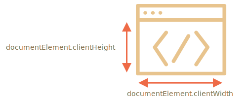

# Tailles des fenêtres et défilement

Comment trouver la largeur et la hauteur de la fenêtre du navigateur ? Comment obtenir la largeur et la hauteur complètes du document, y compris la partie déroulante ? Comment faire défiler la page en utilisant JavaScript ?

Pour ce type d'informations, nous pouvons utiliser l'élément de document racine `document.documentElement`, qui correspond à la balise `<html>`. Mais il existe des méthodes et des particularités supplémentaires suffisamment importantes pour être prises en compte.

## Largeur/hauteur de la fenêtre

Pour obtenir la largeur et la hauteur de la fenêtre, nous pouvons utiliser `clientWidth/clientHeight` de `document.documentElement` :



```online
Par exemple, ce bouton affiche la hauteur de votre fenêtre :

<button onclick="alert(document.documentElement.clientHeight)">alert(document.documentElement.clientHeight)</button>
```

````warn header="Pas `window.innerWidth/Height`"
Les navigateurs prennent également en charge les propriétés `window.innerWidth/innerHeight`. Ils ressemblent à ce que nous voulons, alors pourquoi ne pas les utiliser à la place ?

S'il existe une barre de défilement et qu'elle occupe de l'espace, `clientWidth/clientHeight` fournit la largeur/hauteur sans elle (cela la soustrait). En d'autres termes, elles renvoient la largeur/hauteur de la partie visible du document, disponible pour le contenu.

… Et `window.innerWidth/innerHeight` inclut la barre de défilement.

S'il y a une barre de défilement et qu'elle occupe de l'espace, ces deux lignes affichent des valeurs différentes :
```js run
alert( window.innerWidth ); // pleine largeur de fenêtre
alert( document.documentElement.clientWidth ); // largeur de la fenêtre moins la barre de défilement
```

Dans la plupart des cas, nous avons besoin de la largeur de fenêtre *disponible* : pour dessiner ou positionner quelque chose. C'est-à-dire : à l'intérieur des barres de défilement s'il y en a. Nous devons donc utiliser `documentElement.clientHeight/Width`.
````

```warn header="`Le DOCTYPE` est important"
Remarque: les propriétés de géométrie de niveau supérieur peuvent fonctionner un peu différemment lorsqu'il n'y a pas de `<!DOCTYPE HTML>` dans HTML. Des choses étranges sont possibles.

Dans le HTML moderne, nous devons toujours écrire le `DOCTYPE`.
```

## Largeur/hauteur du document

Théoriquement, comme l'élément de document racine est `document.documentElement` et qu'il contient tout le contenu, nous pourrions mesurer le document en taille réelle comme `document.documentElement.scrollWidth/scrollHeight`.

Mais sur cet élément, pour la page entière, ces propriétés ne fonctionnent pas comme prévu. Dans Chrome/Safari/Opera s'il n'y a pas de défilement, alors `documentElement.scrollHeight` peut être encore moins que `documentElement.clientHeight` ! Cela ressemble à un non-sens, bizarre, non ?

Pour obtenir de manière fiable la pleine hauteur du document, nous devons prendre le maximum de ces propriétés :

```js run
let scrollHeight = Math.max(
  document.body.scrollHeight, document.documentElement.scrollHeight,
  document.body.offsetHeight, document.documentElement.offsetHeight,
  document.body.clientHeight, document.documentElement.clientHeight
);

alert('Full document height, with scrolled out part: ' + scrollHeight);
```

Pourquoi ? Mieux vaut ne pas demander. Ces incohérences viennent des temps anciens, pas d'une logique "intelligente".

## Obtenez le défilement actuel [#page-scroll]

Les éléments DOM ont leur état de défilement actuel dans leurs propriétés `scrollLeft/scrollTop`.

Pour le défilement de document, `document.documentElement.scrollLeft/Top` fonctionne dans la plupart des navigateurs, à l'exception des plus anciens basés sur WebKit, comme Safari (bug [5991](https://bugs.webkit.org/show_bug.cgi?id=5991)), où nous devrions utiliser `document.body` au lieu de `document.documentElement`.

Heureusement, nous n'avons pas du tout à nous souvenir de ces particularités, car le défilement est disponible dans les propriétés spéciales `window.pageXOffset/pageYOffset` :

```js run
alert('Current scroll from the top: ' + window.pageYOffset);
alert('Current scroll from the left: ' + window.pageXOffset);
```

Ces propriétés sont en lecture seule.

```smart header="Également disponible en tant que propriétés `window` `scrollX` et `scrollY`"
Pour des raisons historiques, les deux propriétés existent, mais elles sont identiques :
- `window.pageXOffset` est un alias de `window.scrollX`.
- `window.pageYOffset` est un alias de `window.scrollY`.
```
## Défilement : scrollTo, scrollBy, scrollIntoView [#window-scroll]

```warn
Pour faire défiler la page avec JavaScript, son DOM doit être entièrement construit.

Par exemple, si nous essayons de faire défiler la page à partir du script dans `<head>`, cela ne fonctionnera pas.
```

Les éléments réguliers peuvent défiler en changeant `scrollTop/scrollLeft`.

Nous pouvons faire de même pour la page utilisant `document.documentElement.scrollTop/Left` (sauf Safari, où `document.body.scrollTop/Left` devrait être utilisé à la place).

Alternativement, il existe une solution plus simple et universelle: des méthodes spéciales [window.scrollBy(x,y)](mdn:api/Window/scrollBy) et [window.scrollTo(pageX,pageY)](mdn:api/Window/scrollTo).

- La méthode `scrollBy(x, y)` fait défiler la page *par rapport à sa position actuelle*. Par exemple, `scrollBy(0,10)` fait défiler la page `10px` vers le bas.

    ```online
    Le bouton ci-dessous illustre cela:

    <button onclick="window.scrollBy(0,10)">window.scrollBy(0,10)</button>
    ```
- La méthode `scrollTo(pageX,pageY)` fait défiler la page *jusqu'aux coordonnées absolues*, de sorte que le coin supérieur gauche de la partie visible ait les coordonnées `(pageX, pageY)` par rapport au coin supérieur gauche du document. C'est comme définir `scrollLeft/scrollTop`.

    Pour faire défiler jusqu'au tout début, nous pouvons utiliser `scrollTo(0,0)`.

    ```online
    <button onclick="window.scrollTo(0,0)">window.scrollTo(0,0)</button>
    ```

Ces méthodes fonctionnent de la même manière pour tous les navigateurs.

## scrollIntoView

Pour être complet, couvrons une autre méthode : [elem.scrollIntoView(top)](mdn:api/Element/scrollIntoView).

L'appel à `elem.scrollIntoView(top)` fait défiler la page pour rendre `elem` visible. Il a un argument :

- Si `top=true` (c'est la valeur par défaut), alors la page défilera pour faire apparaître `elem` en haut de la fenêtre. Le bord supérieur de l'élément est aligné avec le haut de la fenêtre.
- Si `top=false`, alors la page défile pour faire apparaître `elem` en bas. Le bord inférieur de l'élément est aligné avec le bas de la fenêtre.

```online
Le bouton ci-dessous fait défiler la page pour aligner l'élément en haut de la fenêtre :

<button onclick="this.scrollIntoView()">this.scrollIntoView()</button>

Et ce bouton fait défiler la page pour l'aligner en bas :

<button onclick="this.scrollIntoView(false)">this.scrollIntoView(false)</button>
```

## Interdire le défilement

Parfois, nous devons rendre le document "non-défilable". Par exemple, lorsque nous devons le couvrir d'un gros message nécessitant une attention immédiate et que nous voulons que le visiteur interagisse avec ce message, pas avec le document.

Pour rendre le document impossible à faire défiler, il suffit de définir `document.body.style.overflow = "hidden"`. La page se fige sur son défilement actuel.

```online
Essayez-le :

<button onclick="document.body.style.overflow = 'hidden'">document.body.style.overflow = 'hidden'</button>

<button onclick="document.body.style.overflow = ''">document.body.style.overflow = ''</button>

Le premier bouton fige le défilement, le second le reprend.
```

Nous pouvons utiliser la même technique pour "figer" le défilement pour d'autres éléments, pas seulement pour `document.body`.

L'inconvénient de la méthode est que la barre de défilement disparaît. S'il occupait de l'espace, cet espace est désormais libre et le contenu "saute" pour le remplir.

Cela semble un peu étrange, mais peut être contourné si nous comparons `clientWidth` avant et après le gel, et s'il a augmenté (la barre de défilement a disparu), puis ajoutez un `padding` à `document.body` à la place de la barre de défilement, pour conservez la même largeur de contenu.

## Résumé

Géométrie :

- Largeur/hauteur de la partie visible du document (largeur/hauteur de la zone de contenu) : `document.documentElement.clientWidth/Height`
- Largeur/hauteur de l'ensemble du document, avec la partie déroulante :

    ```js
    let scrollHeight = Math.max(
      document.body.scrollHeight, document.documentElement.scrollHeight,
      document.body.offsetHeight, document.documentElement.offsetHeight,
      document.body.clientHeight, document.documentElement.clientHeight
    );
    ```

Défilement :

- Lire le défilement actuel : `window.pageYOffset/pageXOffset`.
- Modifiez le défilement actuel :

    - `window.scrollTo(pageX,pageY)` -- coordonnées absolues,
    - `window.scrollBy(x,y)` -- défilement par rapport à l'endroit actuel,
    - `elem.scrollIntoView(top)` -- défilement pour rendre `elem` visible (alignement avec le haut/bas de la fenêtre).
