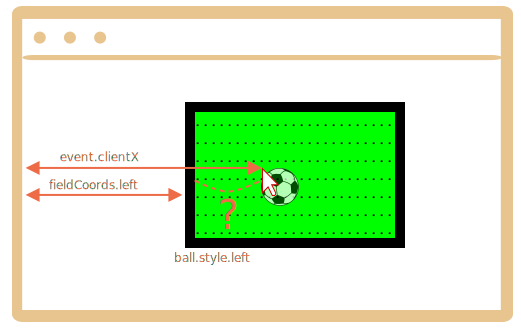

Nous devons d'abord choisir une méthode de positionnement de la balle.

Nous ne pouvons pas utiliser `position:fixed` pour cela, car faire défiler la page déplacerait la balle du terrain.

Nous devrions donc utiliser `position:absolute` et, pour rendre le positionnement vraiment solide, positionner `field` lui-même.

Ensuite le ballon sera positionné relativement au terrain :

<!--
First we need to choose a method of positioning the ball.

We can't use `position:fixed` for it, because scrolling the page would move the ball from the field.

So we should use `position:absolute` and, to make the positioning really solid, make `field` itself positioned.

Then the ball will be positioned relatively to the field:-->

```css
#field {
  width: 200px;
  height: 150px;
  position: relative;
}

#ball {
  position: absolute;
  left: 0; /*par rapport à l'ancêtre positionné le plus proche (champ)*//* relative to the closest positioned ancestor (field) */
  top: 0;
  transition: 1s all; /* L'animation CSS pour gauche/haut fait voler la balle *//* CSS animation for left/top makes the ball fly */
}
```

Ensuite, nous devons attribuer le bon `ball.style.left/top`. Ils contiennent maintenant des coordonnées relatives au champ.

Voici l'image :

<!--

Next we need to assign the correct `ball.style.left/top`. They contain field-relative coordinates now.

Here's the picture:-->



Nous avons `event.clientX/clientY` -- coordonnées relatives à la fenêtre du clic.

Pour obtenir la coordonnée "gauche" relative au champ du clic, nous pouvons soustraire le bord gauche du champ et la largeur de la bordure :

<!--
We have `event.clientX/clientY` -- window-relative coordinates of the click.

To get field-relative `left` coordinate of the click, we can substract the field left edge and the border width:-->

```js
let left = event.clientX - fieldCoords.left - field.clientLeft;
```

Normalement, `ball.style.left` signifie le "bord gauche de l'élément" (la balle). Donc, si nous attribuons cette "gauche", alors le bord de la balle, et non le centre, serait sous le curseur de la souris.

Nous devons déplacer la balle à mi-largeur vers la gauche et à mi-hauteur vers le haut pour la centrer.

Ainsi, la "gauche" finale serait :
<!--
Normally, `ball.style.left` means the "left edge of the element" (the ball). So if we assign that `left`, then the ball edge, not center, would be under the mouse cursor.

We need to move the ball half-width left and half-height up to make it center.

So the final `left` would be:-->

```js
let left = event.clientX - fieldCoords.left - field.clientLeft - ball.offsetWidth/2;
```

La coordonnée verticale est calculée selon la même logique.

Veuillez noter que la largeur/hauteur de la balle doit être connue au moment où nous accédons à `ball.offsetWidth`. Cela doit être spécifié en HTML ou CSS.
<!--
The vertical coordinate is calculated using the same logic.

Please note that the ball width/height must be known at the time we access `ball.offsetWidth`. Should be specified in HTML or CSS.
-->