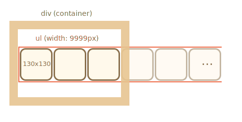
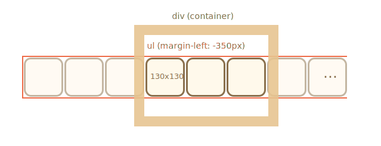

Le ruban d'images peut être représenté par une liste d'images `ul/li` ``.

Normalement, un tel ruban est large, mais nous mettons un `
` de taille fixe autour pour le "couper", de sorte que seule une partie du ruban soit visible :

Pour que la liste s'affiche horizontalement, nous devons appliquer les bonnes propriétés CSS à `<li>`, comme `display: inline-block`.

Pour `` nous devrions également ajuster `display`, car par défaut c'est `inline`. Il y a un espace supplémentaire réservé sous les éléments `inline` pour les "queues de lettre", nous pouvons donc utiliser `display: block` pour le supprimer.

Pour que la liste défile, nous pouvons décaler `<ul>`. Il existe de nombreuses façons de le faire, par exemple en modifiant `margin-left` ou (pour de meilleures performances) en utilisant `transform: translateX()` :

Le `
` externe a une largeur fixe, donc les images "supplémentaires" sont coupées.

L'ensemble du carrousel est un "composant graphique" autonome de la page, nous ferions donc mieux de l'envelopper dans un seul `
` et de styliser les choses à l'intérieur.

<!--
The images ribbon can be represented as `ul/li` list of images ``.

Normally, such a ribbon is wide, but we put a fixed-size `
` around to "cut" it, so that only a part of the ribbon is visible:

To make the list show horizontally we need to apply correct CSS properties for `<li>`, like `display: inline-block`.

For `` we should also adjust `display`, because by default it's `inline`. There's extra space reserved under `inline` elements for "letter tails", so we can use `display:block` to remove it.

To do the scrolling, we can shift `<ul>`. There are many ways to do it, for instance by changing `margin-left` or (better performance) use `transform: translateX()`:

The outer `
` has a fixed width, so "extra" images are cut.

The whole carousel is a self-contained "graphical component" on the page, so we'd better wrap it into a single `
` and style things inside it.-->
