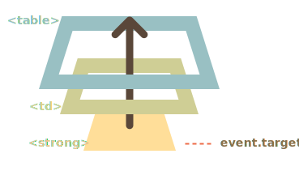

# Délégation d'événement

<<<<<<< HEAD
La capture et le bouillonement ("bubbling") nous permettent d'implémenter l'un des modèles de gestion d'événements les plus puissants appelés *Délégation d'événement*.
=======
Capturing and bubbling allow us to implement one of the most powerful event handling patterns called *event delegation*.
>>>>>>> 0f748275e20a81700c8514f22a7cc80c4422d09c

L'idée est que si nous avons beaucoup d'éléments traités de la même manière, au lieu d'assigner un gestionnaire à chacun d'eux -- nous mettons un seul gestionnaire sur leur ancêtre commun.

Dans le gestionnaire, nous obtenons `event.target` pour voir où l'événement s'est réellement produit et le gérer.

Voyons un exemple -- le [diagramme Ba-Gua](http://en.wikipedia.org/wiki/Ba_gua) reflétant l'ancienne philosophie chinoise.

Le voici:

[iframe height=350 src="bagua" edit link]

Le code HTML est comme ceci:

```html
<table>
  <tr>
    <th colspan="3"><em>Bagua</em> Chart: Direction, Element, Color, Meaning</th>
  </tr>
  <tr>
    <td class="nw"><strong>Northwest</strong><br>Metal<br>Silver<br>Elders</td>
    <td class="n">...</td>
    <td class="ne">...</td>
  </tr>
  <tr>...2 more lines of this kind...</tr>
  <tr>...2 more lines of this kind...</tr>
</table>
```

Le tableau a 9 cellules, mais il pourrait y en avoir 99 ou 9999, peu importe.

**Notre tâche est de surligner une cellule `<td>` en cliquant dessus.**

Au lieu d'assigner un gestionnaire `onclick` à chaque `<td>` -- nous allons configurer le gestionnaire "foure-tout" sur l'élément `<table>`.

Il utilisera `event.target` pour obtenir l'élément cliqué et le surligner.

Le code:

```js
let selectedTd;

*!*
table.onclick = function(event) {
  let target = event.target; // où était le clic?

  if (target.tagName != 'TD') return; // pas sur TD? Alors nous ne sommes pas intéressés

  highlight(target); // surligner
};
*/!*

function highlight(td) {
  if (selectedTd) { // supprimer le surlignage le cas échéant
    selectedTd.classList.remove('highlight');
  }
  selectedTd = td;
  selectedTd.classList.add('highlight'); // surligner le nouveau td
}
```

Un tel code ne se soucie pas du nombre de cellules dans le tableau. Nous pouvons ajouter / supprimer `<td>` dynamiquement à tout moment et le surlignage fonctionnera toujours.

Pourtant, il y a un inconvénient.

Le clic peut se produire non pas sur le `<td>`, mais à l'intérieur.

Dans notre cas, si nous jetons un œil à l'intérieur du HTML, nous pouvons voir des balises imbriquées à l'intérieur de `<td>`, comme `<strong>`:

```html
<td>
*!*
  <strong>Northwest</strong>
*/!*
  ...
</td>
```

Naturellement, si un clic se produit sur la balise `<strong>`, elle devient la valeur de `event.target`.



Dans le gestionnaire `table.onclick`, nous devrions prendre `event.target` et découvrir si le clic était à l'intérieur de `<td>` ou non.

Voici le code amélioré:

```js
table.onclick = function(event) {
  let td = event.target.closest('td'); // (1)

  if (!td) return; // (2)

  if (!table.contains(td)) return; // (3)

  highlight(td); // (4)
};
```

Explications:
1. La méthode `elem.closest(selector)` retourne l'ancêtre le plus proche qui correspond au sélecteur. Dans notre cas, nous recherchons `<td>` en remontant de l'élément source.
2. Si `event.target` n'est pas à l'intérieur d'un `<td>`, alors l'appel renvoie immédiatement, car il n'y a rien à faire.
3. Dans le cas de tableaux imbriquées, `event.target` peut être un `<td>`, mais se trouvant en dehors du tableau actuel. Nous vérifions donc si c'est réellement la balise `<td>` de *notre tableau*.
4. Si c'est le cas, surligner le.

En conséquence, nous avons un code de surlignage rapide et efficace, qui ne se soucie pas du nombre total de `<td>` dans le tableau.

## Exemple de délégation: actions dans le balisage

Il existe d'autres utilisations de la délégation d'événements.

Disons que nous voulons créer un menu avec les boutons "Save", "Load", "Search" et ainsi de suite. Et il y a un objet avec les méthodes `save`, `load`, `search`... Comment les faire correspondre?

La première idée peut être d'assigner un gestionnaire distinct à chaque bouton. Mais il existe une solution plus élégante. Nous pouvons ajouter un gestionnaire pour tout le menu et des attributs `data-action` pour les boutons qui ont la méthode à appeler:

```html
<button *!*data-action="save"*/!*>Click to Save</button>
```

Le gestionnaire lit l'attribut et exécute la méthode. Jetez un œil à l'exemple suivant:

```html autorun height=60 run untrusted
<div id="menu">
  <button data-action="save">Save</button>
  <button data-action="load">Load</button>
  <button data-action="search">Search</button>
</div>

<script>
  class Menu {
    constructor(elem) {
      this._elem = elem;
      elem.onclick = this.onClick.bind(this); // (*)
    }

    save() {
      alert('saving');
    }

    load() {
      alert('loading');
    }

    search() {
      alert('searching');
    }

    onClick(event) {
*!*
      let action = event.target.dataset.action;
      if (action) {
        this[action]();
      }
*/!*
    };
  }

  new Menu(menu);
</script>
```

Veuillez noter qu'à la ligne `(*)`, `this.onClick` est lié à `this`. C'est important, car sinon `this` à l'intérieur ferait référence à l'élément DOM (`elem`), pas à l'objet `Menu`, et `this[action]` ne serait pas ce dont nous avons besoin.

Alors, quels avantages la délégation nous donne-t-elle ici?

```compare
+ Nous n'avons pas besoin d'écrire le code pour affecter un gestionnaire à chaque bouton. Il suffit de faire une méthode et le mettre dans le balisage.
+ La structure HTML est flexible, nous pouvons ajouter / supprimer des boutons à tout moment.
```

Nous pourrions également utiliser les classes `.action-save`, `.action-load`, mais un attribut `data-action` est mieux sémantiquement. Et nous pouvons également l'utiliser dans les règles CSS.

## Le patron "comportement"

Nous pouvons également utiliser la délégation d'événements pour ajouter des "comportements" aux éléments *déclarativement*, avec des attributs et des classes spéciaux.

Le patron comporte deux parties:
1. Nous ajoutons un attribut personnalisé à un élément qui décrit son comportement.
2. Un gestionnaire à l'échelle du document suit les événements et, si un événement se produit sur un élément attribué -- exécute l'action.

### Comportement: Compteur

Par exemple, ici l'attribut `data-counter` ajoute un comportement: "augmenter la valeur en cliquant" aux boutons:

```html run autorun height=60
Counter: <input type="button" value="1" data-counter>
One more counter: <input type="button" value="2" data-counter>

<script>
  document.addEventListener('click', function(event) {

    if (event.target.dataset.counter != undefined) { // si l'attribut existe...
      event.target.value++;
    }

  });
</script>
```

Si nous cliquons sur un bouton - sa valeur est augmentée. Pas de boutons, mais l'approche générale est importante ici.

Il peut y avoir autant d'attributs avec `data-counter` que nous le voulons. Nous pouvons à tout moment en ajouter de nouveaux au HTML. En utilisant la délégation d'événements, nous avons "étendu" le HTML, ajouté un attribut qui décrit un nouveau comportement.

```warn header="Pour les gestionnaires de niveau document -- toujours `addEventListener`"
Lorsque nous affectons un gestionnaire d'événements à l'objet `document`, nous devrions toujours utiliser `addEventListener`, pas `document.on<event>`, car ce dernier provoquera des conflits: les nouveaux gestionnaires écrasent les anciens.

Pour de vrais projets, il est normal qu'il y ait de nombreux gestionnaires sur `document` définis par différentes parties du code.
```

### Comportement: Toggler

Encore un exemple de comportement. Un clic sur un élément avec l'attribut `data-toggle-id` affichera/masquera l'élément avec le `id` donné:

```html autorun run height=60
<button *!*data-toggle-id="subscribe-mail"*/!*>
  Show the subscription form
</button>

<form id="subscribe-mail" hidden>
  Your mail: <input type="email">
</form>

<script>
*!*
  document.addEventListener('click', function(event) {
    let id = event.target.dataset.toggleId;
    if (!id) return;

    let elem = document.getElementById(id);

    elem.hidden = !elem.hidden;
  });
*/!*
</script>
```

Notons encore une fois ce que nous avons fait. Maintenant, pour ajouter une fonctionnalité de basculement à un élément -- il n'est pas nécessaire de connaître JavaScript, utilisez simplement l'attribut `data-toggle-id`.

Cela peut devenir très pratique -- pas besoin d'écrire du JavaScript pour chacun de ces éléments. Utilisez simplement le comportement. Le gestionnaire au niveau du document le fait fonctionner pour n'importe quel élément de la page.

Nous pouvons également combiner plusieurs comportements sur un seul élément.

Le patron "comportement" peut être une alternative aux mini-fragments de JavaScript.

## Résumé

La délégation d'événement est vraiment sympa! C'est l'un des patrons les plus utiles pour les événements DOM.

Il est souvent utilisé pour ajouter la même manipulation pour de nombreux éléments similaires, mais pas seulement pour cela.

L'algorithme:

1. Placez un seul gestionnaire sur le conteneur.
2. Dans le gestionnaire -- vérifiez l'élément source `event.target`.
3. Si l'événement s'est produit à l'intérieur d'un élément qui nous intéresse, gérez l'événement.

Avantages:

```compare
+ Simplifie l'initialisation et économise de la mémoire: pas besoin d'ajouter de nombreux gestionnaires.
+ Moins de code: lors de l'ajout ou de la suppression d'éléments, pas besoin d'ajouter/supprimer des gestionnaires.
+ Modifications DOM: nous pouvons ajouter/supprimer en masse des éléments avec `innerHTML` et autres.
```

La délégation a bien sûr ses limites:

```compare
- Premièrement, l'événement doit bouillonner. Certains événements ne bouillonnent pas. De plus, les gestionnaires de bas niveau ne devraient pas utiliser `event.stopPropagation()`.
- Deuxièmement, la délégation peut ajouter une charge au processeur, car le gestionnaire au niveau du conteneur réagit aux événements à n'importe quel endroit du conteneur, qu'ils nous intéressent ou non. Mais généralement, la charge est négligeable, nous ne la prenons donc pas en compte.
```
