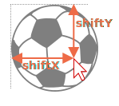

# Les évènements Glisser-Déposer de la souris

Drag'n'Drop est une excellente solution d'interface. Prendre quelque chose et le faire glisser est un moyen clair et simple de faire beaucoup de choses, de la copie et du déplacement de documents (comme dans les gestionnaires de fichiers) à la commande (déposer des articles dans un panier).

Dans la norme HTML moderne, il y a une [section à propos du Drag and Drop](https://html.spec.whatwg.org/multipage/interaction.html#dnd) avec des événements spéciaux tels que `dragstart`, `dragend`, etc.

Ces événements nous permettent de prendre en charge des types spéciaux de glisser-déposer, tels que la gestion du glisser-déposer d'un fichier depuis le gestionnaire de fichiers du système d'exploitation et le déposer dans la fenêtre du navigateur. Ensuite, JavaScript peut accéder au contenu de ces fichiers.

Mais les événements de drag natifs ont également des limites. Par exemple, nous ne pouvons pas empêcher de faire glisser depuis une certaine zone. Nous ne pouvons pas non plus faire de glisser "horizontal" ou "vertical" uniquement. Et il existe de nombreuses autres tâches de glisser-déposer qui ne peuvent pas être effectuées en les utilisant. En outre, la prise en charge des appareils mobiles pour de tels événements est très faible.

Ici, nous verrons comment implémenter le glisser-déposer à l'aide d'événements de souris.

## l'algorithme Drag’and’Drop

1. Sur `mousedown` - préparer l'élément pour le déplacement, si nécessaire (éventuellement en créer une copie, y ajouter une classe ou autre).
2. Puis sur `mousemove` le déplacer en changeant `left/top` et `position:absolute`.
3. Sur `mouseup` - effectue toutes les actions liées à un Drag'n'Drop terminé.


Ce sont les bases. Plus tard, nous verrons comment utiliser d'autres fonctionnalités, telles que la mise en évidence des éléments sous-jacents actuels pendant que nous les glissons.

Voici la mise en œuvre de faire glisser une balle :

```js
<<<<<<< HEAD
ball.onmousedown = function(event) { 
  // (1) la préparer au déplacement :  réglé en absolute et en haut par z-index
  ball.style.position = 'absolute';
  ball.style.zIndex = 1000;

  // déplacez-le de tout parent actuel directement dans body
  // pour le placer par rapport à body
  document.body.append(ball);  
=======
ball.onmousedown = function(event) {
  // (1) prepare to moving: make absolute and on top by z-index
  ball.style.position = 'absolute';
  ball.style.zIndex = 1000;

  // move it out of any current parents directly into body
  // to make it positioned relative to the body
  document.body.append(ball);
>>>>>>> 291b5c05b99452cf8a0d32bd32426926dbcc0ce0

  // Centrer la balle aux coordonnées (pageX, pageY)
  function moveAt(pageX, pageY) {
    ball.style.left = pageX - ball.offsetWidth / 2 + 'px';
    ball.style.top = pageY - ball.offsetHeight / 2 + 'px';
  }

  // déplacer notre balle en positionnement absolu sous le pointeur
  moveAt(event.pageX, event.pageY);

  function onMouseMove(event) {
    moveAt(event.pageX, event.pageY);
  }

  // (2) déplacer la balle sur le déplacement de la souris
  document.addEventListener('mousemove', onMouseMove);

  // (3) laisser tomber la balle, retirer les gestionnaires inutiles
  ball.onmouseup = function() {
    document.removeEventListener('mousemove', onMouseMove);
    ball.onmouseup = null;
  };

};
```

Si nous exécutons le code, nous pouvons remarquer quelque chose d’étrange. Au début de l’action Glisser-Déposer, la  balle est prise en "fourchette": Nous commençons à faire glisser son "clone".

```online
Voici un exemple en action:

[iframe src="ball" height=230]

Essayez de faire glisser-déposer avec la souris et vous verrez un tel comportement.
```

C’est parce que le navigateur a son propre Glisser-Déposer pour les images  et quelques autres  éléments qui s’exécute automatiquement et entre en conflit avec le nôtre.

Pour le désactiver:

```js
ball.ondragstart = function() {
  return false;
};
```

Maintenant tout rentre dans l’ordre.

```online
En action:

[iframe src="ball2" height=230]
```

Un autre aspect important—nous suivons l’évènement `mousemove` sur le `document`, pas sur la `balle`. A première vue, il semblerait que la souris soit toujours sur la balle, et nous pouvons lui appliquer l’évènement `mousemove`.

Mais si nous nous rappelons, l’évènement `mousemove` se déclenche souvent, mais pas sur chaque pixel. Donc après un mouvement rapide, le curseur peut sauter de la balle pour aller quelque part au milieu du document (ou bien même hors de la fenêtre).

Donc nous devons écouter le `document` pour le capturer.

## Positionnent correcte

<<<<<<< HEAD
Dans les exemples ci-dessus la balle est toujours déplacée ainsi, de sorte à ce que son centre soit au-dessous  du curseur:
=======
In the examples above the ball is always moved so that its center is under the pointer:
>>>>>>> 291b5c05b99452cf8a0d32bd32426926dbcc0ce0

```js
ball.style.left = pageX - ball.offsetWidth / 2 + 'px';
ball.style.top = pageY - ball.offsetHeight / 2 + 'px';
```

Pas mal,  mais il y a un  effet secondaire. Pour initier le Glissser-Deposer, nous pouvons appliquer un `mousedown` n’importe où sur la balle. Mais si nous le faisons sur le rebord, alors la balle "saute" soudainement  pour être centrée sous le curseur.

Ce serait mieux si nous gardions le  changement initial de l’élément relativement au curseur.

Par exemple, si nous commençons le glissement par le rebord de la balle, alors le curseur doit rester sur le rebord pendant le déplacement.



1. Lorsqu’un visiteur appuye sur le bouton (`mousedown`) – nous pouvons garder en mémoire la distance du curseur au coin gauche en haut de la balle dans des variables `shiftX/shiftY`. Nous devons garder cette distance en faisant le glissement.

   Pour obtenir ces changements nous pouvons soustraire les coordonnées:

    ```js
    // onmousedown
    let shiftX = event.clientX - ball.getBoundingClientRect().left;
    let shiftY = event.clientY - ball.getBoundingClientRect().top;
    ```

2. Ensuite pendant qu’on fait le glissement nous positionnons la balle sur le même changement relativement au curseur, ainsi:

    ```js
    // onmousemove
    // la balle a une position:absolute
    ball.style.left = event.pageX - *!*shiftX*/!* + 'px';
    ball.style.top = event.pageY - *!*shiftY*/!* + 'px';
    ```

Le code final avec un meilleur positionnement:

```js
ball.onmousedown = function(event) {

*!*
  let shiftX = event.clientX - ball.getBoundingClientRect().left;
  let shiftY = event.clientY - ball.getBoundingClientRect().top;
*/!*

  ball.style.position = 'absolute';
  ball.style.zIndex = 1000;
  document.body.append(ball);

  moveAt(event.pageX, event.pageY);

  // Déplace la balle aux cordonnées (pageX, pageY) 
  // Prenant en compte les changements initiaux 
  function moveAt(pageX, pageY) {
    ball.style.left = pageX - *!*shiftX*/!* + 'px';
    ball.style.top = pageY - *!*shiftY*/!* + 'px';
  }

  function onMouseMove(event) {
    moveAt(event.pageX, event.pageY);
  }

  // déplace la balle à l’évènement mousemove
  document.addEventListener('mousemove', onMouseMove);

  // dépose la balle, enlève les gestionnaires d’évènements dont on a pas besoin
  ball.onmouseup = function() {
    document.removeEventListener('mousemove', onMouseMove);
    ball.onmouseup = null;
  };

};

ball.ondragstart = function() {
  return false;
};
```

```online
En action (inside `<iframe>`):

[iframe src="ball3" height=230]
```

La différence est particulièrement notable si nous faisons glisser la balle depuis son coin gauche. Dans l’exemple précèdent la balle "saute" sous le curseur. Maintenant il suit facilement le curseur à partir de sa position en cours.

## Potentiels Cibles pour un Déposer (déposables)

Dans les exemples précédents la balle pouvait être déposée juste "n’importe où" pour qu’elle y soit. En réalité, nous prenons souvent un élément et le déposons sur un  autre. Par exemple, un fichier dans un dossier, ou autre chose.

En d’autres termes, nous prenons un élément "déplaçable" et le déposons sur un élément  ou l’on peut déposer un élément "déposable".

Nous avons besoin de savoir :
- où l'élément a été déposé à la fin du glisser-déposer -- pour effectuer l'action correspondante,
- et, de préférence, connaitre l'élément droppable que nous déplaçons pour le mettre en surbrillance.

La solution est assez intéressante et juste un peu délicate, alors couvrons-la ici.

Quelle peut être la première idée ? Probablement pour définir des gestionnaires de `mouseover/mouseup` sur des droppables potentiels ?

Mais cela ne marche pas.

Le problème est que, pendant que nous exécutons le déplacement, l’élément déplaçable est toujours sur les autres éléments. Et les évènements de la souris ont lieu seulement sur l’élément, pas sur ceux se trouvant au-dessous  de ce dernier.

Par exemple, ci-dessous deux éléments `<div>`, un en rouge au-dessus d’un autre en bleu (couvert complètement). Il n’y a aucun moyen de capturer un évènement sur celui en bleu, parce que le rouge se trouve au-dessus de celui-ci:

```html run autorun height=60
<style>
  div {
    width: 50px;
    height: 50px;
    position: absolute;
    top: 0;
  }
</style>
<div style="background:blue" onmouseover="alert(Ne marche jamais')"></div>
<div style="background:red" onmouseover="alert('sur le rouge!')"></div>
```

De la même manière avec l’élément déplaçable, la balle est toujours au-dessus des autres éléments, donc les évènements s’exécutent sur lui. Quel que soit les gestionnaires que l’on assigne aux éléments se trouvant en bas, ils ne vont pas fonctionner.

C’est pourquoi l’idée initiale de mettre les gestionnaires sur des potentiels objets déposables ne fonctionne pas  en pratique. Ils ne vont pas démarrer.

Alors, que faire?

<<<<<<< HEAD
Il existe une méthode appelée `document.elementFromPoint(clientX, clientY)`. Elle retourne l’élément le plus imbriqué sur les coordonnées données  relativement à une fenêtre (oubien `null` les coordonnées données sont hors de la fenêtre).
=======
There's a method called `document.elementFromPoint(clientX, clientY)`. It returns the most nested element on given window-relative coordinates (or `null` if given coordinates are out of the window). If there are multiple overlapping elements on the same coordinates, then the topmost one is returned.
>>>>>>> 291b5c05b99452cf8a0d32bd32426926dbcc0ce0

Nous pouvons l’utiliser dans n’importe lequel de nos gestionnaires d’événements à la souris pour détecter le droppable potentiel sous le pointeur, comme ceci :

```js
// dans un gestionnaire d'événements de souris
ball.hidden = true; // (*) hide the element that we drag

let elemBelow = document.elementFromPoint(event.clientX, event.clientY);
// elemBelow est l'élément situé sous la balle, peut être droppable

ball.hidden = false;
```

Remarque: nous devons cacher la balle avant l'appel `(*)`. Sinon, nous aurons généralement une balle sur ces coordonnées, car c'est l'élément supérieur sous le pointeur : `elemBelow=ball`. Donc, nous le cachons et montrons immédiatement à nouveau.

Nous pouvons utiliser ce code pour voir quel élément nous sommes entrain de "survoler" à n’importe quel moment. Et gérer le déposer lorsque cela survient.

Une version élaborée du code de `onMouseMove` pour trouver les éléments qui peuvent recevoir un "déposer":

```js
// droppable potentiel que nous survolons en ce moment
let currentDroppable = null;

function onMouseMove(event) {
  moveAt(event.pageX, event.pageY);

  ball.hidden = true;
  let elemBelow = document.elementFromPoint(event.clientX, event.clientY);
  ball.hidden = false;

  // les événements de déplacement de souris peuvent se déclencher en dehors de la fenêtre (lorsque la balle est déplacée hors de l'écran)
  // si clientX/clientY sont en dehors de la fenêtre, alors elementFromPoint renvoie null
  if (!elemBelow) return;

  // Les objets potentiels pouvant recevoir les déposer sont étiquetés avec la classe "droppable" (peut être une autre logique)
  let droppableBelow = elemBelow.closest('.droppable');

  if (currentDroppable != droppableBelow) {
    // on vole dedans ou dehors …
    // note: les deux valeurs peuvent être nulles
    //   currentDroppable=null si nous n'étions pas sur un droppable avant cet événement (par exemple sur un espace vide)
    //   droppableBelow=null si nous ne sommes pas sur un droppable maintenant, pendant cet événement

    if (currentDroppable) {
      // logique pour évaluer  le "survol hors" de l’objet déposable (enlever la mise en valeur)
      leaveDroppable(currentDroppable);
    }
    currentDroppable = droppableBelow;
    if (currentDroppable) {
      // logique pour évaluer  le "survol vers l’intérieur" de l’objet déposable
      enterDroppable(currentDroppable);
    }
  }
}
```

Dans l’exemple ci-dessous quand la balle est glissée sur le camp du gardien de but, ce dernier est mis en valeur.

[codetabs height=250 src="ball4"]

Maintenant nous avons  "l’objet cible" en cours,  que nous survolons, dans une  variable `currentDroppable` Durant tout le processus et nous pouvons l’utiliser pour mettre en valeur une chose ou faire une autre chose.

## Résumé

Nous avons étudié un algorithme de base du glisser-déposer.
Les composantes clés sont:

1. Flux d'événements : `ball.mousedown` -> `document.mousemove` -> `ball.mouseup` (annule l’évènement natif de `ondragstart`).
2. Au démarrage du glissement – capturer le changement initial du curseur relativement à l’élément: `shiftX/shiftY` et le garder durant le glissement.
3. Détecter les éléments pouvant recevoir l’action déposer sous le curseur en utilisant `document.elementFromPoint`.

- A l’exécution de l’évènement `mouseup` nous pouvons finaliser le déposer: changer les données, déplacer les évènements.
- Nous pouvons mettre en valeur les éléments que nous survolons.
- Nous pouvons limiter le glissement sur une surface et selon une direction voulue. 
- Nous pouvons utiliser la délégation d’évènements avec  `mousedown/up`.  Un gestionnaire d’évènement sur une grande surface qui contrôle la propriété `event.target` peut gérer  le Glisser-déposer pour des centaines d’éléments.
- Ainsi de suite.

Il existe des frameworks qui fondent leur architecture sur cela : `DragZone`, `Droppable`, `Draggable` et d'autres classes. La plupart d’entre eux font des choses similaires à celles décrites au-dessus, donc cela devrait être facile pour vous de les comprendre maintenant. Ou bien même déployer le vôtre, parce que vous savez déjà comment gérer le processus, et comme vous le voyez cela pourrait être plus flexible que d’adapter une solution tierce.
