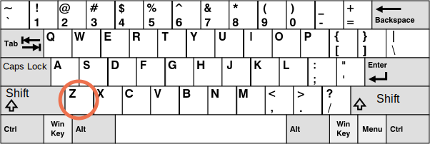
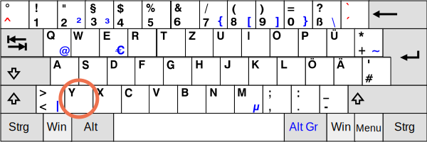

# Le Clavier: les évènements keydown et keyup 

Avant que nous en arrivions au clavier, veuillez noter que sur des appareils modernes il y a d'autres manières de “récupérer quelque chose". Par exemple, les gens utilisent la reconnaissance vocale (en particulier sur les appareils mobiles) oubien le copier/coller avec la souris.


Donc si nous voulons contrôler une entrée dans un champ `<input>`, alors les évènements du clavier ne sont pas assez suffisants. Il y a un autre évènement nommé `input` pour gérer les changements d'un champ `<input>`, par n'importe quelle moyen. Et il peut être un meilleur choix pour une telle tâche. Nous allons traiter cela plus tard dans le chapitre <info:events-change-input>.


Les évènements du clavier doivent être utilisés  lorsqu'on veut gérer les actions sur le clavier (Le clavier virtuel compte aussi). Par exemple, pour réagir sur les touches de directions `key:Up` et `key:Down` oubien les touches de raccourcis (y compris les combinaisons de touches).


## Teststand [#keyboard-test-stand]

```offline
Pour mieux comprendre les évènements du clavier, vous pouvez utiliser le [teststand](sandbox:keyboard-dump).
```

```online
Pour mieux comprendre les évènements du clavier, vous pouvez utiliser le teststand en bas.

Essayez les différentes combinaisons de touches dans la zone de texte.

[codetabs src="keyboard-dump" height=480]
```


## Keydown et keyup

Les évènements  `keydown` surviennent lorsqu'une touche est appuyée, et ensuite intervient `keyup` -- lorsqu'elle est relâchée.

### event.code et event.key

La propriété `key` de l’objet évènement permet d'obtenir un caractère, tandis que la propriété `code` de l'objet évènement objet permet d'obtenir  le "code de la touche physique".


Par exemple, la même touche `key:Z`  peut être appuyée avec ou sans `key:Shift`. Cela nous donne deux caractères différents : minuscule `z` et majuscule `Z`.


La propriété `event.key` est exactement le caractère, et il sera diffèrent. Cependant `event.code` est la même:

| Touche          | `event.key` | `event.code` |
|--------------|-------------|--------------|
| `key:Z`      |`z` (minuscule)         |`KeyZ`        |
| `key:Shift+Z`|`Z` (majuscule)          |`KeyZ`        |


Si un utilisateur travaille avec des langues différentes, alors le fait de changer vers une autre langue aura pour effet de créer un caractère totalement diffèrent de `"Z"`.  Cela va devenir la valeur de `event.key`, tandis que `event.code` est toujours la même que: `"KeyZ"`.

```smart header="\"KeyZ\" et autres codes de touches"
Chaque touche a un code qui dépend de sa position sur le clavier. Les codes des touches sont décrits dans le document [Spécification des codes des évènements Interfaces Utilisateurs](https://www.w3.org/TR/uievents-code/).

Par exemple:
- Les touches des lettres ont des codes de type: `"Key<letter>"`: `"KeyA"`, `"KeyB"` etc.
- Les touches numériques ont des codes de type: `"Digit<number>"`: `"Digit0"`, `"Digit1"` etc.
- Les touches spéciales sont codées par leurs noms: `"Enter"`, `"Backspace"`, `"Tab"` etc.

Il existe plusieurs formats de claviers usuels, différents de par la présentation, et la spécification donne des codes pour les touches pour chacun d'entre eux.


voir [la section alphanumérique de la specification](https://www.w3.org/TR/uievents-code/#key-alphanumeric-section) pour plus de codes, ou essayez juste le [teststand](#keyboard-test-stand) au-dessus.

```

```warn header="Le cas importe: `\"KeyZ\"`,  pas `\"keyZ\"`"
Semble être évident, mais beaucoup de gens font toujours des fautes.

S'il vous plait éviter les fautes de frappes: c'est `KeyZ`, pas `keyZ`. Le control tel que `event.code=="keyZ"` ne vas pas fonctionner: la première lettre de `"Key"` doit être une majuscule.
```


Et si une touche ne donne aucun caractère ? Par exemple, `key:Shift` ou `key:F1` ou autres.  Pour ces touches, `event.key` est approximativement la même chose que `event.code` :

| Key          | `event.key` | `event.code` |
|--------------|-------------|--------------|
| `key:F1`      |`F1`          |`F1`        |
| `key:Backspace`      |`Backspace`          |`Backspace`        |
| `key:Shift`|`Shift`          |`ShiftRight` or `ShiftLeft`        |

Veuillez noter que `event.code` spécifie exactement quelle touche est appuyée. Par exemple, la plupart des claviers ont deux touches de `key:Shift`: à gauche et à droite. La propriété `event.code` nous dit exactement laquelle fut appuyée, et `event.key` est responsable de la " signification " de la touche: comment il s'agit d'un ("Shift").


Disons, nous voulons gérer un raccourci : `key:Ctrl+Z` (ou `key:Cmd+Z` pour Mac). La plupart des éditeurs accrochent l'action du "Defaire" sur cette touche. Nous pouvons mettre un écouteur lorsqu’on déclenche l'évènement `keydown` et chercher à savoir quelle touche est appuyée.


Il existe un dilemme ici: Dans cet écouteur d’évènement, devons-nous contrôler la valeur de `event.key` oubien `event.code`?


D'une part, la valeur de `event.key` est un caractère, elle change en fonction de la langue. Si le visiteur a plusieurs langues dans le système d'exploitation et bascule entre elles, la même clé donne des caractères différents. Il est donc logique de vérifier `event.code`, c'est toujours pareil.


Ainsi:

```js run
document.addEventListener('keydown', function(event) {
  if (event.code == 'KeyZ' && (event.ctrlKey || event.metaKey)) {
    alert('Undo!')
  }
});
```


D'autre part, il existe un problème avec `event.code`. Pour des dispositions de clavier différentes, la même touche peut avoir des caractères différents.

Par exemple, voici la disposition du clavier Américain ("QWERTY") et Allemand ("QWERTZ") dessous (de Wikipedia) :






Pour la même touche, le clavier Américain a un "Z", tandis que celui Allemand a un "Y" (les lettres sont échanges).


Donc, `event.code` sera égal à `KeyZ` pour les gens utilisant le clavier Allemand lorsqu'ils appuient sur `key:Y`.

Si on vérifie `event.code == 'KeyZ'` dans notre code, alors pour les personnes avec la disposition allemande ce genre de test passera quand ils appuient sur `key:Y`.

Cela semble être bizarre, mais c'est ainsi. La [specification](https://www.w3.org/TR/uievents-code/#table-key-code-alphanumeric-writing-system) mentionne explicitement ce comportement.

Donc, `event.code` peut correspondre à un caractère incorrect pour une disposition inattendue. Les mêmes lettres dans différentes disposition peuvent mapper sur différentes clés physiques, conduisant à des codes différents. Heureusement, cela ne se produit qu'avec plusieurs codes, par exemple `keyA`, `keyQ`, `keyZ` (comme nous l'avons vu), et ne se produit pas avec des touches spéciales telles que `Shift`. Vous pouvez trouver la liste dans la [specification](https://www.w3.org/TR/uievents-code/#table-key-code-alphanumeric-writing-system).

Pour suivre de manière fiable les caractères dépendant de la disposition, `event.key` peut être un meilleur moyen.

D'un autre côté, `event.code` a l'avantage de rester toujours le même, lié à l'emplacement de la clé physique. Ainsi, les raccourcis clavier qui en dépendent fonctionnent bien même en cas de changement de langue.

Voulons-nous gérer des clés dépendantes de la disposition ? Alors `event.key` est la voie à suivre.

Ou voulons-nous un raccourci clavier même après un changement de langue ? Alors, `event.code` peut être une meilleure option.


## Auto-repeat

Si une touche est appuyée assez longtemps, elle commence la répétition avec la propriété "auto-repeat": l'évènement `keydown` se déclenche de manière répétitive, et ensuite lorsqu'elle est relâchée nous obtenons finalement l'évènement `keyup`. Donc c'est normal d'avoir plusieurs `keydown`  et un unique évènement `keyup`.

Pour les évènements déclenchés par auto-repeat, l'évènement objet a une propriété `event.repeat` dont la valeur est assignée à `true`.


## Actions par défaut

Les actions par défaut varient, comme il y a beaucoup de possibilités pouvant être initiées par le clavier.

Pa exemple:

- Un caractère apparait sur l'écran (le résultat le plus évident).
- Un caractère est supprimé (`key:Delete` key).
- Une page est défilée (`key:PageDown` key).
- Le navigateur ouvre la boite de dialogue "Sauvegarder la Page" dialog (`key:Ctrl+S`)
-  ...ainsi de suite.

L’empêchement de l'action par défaut à l'évènement `keydown` peut annuler la plupart d'entre elles, à l'exception des touches spéciales spécifiques aux systèmes d'exploitations. Par exemple, sur Windows `key:Alt+F4` ferme la fenêtre en cours du navigateur. Et il n'existe aucun moyen de l'arrêter en empêchant l'action par défaut JavaScript.

Par exemple, la balise `<input>` en bas s'attend à recevoir un numéro de téléphone, alors elle n'accepte que les touches numériques, `+`, `()` oubien `-`:

```html autorun height=60 run
<script>
function checkPhoneKey(key) {
  return (key >= '0' && key <= '9') || ['+','(',')','-'].includes(key);
}
</script>
<input *!*onkeydown="return checkPhoneKey(event.key)"*/!* placeholder="Phone, please" type="tel">
```

Le gestionnaire `onkeydown` utilise ici `checkPhoneKey` pour vérifier la touche enfoncée. S'il est valide (de `0..9` ou l'un des `+-()`), alors il renvoie `true`, sinon `false`.

Comme nous le savons, la valeur `false` renvoyée par le gestionnaire d'événements, attribuée à l'aide d'une propriété DOM ou d'un attribut, comme ci-dessus, empêche l'action par défaut, donc rien n'apparaît dans le `<input>` pour les clés qui ne passent pas le test. (La valeur 'true' renvoyée n'affecte rien, seul le renvoi de 'false' compte)

Veuillez noter que les touches spéciales, telles que `key:Backspace`, `key:Left`, `key:Right`, ne fonctionnent pas dans l'input. C'est un effet secondaire du filtre strict `checkPhoneKey`. Ces clés lui font retourner `false`.

Détendons un peu le filtre en autorisant les touches fléchées `key:Left`, `key:Right` et `key:Delete`, `key:Backspace` :

```html autorun height=60 run
<script>
function checkPhoneKey(key) {
  return (key >= '0' && key <= '9') ||
    ['+','(',')','-',*!*'ArrowLeft','ArrowRight','Delete','Backspace'*/!*].includes(key);
}
</script>
<input onkeydown="return checkPhoneKey(event.key)" placeholder="Phone, please" type="tel">
```

maintenant les flèches et la suppression marchent bien.

Même si nous avons le filtre de clavier, on peut toujours entrer n'importe quoi à l'aide d'une souris et faire un clic droit + Coller. Les appareils mobiles offrent d'autres moyens de saisir des valeurs. Le filtre n'est donc pas fiable à 100%.

L'approche alternative serait de suivre l'événement `oninput` -- il se déclenche *après* toute modification. Là, nous pouvons vérifier le nouveau `input.value` et le modifier/mettre en surbrillance le `<input>` lorsqu'il est invalide. Ou nous pouvons utiliser les deux gestionnaires d'événements ensemble.

## Héritage

Dans le passé, il y'avait un évènement `keypress`, et aussi les propriétés `keyCode`, `charCode`, `which` de l'objet évènement.

Il y avait tellement d'incompatibilités au niveau des navigateurs en travaillant avec eux que les développeurs de la spécification n'avaient autre moyen que de les déprécier tous et d’en créer de  nouveaux et plus modernes (tels que ceux décrits en haut dans ce chapitre). L'ancien code marche encore, étant donné que les navigateurs continuent de les supporter, mais nous n'avons nullement besoin de les utiliser maintenant.


## Claviers mobiles

Lors de l'utilisation de claviers virtuels / mobiles, officiellement appelés IME (Input-Method Editor), la norme W3C indique qu'un KeyboardEvent [`e.keyCode` devrait être `229`](https://www.w3.org/TR/uievents/#determine-keydown-keyup-keyCode) et [`e.key` devrait être `"Unidentified"`](https://www.w3.org/TR/uievents-key/#key-attr-values).

Bien que certains de ces claviers puissent toujours utiliser les bonnes valeurs pour `e.key`,` e.code`, `e.keyCode` ... lorsque vous appuyez sur certaines touches telles que les flèches ou le retour arrière, il n'y a aucune garantie, donc la logique de votre clavier peut ne pas toujours fonctionner sur les appareils mobiles.

## Résumé

Le fait d'appuyer sur une touche génère toujours un évènement du clavier, que cela soit une touche de symbole ou des touches spéciales telles que `key:Shift` oubien `key:Ctrl` et ainsi de suite. La seule exception est la touche `key:Fn` qui est dès fois présente  sur un clavier d’ordinateur portable. Il n’y a pas d'évènement de clavier pour cela, parce que cela est implémenté à un niveau plus bas que celui du system d'exploitation.

Les Evènements du Clavier:

- `keydown` -- en appuyant sur la touche (auto-repeats répète automatiquement si un appui long de la  touche est effectué),
- `keyup` -- en relâchant la touche.

Les propriétés principales des évènements du clavier:

- `code` -- la propriété "key code" (`"KeyA"`, `"ArrowLeft"` ainsi de suite), spécifique à la position physique de la touche sur le  clavier.
- `key` -- le caractère (`"A"`, `"a"` et ainsi de suite), pour les touches ne prenant pas en charge les caractères, telles que `key:Esc`, a souvent la même valeur que `code`.

Dans le passé, les évènements du clavier étaient des fois utilisés pour contrôler les entrées dans les champs de formulaires. Cela n'est pas fiable, parce que les données recueillies peuvent provenir de plusieurs sources. Nous avons les évènements `input` et `change` pour gérer toute entrée de donnée (traitée plus tard dans le chapitre <info:events-change-input>). Elles se déclenchent après toute sorte d'entrée, y compris le copier-coller oubien la reconnaissance vocale.

Nous devons utiliser les évènements du clavier quand nous voulons vraiment utiliser le clavier. Par exemple, pour réagir aux raccourcis ou touches spéciales.
