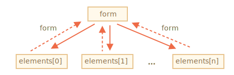

# Propriétés de formulaire

Les formulaires et les éléments, tel que `<input>` ont beaucoup de propriétés et évènements spécifiques.

Travailler avec les formulaires sera beaucoup plus facile une fois que nous aurons exploré leurs principales propriétés.

## Navigation: formulaires et éléments

Les formulaires du document font partie d'une collection spéciale, `document.forms`.

C'est une *"collection nommée"*: ses élements sont à la fois nommés et triés. On peut utiliser soit le nom, soit l'index pour récupérer un formulaire.

```js no-beautify
document.forms.my; // le formulaire avec la propriété name="my"
document.forms[0]; // le premier formulaire dans le document
```

Tous les éléments d'un formulaire sont accessibles via la collection nommée `form.elements`.

Par exemple:

```html run height=40
<form name="my">
  <input name="un" value="1">
  <input name="deux" value="2">
</form>

<script>
  // Récupére le formulaire
  let form = document.forms.my; // L'élément <form name="my">

  // Récupére l'élément "un"
  let elem = form.elements.un; // L'élément <input name="un">

  alert(elem.value); // 1
</script>
```

Il peut exister plusieurs éléments avec le même nom. C'est le cas par exemple pour les boutons radios et les cases à cocher.

Dans ce cas, `form.elements[name]` est une *collection*. Par exemple:

```html run height=40
<form>
  <input type="radio" *!*name="age"*/!* value="10">
  <input type="radio" *!*name="age"*/!* value="20">
</form>

<script>
let form = document.forms[0];

let ageElems = form.elements.age;

*!*
alert(ageElems[0]); // [object HTMLInputElement]
*/!*
</script>
```

Ces propriétés de navigation ne dépendent pas de la structure des balises. Tous les éléments de contrôle, quel que soit leur profondeur dans l'imbrication HTML, sont accessibles via `form.elements`.


````smart header="Utiliser des fieldsets comme des \"sous-formulaires\""
Un formulaire peut contenir un ou plusieurs éléments de type `<fieldset>`. Un fieldset a aussi une propriété `elements` contenant la liste des contrôles qu'il contient.

Par exemple:

```html run height=80
<body>
  <form id="form">
    <fieldset name="userFields">
      <legend>info</legend>
      <input name="login" type="text">
    </fieldset>
  </form>

  <script>
    alert(form.elements.login); // <input name="login">

*!*
    let fieldset = form.elements.userFields;
    alert(fieldset); // HTMLFieldSetElement

    // On peut récupérer l'élément à la fois depuis le form et depuis le fieldset
    alert(fieldset.elements.login == form.elements.login); // true
*/!*
  </script>
</body>
```
````

````warn header="Notation raccourcie: `form.name`"
Il existe une notation plus courte: on peut accéder à l'élément via `form[index/name]`.

Autrement dit, au lieu de `form.elements.login`, on peut simplement écrire `form.login`.

Cela fonctionne, mais avec un bémol: si on accède à un élément, et qu'on change ensuite son `name`, il reste accessible via son ancien nom (en plus du nouveau).

Un exemple pour démontrer cette particularité:

```html run height=40
<form id="form">
  <input name="login">
</form>

<script>
  alert(form.elements.login == form.login); // true, c'est le même <input>

  form.login.name = "username"; // On change le nom de l'input

  // form.elements a bien mis à jour le nom:
  alert(form.elements.login); // undefined
  alert(form.elements.username); // input

*!*
  // La propriété form contient bien les 2 noms: le nouveau et l'ancien
  alert(form.username == form.login); // true
*/!*
</script>
```

Ce n'est cependant généralement pas un problème, car c'est très rare de modifier le nom d'un élément dans un formulaire.

````

## Backreference: element.form

Dans chaque élement, le formulaire associé est disponible via la propriété `element.form`. Un formulaire référence donc tous ses éléments, et tous les élements référencent leur formulaire.

Voici un schéma de leurs relations:



Par exemple:

```html run height=40
<form id="form">
  <input type="text" name="login">
</form>

<script>
*!*
  // form -> element
  let login = form.login;

  // element -> form
  alert(login.form); // HTMLFormElement
*/!*
</script>
```

## Eléments de formulaire

Parlons un peu des contrôles de formulaires.

### input et textarea

On peut accéder à leur valeur via `input.value` (string) ou `input.checked` (boolean) pour les cases à cocher et les boutons radios.

Exemple:

```js
input.value = "Nouvelle valeur";
textarea.value = "Nouveau texte";

input.checked = true; // pour une case à cocher ou un bouton radio
```

```warn header="Utilisez `textarea.value`, et pas `textarea.innerHTML`"
Notez que même si `<textarea>...</textarea>` stocke sa valeur sous forme de HTML imbriqué, il ne faut jamais utiliser `textarea.innerHTML` pour y accéder.

Cette propriété stocke le HTML qui était sur la page d'origine, et non sa valeur actuelle.
```

### select et option

Un élément `<select>` a 3 propriétés importantes:

1. `select.options` -- une collection de ses sous-élements `<option>`,
2. `select.value` -- la *valeur* de l'`<option>` actuellement sélectionnée,
3. `select.selectedIndex` -- l'*index* de l'`<option>` actuellement sélectionnée.

Elles nous donnent 3 moyens différents de définir la valeur d'un `<select>`:

1. Trouver l'élement `<option>` correspondant (parmi `select.options`) et mettre sa valeur `option.selected` à `true`.
2. Si on connaît la nouvelle valeur: mettre `select.value` à la nouvelle valeur.
3. Si on connaît l'index de la nouvelle option: mettre `select.selectedIndex` à ce nombre.

Voici un exemple pour ces 3 méthodes:

```html run
<select id="select">
  <option value="apple">Pomme</option>
  <option value="pear">Pêche</option>
  <option value="banana">Banane</option>
</select>

<script>
  // Les 3 lignes suivantes font la même chose
  select.options[2].selected = true; 
  select.selectedIndex = 2;
  select.value = 'banana';
  // Note: la liste 'options' démarre à 0, donc l'index 2 pointe sur la 3ème option.
</script>
```

Contrairement à la plupart des contrôles, `<select>` permet de sélectionner plusieurs options en même temps si il a l'attribut `multiple`. Cet attribut est cependant rarement utilisé.

En cas de valeurs sélectionnées multiples, utilisez la première méthode: ajouter/supprimer la propriété `selected` de chaque sous-élement `<option>`.

Voici un exemple montrant comment récupérer toutes les valeurs sélectionnées d'un multi-select:

```html run
<select id="select" *!*multiple*/!*>
  <option value="blues" selected>Blues</option>
  <option value="rock" selected>Rock</option>
  <option value="classic">Classic</option>
</select>

<script>
  // Récupère toutes les valeurs sélectionnées du multi-select
  let selected = Array.from(select.options)
    .filter(option => option.selected)
    .map(option => option.value);

  alert(selected); // blues,rock  
</script>
```

La spécification complète de l'élement `<select>` est disponible dans la spécification HTML <https://html.spec.whatwg.org/multipage/forms.html#the-select-element>.

### Nouvelle option

Dans la [spécification](https://html.spec.whatwg.org/multipage/forms.html#the-option-element), on peut trouver une syntaxe raccourcie pour créer un élément `<option>` :

```js
option = new Option(text, value, defaultSelected, selected);
```

Cette syntaxe est optionnelle. On peut très bien utiliser `document.createElement('option')` et définir ses attributs manuellement. Mais cette syntaxe est plus courte, voici donc ses paramètres:

- `text` -- Le texte à l'intérieur de l'option,
- `value` -- La valeur de l'option,
- `defaultSelected` -- Si `true`, alors l'attribut HTML `selected` est créé,
- `selected` -- Si `true`, l'option est sélectionnée.

<<<<<<< HEAD
La différence entre `defaultSelected` and `selected` est que `defaultSelected` définit l'attribut HTML (qu'on peut récupérer via `option.getAttribute('selected')`), alors que `selected` définit si l'option est sélectionnée ou non.
=======
The difference between `defaultSelected` and `selected` is that `defaultSelected` sets the HTML-attribute (that we can get using `option.getAttribute('selected')`), while `selected` sets whether the option is selected or not.
>>>>>>> 3d7abb9cc8fa553963025547717f06f126c449b6

En pratique, il vaut mieux mettre les _deux_ valeurs à `true` ou `false`. (Ou simplement ne pas les utiliser, leur valeur sera `false` par défaut.)

Par exemple, voici une nouvelle option "non sélectionnée" :

```js
let option = new Option("Texte", "valeur");
// Créé un élément <option value="value">Text</option>
```

La même option, mais cette fois-ci sélectionnée:

```js
let option = new Option("Texte", "valeur", true, true);
```

Un élément d'option a les propriétés suivantes:

`option.selected`
: Est l'option sélectionnée.

`option.index`
: L'index de l'option parmi les autres dans son `<select>`.

`option.text`
: Le texte de l'option (visible par le visiteur de la page).

## Références

- Spécification: <https://html.spec.whatwg.org/multipage/forms.html>.

## Résumé

Navigation d'un formulaire:

`document.forms`
: Un formulaire est disponible via `document.forms[name/index]`.

`form.elements`  
: Les élements d'un formulaire sont disponibles via `form.elements[name/index]`, ou `form[name/index]`. La propriété `elements` fonctionne aussi pour un `<fieldset>`.

`element.form`
: Chaque élement référence son formulaire via la propriété `form`.

La valeur est disponible via `input.value`, `textarea.value`, `select.value`, etc. (Pour les cases à cocher et les boutons radios, utilisez `input.checked` pour déterminer si une valeur est sélectionnée ou non.)

Pour `<select>`, on peut aussi récuperer la valeur par son index via `select.selectedIndex`, ou dans la liste des options via `select.options`.

Ce sont les bases pour commencer à travailler avec les formulaires. Nous verrons d'autres exemples plus loin dans le tutoriel.

Dans le prochain chapitre, nous couvrirons les évènements `focus` et `blur` qui peuvenet se déclencher sur n'importe quel élément, mais sont principalement utilisés sur les formulaires.
