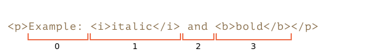
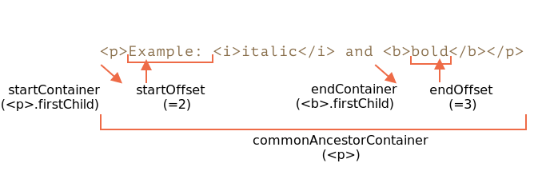
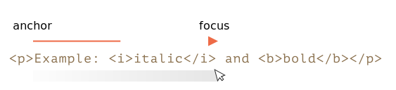
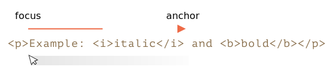

libs:
  - d3
  - domtree

---

# Selection et Range

Dans ce chapitre, nous aborderons la sélection dans le document, ainsi que la sélection dans les champs de formulaire, tels que `<input>`.

JavaScript peut accéder à une sélection existante, sélectionner/désélectionner des nœuds du DOM dans leur ensemble ou partiellement, supprimer le contenu sélectionné du document, l'envelopper dans une balise, etc.

Vous pouvez trouver quelques recettes de tâches courantes à la fin du chapitre, dans la section "Résumé". Peut-être que cela couvre vos besoins actuels, mais vous obtiendrez beaucoup plus si vous lisez le texte en entier.

Les objets `Range` et `Selection` sont faciles à comprendre, et vous n'aurez besoin d'aucune recette pour les faire faire ce que vous voulez.

## Range

Le concept de base de la sélection est la [plage](https://dom.spec.whatwg.org/#ranges) (Range), qui est essentiellement une paire de "points limites": le début et la fin de la plage.

Un objet `Range` est créé sans paramètres :

```js
let range = new Range();
```

Ensuite, nous pouvons définir les limites de la sélection en utilisant `range.setStart(node, offset)` et `range.setEnd(node, offset)`.

Comme vous pouvez le deviner, nous allons utiliser les objets `Range` pour la sélection, mais créons d'abord quelques-uns de ces objets.

### Sélection partielle du texte

La chose intéressante est que le premier argument `node` dans les deux méthodes peut être soit un noeud de texte ou un noeud d'élément, et la signification du deuxième argument dépend de cela.

**Si `node` est un noeud de texte, alors `offset` doit être la position dans son texte.**

Par exemple, étant donné l'élément `<p>Hello</p>`, nous pouvons créer la plage contenant les lettres "ll" comme suit :

```html run
<p id="p">Hello</p>
<script>
  let range = new Range();
  range.setStart(p.firstChild, 2);
  range.setEnd(p.firstChild, 4);

  // toString d'une plage renvoie son contenu sous forme de texte
  console.log(range); // ll
</script>
```

Ici, nous prenons le premier enfant de `<p>` (c'est le noeud texte) et nous spécifions les positions du texte à l'intérieur de celui-ci :


### Sélection des noeuds d'éléments

**Alternativement, si `node` est un noeud d'élément, alors `offset` doit être le numéro de l'enfant.**

C'est pratique pour faire des plages qui contiennent les noeuds dans leur ensemble, et non pas s'arrêter quelque part dans leur texte.

Par exemple, nous avons un fragment de document plus complexe :

```html autorun
<p id="p">Example: <i>italic</i> and <b>bold</b></p>
```

Voici sa structure DOM avec les nœuds d'élément et de texte :

<div class="select-p-domtree"></div>

<script>
let selectPDomtree = {
  "name": "P",
  "nodeType": 1,
  "children": [{
    "name": "#text",
    "nodeType": 3,
    "content": "Example: "
  }, {
    "name": "I",
    "nodeType": 1,
    "children": [{
      "name": "#text",
      "nodeType": 3,
      "content": "italic"
    }]
  }, {
    "name": "#text",
    "nodeType": 3,
    "content": " and "
  }, {
    "name": "B",
    "nodeType": 1,
    "children": [{
      "name": "#text",
      "nodeType": 3,
      "content": "bold"
    }]
  }]
}

drawHtmlTree(selectPDomtree, 'div.select-p-domtree', 690, 320);
</script>

Créons une plage pour `"Example: <i>italic</i>"`.

Comme nous pouvons le voir, cette phrase est composée d'exactement deux enfants de `<p>`, avec les indices `0` et `1` :



- Le point de départ a `<p>` comme `node` parent, et `0` comme décalage (offset).

    On peut donc le définir comme `range.setStart(p, 0)`.
- Le point de fin a aussi `<p>` comme `node` parent, mais `2` comme décalage (il spécifie la plage jusqu'à, mais sans inclure `offset`).

    On peut donc le définir comme `range.setEnd(p, 2)`.

Voici la démo. Si vous l'exécutez, vous pouvez voir que le texte est sélectionné :

```html run
<p id="p">Example: <i>italic</i> and <b>bold</b></p>

<script>
*!*
  let range = new Range();

  range.setStart(p, 0);
  range.setEnd(p, 2);
*/!*

  // toString d'une plage renvoie son contenu sous forme de texte, sans balises
  console.log(range); // Example: italic

  // appliquer cette plage pour la sélection du document (expliqué plus loin)
  document.getSelection().addRange(range);
</script>
```

Voici un banc d'essai plus flexible dans lequel vous pouvez définir des valeurs de début et de fin de plage et explorer d'autres variantes :

```html run autorun
<p id="p">Example: <i>italic</i> and <b>bold</b></p>

From <input id="start" type="number" value=1> – To <input id="end" type="number" value=4>
<button id="button">Click to select</button>
<script>
  button.onclick = () => {
  *!*
    let range = new Range();

    range.setStart(p, start.value);
    range.setEnd(p, end.value);
  */!*

    // appliquer la sélection, expliquée plus loin
    document.getSelection().removeAllRanges();
    document.getSelection().addRange(range);
  };
</script>
```

E.g. en sélectionnant dans le même `<p>` de l'offset `1` à `4` on obtient `<i>italic</i> and <b>bold</b>`:


```smart header="Les nœuds de début et de fin peuvent être différents"
Nous ne sommes pas obligés d'utiliser le même noeud dans `setStart` et `setEnd`. Une plage peut s'étendre sur de nombreux noeuds non liés. Il est seulement important que la fin soit après le début dans le document.
```

### Sélection d'un plus grand fragment

Faisons une sélection plus grande dans notre exemple, comme ceci :


Nous savons déjà comment faire. Nous devons juste définir le début et la fin comme un offset relatif dans les nœuds de texte.

Nous devons créer une plage, qui :
- commence à la position 2 dans `<p>` firstChild (en prenant toutes les lettres sauf les deux premières de "Ex<b>ample:</b> ").
- se termine à la position 3 dans `<b>` firstChild (en prenant les trois premières lettres de "<b>bol</b>d", mais pas plus) :

```html run
<p id="p">Example: <i>italic</i> and <b>bold</b></p>

<script>
  let range = new Range();

  range.setStart(p.firstChild, 2);
  range.setEnd(p.querySelector('b').firstChild, 3);

  console.log(range); // ample: italic and bol

  // utiliser cette plage pour la sélection (expliqué plus loin)
  window.getSelection().addRange(range);
</script>
```

Comme vous pouvez le voir, il est assez facile de créer une plage de ce que l'on veut.

Si nous voulons prendre les noeuds dans leur ensemble, nous pouvons passer des éléments dans `setStart/setEnd`. Sinon, nous pouvons travailler au niveau du texte.

## Propriétés de la plage

L'objet range que nous avons créé dans l'exemple ci-dessus a les propriétés suivantes :



- `startContainer`, `startOffset` -- nœud et offset du début,
  - dans l'exemple ci-dessus : premier noeud de texte à l'intérieur de `<p>` et `2`.
- `endContainer`, `endOffset` -- noeud et offset de la fin,
  - dans l'exemple ci-dessus : premier noeud de texte dans `<b>` et `3`.
- `collapsed` -- booléen, `true` si la plage commence et se termine sur le même point (donc il n'y a pas de contenu à l'intérieur de la plage),
  - dans l'exemple ci-dessus : `false`.
- `commonAncestorContainer` -- l'ancêtre commun le plus proche de tous les noeuds de la plage,
  - dans l'exemple ci-dessus : `<p>`.


## Méthodes de sélection de plages

Il existe de nombreuses méthodes pratiques pour manipuler les plages.

Nous avons déjà vu `setStart` et `setEnd`, voici d'autres méthodes similaires.

Définir le début de la plage :

- `setStart(node, offset)` définit le début à : position `offset` dans `node`.
- `setStartBefore(node)` définit le début à : juste avant `node`.
- `setStartAfter(node)` définit le début à : juste après `node`.

Définir la fin de la plage (méthodes similaires) :

- `setEnd(node, offset)` définit la fin à : position `offset` dans `node`.
- `setEndBefore(node)` définit la fin à : juste avant `node`.
- `setEndAfter(node)` définit la fin à : juste après `node`.

Techniquement, `setStart/setEnd` peuvent faire n'importe quoi, mais plus de méthodes fournissent plus de commodité.

Dans toutes ces méthodes, `node` peut être un noeud de texte ou d'élément : pour les noeuds de texte, `offset` saute autant de caractères, tandis que pour les noeuds d'éléments, autant de noeuds enfants.

Encore plus de méthodes pour créer des plages :
- `selectNode(node)` définit la plage pour sélectionner le `node` entier.
- `selectNodeContents(node)` sélectionne le contenu du `node` dans son intégralité.
- `collapse(toStart)` si `toStart=true`, définissez end=start, sinon définissez start=end, ce qui réduit la plage de sélection.
- `cloneRange()` crée une nouvelle plage avec le même début et la même fin.

## Méthodes d'édition des plages

Une fois que la plage est créée, nous pouvons manipuler son contenu en utilisant ces méthodes :

- `deleteContents()` -- supprime le contenu de la plage du document.
- `extractContents()` -- supprime le contenu de la plage du document et le retourne en tant que [DocumentFragment](info:modifying-document#document-fragment).
- `cloneContents()` -- clone le contenu d'une plage et le renvoie en tant que [DocumentFragment](info:modifying-document#document-fragment).
- `insertNode(node)` -- Insère `node` dans le document au début de la plage.
- `surroundContents(node)` -- entoure `node` du contenu de la plage. Pour que cela fonctionne, la plage doit contenir à la fois des balises d'ouverture et de fermeture pour tous les éléments qu'elle contient : pas de plages partielles comme `<i>abc`.

Avec ces méthodes, nous pouvons faire pratiquement n'importe quoi avec les noeuds sélectionnés.

Voici le banc d'essai pour les voir en action :

```html run refresh autorun height=260
Cliquez sur les boutons pour exécuter des méthodes sur la sélection, "resetExample" pour la réinitialiser.

<p id="p">Example: <i>italic</i> and <b>bold</b></p>

<p id="result"></p>
<script>
  let range = new Range();

  // Chaque méthode démontrée est représentée ici :
  let methods = {
    deleteContents() {
      range.deleteContents()
    },
    extractContents() {
      let content = range.extractContents();
      result.innerHTML = "";
      result.append("extracted: ", content);
    },
    cloneContents() {
      let content = range.cloneContents();
      result.innerHTML = "";
      result.append("cloned: ", content);
    },
    insertNode() {
      let newNode = document.createElement('u');
      newNode.innerHTML = "NEW NODE";
      range.insertNode(newNode);
    },
    surroundContents() {
      let newNode = document.createElement('u');
      try {
        range.surroundContents(newNode);
      } catch(e) { console.log(e) }
    },
    resetExample() {
      p.innerHTML = `Example: <i>italic</i> and <b>bold</b>`;
      result.innerHTML = "";

      range.setStart(p.firstChild, 2);
      range.setEnd(p.querySelector('b').firstChild, 3);

      window.getSelection().removeAllRanges();
      window.getSelection().addRange(range);
    }
  };

  for(let method in methods) {
    document.write(`<div><button onclick="methods.${method}()">${method}</button></div>`);
  }

  methods.resetExample();
</script>
```

Il existe également des méthodes permettant de comparer des plages, mais elles sont rarement utilisées. Si vous en avez besoin, veuillez vous reporter à la [spec](https://dom.spec.whatwg.org/#interface-range) ou au [manuel MDN](mdn:/api/Range).

## Sélection

`Range` est un objet générique pour gérer les plages de sélection. Bien que la création d'une `Range` ne signifie pas que nous voyons une sélection à l'écran.

Nous pouvons créer des objets `Range`, les faire circuler - ils ne sélectionnent rien visuellement par eux-mêmes.

La sélection du document est représentée par un objet `Selection`, qui peut être obtenu par `window.getSelection()` ou `document.getSelection()`. Une sélection peut inclure zéro ou plusieurs plages. C'est du moins ce que dit la [spécification de Selection API](https://www.w3.org/TR/selection-api/). En pratique cependant, seul Firefox permet de sélectionner plusieurs plages dans le document en utilisant `key:Ctrl+click` (`key:Cmd+click` pour Mac).

Voici une capture d'écran d'une sélection avec 3 plages, réalisée dans Firefox :


Les autres navigateurs prennent en charge au maximum 1 plage. Comme nous allons le voir, certaines méthodes de `Selection` impliquent qu'il peut y avoir plusieurs plages, mais là encore, dans tous les navigateurs sauf Firefox, il y a au maximum 1 plage.

Voici une petite démo qui montre la sélection actuelle (sélectionner quelque chose et cliquer) sous forme de texte :

<button onclick="alert(document.getSelection())">alert(document.getSelection())</button>

## Propriétés de Selection

Comme nous l'avons dit, une sélection peut en théorie contenir plusieurs plages. Nous pouvons obtenir ces objets range en utilisant la méthode :

- `getRangeAt(i)` -- obtient la i-ième plage, en commençant par `0`. Dans tous les navigateurs sauf Firefox, seul `0` est utilisé.

Il existe également des propriétés qui sont souvent plus pratiques.

Comme pour une plage, un objet selection a un début, appelé "anchor", et une fin, appelée "focus".

Les principales propriétés de selection sont :

- `anchorNode` -- le noeud où la sélection commence.
- `anchorOffset` -- le décalage (offset) dans `anchorNode` où la sélection commence.
- `focusNode` -- le noeud où la sélection se termine.
- `focusOffset` -- le décalage dans `focusNode` où la sélection se termine.
- `isCollapsed` -- `true` si la sélection ne sélectionne rien (plage vide), ou si elle n'existe pas.
- `rangeCount` -- nombre de plages dans la sélection, maximum `1` dans tous les navigateurs sauf Firefox.


<<<<<<< HEAD
```smart header="end/start de selection vs Range"
=======
There's an important difference between a selection anchor/focus compared with a `Range` start/end.
>>>>>>> 1dce5b72b16288dad31b7b3febed4f38b7a5cd8a

Il y a une différence importante entre anchor/focus d'une sélection et start/end d'un objet `Range`.

Comme nous le savons, les objets `Range` ont toujours leur début avant leur fin.

Pour les sélections, ce n'est pas toujours le cas.

La sélection d'un objet avec une souris peut se faire dans les deux sens : de gauche à droite ou de droite à gauche.

En d'autres termes, lorsque le bouton de la souris est enfoncé, puis qu'il avance dans le document, sa fin (focus) se trouvera après son début (anchor).

E.g. si l'utilisateur commence à sélectionner avec la souris et passe de "Example" à "italic" :



...Mais la même sélection pourrait être faite en sens inverse : en partant de "italic" vers "Example" (sens inverse), alors sa fin (focus) sera avant le début (anchor) :


```

## Événements de sélection

Il y a des événements pour suivre la trace de la sélection :

- `elem.onselectstart` -- quand une sélection *débute* spécifiquement sur l'élément `elem` (ou à l'intérieur de celui-ci). Par exemple, lorsque l'utilisateur appuie sur le bouton de la souris sur cet élément et commence à déplacer le pointeur.
    - En empêchant l'action par défaut, on annule le démarrage de la sélection. Le démarrage d'une sélection à partir de cet élément devient donc impossible, mais l'élément reste tout de même sélectionnable. Le visiteur doit simplement démarrer la sélection à partir d'un autre endroit.
- `document.onselectionchange` -- quand une sélection change ou commence.
    - Attention : ce gestionnaire ne peut être défini que sur `document`, il suit toutes les sélections qu'il contient.

### Démonstration du suivi des sélections

Voici une petite démo. Elle suit la sélection courante sur le `document` et montre ses limites :

```html run height=80
<p id="p">Select me: <i>italic</i> and <b>bold</b></p>

From <input id="from" disabled> – To <input id="to" disabled>
<script>
  document.onselectionchange = function() {
    let selection = document.getSelection();

    let {anchorNode, anchorOffset, focusNode, focusOffset} = selection;

    // anchorNode et focusNode sont des nœuds de texte habituellement
    from.value = `${anchorNode?.data}, offset ${anchorOffset}`;
    to.value = `${focusNode?.data}, offset ${focusOffset}`;
  };
</script>
```

### Démonstration de la copie d'une sélection

Il existe deux approches pour copier le contenu sélectionné :

1. Nous pouvons utiliser `document.getSelection().toString()` pour le récupérer sous forme de texte.
2. Sinon, pour copier le DOM complet, par exemple si nous devons garder le formatage, nous pouvons obtenir les plages sous-jacentes avec `getRangesAt(...)`. Un objet `Range`, à son tour, a la méthode `cloneContents()` qui clone son contenu et retourne un objet `DocumentFragment`, que nous pouvons insérer ailleurs.

Voici la démonstration de la copie du contenu sélectionné à la fois comme texte et comme noeuds DOM :

```html run height=100
<p id="p">Select me: <i>italic</i> and <b>bold</b></p>

Cloned: <span id="cloned"></span>
<br>
As text: <span id="astext"></span>

<script>
  document.onselectionchange = function() {
    let selection = document.getSelection();

    cloned.innerHTML = astext.innerHTML = "";

    // Cloner les noeuds du DOM à partir de plages (nous supportons le multiselect ici)
    for (let i = 0; i < selection.rangeCount; i++) {
      cloned.append(selection.getRangeAt(i).cloneContents());
    }

    // Obtenir sous forme de texte
    astext.innerHTML += selection;
  };
</script>
```

## Méthodes de sélection

Nous pouvons travailler avec la sélection en ajoutant/supprimant (add/remove) des plages :

- `getRangeAt(i)` -- obtient la i-ième plage, en commençant par `0`. Dans tous les navigateurs sauf Firefox, seul `0` est utilisé.
- `addRange(range)` -- ajoute `range` à la sélection. Tous les navigateurs, à l'exception de Firefox, ignorent l'appel, si la sélection a déjà une plage associée.
- `removeRange(range)` -- supprime `range` de la sélection.
- `removeAllRanges()` -- supprime toutes les plages.
- `empty()` -- alias de `removeAllRanges`.

Il y a aussi des méthodes pratiques pour manipuler directement la plage de sélection, sans appels intermédiaires à `Range` :

- `collapse(node, offset)` -- remplace la plage sélectionnée par une nouvelle qui commence et se termine au `node` donné, à la position `offset`.
- `setPosition(node, offset)` -- alias de `collapse`.
- `collapseToStart()` - réduit (remplace par une plage vide) au début de la sélection.
- `collapseToEnd()` - réduit à la fin de la sélection.
- `extend(node, offset)` - déplace le focus de la sélection vers le `node` et la position `offset` donnés.
- `setBaseAndExtent(anchorNode, anchorOffset, focusNode, focusOffset)` - remplace la plage de sélection avec les valeurs de début `anchorNode/anchorOffset` et de fin `focusNode/focusOffset`. Tout le contenu situé entre les deux est sélectionné.
- `selectAllChildren(node)` -- sélectionne tous les enfants du `node`.
- `deleteFromDocument()` -- supprime le contenu sélectionné du document.
- `containsNode(node, allowPartialContainment = false)` -- vérifie si la sélection contient `node` (partiellement si le second argument est `true`).

Pour la plupart des tâches, ces méthodes sont suffisantes, il n'y a pas besoin d'accéder à l'objet `Range` sous-jacent.

Par exemple, sélectionner le contenu entier du paragraphe `<p>` :

```html run
<p id="p">Select me: <i>italic</i> and <b>bold</b></p>

<script>
  // sélectionnez du 0-ème enfant de <p> au dernier element fils
  document.getSelection().setBaseAndExtent(p, 0, p, p.childNodes.length);
</script>
```

La même chose en utilisant Range :

```html run
<p id="p">Select me: <i>italic</i> and <b>bold</b></p>

<script>
  let range = new Range();
  range.selectNodeContents(p); // ou selectNode(p) pour sélectionner également la balise <p>

  document.getSelection().removeAllRanges(); // effacer la sélection existante s'il y en a une
  document.getSelection().addRange(range);
</script>
```

```smart header="Pour sélectionner quelque chose, il faut d'abord supprimer la sélection existante"
Si une sélection du document existe déjà, videz-la d'abord avec `removeAllRanges()`. Puis ajoutez des plages. Sinon, tous les navigateurs, sauf Firefox, ignorent les nouvelles plages.

L'exception est certaines méthodes de sélection, qui remplacent la sélection existante, comme `setBaseAndExtent`.
```

## Sélection dans les contrôles de formulaires

Les éléments de formulaire, tels que `input` et `textarea` fournissent [une API spéciale pour la sélection](https://html.spec.whatwg.org/#textFieldSelection), sans objets `Selection` ou `Range`. Comme une valeur d'entrée est un texte pur, pas du HTML, il n'y a pas besoin de tels objets, tout est beaucoup plus simple.

Propriétés :
- `input.selectionStart` -- position du début de la sélection (accessible en écriture).
- `input.selectionEnd` -- position de la fin de la sélection (accessible en écriture).
- `input.selectionDirection` -- direction de la sélection, une parmi : "forward", "backward" ou "none" (si, par exemple, la sélection est effectuée par un double clic de souris).

les événements :
- `input.onselect` -- se déclenche lorsque quelque chose est sélectionné.

Méthodes :

- `input.select()` -- sélectionne tout dans le contrôle de texte (peut être `textarea` au lieu de `input`).
- `input.setSelectionRange(start, end, [direction])` -- modifie la sélection pour qu'elle s'étende de la position `start` à `end`, dans la direction donnée (facultatif).
- `input.setRangeText(replacement, [start], [end], [selectionMode])` -- remplace une plage de texte par le nouveau texte.

    Les arguments facultatifs `start` et `end`, s'ils sont fournis, définissent le début et la fin de la plage, sinon la sélection de l'utilisateur est utilisée.

    Le dernier argument, `selectionMode`, détermine comment la sélection sera définie après que le texte ait été remplacé. Les valeurs possibles sont :

    - `"select"` -- le texte nouvellement inséré sera sélectionné.
    - `"start"` -- la plage de sélection se réduit juste avant le texte inséré (le curseur sera immédiatement devant).
    - `"end"` -- la plage de sélection se réduit juste après le texte inséré (le curseur sera juste après).
    - `"preserve"` -- tente de préserver la sélection. C'est la valeur par défaut.

Voyons maintenant ces méthodes en action.

### Exemple : suivi de sélection

Par exemple, ce code utilise l'événement `onselect` pour suivre la sélection :

```html run autorun
<textarea id="area" style="width:80%;height:60px">
Selecting in this text updates values below.
</textarea>
<br>
From <input id="from" disabled> – To <input id="to" disabled>

<script>
  area.onselect = function() {
    from.value = area.selectionStart;
    to.value = area.selectionEnd;
  };
</script>
```

Veuillez noter :
- `onselect` se déclenche lorsque quelque chose est sélectionné, mais pas lorsque la sélection est supprimée.
- L'événement `document.onselectionchange` ne devrait pas se déclencher pour les sélections à l'intérieur d'un contrôle de formulaire, selon la [spec](https://w3c.github.io/selection-api/#dfn-selectionchange), car il n'est pas lié à la sélection et aux plages du `document`. Certains navigateurs le génèrent, mais il ne faut pas s'y fier.


### Exemple : déplacement du curseur

Nous pouvons changer `selectionStart` et `selectionEnd`, cela définit la sélection.

Un cas particulier important est celui où `selectionStart` et `selectionEnd` sont égaux. Dans ce cas, il s'agit exactement de la position du curseur. Ou, pour le dire autrement, lorsque rien n'est sélectionné, la sélection est réduite à la position du curseur.

Donc, en mettant `selectionStart` et `selectionEnd` à la même valeur, on déplace le curseur.

Par exemple :

```html run autorun
<textarea id="area" style="width:80%;height:60px">
Focus on me, the cursor will be at position 10.
</textarea>

<script>
  area.onfocus = () => {
    // setTimeout de délai zéro à exécuter après la fin de l'action "focus" du navigateur
    setTimeout(() => {
      // nous pouvons définir n'importe quelle sélection
      // si start=end, le curseur se trouve exactement à cet endroit
      area.selectionStart = area.selectionEnd = 10;
    });
  };
</script>
```

### Exemple : modifier la sélection

Pour modifier le contenu de la sélection, on peut utiliser la méthode `input.setRangeText()`. Bien sûr, nous pouvons lire `selectionStart/End` et, avec la connaissance de la sélection, modifier la chaîne partielle (substring) correspondante de `value`, mais `setRangeText` est plus puissant et souvent plus pratique.

C'est une méthode plus ou moins complexe. Dans sa forme la plus simple à un argument, elle remplace la plage sélectionnée par l'utilisateur et supprime la sélection.

Par exemple, ici la sélection de l'utilisateur sera entourée de `*...*` :

```html run autorun
<input id="input" style="width:200px" value="Select here and click the button">
<button id="button">Wrap selection in stars *...*</button>

<script>
button.onclick = () => {
  if (input.selectionStart == input.selectionEnd) {
    return; // rien n'est sélectionné
  }

  let selected = input.value.slice(input.selectionStart, input.selectionEnd);
  input.setRangeText(`*${selected}*`);
};
</script>
```

Avec plus d'arguments, nous pouvons définir `start` et `end` de range.

Dans cet exemple, nous trouvons `"THIS"` dans le texte de saisie, le remplaçons et gardons le remplacement sélectionné :

```html run autorun
<input id="input" style="width:200px" value="Replace THIS in text">
<button id="button">Replace THIS</button>

<script>
button.onclick = () => {
  let pos = input.value.indexOf("THIS");
  if (pos >= 0) {
    input.setRangeText("*THIS*", pos, pos + 4, "select");
    input.focus(); // focus pour rendre la sélection visible
  }
};
</script>
```

### Exemple : insérer au curseur

Si rien n'est sélectionné, ou si nous utilisons des `start` et `end` égaux dans `setRangeText`, alors le nouveau texte est juste inséré, rien n'est supprimé.

On peut aussi insérer quelque chose "au curseur" en utilisant `setRangeText`.

Voici un bouton qui insère `"HELLO"` à la position du curseur et place le curseur immédiatement après. Si la sélection n'est pas vide, elle est remplacée (nous pouvons le détecter en comparant `selectionStart!=selectionEnd` et faire autre chose à la place) :

```html run autorun
<input id="input" style="width:200px" value="Text Text Text Text Text">
<button id="button">Insert "HELLO" at cursor</button>

<script>
  button.onclick = () => {
    input.setRangeText("HELLO", input.selectionStart, input.selectionEnd, "end");
    input.focus();
  };
</script>
```


## Rendre un élément non sélectionnable

Pour rendre quelque chose non sélectionnable, il y a trois approches :

1. Utiliser la propriété CSS `user-select: none`.

    ```html run
    <style>
    #elem {
      user-select: none;
    }
    </style>
    <div>Selectable <div id="elem">Unselectable</div> Selectable</div>
    ```

    Cela ne permet pas à la sélection de commencer à `elem`. Mais l'utilisateur peut commencer la sélection ailleurs et inclure `elem` dans celle-ci.

    Dans ce cas, `elem` deviendra une partie de `document.getSelection()`, et la sélection aura bien lieu, mais son contenu sera généralement ignoré dans le copier-coller.


2. Empêcher l'action par défaut dans les événements `onselectstart` ou `mousedown`.

    ```html run
    <div>Selectable <div id="elem">Unselectable</div> Selectable</div>

    <script>
      elem.onselectstart = () => false;
    </script>
    ```

    Cela empêche de commencer la sélection sur `elem`, mais le visiteur peut la commencer sur un autre élément, puis l'étendre à `elem`.

    C'est pratique quand il y a un autre gestionnaire d'événement sur la même action qui déclenche la sélection (par exemple `mousedown`). Nous désactivons donc la sélection pour éviter tout conflit, tout en permettant au contenu de `elem` d'être copié.

3. On peut aussi effacer la sélection après le fait avec `document.getSelection().empty()`. C'est rarement utilisé, car cela provoque un clignotement indésirable lorsque la sélection apparaît-disparaît.

## Quelques références

- [DOM spec: Range](https://dom.spec.whatwg.org/#ranges)
- [Selection API](https://www.w3.org/TR/selection-api/#dom-globaleventhandlers-onselectstart)
- [HTML spec: APIs for the text control selections](https://html.spec.whatwg.org/multipage/form-control-infrastructure.html#textFieldSelection)


## Résumé

Nous avons couvert deux API différentes pour les sélections :

1. Pour le document : objets `Selection` et `Range`.
2. Pour `input`, `textarea` : méthodes et propriétés supplémentaires.

La deuxième API est très simple, puisqu'elle fonctionne avec du texte.

Les recettes les plus utilisées sont probablement :

1. Obtenir la sélection :
    ```js
    let selection = document.getSelection();

    let cloned = /* élément pour cloner les nœuds sélectionnés vers */;

    // puis appliquer les méthodes Range à selection.getRangeAt(0)
    // ou, comme ici, à toutes les plages (range) pour supporter la sélection multiple.
    for (let i = 0; i < selection.rangeCount; i++) {
      cloned.append(selection.getRangeAt(i).cloneContents());
    }
    ```
2. Mise en place de la sélection :
    ```js
    let selection = document.getSelection();

    // directement:
    selection.setBaseAndExtent(...from...to...);

    // ou nous pouvons créer une plage et :
    selection.removeAllRanges();
    selection.addRange(range);
    ```

Et enfin, à propos du curseur. La position du curseur dans les éléments modifiables, comme `<textarea>` est toujours au début ou à la fin de la sélection. Nous pouvons l'utiliser pour obtenir la position du curseur ou pour le déplacer en définissant `elem.selectionStart` et `elem.selectionEnd`.
