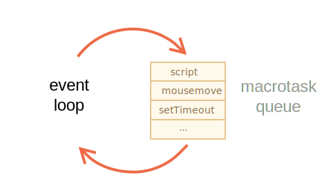
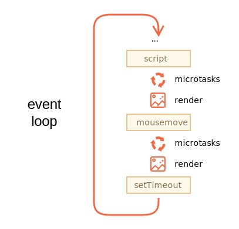

# La boucle d'événement: les microtâches et les macrotâches

Le flux d'exécution JavaScript dans un navigateur, de même que dans Node.js, est basé sur la *boucle d'événement*.

Comprendre comment fonctionne la boucle d'événement est important pour les optimisations, et parfois pour le bon choix d'une architecture.

Dans ce chapitre, nous couvrons d'abord les détails théoriques sur le fonctionnement des choses, puis nous verrons les applications pratiques de ces connaissances.

## La boucle d'événement

Le concept de *boucle d'événement* est très simple. Il y a une boucle sans fin, où le moteur JavaScript attend les tâches, les exécute puis dort, en attendant plus de tâches.

L'algorithme général du moteur:

1. Tant qu'il y a des tâches:
    - il les exécute, en commençant par la tâche la plus ancienne.
2. Dort jusqu'à ce qu'une tâche apparaisse, puis repasse à 1.

<<<<<<< HEAD
C'est une formalisation de ce que nous voyons lors de la navigation sur une page. Le moteur JavaScript ne fait rien la plupart du temps, il ne fonctionne que si un script / gestionnaire / événement s'active.
=======
That's a formalization of what we see when browsing a page. The JavaScript engine does nothing most of the time, it only runs if a script/handler/event activates.
>>>>>>> 1dce5b72b16288dad31b7b3febed4f38b7a5cd8a

Exemples de tâches:

- Lorsqu'un script externe `< script src = "...">` charge, la tâche consiste à l'exécuter.
- Lorsqu'un utilisateur déplace sa souris, la tâche consiste à envoyer un événement `mousemove` et à exécuter des gestionnaires.
- Lorsque le temps est écoulé pour un `setTimeout` planifié, la tâche consiste à exécuter la fonction de callback.
- ...et ainsi de suite.

Les tâches sont définies -- le moteur les gère -- puis attend plus de tâches (tout en dormant et en consommant près de zéro CPU).

Il peut arriver qu'une tâche arrive pendant que le moteur est occupé, il est alors mis en file d'attente.

<<<<<<< HEAD
Les tâches forment une file d'attente, dite "file d'attente des macrotâches" (terme v8) :



Par exemple, alors que le moteur est occupé à exécuter un `script`, un utilisateur peut déplacer sa souris provoquant un `mousemove`, et un `setTimeout` peut être écoulé, et ainsi de suite, ces tâches forment une file d'attente, comme illustré sur l'image ci-dessus.

Les tâches de la file d'attente sont traitées sur la base du «premier arrivé - premier servi». Lorsque le navigateur du moteur en a fini avec le `script`, il gère l'événement `mousemove`, puis le gestionnaire `setTimeout`, etc.
=======
The tasks form a queue, the so-called "macrotask queue" ([v8](https://v8.dev/) term):


For instance, while the engine is busy executing a `script`, a user may move their mouse causing `mousemove`, and `setTimeout` may be due and so on, these tasks form a queue, as illustrated in the picture above.

Tasks from the queue are processed on a "first come – first served" basis. When the engine browser is done with the `script`, it handles `mousemove` event, then `setTimeout` handler, and so on.
>>>>>>> 1dce5b72b16288dad31b7b3febed4f38b7a5cd8a

Jusqu'à présent, c'est assez simple, n'est-ce pas ?

<<<<<<< HEAD
Deux détails supplémentaires:
1. Le rendu ne se produit jamais pendant que le moteur exécute une tâche. Peu importe que la tâche prenne beaucoup de temps. Les modifications apportées au DOM ne sont peintes qu'après la fin de la tâche.
2. Si une tâche prend trop de temps, le navigateur ne peut pas effectuer d'autres tâches, telles que le traitement des événements utilisateur. Donc, après un certain temps, cela soulève une alerte du type "La page ne répond plus", suggérant de tuer la tâche avec toute la page. Cela se produit lorsqu'il y a beaucoup de calculs complexes ou une erreur de programmation conduisant à une boucle infinie.
=======
Two more details:
1. Rendering never happens while the engine executes a task. It doesn't matter if the task takes a long time. Changes to the DOM are painted only after the task is complete.
2. If a task takes too long, the browser can't do other tasks, such as processing user events. So after some time, it raises an alert like "Page Unresponsive", suggesting killing the task with the whole page. That happens when there are a lot of complex calculations or a programming error leading to an infinite loop.
>>>>>>> 1dce5b72b16288dad31b7b3febed4f38b7a5cd8a

C'était la théorie. Voyons maintenant comment nous pouvons appliquer ces connaissances.

## Cas d'utilisation 1: fractionnement des tâches consommatrices de CPU

Supposons que nous avons une tâche gourmande en CPU.

Par exemple, la mise en évidence de la syntaxe (utilisée pour coloriser des exemples de code sur cette page) est assez lourde en termes de CPU. Pour mettre en évidence le code, il effectue l'analyse, crée de nombreux éléments colorés, les ajoute au document - pour une grande quantité de texte qui prend beaucoup de temps.

Bien que le moteur soit occupé à mettre en évidence la syntaxe, il ne peut pas faire d'autres trucs liés au DOM, traiter les événements utilisateur, etc. Cela peut même amener le navigateur à "saccader" ou même à "figer" un peu, ce qui est inacceptable.

<<<<<<< HEAD
Nous pouvons éviter les problèmes en divisant la grande tâche en morceaux. Mettez en surbrillance les 100 premières lignes, puis planifiez un `setTimeout` (avec un délai à 0) pour les 100 lignes suivantes, etc.
=======
We can avoid problems by splitting the big task into pieces. Highlight the first 100 lines, then schedule `setTimeout` (with zero-delay) for the next 100 lines, and so on.
>>>>>>> 1dce5b72b16288dad31b7b3febed4f38b7a5cd8a

Pour démontrer cette approche, par souci de simplicité, au lieu de la colorisation du texte, prenons une fonction qui compte de `1` à `1000000000`.

Si vous exécutez le code ci-dessous, le moteur va se "figer" pendant un certain temps. Pour du JS côté serveur, c'est clairement perceptible, et si vous l'exécutez dans le navigateur, essayez de cliquer sur d'autres boutons de la page - vous verrez qu'aucun autre événement n'est géré jusqu'à la fin du comptage.

```js run
let i = 0;

let start = Date.now();

function count() {

  // réalise un gros job
  for (let j = 0; j < 1e9; j++) {
    i++;
  }

  alert("Effectué en " + (Date.now() - start) + 'ms');
}

count();
```

Le navigateur peut même afficher un avertissement "le script prend trop de temps".

Divisons le travail en utilisant des appels de `setTimeout` imbriqués :

```js run
let i = 0;

let start = Date.now();

function count() {

  // réalise un morceau du gros job (*)
  do {
    i++;
  } while (i % 1e6 != 0);

  if (i == 1e9) {
    alert("Effectué en " + (Date.now() - start) + 'ms');
  } else {
    setTimeout(count); // planifie un nouvel appel (**)
  }

}

count();
```

Désormais, l'interface du navigateur est pleinement fonctionnelle pendant le processus de "comptage".

Une seule exécution de `count` fait une partie du travail `(*)`, puis se re-calcule `(**)` si nécessaire:

1. La première manche compte : `i=1...1000000`.
2. La deuxième manche compte : `i=1000001..2000000`.
3. ...et ainsi de suite.

Maintenant, si une nouvelle tâche secondaire (par ex. un événement `onclick`) apparaît pendant que le moteur est occupé à exécuter la partie 1, elle est mise en file d'attente, puis s'exécute lorsque la partie 1 est terminée, avant la partie suivante. Les retours périodiques à la boucle d'événement entre les exécutions «count» fournissent juste assez d '«air» pour que le moteur JavaScript fasse autre chose, pour réagir à d'autres actions de l'utilisateur.

La chose notable est que les deux variantes - avec et sans diviser le travail par `setTimeout` - sont comparables en vitesse. Il n'y a pas beaucoup de différence dans le temps de comptage global.

Pour les minimiser, faisons une amélioration.

Nous déplacerons la planification au début du `count()`:

```js run
let i = 0;

let start = Date.now();

function count() {

  // déplace la planification au début
  if (i < 1e9 - 1e6) {
    setTimeout(count); // planifie le nouvel appel
  }

  do {
    i++;
  } while (i % 1e6 != 0);

  if (i == 1e9) {
    alert("Effectué en " + (Date.now() - start) + 'ms');
  }

}

count();
```

Maintenant, quand nous commençons à `count()` et voyons que nous aurons besoin de `count()` supplémentaires, nous planifions cela immédiatement, avant de faire le travail.

Si vous l'exécutez, il est facile de remarquer que cela prend beaucoup moins de temps.

Pourquoi ?  

C'est simple: comme vous vous en souvenez, il y a le retard minimal dans le navigateur de 4 ms pour de nombreux appels de `setTimeout` imbriqués. Même si nous définissons un délai à `0`, c'est 4ms (ou un peu plus). Donc, plus nous les planifions tôt - plus ils s'exécuteront rapidement.

Voilà, nous avons divisé une tâche gourmande en CPU en morceaux - maintenant elle ne bloque pas l'interface utilisateur. Et son temps d'exécution global n'est pas beaucoup plus long.

## Cas d'utilisation 2: indicateur de progression

Un autre avantage de la division de tâches lourdes pour les scripts de navigateur est que nous pouvons afficher un indicateur de progression.

Comme mentionné précédemment, les modifications apportées au DOM ne sont peintes qu'après la fin de la tâche en cours d'exécution, quel que soit le temps nécessaire.

D'une part, c'est génial, car notre fonction peut créer de nombreux éléments, les ajouter un par un au document et changer leurs styles - le visiteur ne verra aucun état "intermédiaire" et inachevé. Une chose importante, non?

Voici la démo, les modifications apportées à `i` n'apparaîtront pas avant la fin de la fonction, nous ne verrons donc que la dernière valeur :


```html run
<div id="progress"></div>

<script>

  function count() {
    for (let i = 0; i < 1e6; i++) {
      i++;
      progress.innerHTML = i;
    }
  }

  count();
</script>
```

...Mais nous pouvons également vouloir afficher quelque chose pendant la tâche, par exemple une barre de progression.

Si nous divisons la tâche lourde en morceaux à l'aide d'un `setTimeout`, les modifications sont peintes entre elles.

Cela semble plus joli :

```html run
<div id="progress"></div>

<script>
  let i = 0;

  function count() {

    // réalise un morceau du travail lourd (*)
    do {
      i++;
      progress.innerHTML = i;
    } while (i % 1e3 != 0);

    if (i < 1e7) {
      setTimeout(count);
    }

  }

  count();
</script>
```

Maintenant, la `<div>` montre des valeurs croissantes de `i`, une sorte de barre de progression.


## Cas d'utilisation 3: faire quelque chose après l'événement

Dans un gestionnaire d'événements, nous pouvons décider de reporter certaines actions jusqu'à ce que l'événement "bouillonne" (bubble up) et soit géré à tous les niveaux. Nous pouvons le faire en enveloppant le code dans un `setTimeout` avec un délai nul.

Dans le chapitre <info:dispatch-events>, nous avons vu un exemple: l'événement personnalisé `menu-open` est envoyé dans un `setTimeout`, de sorte qu'il se produit après que l'événement "clic" soit entièrement géré.

```js
menu.onclick = function() {
  // ...

  // crée un événement personnalisé avec les données de l'élément de menu cliqué
  let customEvent = new CustomEvent("menu-open", {
    bubbles: true
  });

  // dispatche l'événement personnalisé de manière asynchrone
  setTimeout(() => menu.dispatchEvent(customEvent));
};
```

## Les Macrotâches et les Microtâches

Avec les *macrotâches*, décrits dans ce chapitre, il y a les *microtâches*, mentionnés dans le chapitre <info:microtask-queue>.

Les microtâches proviennent uniquement de notre code. Ils sont généralement créés par des Promesses: une exécution du gestionnaire `.then / catch / finally` devient une microtâche. Les microtâches sont également utilisées "sous la couverture" d'un `await`, car c'est une autre forme de gestion des Promesses.

Il existe également une fonction spéciale `queueMicrotask(func)` qui met en file d'attente `func` pour l'exécution dans la file d'attente des microtâches.

**Immédiatement après chaque *macrotâche*, le moteur exécute toutes les tâches à partir de la file d'attente des *microtâches*, avant d'exécuter d'autres macrotâches, ou rendu, ou quoi que ce soit d'autre.**

Par exemple, jetez un œil là-dessus:

```js run
setTimeout(() => alert("timeout"));

Promise.resolve()
  .then(() => alert("promise"));

alert("code");
```

Quel sera l'ordre ici?

1. `code` s'affiche en premier, car il s'agit d'un appel synchrone régulier.
2. `promise` s'affiche en second, car `.then` passe par la file d'attente des microtâches et s'exécute après le code actuel.
3. `timeout` s'affiche en dernier, car c'est une macrotâche.

Une image, plus parlante, de la boucle d'événements ressemble à ceci (l'ordre est de haut en bas, c'est-à-dire: le script d'abord, puis les microtâches, le rendu, etc.):



Toutes les microtâches sont terminées avant toute autre gestion ou rendu d'événement ou toute autre macrotâche.

C'est important, car cela garantit que l'environnement de l'application est fondamentalement le même (pas de changement de coordonnées de souris, pas de nouvelles données réseau, etc.) entre les microtâches.

Si nous souhaitons exécuter une fonction de manière asynchrone (après le code actuel), mais avant que les modifications ne soient rendues ou que de nouveaux événements ne soient traités, nous pouvons la planifier avec un `queueMicrotask`.

Voici un exemple avec le "calcul de la barre de progression", similaire à celui illustré précédemment, mais "queueMicrotask" est utilisé à la place de "setTimeout". Vous pouvez voir que cela se produit à la toute fin. Tout comme le code synchrone :

```html run
<div id="progress"></div>

<script>
  let i = 0;

  function count() {

    // réalise un morceau du travail lourd (*)
    do {
      i++;
      progress.innerHTML = i;
    } while (i % 1e3 != 0);

    if (i < 1e6) {
  *!*
      queueMicrotask(count);
  */!*
    }

  }

  count();
</script>
```

## Résumé

Un algorithme de boucle d'événement plus détaillé (bien que toujours simplifié par rapport à la [spécification](https://html.spec.whatwg.org/multipage/webappapis.html#event-loop-processing-model)):

1. Dépile et exécute la tâche la plus ancienne de la file d'attente *macrotâches* (par ex. "script").
2. Exécute toutes les *microtâches* :
    - Tant que la file d'attente des microtâches n'est pas vide :
        - Dépile et exécute la plus ancienne microtâche.
3. Le rendu change le cas échéant.
4. Si la file d'attente des macrotâches est vide, attend qu'une macrotâche apparaisse.
5. Passez à l'étape 1.

Pour planifier une nouvelle *macrotâche*:
- Utilisez un `setTimeout(f)` avec un délai de 0.

Cela peut être utilisé pour fractionner en morceaux une grande tâche de calcul lourd, pour que le navigateur puisse réagir aux événements utilisateur et afficher une progression entre eux.

Également, c'est utilisé dans les gestionnaires d'événements pour planifier une action après que l'événement ait été entièrement géré ("bubbling" terminé).

Pour planifier une nouvelle *microtâche*
- Utilisez un `queueMicrotask(f)`.
- Les gestionnaires de Promesses passent également par la file d'attente des microtâches.

Il n'y a pas de gestion d'interface utilisateur ou d'événement réseau entre les microtâches: elles fonctionnent immédiatement l'une après l'autre.

On peut donc vouloir utiliser un `queueMicrotask` pour exécuter une fonction de manière asynchrone, mais dans l'état de l'environnement.

```smart header="Web Workers"
Pour les calculs longs et lourds qui ne devraient pas bloquer la boucle d'événement, nous pouvons utiliser les [Web Workers](https://html.spec.whatwg.org/multipage/workers.html).

C'est une façon d'exécuter du code dans un autre thread parallèle.

Les Web Workers peuvent échanger des messages avec le processus principal, mais ils ont leurs propres variables et leur propre boucle d'événements.

Les Web Workers n'ont pas accès au DOM, ils sont donc utiles, principalement, pour les calculs, pour utiliser simultanément plusieurs cœurs CPU.
```
